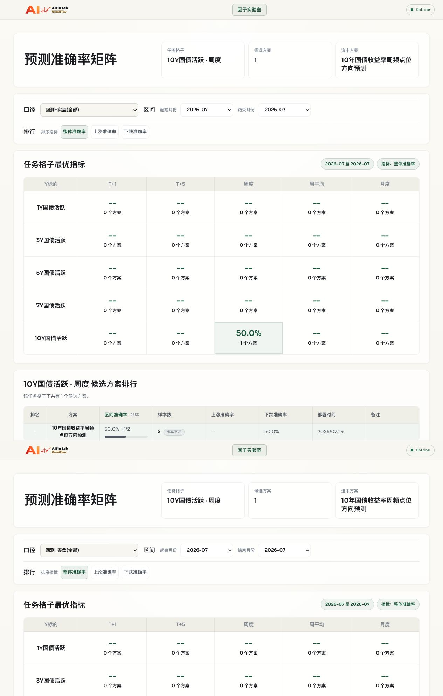
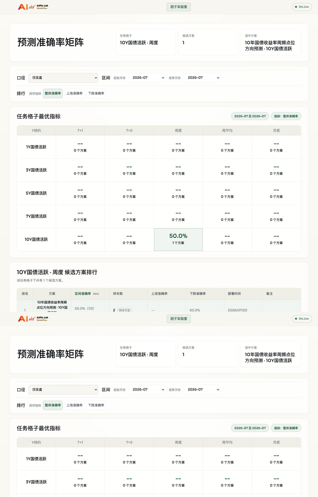
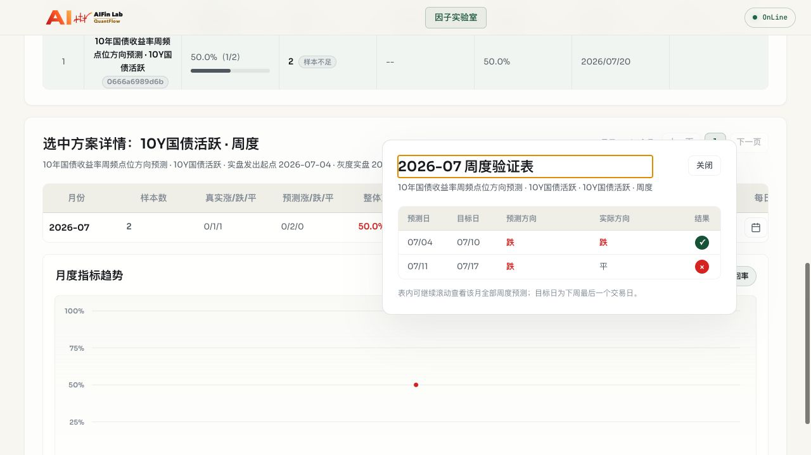

# Blackbox V2 全链路稳定性认证报告

**文档状态**：`HISTORICAL`

**目标读者**：平台入库、生产准备和审计人员

**最后核验日期**：2026-07-20

**记录类型**：隔离灰度实测审计

**适用运行时**：`blackbox_v2`

**测试日期**：2026-07-19（Asia/Shanghai）

**测试方案**：`weekly_10y_lgbm_point_v1`

**证据文件**：`FULL_PIPELINE_STABILITY_AUDIT_20260719.evidence.json`

> **最新复核**：2026-07-20 已完成 BBV2-01 至 BBV2-07 整改后的隔离生产路径认证，结论见第 8 节。第 1 至第 7 节保留为 2026-07-19 修复前历史基线，不代表当前实现。
>
> **后续状态**：同一真实交付于 2026-07-20 获专项授权进入生产灰度，见[生产灰度激活记录](PRODUCTION_GRAY_ACTIVATION_20260720.md)。本文中“生产 trial 未改变”的表述只对应隔离认证结束时点。

## 1. 明确结论

```text
SHADOW_READY: PASS
PRODUCTION_READY: FAIL
OVERALL: PRODUCTION_BLOCKED
```

Blackbox V2 的两文件收包、统一 DataBridge 输入、七 Gate、单点预测、100 条 no-persist 回测和 `shadow + paused` 登记已经达到可重复使用的稳定程度。后续真实交付可以继续按 SOP 进入技术入库和 shadow 验收。

Blackbox V2 尚未达到生产稳定。当前实现不能完成回测持久化，正式 ActivationGate 与 Blackbox 版本身份不兼容，sandbox 仍能读取任意本机文件和继承环境变量，JSON Result 仍接受字符串方向。因此，任何 V2 方案当前最多进入 `shadow + paused`，不得直接 `active/live`。

本轮在独立测试库中强制激活后，`gray_live -> scheduled_live -> actual -> API -> 前端` 技术链路可以工作。这只证明下游组件兼容，不代表正式生产晋级门禁已经通过。

## 2. 测试边界与隔离

- 测试 worktree：`codex/v2-full-pipeline-audit-20260719`。
- 测试数据库：`bond_factor_lab_v2_e2e_20260719_1730`。
- 数据库迁移：`001-016` 全部执行。
- 源数据表：通过只读 View 指向 `bond_db`。
- Registry、Harness、预测、回测和 actual 业务表：全部位于独立测试 Schema。
- 测试后端：临时运行于 `127.0.0.1:18100`，测试结束后已停止。
- 生产方案始终保持 `shadow + paused`，生产方案的 run、prediction、backtest 均为 0。

历史回放 generation 是从 2026-07-19 当前全量文件按截止键截断得到的测试夹具，只用于验证平台流程和日期语义，不代表平台拥有历史修订版本回放能力。

## 3. 全链路认证矩阵

| 环节 | 状态 | 结论 |
|---|---|---|
| 上游两文件交付 SOP | `CONDITIONAL_PASS` | 真实交付可执行，文档与机器合同一致；仅覆盖一个真实方案 |
| Intake 与身份 | `PASS` | 两文件、Metadata、命名和摘要校验通过 |
| DataBridge 三频输入 | `PASS` | 当前 generation 完整，快照同代，截止隔离通过 |
| 七 Gate 技术入库 | `PASS` | 同一真实交付连续 10/10 完整通过 |
| 单点预测 | `PASS` | 重复执行一致，标准 `PredictionRecord` 可生成 |
| no-persist 回测 | `PASS` | 100/101/500/1000 条分批、顺序和结果一致 |
| 回测持久化 | `FAIL` | `--persist` 返回成功但 `t_backtest_*` 仍为 0 |
| Shadow 登记 | `PASS` | Registry=`paused`、version=`shadow` |
| 正式 ActivationGate | `FAIL` | Blackbox 版本与公共 ActivationGate 计算版本不一致 |
| gray_live | `CONDITIONAL_PASS` | 隔离库强制 active 后写入 1 run + 1 prediction |
| scheduler run-once | `CONDITIONAL_PASS` | 隔离库强制 active 后写入 1 run + 1 prediction |
| actual join 与指标 | `CONDITIONAL_PASS` | 两条 live 行完成 weekly actual 关联，准确率 50% |
| API 与前端 | `CONDITIONAL_PASS` | 强制 active 时显示正确；paused 时立即隐藏 |
| 失败零预测副作用 | `CONDITIONAL_PASS` | timeout、缺 CSV、非法方向、stale generation 均无 prediction；CLI 退出语义仍有缺口 |
| 安全隔离 | `FAIL` | 网络和 data-dir 写入被拒绝；任意文件读取和环境变量读取未隔离 |
| 五类任务合同 | `PASS` | 五组 Metadata/日期 Request 夹具通过；不等同于真实算法覆盖 |

## 4. 核心证据

### 4.1 收包、环境与数据

- 交付脚本 SHA256：`6e3ee104e9db652d0d3a291a13695c616ec605547693307bdfe61aa3fee45c72`。
- Metadata SHA256：`e60e9237f2f02d973033030e52fa8744fc62e841d5f2073ea6f273ee431901be`。
- Runtime Profile：`blackbox-v2-v1`。
- Conda 环境：`forecast_env_blackbox_v1`。
- 环境指纹：`720ad40ab77cd6c7156ff35a80cf3604ac3a6153425ed235a4e3158b0631f8bd`。
- DataBridge generation：`full-20260719-055002-7876ee1e5ec9`。
- DataBridge business digest：`7876ee1e5ec975034396e3ff33c96ce294bd2f516e8497b9e54afefd5cf5867b`。
- 同代快照：`snapshot-245c54a6363ed5251475e8f5`。
- 计划基线的 174 项 V2、DataBridge、API、前端和 SOP 相关自动测试通过；提交前扩展复验 177 项通过、0 项失败。

### 4.2 十轮 Harness 稳定性

- 10/10 轮通过，每轮 7/7 Gate 通过。
- 预测方向十轮均为 `1`。
- 单轮耗时 25-26 秒，P50=26 秒，P95=26 秒。
- 代表性完整运行的最大驻留内存约 552 MiB（包含命令包装进程）。
- 十轮结束时预测、实盘 run 和回测业务表均无写入。
- 未发现残留临时快照。

### 4.3 批量回测

| Request 数 | 平台批次 | 耗时 | 结果 |
|---:|---:|---:|---|
| 100 | 1 | 3.718 秒 | 100/100 |
| 101 | 2 | 3.744 秒 | 101/101 |
| 500 | 5 | 13.045 秒 | 500/500 |
| 1000 | 10 | 26.902 秒 | 1000/1000 |

四种规模均保持 Request 顺序和前缀结果一致。真实 `harness gate backtest --persist` 虽然退出码为 0、Gate 标记 passed、生成 100 条内存结果，但证据仍为 `persist=false`，数据库 `t_backtest_runs` 和 `t_backtest_predictions` 均为 0。这是完整生产链路的确定性阻塞，不是未测试项。

### 4.4 激活、实盘与调度

真实公共 ActivationGate 被阻断：

- Blackbox StaticGate 版本：`2110193568a9`。
- 公共 ActivationGate 计算版本：`45638f28d0ea`。
- ActivationGate 无法找到匹配的 all-stage 历史，因此正式激活失败。

为测量后续组件，本轮只在测试 Schema 和测试 worktree 中标记 `FORCED_ACTIVE_TEST_ONLY`，生成测试版本 `3be8c7720410`：

| 阶段 | predict_date | feature_date | target_date | 方向 | 结果 |
|---|---|---|---|---:|---|
| `gray_live` | 2026-07-04 | 2026-07-03 | 2026-07-10 | -1 | 1 run、1 prediction、1 log |
| `scheduled_live` | 2026-07-11 | 2026-07-10 | 2026-07-17 | -1 | 1 run、1 prediction、1 log |

两条结果均包含 `runtime_type`、scheme version、Request、`data_snapshot_id` 和 `prediction_phase`。这说明 Blackbox runner 与统一写库模型兼容，但正式路径仍因 ActivationGate 失败而不可认证。

### 4.5 Actual、API 与前端

weekly actual updater 在隔离库写入实际值后：

- 2026-07-10：预测 `-1`，实际 `-1`，正确。
- 2026-07-17：预测 `-1`，实际 `0`，错误。
- API 汇总：2 个样本、1 个正确、准确率 50%。
- `/api/schemes` 在 active 测试状态返回 composite ID `weekly_10y_lgbm_point_v1__h1__10Y`。
- `/api/metrics/{registry_id}` 返回两条 live 行，字段与数据库一致。
- `/api/backtests/factor-lab` 不包含该方案，符合“回测未持久化”的实际状态。
- 前端将方案放入 `10Y国债活跃 + 周度` 格子，显示 2 条明细，无重复行，浏览器控制台无 error。
- 暂停后 `/api/schemes` 隐藏该方案，metrics 返回 404，前端不再显示。

前端截图：

### 4.6 故障注入

| 场景 | 结果 | Output / 业务副作用 |
|---|---|---|
| 缺少周/月 CSV | 正确拒绝 | 无 Output |
| 算法超时 1 秒 | 正确终止 | 无 Output |
| 网络访问 | sandbox 拒绝 | 无 Output |
| 写入 `--data-dir` | sandbox 拒绝 | 无 Output |
| 非法方向 `2` | Result 校验拒绝 | 无平台 prediction |
| stale generation | 记录 failed run | 0 prediction、0 部分结果 |
| 读取 `/etc/hosts` | **成功读取** | 安全失败 |
| 读取继承环境变量 | **成功读取** | 安全失败 |
| JSON 字符串方向 `"1"` | **被接受为整数 1** | 合同偏差 |

stale generation 运行还有一个运维缺口：数据库正确记录 failed run，但 `scheduler --run-once` 进程退出码仍为 0，外层调度可能误判任务成功。

暂停验证中，scheduler 不再新增 run 或 prediction，但会追加一条 `status=paused` 的 skipped 审计日志；这是可接受的控制面留痕。

## 5. 生产阻塞项

| 严重度 | 编号 | 阻塞项 | 必须完成的整改 |
|---|---|---|---|
| P0 | BBV2-01 | 回测 `--persist` 被静默忽略 | 实现 Blackbox 回测事务落库，并验证 API/前端回测显示和失败回滚 |
| P0 | BBV2-02 | ActivationGate 版本身份不兼容 | 统一 Blackbox Static、all-stage、shadow、activate 的版本计算和历史匹配 |
| P1 | BBV2-03 | 缺 Blackbox 专用 activate/live hard-stop | 将生产批准状态同时约束 ActivationGate、scheduler 和人工 trigger |
| P1 | BBV2-04 | sandbox 任意文件读取与环境变量继承 | 使用读取 allowlist，清理凭据和非必要环境变量 |
| P1 | BBV2-05 | JSON Result 接受字符串方向 | JSON 仅接受整数 `-1/0/1`；CSV 保持文本枚举解析 |
| P1 | BBV2-06 | failed scheduler run 仍退出 0 | `run-once` 在 failed 时返回非零，skipped 语义单独定义 |
| P1 | BBV2-07 | Shadow 多步状态和恢复未自动化 | 事务化写入或提供自动 reconciliation 与幂等重试 |
| P1 | BBV2-08 | 真实方案覆盖不足 | 在现有周频方案外至少增加日频和月频交付，使真实交付总数不少于 3 个并重复认证 |

上述问题对应并扩展 `PRODUCTION_READINESS.md` 的 PR-01 至 PR-08。当前没有任何依据可将该文档从 `BLOCKED_DRAFT` 改为生产 SOP。

## 6. SOP 稳定性结论

### 上游交付 SOP

结论为 `CONDITIONAL_PASS`。一个真实算法工程师交付包可以仅依赖 SOP 完成两文件改造，Metadata、三频快照、七字段 Request、五字段 Result、predict/backtest 和自验要求均与机器合同一致。

仍不能宣称“对所有上游算法稳定”，因为实测只覆盖 `10Y + weekly_point + LightGBM`。日频、周平均、月频和不同依赖栈目前只有机器夹具，没有第二个真实交付方证据。

### 平台入库 SOP

Intake 至 `shadow + paused` 的操作手册结论为 `PASS`。按文档可以完成收包、环境与数据 preflight、七 Gate、shadow 授权、零业务表核验和失败停止。

生产晋级仍为 `BLOCKED_DRAFT`。当前代码无法按正式门禁激活 Blackbox，也无法持久化回测，因此不能通过修改 SOP 文字把缺失能力描述成已具备。

## 7. 最终认证

允许的结论：

> Blackbox V2 技术入库与 shadow 验收已经基本稳定，可以继续用真实方案持续测试和提高入库效率。

禁止的结论：

> Blackbox V2 已经完成算法入库、回测落库、实盘预测、actual、API 和前端的生产稳定闭环。

下一次申请 `PRODUCTION_READY` 前，必须先关闭 BBV2-01 至 BBV2-07，再使用至少三个真实交付包覆盖日、周、月频率。通过后应重新执行本报告全部矩阵，而不是沿用本次强制激活证据。

## 8. 2026-07-20 修复后生产路径认证

### 8.1 最新结论

```text
SHADOW_READY: PASS
PRODUCTION_PATH_READY: PASS
PRODUCTION_READY: NOT_CERTIFIED
OVERALL: CONDITIONAL_PASS
```

BBV2-01 至 BBV2-07 已关闭。当前代码已通过正式签名的 Shadow、ActivationGate、回测落库、gray live、scheduler live、actual、真实 API 探针、前端展示、暂停隐藏和失败恢复认证，不再依赖强制修改状态或临时绕过平台门禁。

`PRODUCTION_READY` 仍不得标记为 `PASS`。BBV2-08 尚未关闭：目前只有一个真实上游交付包，覆盖 `10Y + weekly_point + LightGBM`。在至少三个真实交付包覆盖日、周、月三种频率并重复认证前，只能得出“生产路径已打通并对当前试验方案稳定”的结论，不能外推为“所有新增方案均已生产稳定”。

### 8.2 隔离边界

- 认证 worktree：`codex/bbv2-certification-runtime-20260720`。
- 隔离 Schema：`bbv2_cert_20260720d`，执行 `001-016` 全部迁移。
- 源数据：9 个 `SQL SECURITY DEFINER` 只读 View 指向生产源表；认证账号只能读生产源表、写隔离 Schema。
- 业务写入、Registry、版本、Harness 和 actual 全部位于隔离 Schema。
- 测试服务：`127.0.0.1:18100`，认证完成后已停止。
- 生产 trial 始终保持 `shadow + paused`，生产 run、prediction、backtest 均为 0。

### 8.3 最新认证矩阵

| 环节 | 状态 | 修复后证据 |
|---|---|---|
| 上游两文件 Intake | `PASS` | 原始脚本和 Metadata 摘要不变，scheme version 固定为 `0666a6989d6b` |
| DataBridge Preflight | `PASS` | generation、business digest、三文件 SHA256 和同代 snapshot 全部绑定 |
| 七 Gate 稳定性 | `PASS` | 同一真实交付连续 10/10 完整通过，70/70 Gate 通过 |
| no-persist 回测 | `PASS` | 100/101/500/1000 条均通过，自动分批结果不变 |
| 回测持久化 | `PASS` | 正式授权后原子写入 1 run、100 predictions、24 monthly metrics |
| Shadow 登记 | `PASS` | 正式签名授权，配置、版本和 Registry 三方核验一致 |
| ActivationGate | `PASS` | 正式签名授权，精确版本 `0666a6989d6b` 激活，无强制状态修改 |
| gray live | `PASS` | 精确增加 1 run、1 prediction、1 log，其余受保护表零增量 |
| scheduler live | `PASS` | 真实 `scheduler --run-once` 精确增加 1 run、1 prediction、1 log |
| actual 与指标 | `PASS` | 2 条 live 全部关联 actual，1/2 正确，API 与数据库一致 |
| API 探针 | `PASS` | Registry、schemes、metrics、backtest 和 service fingerprint 均真实验证 |
| 前端显示 | `PASS` | 正确落入 `10Y + weekly_point`，显示 2 条 live、50.0%，无控制台错误 |
| 暂停与隐藏 | `PASS` | 暂停后 scheduler skip，schemes 隐藏、metrics 404、backtest 方案列表为空 |
| stale generation | `PASS` | scheduler 退出码 1，新增 failed run，0 prediction、0 部分回测结果 |
| sandbox 与 Result | `PASS` | 外部文件、继承密钥、网络和非授权写入均被阻断；JSON 字符串方向被拒绝 |

### 8.4 核心身份与数据证据

- 实现分支 HEAD：`334bfa7`；隔离认证分支 HEAD：`8cdfefea0b3fe79184b0b70cbfe15eeddd82e259`。两者的平台代码一致，认证分支仅在 `schemes/` 中移除 Native 方案、保留当前 trial，以隔离 scheduler 发现范围。
- 交付脚本 SHA256：`6e3ee104e9db652d0d3a291a13695c616ec605547693307bdfe61aa3fee45c72`。
- Metadata SHA256：`e60e9237f2f02d973033030e52fa8744fc62e841d5f2073ea6f273ee431901be`。
- Runtime Profile：`blackbox-v2-v1`；环境指纹：`720ad40ab77cd6c7156ff35a80cf3604ac3a6153425ed235a4e3158b0631f8bd`。
- DataBridge generation：`full-20260720-055026-00e12e3803a8`。
- business digest：`00e12e3803a89e3b06439881059c9f3d9093e8642b7c37f063f4ff6169c54f1b`。
- Harness snapshot：`snapshot-fd8a1f8736d3a4d057fbd98e`。
- 最新 Harness run：`hr_20260720T014629Z_e0b7080da057`。
- API service fingerprint：`9590ab28e0f99fe283ab8d1691556197aca137bb6eb9b59e7798d925e84f3d49`，期望值与服务返回值一致。
- 最终自动回归：聚焦安全与生命周期测试 120/120，通过完整测试集 1093/1093。

三频当前文件：

| 文件 | 行/列 | 最大键 | SHA256 |
|---|---:|---|---|
| `daily_output.csv` | 3878 / 774 | `2026-07-17` | `03bbcc94c11acc58ac5647c2b530e2be3e45b9ed5fd74ff12a5677854e3a50e1` |
| `weekly_output.csv` | 847 / 575 | `202628` | `9dfe8a8cfaae9fd4be1e70b872ff2d89d5839f4c266af3924eb0e0f5d4ebc4d5` |
| `monthly_output.csv` | 201 / 123 | `202701` | `f29607a79c66860d4c43f369d99cb4fdfbba2cf665d3931f930f496bc21d86b5` |

### 8.5 重复运行与回测

十轮 Harness 全部使用同一 scheme version、generation、snapshot 和环境指纹；单轮数据库记录耗时为 30-32 秒，P50=31 秒，P95=32 秒。每轮七个 Gate 全部通过，十轮后没有 `runtime_snapshot` 临时目录残留。

| Request 数 | 子进程数 | 耗时 | 结果 |
|---:|---:|---:|---|
| 100 | 3 | 18 秒 | 100/100，分批不变量通过 |
| 101 | 4 | 20 秒 | 101/101，分批不变量通过 |
| 500 | 12 | 43 秒 | 500/500，分批不变量通过 |
| 1000 | 23 | 71 秒 | 1000/1000，分批不变量通过 |

正式持久化回测使用 benchmark `bbv2-weekly_10y_lgbm_point_v1-hr_20260720T014629Z_e0b7080da057`，日期范围为 2024-08-09 至 2026-07-10，100 条预测、50 条正确、准确率 50.0%。写入前后精确增量为：

```text
t_backtest_runs:             0 -> 1
t_backtest_predictions:      0 -> 100
t_backtest_monthly_metrics:  0 -> 24
```

### 8.6 正式激活、实盘与前端

ActivationGate 使用最新完整 Harness run、精确 scheme version 和 15 分钟内有效的 HMAC 授权正式通过。没有直接更新配置或数据库绕过 Gate。

| 阶段 | predict_date | feature_date | target_date | 方向 | snapshot |
|---|---|---|---|---:|---|
| `gray_live` | 2026-07-04 | 2026-07-03 | 2026-07-10 | -1 | `snapshot-0cf620d3f51f93b696385841` |
| `scheduled_live` | 2026-07-11 | 2026-07-10 | 2026-07-17 | -1 | `snapshot-a9f2b0c15eb39767fd038cda` |

2026-07-10 实际方向为 `-1`，第一条预测正确；2026-07-17 实际方向为 `0`，第二条预测错误。真实 API 返回 2 条 live、2 条已关联 actual、0 条待验证，前端显示 50.0%（1/2）。

前端矩阵：

逐条明细：

### 8.7 失败恢复与最终状态

使用 `predict_date=2026-07-18` 对当前 `refresh_date=2026-07-20` generation 做反向日期故障注入，平台 fail-closed：进程退出码为 1，新增 run 3 状态为 `failed`，错误为 `DataBridge refresh_date must be 2026-07-18, got 2026-07-20`；预测仍为 2 条，持久化回测仍为 1/100/24。

认证完成后通过生命周期 journal 将隔离方案收敛为 `shadow + paused`。scheduler 返回 `skipped: status=paused` 且不新增 run；`/api/schemes` 不再返回该方案，metrics 返回 404，回测接口中的方案列表为空。临时后端已停止，DataBridge current 已恢复到完整 generation，临时 runtime snapshot 为 0。

生产基线独立复核结果：

```text
config: shadow + paused
Registry: paused
scheme runs: 0
predictions: 0
backtest runs: 0
backtest predictions: 0
```

### 8.8 已关闭与剩余项

| 编号 | 2026-07-20 状态 | 关闭证据 |
|---|---|---|
| BBV2-01 | `CLOSED` | Blackbox 回测授权、事务落库、API 和前端回测读取通过 |
| BBV2-02 | `CLOSED` | Static、all-stage、Shadow、Activation 使用同一 canonical version |
| BBV2-03 | `CLOSED` | scheduler、人工 live、ActivationGate 均校验精确 active 批准状态 |
| BBV2-04 | `CLOSED` | sandbox 读取 allowlist、生效环境清理及逃逸测试通过 |
| BBV2-05 | `CLOSED` | JSON 仅接受真正整数，字符串、布尔和浮点全部拒绝 |
| BBV2-06 | `CLOSED` | failed/partial run-once 非零退出，skipped 单独保持退出码 0 |
| BBV2-07 | `CLOSED` | 生命周期 journal、补偿、reconciliation、幂等和并发互斥通过 |
| BBV2-08 | `OPEN` | 仍只有一个真实交付包；需至少三个并覆盖日、周、月 |

剩余两个非阻断观察项：隔离库 `t_harness_runs.git_commit` 仍为空，但 API service fingerprint 已绑定并校验真实认证 HEAD；在仅激活周频方案的空基线库中运行全量 actual updater 会同时填充日、周、月历史 actual，属于存储与运维效率优化，不影响本次结果正确性。

修复后允许的最终表述：

> Blackbox V2 对当前真实周频试验方案已完成从标准交付、自动 Gate、回测落库、正式激活、实盘预测、actual、API 到前端的隔离生产路径认证；BBV2-01 至 BBV2-07 已关闭，生产 trial 未改变。由于 BBV2-08 仍开放，平台尚未取得面向所有新方案的 `PRODUCTION_READY` 认证。
