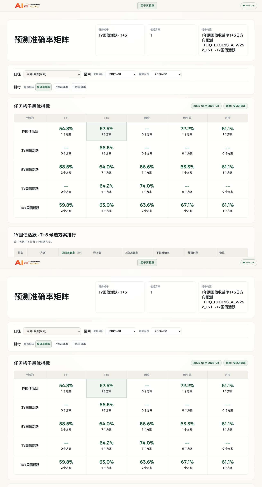
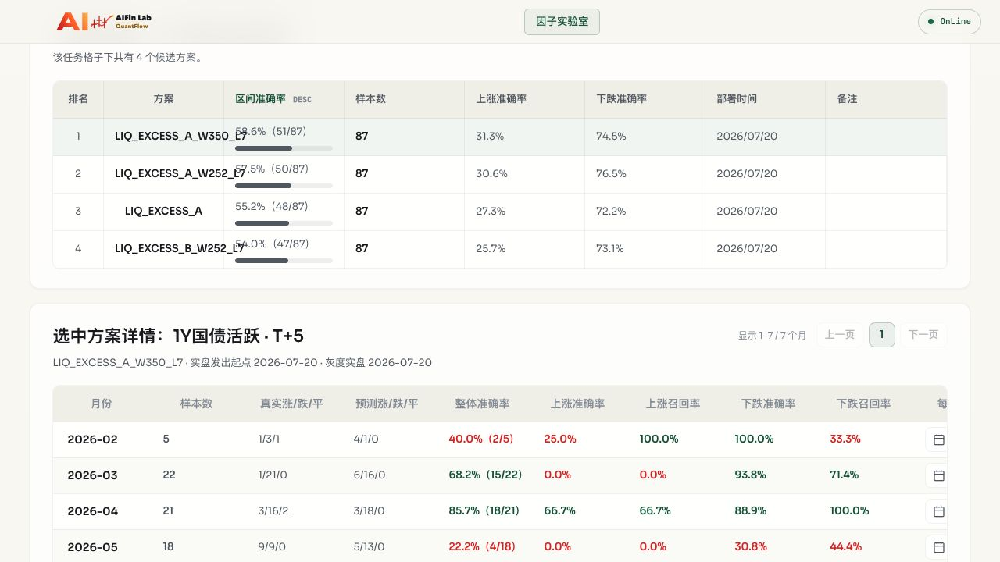

# 1Y T+5 四方案生产灰度记录

**文档状态**：`IN_PROGRESS`

**执行日期**：2026-07-20，`Asia/Shanghai`

**当前阶段**：用户明确将本批时序调整为当天全量激活；四方案均已完成 Activation、100 条持久化回测和单次 `gray_live`。scheduler 当天未重启，下一交易日自然 `scheduled_live` 和 2026-07-24 actual 仍待复验。

**机器证据**：[PRODUCTION_GRAY_1Y_T5_4SCHEMES_20260720.evidence.json](PRODUCTION_GRAY_1Y_T5_4SCHEMES_20260720.evidence.json)

本文记录本批四个真实 Blackbox V2 日频方案的生产技术入库与后续专项灰度。通用规则仍以平台 SOP 为准；本批用户授权只适用于本文列出的四个方案，不构成面向其他交付的通用生产授权。

## 1. 范围

| 业务名称 | base scheme ID | Registry ID | 当前版本 |
|---|---|---|---|
| `LIQ_EXCESS_A` | `one_y_t5_liq_excess_a_v1` | `one_y_t5_liq_excess_a_v1__h5__1Y` | `8d583560c9f1` |
| `LIQ_EXCESS_A_W252_L7` | `one_y_t5_liq_excess_a_w252_l7_v1` | `one_y_t5_liq_excess_a_w252_l7_v1__h5__1Y` | `103c93bbc913` |
| `LIQ_EXCESS_A_W350_L7` | `one_y_t5_liq_excess_a_w350_l7_v1` | `one_y_t5_liq_excess_a_w350_l7_v1__h5__1Y` | `86b458c568a5` |
| `LIQ_EXCESS_B_W252_L7` | `one_y_t5_liq_excess_b_w252_l7_v1` | `one_y_t5_liq_excess_b_w252_l7_v1__h5__1Y` | `ba00891cd179` |

明确排除且未执行 Intake：

- `one_y_t5_liq_excess_b_v1`
- `one_y_t5_liq_excess_b_w160_l3_v1`
- `one_y_t5_liq_excess_b_w200_l7_v1`
- `one_y_t5_liq_excess_b_w350_l7_v1`

## 2. 收包与 Intake

原始 ZIP SHA256 为 `3b08ddc0bccc54e7b275d864748058f3ec9bfceb361969049ec34ff011d9de5f`，CRC 完整性通过。平台在仓库外拆成四个独立两文件目录后逐方案执行 Intake，没有修改上游脚本、Metadata、模型窗口或方向映射。

四个脚本字节相同，SHA256 均为 `689fe3734e3cdae5524a0e6cf8b22d83e96a40686baba77dd2bbd2eb6e08c6c0`。Metadata 摘要如下：

| base scheme ID | Metadata SHA256 |
|---|---|
| `one_y_t5_liq_excess_a_v1` | `e1e3bac8c54f8a192b02cc4a1433bad9ebf1552388d90f54cb5db25eb9c287d0` |
| `one_y_t5_liq_excess_a_w252_l7_v1` | `36c0da6a2b4edb621fff21c82de823be09174aaec813680bc98ce747b3e219b0` |
| `one_y_t5_liq_excess_a_w350_l7_v1` | `217d1d64761adbc1a7f1e25207a303b0de8b0b031397c9c9fffc61593c132799` |
| `one_y_t5_liq_excess_b_w252_l7_v1` | `a30b7a7cf326d70c5c822c6df94cf31d294d997c5d6d858339a6737814c76f25` |

Intake 后四个方案均为 `blackbox_v2 + data_bridge_current + paused + draft`，任务口径均为 `1Y + T+5 + horizon=5`，delivery 文件权限均为 `0444`。

## 3. 平台 Preflight

| 检查 | 结果 |
|---|---|
| 服务回归 | 1107/1107 `unittest` 通过；冻结服务环境未安装 `pytest`，未临时安装依赖 |
| Runtime Profile | `blackbox-v2-v1` |
| 环境指纹 | `720ad40ab77cd6c7156ff35a80cf3604ac3a6153425ed235a4e3158b0631f8bd` |
| sandbox | 网络拒绝、DataBridge 目录写入拒绝 |
| generation | `full-20260720-055026-00e12e3803a8`，`refresh_date=2026-07-20` |
| snapshot | `snapshot-fd8a1f8736d3a4d057fbd98e` |
| business digest | `00e12e3803a89e3b06439881059c9f3d9093e8642b7c37f063f4ff6169c54f1b` |
| 日频 current | 3878×774，最大键 `2026-07-17`，SHA256 `03bbcc94c11acc58ac5647c2b530e2be3e45b9ed5fd74ff12a5677854e3a50e1` |
| 周频 current | 847×575，最大键 `202628`，SHA256 `9dfe8a8cfaae9fd4be1e70b872ff2d89d5839f4c266af3924eb0e0f5d4ebc4d5` |
| 月频 current | 201×123，最大键 `202701`，SHA256 `f29607a79c66860d4c43f369d99cb4fdfbba2cf665d3931f930f496bc21d86b5` |

### 3.1 CompareGate 探针修正

首轮真实 Gate 暴露平台未来行探针缺陷：硬编码 `2999-12-31` 超出冻结 pandas 的时间戳范围；首次改为动态日期后又因输出 `YYYY-MM-DD` 与 DataBridge 的 `YYYY/MM/DD HH:MM` 混用而被严格解析拒绝。两次均停在 CompareGate，未执行后续 Gate 或任何业务写入。

平台以测试先行方式将日频探针改为“快照末日加一天并保留原始日期格式”。目标回归和 Blackbox Gate 模块 20/20 通过，真实 current 探针末行变为 `2026/07/18 00:00` 且保持升序。交付脚本与 Metadata 字节未变化。

## 4. 10 轮稳定性认证

四方案共 40 个正式计数轮次全部通过，每轮固定覆盖 `static → input → unit → dry-run → compare → backtest → api-readiness`。每轮 no-persist 回测均返回 100 条，重复、predict/backtest、分批、Request 顺序和未来行隔离均通过。

| base scheme ID | 通过轮次 | P50 | P95 | 最终 Harness run |
|---|---:|---:|---:|---|
| `one_y_t5_liq_excess_a_v1` | 10/10 | 28 秒 | 28 秒 | `hr_20260720T085540Z_2068d5d0eea9` |
| `one_y_t5_liq_excess_a_w252_l7_v1` | 10/10 | 28 秒 | 29 秒 | `hr_20260720T090110Z_3de057d3955a` |
| `one_y_t5_liq_excess_a_w350_l7_v1` | 10/10 | 29 秒 | 29 秒 | `hr_20260720T090702Z_ea12669b5485` |
| `one_y_t5_liq_excess_b_w252_l7_v1` | 10/10 | 29 秒 | 29 秒 | `hr_20260720T091230Z_3852f6ea92e4` |

四个最终 run 均在 `t_harness_runs` 中精确命中 `stage=all + status=passed`，并各自拥有七条完整 passed Gate 记录。自动段结束后，四方案的正式 run、prediction、run log、backtest run 和 backtest prediction 均为 0。

## 5. Shadow 登记

新 Intake 目录尚未被常驻 backend/scheduler 重新发现，因此第一次 ShadowGate 在读取 draft 控制面身份时 fail-closed，配置和数据库均未变化。随后通过正式 `sync_scheme_registry()` 入口只为这四个方案建立 `draft` version 和 `paused` Registry；该入口不能提升版本或激活 Registry。

四个方案之后分别使用绑定 exact scheme/version/latest run 的全新 900 秒 HMAC token 完成 ShadowGate。所有 lifecycle journal 均为 `verified`，终态为：

- config：`status=paused + version_status=shadow`；
- exact version：`shadow`；
- composite Registry：`paused + blackbox_v2`；
- active `/api/schemes`：四方案均不可见；
- scheduler：未重启，未挂载四方案任务；
- 每方案业务表：正式 run、prediction、run log、backtest run、backtest prediction 均为 0。

## 6. 代表性 Canary

代表性 Canary 为 `one_y_t5_liq_excess_a_w252_l7_v1`。Shadow 后使用当天同一 DataBridge generation 重新执行完整 Harness，`hr_20260720T092351Z_1b6e76e498c0` 的七个 Gate 全部通过；该 run、版本 `103c93bbc913`、generation、snapshot 和环境指纹共同绑定后续三种独立授权。

### 6.1 Activation

`blackbox_activate` 使用一次性 900 秒 token，经正式 ActivationGate 后于 `2026-07-20 17:25:01 +08:00` 完成：

- config：`active + active`，config SHA256 为 `b13a03aa95117d677efbbdc9582cb1e93389cf695922170666cb70e62a62c964`；
- exact version：`active`，`approved_by=codex-canary-activation-20260720`；
- Registry：`one_y_t5_liq_excess_a_w252_l7_v1__h5__1Y + active`；
- 激活动作本身未写入预测、run、log 或回测表。

### 6.2 持久化回测前的数据口径修正

首次持久化在业务写入前 fail-closed，暴露 `t_trade_calendar` 的通用工作日口径与 `api_wind_daily` 的债券实际观测日不一致：调休周末被标为工作日，且 `2024-02-09` 虽为周五但无 1Y 债券观测。旧实现从 2010 年全量检查，因此样本窗口以外的历史特殊休市也会阻断最近 100 条回测。

平台以测试先行方式将日频规则收紧为：

1. 调休周末不参与债券 T+N 交易日映射；
2. 只对最终选中的最近回测窗口执行债券源覆盖校验；
3. 所选窗口内的工作日缺数继续 fail-closed；
4. 月频和周频原有校验边界不变。

相关 54 项历史、持久化、Harness 和 provenance 回归全部通过，修复提交为 `884c4bd`。两次失败均未产生业务表写入；交付 `.py/.json` 摘要保持不变。

### 6.3 持久化回测与 gray live

| 项目 | 结果 |
|---|---|
| 持久化回测 | `run_id=166`，benchmark `bbv2-one_y_t5_liq_excess_a_w252_l7_v1-hr_20260720T092351Z_1b6e76e498c0` |
| 回测明细 | 100 条；100 个唯一 predict/target date；`predict_date=feature_date` 100/100 |
| 回测区间 | predict `2026-02-06..2026-07-10`；target `2026-02-13..2026-07-17` |
| 月度指标 | 6 个月；总体 59/100，准确率 59.0% |
| 回测语义 | `blackbox_v2_current_snapshot_as_of`，不声明 historical vintage PIT |
| gray live | `run_id=956`；精确新增 1 run、1 prediction、1 log |
| live Request | predict `2026-07-20`、feature `2026-07-17`、target `2026-07-24` |
| live 结果 | 方向 `1`，`prediction_phase=gray_live`，actual pending |

回测授权和 live 授权分别签发，均绑定 exact version 和最新 all-stage run；任何 token 均未跨动作复用。回测以外的受保护表在 persist 阶段零增量，live 阶段除上述三张允许表外均零增量。

### 6.4 API、前端和进程时序

backend 完成单独重启，scheduler PID 始终为 `52329`，当天未重启、未触发 startup catchup。验收结果：

- 本地与公网 `/api/schemes` 均只新增当前 Canary；被排除四方案均不可见；
- Canary metrics 返回 1 条 `gray_live`，actual 未到时为 pending；
- factor-lab backtest API 返回 100 条明细和 6 个月度指标；
- 公网只读访问 200/403 矩阵 14/14 通过，Canary metrics 为 HTTP 200；
- 前端 `1Y国债活跃 × T+5` 显示 1 个候选，灰度分隔线与 `--（0/0）` 正确，未公开内部 scheme version；
- 浏览器控制台错误数为 0。

Canary 截图：

## 7. 四方案全量激活

原计划要求先等待 Canary 的下一交易日自然 `scheduled_live`，再激活其余三项。用户于 2026-07-20 明确要求“全部激活、按照 A 展示继续推进”，因此生产编排调整为：当天仍不重启 scheduler，但对其余三个方案逐项重新执行当天 all-stage，并使用互不复用的 Activation、persist 和 live 授权完成灰度写入。该授权只覆盖本批三个明确目标，不外推到其他方案。

### 7.1 名称治理

上游交付 SOP 已明确 Metadata `name` 只表达任务格子内的候选方案名，不重复 `target_tenor`、`task_type`、`horizon`，也不追加“方向预测”。已有四份不可变交付不修改 `.py/.json`，平台通过不参与 canonical version 的 `config.display_name` 覆盖 Registry 展示名；四个 `scheme_version` 与交付摘要保持不变。

| base scheme ID | Registry 短名称 | fresh all-stage | Backtest run | 100 条准确率 | gray live run |
|---|---|---|---:|---:|---:|
| `one_y_t5_liq_excess_a_v1` | `LIQ_EXCESS_A` | `hr_20260720T104328Z_c3c808890a19` | 167 | 56.0% | 957 |
| `one_y_t5_liq_excess_a_w252_l7_v1` | `LIQ_EXCESS_A_W252_L7` | `hr_20260720T092351Z_1b6e76e498c0` | 166 | 59.0% | 956 |
| `one_y_t5_liq_excess_a_w350_l7_v1` | `LIQ_EXCESS_A_W350_L7` | `hr_20260720T104409Z_f56ec5b92916` | 168 | 60.0% | 958 |
| `one_y_t5_liq_excess_b_w252_l7_v1` | `LIQ_EXCESS_B_W252_L7` | `hr_20260720T104452Z_8b5e93112072` | 169 | 56.0% | 959 |

三个新增 fresh run 均为 7/7 Gate passed，并绑定当天 generation、snapshot 和冻结环境指纹。三个新增 persist 各自精确新增 1 个 backtest run、100 条 prediction 和 6 条 monthly metric；三个新增 live 各自精确新增 1 个 run、1 条 prediction 和 1 条 run log，其他受保护表零增量。四条 live 均为方向 `1`，日期口径统一为 `predict=2026-07-20`、`feature=2026-07-17`、`target=2026-07-24`、`prediction_phase=gray_live`。

### 7.2 API、前端与进程验收

- 四个配置、exact version 和 composite Registry 均为 active；四个 Registry 名称均为短名称。
- 本地与公网 `/api/schemes` 恰好包含四个选中方案，被排除的四个方案均不可见。
- 每个 backtest API 项均为 100 条明细、6 个月度指标；回测语义均为 current snapshot as-of replay。
- 每个 metrics API 当前有 1 条 `gray_live`；actual 尚未到达，因此 live 月度指标和 `metric_samples` 保持 pending。
- 前端 `1Y国债活跃 × T+5` 显示四个短名称候选，没有重复“1年期国债收益率T+5日方向预测”或 `· 1Y国债活跃`，浏览器控制台错误数为 0。
- 公网只读/拒绝矩阵 14/14 通过。
- backend 单独重启为 PID `23395`；scheduler PID 始终为 `52329`，当天未重启、未触发 startup catchup。
- 当前 2 分钟错峰计划解析为 A `07:33`、A_W252_L7 `07:35`、A_W350_L7 `07:37`、B_W252_L7 `07:39`，随后 `t1_daily=07:41`、`t5_daily=07:43`；实际时间必须以下一交易日自然运行记录为准。

四方案截图：

## 8. 下一检查点

当前保持 `IN_PROGRESS`，但四方案已经是 `GRAY_ACTIVE`。必须等下一交易日 DataBridge 刷新成功后、`07:03` 前重启 scheduler，确认 startup catchup 没有意外补跑，并观察四方案自然产生 `scheduled_live`。`target_date=2026-07-24` 的 actual 到达前，不报告当前 gray live 的准确率，也不人工补写 actual。
