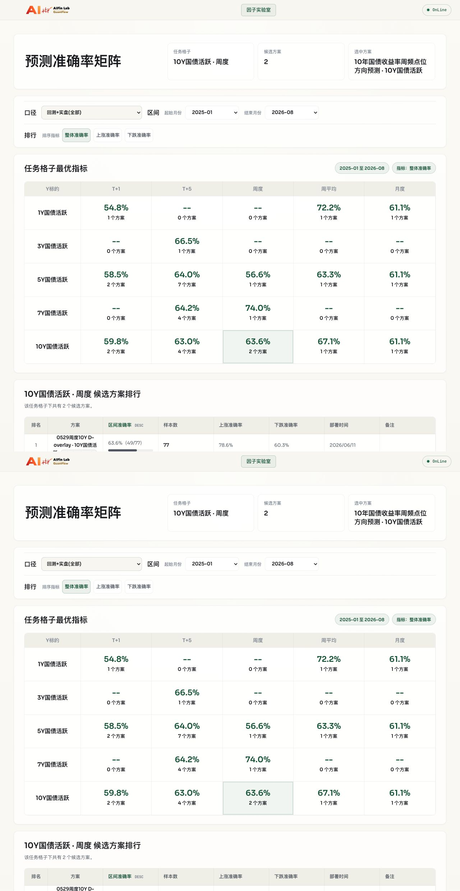

# Blackbox V2 生产灰度激活记录

**记录类型**：真实生产灰度专项授权记录

**执行日期**：2026-07-20（Asia/Shanghai）

**方案**：`weekly_10y_lgbm_point_v1`

**机器证据**：[PRODUCTION_GRAY_ACTIVATION_20260720.evidence.json](PRODUCTION_GRAY_ACTIVATION_20260720.evidence.json)

## 1. 结论

```text
CURRENT_SCHEME_STATUS: PRODUCTION_GRAY_ACTIVE
ACTIVATION: PASS
PERSISTED_BACKTEST: PASS
GRAY_LIVE: PASS
SCHEDULER_REGISTRATION: PASS
API_AND_FRONTEND_VISIBILITY: PASS
ACTUAL_JOIN: PENDING_TARGET_DATE
PLATFORM_WIDE_PRODUCTION_READY: NOT_CERTIFIED
```

该真实交付已通过专项授权进入生产灰度。它已经写入一组正式回测和一条 `gray_live` 预测，并已被生产 Registry、API、前端和 scheduler 识别。

目标日为 `2026-07-24`，因此当前实际方向、准确率和正式 API Gate 中的 actual 条件尚未产生。不得把“当前方案已生产灰度激活”扩大为“所有 Blackbox V2 新方案均已生产稳定”。

## 2. 身份与输入

| 项目 | 生产证据 |
|---|---|
| base scheme | `weekly_10y_lgbm_point_v1` |
| Registry ID | `weekly_10y_lgbm_point_v1__h1__10Y` |
| scheme version | `0666a6989d6b` |
| runtime | `blackbox_v2` / `blackbox-v2-v1` |
| Harness run | `hr_20260720T025353Z_b176dbf5eb3e` |
| environment fingerprint | `720ad40ab77cd6c7156ff35a80cf3604ac3a6153425ed235a4e3158b0631f8bd` |
| DataBridge generation | `full-20260720-055026-00e12e3803a8` |
| business digest | `00e12e3803a89e3b06439881059c9f3d9093e8642b7c37f063f4ff6169c54f1b` |
| snapshot | `snapshot-fd8a1f8736d3a4d057fbd98e` |
| Request | `2026-07-20 / 2026-07-17 / 2026-07-24` |
| cutoff keys | `2026-07-17 / 202628 / 202607` |

三频 Snapshot 与当日 generation 一致：

| 文件 | 行/列 | SHA256 |
|---|---:|---|
| `daily_output.csv` | 3878 / 774 | `03bbcc94c11acc58ac5647c2b530e2be3e45b9ed5fd74ff12a5677854e3a50e1` |
| `weekly_output.csv` | 847 / 575 | `9dfe8a8cfaae9fd4be1e70b872ff2d89d5839f4c266af3924eb0e0f5d4ebc4d5` |
| `monthly_output.csv` | 201 / 123 | `f29607a79c66860d4c43f369d99cb4fdfbba2cf665d3931f930f496bc21d86b5` |

## 3. 生产写入

| 环节 | 结果 |
|---|---|
| all-stage | 7/7 Gate passed；无业务表写入 |
| shadow-register | exact version/run 专项签名通过；Registry 保持 paused |
| ActivationGate | 配置、版本和 Registry 统一变为 active |
| 回测落库 | run `165`；100 predictions；24 monthly metrics |
| 回测汇总 | 100 条中 50 条正确，整体准确率 `50.0%` |
| gray live | run `955`；精确新增 1 run、1 prediction、1 log |
| 单点预测 | 方向 `1`；feature `2026-07-17`；target `2026-07-24` |
| 其他受保护表 | gray live 执行前后零增量 |

## 4. 下游验证

- Registry、版本配置均为 `active`。
- `/api/schemes` 返回该 composite Registry ID。
- `/api/metrics/{registry_id}` 返回 1 条 `gray_live`，actual 为 pending。
- `/api/backtests/factor-lab` 返回该版本的 100 条回测和 24 条月度指标。
- 前端 `10Y国债活跃 · 周度` 格子显示两个候选方案，V2 方案版本为 `0666a6989d6b`，详情标记“灰度实盘 2026-07-20”。
- 浏览器控制台错误数为 0。
- scheduler 已登记周六 `11:32 Asia/Shanghai` 的实际执行时间；原始 cron 为周六 `11:30`，因同组方案错峰增加 2 分钟。

前端证据：



## 5. 待验证项

正式 API Gate 的 service fingerprint、Registry、schemes、live 行和 backtest 均已匹配，但因目标日尚未来到，按设计未通过以下三项：

- `monthly_metrics must be non-empty`
- `actual contract requires at least one matched actual row`
- `summary.metric_samples must be positive`

该结果不是接口不可见或运行失败，而是首条生产灰度预测尚未到验证日。`2026-07-24` actual 刷新完成后，必须重新执行 actual、metrics 和正式 API Gate；在此之前准确率保持待验证。

## 6. 当前边界

- 当前方案可以继续生产灰度观察和受调度运行。
- 本次专项授权不自动授权其他 Blackbox V2 方案。
- 平台总体仍缺另外两个独立真实交付包以及日频、月频覆盖，因此保持 `PRODUCTION_PATH_READY`，不标记为广义 `PRODUCTION_READY`。
