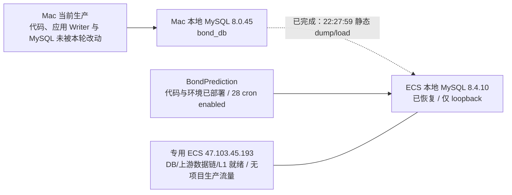
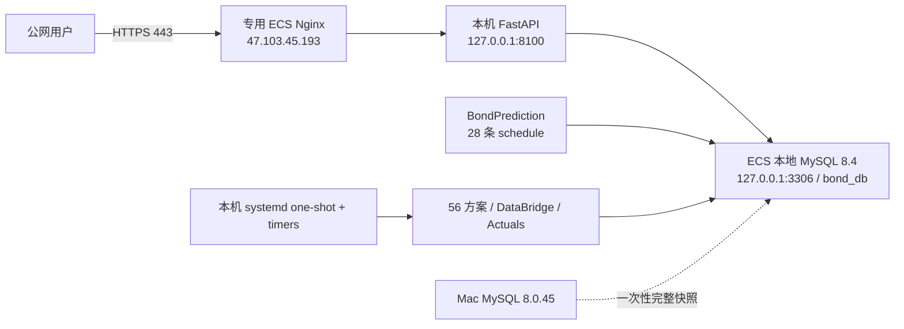
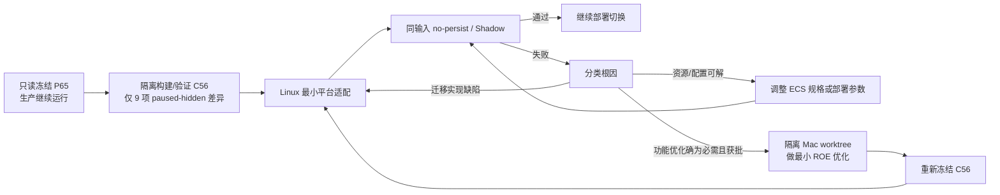

# Bond Factor Lab 阿里云迁移：第一性原理可行性评估与问题台账

**文档状态**：`CURRENT`

**目标读者**：迁移实施、平台运维和项目负责人

## 索引

| 章节 | 内容 | 什么时候看 |
|---|---|---|
| **0.0** | 数据库克隆决策 `DB-CLONE-A` 与实施回填 | 想知道数据库现在在哪、怎么来的 |
| **0.0.2–0.0.3** | v1.22/v1.24 状态变化（沙箱、ECS cron、Linux L1） | 了解与上一版的差异 |
| **0.1–0.10** | 单一交接入口：速查表、SSH、资源盘点、目标拓扑、Secret 边界、接手步骤 | **新同事第一入口** |
| 1 | 需求重述、阶段一范围、纯迁移原则与 ROE 准入 | 判断某项改动该不该进本次迁移 |
| 2 | 执行摘要与分层可行性结论 | 快速了解整体判定 |
| 3 | 已核实的现状与证据（Mac / ECS / 方案清单 / Artifact / DataBridge） | 需要引用事实依据时 |
| 4 | 卡点分类定义（HARD_BLOCKED / STOP_SHIP / ACCEPTED_RISK 等） | 理解台账里的状态词 |
| **5** | **MIG 问题台账 MIG-001…024** | 迁移全局的阻断项与状态 |
| 7 | 9 个延期 Native 的处置与未来恢复条件 | 涉及 paused-hidden 范围时 |
| 8 | 可解决的 Stop-Ship 工程（数据库连接、单 Writer、systemd 控制面、备份） | 具体工程实施 |
| 9 | 对抗性审查发现的遗漏 | 复核有无盲区 |
| 12 | 基于实验的容量与成本方法 | 设计容量实验时 |
| **13** | **剩余阶段计划 L1–L6** | **了解整体推进顺序** |
| 14 | 上线验收证据清单 | 切流前逐项核对 |
| 16 | 工期口径（不给固定总工期，逐段估算） | 被问到"多久能完成" |
| 18 | 外部参考链接 | — |
| **20** | **开工执行手册** | **实际动手时照着做** |
| **21** | **待解决问题台账 A–E** | **遇到问题先查这里** |
| 22 | 更新记录 | 追溯某个结论何时改变 |

加粗的五处是日常最常用的：**0.1 速查**、**5 MIG 台账**、**13 阶段计划**、**20 开工手册**、**21 问题台账**。

## 0.0 当前最高优先级决策：完整数据库克隆 + 云端独立增量更新（v1.21）

2026-08-16，用户用新的数据库实施方案取代了本文 1.19 及以前的“ECS 长期经 NATApp 直连 Mac MySQL”基线。**本节是当前数据库拓扑、`BondPrediction` 和数据更新调度的唯一执行 authority；本文后续仍出现的 `DB-A`、`DB-TRANSPORT-A`、ACCOUNT-A 公网直连、远程 DataBridge 或 NATApp 长期运行描述只保留为决策历史，不得据此实施。**应用与调度的其余既定范围继续有效：9 个 Darwin-only Native 保留代码但暂停隐藏，不运行历史回测，不夹带 DataBridge/队列/并发等功能优化。

当前批准的最小设计代号为 `DB-CLONE-A`：

1. 从 Mac 本地 MySQL 8.0.45 对完整 `bond_db` 做一次逻辑快照，经已固定 Host Key 的 SSH 通道传到专用 ECS；这不是主从复制，也不建立后续 Mac→ECS 增量链路。
2. ECS 使用本机 `127.0.0.1` MySQL 作为新的数据库 Candidate。2026-08-16 只读盘点确认源库含 322 张 BASE TABLE、5 个 VIEW、9 个 PROCEDURE、36 个 TRIGGER 和 3 个 ENABLED EVENT；InnoDB 数据/索引约 2.19 GB，另有一张约 0.33 MB 的 MyISAM 日志表 `sys_log`。这些对象全部进入迁移和恢复核验。
3. Ubuntu 26.04 仓库提供 MySQL 8.4.10；MySQL 官方将 8.0→8.4 LTS 的 logical dump/load 列为支持路径。恢复前关闭 Event Scheduler，恢复后保持 `event_scheduler=DISABLED`：三个历史回溯 Event 的定义保留但绝不执行，符合“不跑历史回测”的已确认边界。
4. dump 使用 `--single-transaction --quick --skip-lock-tables --routines --events --triggers --no-tablespaces --set-gtid-purged=OFF`。321 张 InnoDB 表取得非阻塞一致性视图；`sys_log` 仍完整复制，但因 MyISAM 不受事务快照保护，允许其时间点与 InnoDB 快照有秒级差异，不为日志表锁住 Mac 生产库。用户已明确要求直接导出当前静态快照，因此实际快照起点固定为 `2026-08-16 22:27:59 +08:00`，没有等待 `23:25` 任务，也没有暂停 Mac Writer。
5. `BondPrediction` 必须从 `/Users/macstudio0/bondprojectpro/BondPrediction` 的**当前工作目录 bytes**制作受控快照，不能用 Gitee clone 代替：现场有生产所需的未提交修改和新增文件。发布包排除 `logs/`、`tmp/`、`outputs/`、cache 和 `__pycache__`，保留生产脚本、`config/`、`juyuan/`、shell 入口与测试。
6. Mac 现场运行环境是 Python 3.13.12、NumPy 2.5.1、Pandas 3.0.0；ECS 系统 Python 是 3.14.4，仓库 `requirements.txt` 的 NumPy 1.26.4 又与现场漂移。ECS 已在 `/opt/bondprediction/venv` 建立 Python 3.13.12 环境，安装 NumPy 2.5.1、Pandas 3.0.0、Selenium 4.38.0、MySQL Connector 9.5.0、SQLAlchemy 2.0.44，以及 Chrome/ChromeDriver 151.0.7922.137；Linux 测试重新得到 `74 passed, 6 subtests passed`。
7. 当前 Mac 用户 crontab 中精确识别到 28 条有效 `BondPrediction` 数据更新触发；用户已明确确认另外 4 条 `forecast_project` 定时任务不需要，**不得迁移、复制、生成或启用**。只有 28 条 `BondPrediction` schedule 已按 Asia/Shanghai 和 Linux 路径生成到 ECS `/opt/bondprediction/cron.disabled`，但全部是注释状态，`root` crontab 仍不存在；Mac crontab 未改变。
8. 本阶段不做 24 小时 Mac/ECS 双跑，也不等待自然日、自然周或自然月观察。ECS 已手工运行 `insertDateList.py --ensure-ahead-days 14`：首次从 6,088 行增加到 6,090 行，补入 2 个缺失日期；同命令再次运行仍为 6,090 行，证明该入口能增量写入且同键重跑幂等。`windApiDailyLastDay.py --rdate 2026-08-14 --dry-run` 完成 404 个成功项、0 跳过，且 `api_wind_daily` 行数不变；这验证了外部合同而未额外写入业务数据。
9. 通过上述验证即可判定“云端数据库具备每日增量入库能力”。正式启用 ECS cron 与停止 Mac 对应 28 条 cron 必须作为同一个后续切换动作；本阶段不启用云端自然调度，因此既不产生双份外部数据源请求，也不影响 Mac 当前服务。
10. MySQL 仅监听 loopback，不开放公网 3306；dump、数据库管理员凭据和应用凭据均不得进入 Git、本文、命令参数或普通日志。安装、恢复并清理临时安装包后，40 GiB 系统盘已使用约 14 GiB、可用约 24 GiB；其中 `/var/lib/mysql` 约 8.3 GiB、压缩快照约 318 MiB。当前 Candidate 空间充足，`sync_outbox`、binlog 和日志增长仍须在后续自然运行中观测。

`DB-CLONE-A` 的 Candidate 实施与本阶段验收已经完成：源/目标对象结构一致，36 个 Trigger 与 9 个 Procedure 可读回，3 个 Event 定义保留但全局 Event Scheduler 为 `OFF`，Linux 测试通过，代表任务完成首次增量写入与同键重跑且无重复。它不要求历史回测、24 小时双跑、主从复制、RDS、LKG 或远程 DataBridge。**这只完成数据库克隆与 `BondPrediction` 增量能力迁移，不表示 Bond Factor Lab Web、DataBridge、56 个算法、Actuals、systemd timer、Nginx、DNS 或生产流量已经迁移。**

### 0.0.1 已完成实施回填（2026-08-16）

| 验收项 | 实际结果 |
|---|---|
| 静态快照 | `2026-08-16 22:27:59 +08:00` 开始；压缩文件 `332,565,676` bytes，解压 SQL `3,491,167,430` bytes；SHA-256 `1e5c443148153815b2818b26441846c6c3c8af9600a10baec1d568c6000e57af` |
| 快照位置 | Mac 受控副本 `/Users/macstudio0/bond-factor-lab-migration-docs/artifacts/bond_db_static_20260816T222759_CST.sql.zst`；ECS 受控副本 `/var/backups/bond-factor-lab/bond_db_static_20260816T222759_CST.sql.zst`；两端字节数、SHA-256 和 `zstd -t` 一致，权限均为 `0600` |
| 恢复 | ECS MySQL 8.4.10；恢复耗时 826 秒；`bond_db` 为 `utf8mb4/utf8mb4_0900_ai_ci`；MySQL 仅监听 `127.0.0.1:3306/33060` |
| 对象闭包 | 源/目标均为 322 BASE TABLE、5 VIEW、9 PROCEDURE、36 TRIGGER、3 EVENT；table/column/index/routine/trigger/event 六类规范化元数据 SHA-256 全部逐类一致；`mysqlcheck --check --quick --silent bond_db` 通过；对象 DEFINER 缺失数为 0 |
| Event 边界 | 3 个 Event 的定义和原状态被恢复，但全局 `event_scheduler=OFF` 已 `SET PERSIST` 并经 MySQL 重启后复核；历史 Event 不会执行 |
| 本地账号适配 | Ubuntu MySQL 的 `root@localhost` 使用 `auth_socket`，不适合作为脚本 TCP 账号；保留该 socket 管理账号，并新增仅本机可用的 `bond_app@localhost`。`BondPrediction` 目标配置仅把用户名改为 `bond_app`，仍使用受保护 Secret，文件权限 `0600`；Mac 原配置未改 |
| `BondPrediction` 发布 | 当前工作目录 bytes 已复制到 `/opt/bondprediction/current`，共 80 个文件、约 2.1 MiB 业务代码；排除 `.git`、cache、日志、临时和输出目录；发布 SHA-256 清单位于 `/opt/bondprediction/DEPLOYMENT_SHA256SUMS` |
| Linux 环境 | `/opt/bondprediction/venv` 为 Python 3.13.12；`pip check` 无破损依赖；Chrome 与 ChromeDriver 均为 151.0.7922.137；通过 `SE_OFFLINE=true` 使用本地 Driver，Selenium smoke 通过 |
| 测试与增量写入 | `python -m pytest -q tests check/test_*.py`：`74 passed, 6 subtests passed in 8.15s`；日期入口首次增加 2 行、同命令重跑 0 行；精确 cron shell 命令也运行成功；Wind 日频 dry-run 为 404 成功、0 跳过、目标表 0 行变化 |
| Cron | 28 条 Linux 候选任务已写入 `/opt/bondprediction/cron.disabled`，Mac 受控副本为 `/Users/macstudio0/bond-factor-lab-migration-docs/artifacts/bondprediction.cron.disabled`，SHA-256 均为 `8ccfbb2adaf168bf3c24272d1d6459830ecbf1d5621b1e71596589a08a835aee`；语法和 12 个唯一脚本路径通过核验，内容不含 `forecast_project`；所有任务保持注释，`root` crontab 仍为 absent。Mac 的 28 条有效 `BondPrediction` 与 4 条 `forecast_project` 任务保持原状；后者明确不迁移 |
| 资源余量 | 清理临时安装包后根盘约 14 GiB 已用、24 GiB 可用；内存约 1.2 GiB 已用、13 GiB available；无 Swap；MySQL 与 cron service active，0 failed unit |

本次是**静态**快照，不是持续复制。快照之后 Mac 新写入的数据不会自动出现在 ECS；ECS cron 又尚未启用，所以 Candidate 会自然落后。后续 Writer 正式切换若要求零遗漏，只需在切换窗口重新取一次最终静态快照，或按明确业务日期补齐快照后的空窗，再启用 ECS cron；这不是本次“脚本能否增量入库”的验收卡点。

源/目标六类规范化对象 hash 的共同值为：tables `3a8a5e8982a15aa72526aae3995876a16e2cfda2090cd34407d5049287c11cbf`、columns `22fde81fe2a6176def4eb2eb7405ac1a6767a577ec42d126e0929f5e37eac119`、indexes `b2992c24df8dc5c588e7666661aa9481f0d79abb3fc3323acfd475dfaee390d0`、routines `8f7bc92dff94eefe13416c9bb2b590b061a7280b702bdd41610f7a3c83658e5f`、triggers `09f0052d2ce81020d8dc24a0cdaa822cf482bc9891649db60f3a779597df1350`、events `5c1f75f108f9594123d8f5dd00d3444316d27660acd6f106d20cc18e84ece313`。

### 0.0.2 v1.22 状态变化（2026-08-17 只读复核）

两项与 v1.21 记录不同的现场事实，以及一项新完成的代码变更：

| 项 | v1.21 记录 | 2026-08-17 实测 |
|---|---|---|
| ECS cron | 28 条全部注释，`root` crontab absent | **已启用**：`crontab -l` 返回 28 条有效触发，上游数据链正在 ECS 本地生产并写库 |
| 磁盘 | 恢复与清理后约 14 GiB 已用 | 40 GiB 盘已用 15 GiB、可用 23 GiB，其中 `/var/lib/mysql` 占 8.3 GiB |
| Blackbox 运行期沙箱 | MIG-003 STOP_SHIP | 已退役（commit `713ee33`），保证前移到入库 StaticGate + 版本哈希绑定 + 运行后输入目录指纹复验 |

ECS cron 启用带来一个需要判定的副作用：v1.21 第 9 条要求"正式启用 ECS cron 与停止 Mac 对应 28 条 cron
必须作为同一个后续切换动作"，理由是避免**双份外部数据源请求**。若 Mac 的 28 条 cron 仍在运行，
则两地正在同时向同一批外部数据源（Wind API、东方财富、中国货币网、中债）发起请求。
这既可能触及配额或频率限制，也可能触及数据许可的节点约束。**需要确认 Mac 侧 cron 的当前状态并作出处置。**

沙箱退役后仍需注意：`network_access: false` 与 `database_access: false` 在运行期不再有强制机制，
仅作为契约声明由入库 StaticGate 静态强制；`database_access` 另有 `environment_allowlist`
（仅 `LANG/LC_ALL/TZ`）兜底。验收报告不得声称存在 OS 级网络或文件系统隔离。

### 0.0.3 v1.24 Linux L1 实施回填（2026-08-17）

用户选择 `conda-forge-only` 后，Bond Factor Lab 的 Linux L1 已在 ECS bootstrap 区完成，
但尚未安装为生产应用、启用 systemd、修改 Registry 或切换流量：

| 项 | 实际结果 |
|---|---|
| 候选 release | `codex/aliyun-db-clone-20260816@537e8ba50a60ac6954201d9e0c97f91fe09be18b`；9 个延期 Native 在候选配置中精确 paused，17 Native + 39 Blackbox 保持 active；全量回归 `815 passed, 456 subtests passed` |
| Conda 基础 | 三个目标环境均以 `--override-channels --channel conda-forge --strict-channel-priority --platform linux-64` 创建；Service 为 CPython `3.12.13=h8ab3286_1_cpython`，Native/Blackbox 为非 free-threaded CPython `3.13.12=hc97d973_100_cp313` |
| Python 依赖 | Service `48/48`、Native `49/49`、Blackbox `49/49` 精确版本匹配，均无额外 Python distribution，三者 `pip check` 通过；Linux 闭包补入 service 的 `greenlet` 和两个算法环境的 `nvidia-nccl-cu12`，未把 `xgboost` 静默替换为 `xgboost-cpu` |
| Wheel 供应链 | 97 个实际 wheel 从阿里云 HTTPS PyPI 镜像取得；每个精确文件名和 SHA-256 均与官方 PyPI JSON metadata 匹配；安装使用本地 wheelhouse + `--no-index --require-hashes --only-binary=:all: --no-deps` |
| 运行探针 | 三套环境核心 import 全通过；两个算法环境均以 `tree_method='hist'` 完成最小 CPU XGBoost 训练；Service 新进程使用受保护配置只读连接 ECS MySQL 成功，证据不记录 DSN、账号、密码或服务器 UUID |
| Blackbox manifest | canonical `environment_manifest.json` 已变为 `linux-64`、71 包，fingerprint `b37b78e89aeb65600edb909d7e98dcfbf69429edb4f3232526331021570ec565`；原 Mac 64 包证据按字节保存在 `environment_manifest.osx-arm64.json`；`profile_name` 仍为 `blackbox-v2-v1`，39 个 `scheme_version` 未变 |
| Blackbox CLI | 最终 release 中 39/39 个交付均通过平台正式 `probe_blackbox_help`，全部暴露 `predict` 与 `backtest`；在独立网络 namespace 中执行，release 文件树前后摘要一致 |
| Liwei Phase A | 精确迁移 75 个载荷、`100,622,640` bytes：7 个 `current.json`、14 个 generation manifest、54 个 pickle；0 个 `.invalid-*`/`.lock`。Linux CPython 3.13/x86_64 使用正式 secure loader 重放 7/7 current + parent lineage，载荷前后 SHA-256 一致 |
| 可复核证据 | 环境证据：`/Users/macstudio0/bond-factor-lab-migration-docs/artifacts/linux-envs/environment-evidence-20260817T042945Z/`；缓存证据：`/Users/macstudio0/bond-factor-lab-migration-docs/artifacts/liwei-phase-a-cache-20260817T034508Z/linux-verification/`；两处 `SHA256SUMS` 均通过 |

L1 的**当前主机功能出口**已经通过，可以进入 L2 fixture/数值/性能实验。供应链仍有一个
不影响当前主机运行、但影响“从空机器完全复建”措辞的缺口：最初的 Miniconda installer 文件
已不在 `/opt` 或 `/root`，因此只有已安装 Conda 可执行文件、安装历史和三套环境的精确清单/hash，
没有原 installer 文件 hash。未来做零起点重建前必须另行钉死并校验一个批准的 installer；在此之前
不得把 L1 写成“从裸机完全可复现”。

## 0. 单一迁移交接入口（先读）

本节是新接手人员的第一入口。除非注明“目标/待实施”，下列值均为 2026-08-17（Asia/Shanghai）对专用 ECS 的现场实施与读回结果。数据库克隆、`BondPrediction` 发布与增量能力、Bond Factor Lab 的 C56 release、三套 Linux 环境和 Liwei 热缓存 bootstrap 验证已完成；Web、DataBridge/算法/Actuals 的应用安装、systemd timer、Nginx、DNS 与生产流量尚未部署或切换。任何超出第 0.0.1/0.0.3 节已完成范围的 Reload、启停、写库、切流或安全组操作，仍须取得对应授权。本文的服务器资源基线只以本节记录的专用 ECS 为准。

### 0.1 一页速查

| 类别 | 已核实值 / 当前决定 | 状态 |
|---|---|---|
| 专用 ECS 公网 EIP | `47.103.45.193` | 本文唯一记录和管理的云服务器 |
| Bond Factor Lab 目标域名 | `bond.finailab.cn` | G6 在本服务器完成 Nginx/TLS 后，把域名切到该 EIP；当前尚未切流 |
| 目标访问地址 | `https://bond.finailab.cn/bond-factor-lab/` | URL 保持不变；DNS/TLS 切换属于独立生产操作 |
| 专用 ECS SSH | `root@47.103.45.193:22`，仅公钥认证 | 2026-08-16 已用受控私钥只读登录；Host Key 见 0.2 |
| 本机 SSH 私钥引用 | `/Users/macstudio0/.ssh/finlab-key.pem`，权限 `0600` | 仅记录位置，不在本文保存或展示私钥内容；此路径只对当前 Mac 有效 |
| 专用 ECS 身份/网络 | `i-uf68h8wsd7ks5wqod85s`；EIP `47.103.45.193`；私网 `172.22.56.176/20` | 已由实例元数据核实；`cn-shanghai-e` |
| 专用 Candidate 资源 | **`ecs.u1-c1m4.xlarge`；4 vCPU；Guest 可见 `16,061,423,616` bytes（约 14.96 GiB）；40 GiB ext4 系统盘** | 2026-08-16 已通过 SSH/元数据读回生效；可开始 Candidate 准备，但功能/生产容量尚未验收 |
| 专用 Candidate 系统 | Ubuntu 26.04 LTS；Linux `7.0.0-28-generic`；x86_64；systemd 259；无 Swap | 已核实；系统 Python 3.14.4，不可替代项目要求的独立 3.12/3.13 环境 |
| Candidate 当前状态 | ECS 本地 MySQL 与 `BondPrediction` 已部署；C56 release、三套 Linux 环境和 Liwei cache 已在 `/opt/bond-factor-lab-bootstrap` staging 验证；无 Nginx、FastAPI、DataBridge/算法/Actuals 应用服务或生产流量 | Linux L1 完成，可以进入 L2；staging 不等于已安装/启用 |
| 阶段一数据库 | `DB-CLONE-A`：Mac MySQL 8.0.45 的完整 `bond_db` 已一次性 dump/load 到 ECS 本机 MySQL 8.4.10；运行期连接 `127.0.0.1` | **Candidate 已完成并验收**；不建立复制，后续由 ECS `BondPrediction` 独立增量更新 |
| 阶段一数据库账号 | ECS 使用仅本机可连接的 `bond_app@localhost` 承载 `BondPrediction`，后续也供 Backend、Dashboard、DataBridge、scheduler/Actuals 使用；凭据只落 root-only 配置 | 已保留 `root@localhost` 的 socket 管理语义；未复制 `mysql` 系统库、未开放公网 3306；DEFINER coverage 已通过 |
| Secret 交付 | `BondPrediction` 的既有配置合同已在目标机 root-only 文件中交付，用户名适配为 `bond_app`；Bond Factor Lab 的 `/etc/bond-factor-lab/bond-factor-lab.env` 尚未创建 | 已完成数据更新脚本所需部分；Web/算法部署时再完成平台环境文件；Secret 不进入 Git、release、unit 正文、命令行、日志或本文 |
| 阶段一数据库传输 | 一次性 `mysqldump` 压缩快照已经固定 Host Key 的 SSH 传输；两端 SHA-256 与压缩完整性一致并已恢复 | NATApp 只保留为历史端点/必要只读核验，不再是应用运行期数据库链路 |
| 阶段一算法范围 | 17 个可迁 Native + 39 个 Blackbox，共 56 个；9 个 Darwin-only Native 采用“暂停隐藏、代码保留” | 候选 config 与 release 已机器强制 56/9；生产 Registry 的 9 行暂停仍是独立切换写操作，尚未执行 |
| 阶段一回测范围 | **不执行历史回测，不补跑或持久化新的 `t_backtest_*` 结果**；保留 backtest 代码、既有历史数据及 Dashboard/API 只读展示 | 用户已确认；迁移验收聚焦 live schedule、当前输入和 no-persist/fixture 证据 |
| 阶段一调度范围 | `LIVE-SCHEDULE-ONLY`：DataBridge 每日 06:30；日频周一至周五 07:03；周频周六 11:30；月频每月 15 日 18:00；Actuals 每日 08:30、19:00、23:45 | 用户已确认所有 live 日/周/月任务按各自日历正常运行；不包含历史回测、历史补跑或自动 backfill |
| 阶段一部署基线 | **最小整仓搬迁到专用 Candidate**：干净 C56 release + ECS 本地 MySQL + `BondPrediction` + Linux 环境 + Candidate 本地 DataBridge + Blackbox 直接执行 + systemd one-shot/timer + 本机 Nginx/HTTPS | 本地 MySQL、`BondPrediction`、C56 release、Linux 环境与 Liwei cache 已完成/staged；L2、应用安装、systemd、Web 与流量仍待实施 |
| Web 内部监听 | FastAPI 仅监听 `127.0.0.1:8100`，本机 Nginx 直接反代该地址；8100 不对公网开放 | 目标设计已确定、尚未安装；仓库现有 Nginx 模板按另一拓扑生成，不能原样复制 |
| Timer 错过触发 | 所有 live timer 固定 `Persistent=false`、`RandomizedDelaySec=0`；ECS 停机期间错过的触发不在开机后自动补跑 | 与“无历史补跑/无 startup catch-up”一致；漏跑记失败并告警，人工重跑须走独立受控操作 |
| G6 证书引导 | 当前域名 A 记录尚未指向 Candidate；切流前默认以 DNS-01 预签证书，切流后再把自动续期收敛到本机 HTTP-01/webroot 并 dry-run | 不阻止 G0B–G5；G6 只需确认 DNS/TXT 操作权限和切换窗口，不引入长期 DNS API Secret |
| 实施原则 | 冻结 Mac 当前行为，只做必要 Linux 平台适配；与迁移无关的 DataBridge 共享、队列、并发、LKG/RDS 均后置 | 已确认 |
| 切流前零干扰边界 | Mac 生产代码、65 方案 config/Registry、launchd、应用 Writer、服务与公网链路未因本轮候选工作改变；ECS 项目 release/env/cache 只在 bootstrap staging | 2026-08-17 只读复核发现 ECS 的 28 条 `BondPrediction` cron 已启用；Mac 对应 cron 当前状态必须在 Writer 切换前重新读回，避免两端重复外部请求 |
| 当前生产切换判定 | **No-Go（仅表示整套服务尚未切换）** | 数据库、上游数据链和 Linux L1 已通过；Bond Factor Lab L2、应用 Writer、systemd、Web/Nginx/DNS、Registry 切换和生产流量均未完成 |

### 0.2 SSH 连接方式与主机身份

对新同事或新电脑，`/Users/macstudio0/.ssh/finlab-key.pem` 不会自动存在，且不得通过本文、Git、IM 明文或普通邮件分发。应由 ECS/密钥责任人通过受控渠道发放独立凭据或批准新公钥；私钥落盘后权限必须为 `0600`。首次连接前先比对 Host Key，不能把 `StrictHostKeyChecking=no` 当作便利配置：

```bash
ssh \
  -i /Users/macstudio0/.ssh/finlab-key.pem \
  -o IdentitiesOnly=yes \
  -o StrictHostKeyChecking=yes \
  root@47.103.45.193
```

| Candidate Host Key 类型 | 2026-08-16 已核实指纹 |
|---|---|
| ED25519 | `SHA256:ue5OMfnTmotUaVbS/f5cqQ3aGcdDxF5VPfF3rYLpDCs` |

本轮为避免未经确认写入常规 `known_hosts`，实际连接使用一次性受控 known-hosts 文件；新同事首次连接仍须先从可信渠道比对上述指纹，再把公钥写入自己的受控 known-hosts。仅运行 `ssh-keyscan` 不构成身份认证。

可用下面的只读命令查看当前网络返回的 ED25519 指纹，并与上表通过可信渠道核对；`ssh-keyscan` 本身不证明主机身份：

```bash
ssh-keyscan -t ed25519 47.103.45.193 2>/dev/null | ssh-keygen -lf -
```

该 SSH Server 当前已核实的有效边界为：监听 IPv4/IPv6 的 22 端口，`PermitRootLogin yes`、`PubkeyAuthentication yes`、`PasswordAuthentication no`、`KbdInteractiveAuthentication no`。因此“root + 共享私钥引用”是已观察到的阶段一现状，不是推荐的长期权限模型。2026-08-16 用户已确认具备阿里云控制台、安全组查看、重启、升配和续费权限，云端失联时有控制面接管能力。密钥保管/轮换、离职回收和是否改成个人账号 + sudo 属于后续运维治理，见 MIG-021C，不阻止首次功能部署。

### 0.3 专用 ECS 的资源、网络与操作系统盘点

| 项目 | 已核实现场值 | 解释 |
|---|---|---|
| 实例名称 / ID / 主机名 | `灰度实验室v1` / `i-uf68h8wsd7ks5wqod85s` / `iZuf68h8wsd7ks5wqod85sZ` | 截图与实例元数据、SSH Guest 三方一致 |
| 地域 / 可用区 | `cn-shanghai` / `cn-shanghai-e` | 实例元数据结果 |
| 实例规格 | `ecs.u1-c1m4.xlarge` | 4 vCPU / 16 GiB；已真实生效，不再是待配置值 |
| 镜像 | `ubuntu_26_04_x64_20G_alibase_20260720.vhd` | 实例元数据结果 |
| OS / Kernel / libc | Ubuntu 26.04 LTS；Linux `7.0.0-28-generic`；glibc 2.43；x86_64 | 必须用独立项目环境做兼容性 Spike |
| CPU | 4 vCPU；Intel Xeon Platinum；2 cores × 2 threads；KVM；单 NUMA；AVX2/AVX-512 | u1 平台可能变化；本次具体 CPU flags 已取证，性能需重复测量 |
| 内存 / Swap | Guest `MemTotal=16,061,423,616` bytes（约 14.96 GiB）；数据库和数据更新环境部署后约 1.2 GiB 已用、13 GiB available；无 Swap | 当前余量充足；仍须以完整 C56 串行批次验收，Swap 不作为容量 |
| 系统盘 | 控制台云盘 `d-uf68h8wsd7ks5wqo5jxr`；ESSD 40 GiB；Guest `/dev/vda3` ext4 | 数据库、三套项目环境、wheel/evidence、release 与 cache staging 后约 22 GiB 已用、16 GiB 可用；`/var/lib/mysql` 约 8.3 GiB、受控压缩快照约 318 MiB |
| 公网 / 私网 | EIP `47.103.45.193`；私网 `172.22.56.176/20`；网关 `172.22.63.253`；MTU 1500 | EIP 来自控制台与 metadata `eipv4`；当前仅 SSH 对外监听 |
| VPC / vSwitch | `vpc-uf67yzmupy4ozrdtnjjf3` / `vsw-uf6oktv3w5xyj06dhsdq4`，vSwitch CIDR `172.22.48.0/20` | 本文唯一记录的云网络位置 |
| 公网带宽 | 控制台显示按固定带宽 3 Mbps | Guest 不能证明计费/限速细节；不做消耗性 speed test，G5/G6 用真实流量验证 |
| 付费 / 到期 | 包年包月；截图显示手动续费；到期 `2026-09-16 23:59:59` | 足够短期 Spike，但若进入持续 Shadow 或生产，必须在到期前明确续费，不能当长期资源 |
| 时钟 | `Asia/Shanghai`；NTP enabled/synchronized；Local RTC=no | 满足 systemd Timer 日期语义基础条件 |
| systemd / 安全能力 | systemd 259；AppArmor enabled；cgroup v2（含 cpu/io/memory/pids）；UFW inactive；无 failed unit；无 OOM 事件 | 安全组仍是公网边界 authority；本轮未修改任何设置 |
| 当前监听 | 公网 `22/tcp`；MySQL 仅监听 `127.0.0.1:3306/33060`；另有本地 resolver/Agent loopback | 尚无 Nginx/FastAPI 公网服务，不承载生产流量；3306 不进安全组 |
| 已有工具/运行时 | 系统 Python 3.14.4、Git 2.53.0、GCC/G++ 15.2、make、curl/wget/rsync、OpenSSL 3.5.5；MySQL 8.4.10；`/opt/miniconda3`；Bond Factor Lab 三套精确环境；`/opt/bondprediction/venv` Python 3.13.12；Chrome/ChromeDriver 151.0.7922.137 | 数据更新与 Bond Factor Lab Linux L1 环境均完成 |
| 尚未安装/部署 | Nginx、FastAPI、DataBridge/算法/Actuals 项目服务、项目 systemd unit/timer、Docker、Podman | C56 release/cache 仅在 bootstrap staging；本地数据库和 `BondPrediction` 不在此缺口中 |
| 系统状态 | cloud-init done；system state running；MySQL 和 cron service active；0 failed unit；logrotate/fstrim timer enabled；root crontab 有 28 条 `BondPrediction` 触发 | 上游数据链正在 ECS 本地运行；尚无 Bond Factor Lab Writer/Web 生产流量 |
| 基础连通 | PyPI/Conda/GitHub/Google Chrome 下载链路可用；本地 `bond_app@localhost` 对 `bond_db` 的真实应用 TCP 连接通过 | NATApp 基础连通仅是历史证据，不再参与当前运行拓扑；完整 DataBridge/算法仍待后续验证 |

2026-08-16，用户把该实例指定为本次迁移唯一专用服务器，并要求按 4C16G 验证。现场已证明规格、内存和网络真实生效，因此“是否有可用 Candidate 主机”已关闭；MIG-002 只剩功能/容量实验，不再等待资源配置。该节点目前运行 loopback-only MySQL 与 `BondPrediction` 上游任务，并保存 Bond Factor Lab C56/env/cache bootstrap staging，但没有 Nginx、FastAPI、DataBridge/算法/Actuals 项目服务；Web 与 Batch 部署后会共享这 4C16G，必须在 G5 观测。

实例 Guest 内仍无法可靠回答 Security Group 精确规则、自动快照策略和带宽计费细节。用户已确认具备控制台权限，因此这些按其实际 Gate 回填，不阻止 L2。云盘 40 GiB 在 Linux L1 完成后约 16 GiB 可用，足够进入短期 fixture/性能实验；它不构成长周期无界增长保证，正式运行前仍须量化临时 Artifact、日志、Native CSV 与 MySQL/binlog 增长。

本文把“是否 OK”拆成两级，避免仅凭启动成功做容量承诺：**功能试跑 OK**表示代表 Native/Blackbox 及完整 C56 串行 Shadow 可执行、无 OOM/残留进程且结果等价；**生产容量 OK**还要求完整日/周/月批次满足批准的 deadline、峰值资源保留安全余量，并且 Batch 期间本机 API 无不可接受退化。4C16G 是待验证输入，不是结论；CPU 核数也不授权迁移时增加队列或并发。

阿里云官方规格表中的 canonical 名称是 `ecs.u1-c1m4.xlarge`，确认其为 4 vCPU/16 GiB、基础网络带宽 1.5 Gbit/s、基础云盘 IOPS 2 万、基础云盘带宽 1.5 Gbit/s。官方同时说明 u1 创建时可能落在不同服务器平台，生命周期中也可能迁移，不同平台间可能存在明显性能差异。因此试验必须记录 `model name`、CPU flags 和实例身份，并至少重复 3–5 次；一次跑通只能证明该次环境，不能把墙钟外推为所有 u1 主机的固定性能。

### 0.4 专用 ECS 当前状态



当前 Candidate 状态为：

| 组件 | 当前配置 / 状态 |
|---|---|
| 公网监听 | `22/tcp` SSH；80/443 尚无服务；MySQL 仅在 loopback；实际 Security Group 规则待 G6 读回 |
| Nginx / TLS | 均未安装或配置；目标是在本机承载 `bond.finailab.cn` |
| FastAPI / 前端 | 未安装为服务；Service Linux 环境与 C56 bytes 已在 bootstrap staging 验证 |
| DataBridge / 算法 / Actuals | 未安装/启用；Native/Blackbox Linux 环境、39 个 Blackbox CLI 和 Liwei cache 已在 bootstrap staging 验证 |
| MySQL | 8.4.10 active；`bond_db` 已恢复；`event_scheduler=OFF` 已持久化并经重启复核；本地应用连接通过 |
| `BondPrediction` | `/opt/bondprediction/current` 与 Python/Chrome 环境已部署；测试、增量写入、幂等重跑和 Wind dry-run 通过 |
| 数据更新 schedule | `/opt/bondprediction/cron.disabled` 仍保留候选副本；2026-08-17 只读复核时 root crontab 已有 28 条有效 `BondPrediction` 触发，4 条 `forecast_project` 未迁移 |
| Bond Factor Lab systemd unit/timer | 尚未创建；后续创建时保持 Timer disabled，直到 G7 独立授权 |
| 生产流量 | 0；当前 Mac 生产保持原状 |

任何未来 installed Nginx/systemd 配置和 loaded state 才是本机运行 authority；尚未安装的目标配置不得冒充现场事实。

### 0.5 阶段一目标拓扑：最小迁移，不夹带优化



2026-08-16，用户正式确认采用**最小整仓搬迁 + 本地数据库克隆基线（Minimal Lift-and-Shift + Local DB Clone）**。数据库先从 Mac 做一次完整逻辑快照并恢复到 ECS，本次迁移后的 Backend、Dashboard、DataBridge、算法调度、Actuals 和 `BondPrediction` 全部只连 ECS loopback MySQL；后续数据新增由迁到 ECS 的既有 `BondPrediction` 脚本及其 28 条 schedule 独立完成，不建立 Mac→ECS 持续同步链路。

| 组件 | 阶段一最小动作 | 性质 |
|---|---|---|
| 前端 + FastAPI | 在新专用 Candidate 部署同一份干净 C56 release，安装 Linux Service 依赖并令 FastAPI 仅监听 `127.0.0.1:8100` | 部署，不改业务功能；8100 不进入 Security Group 公网入站 |
| 数据库 | 完整 `bond_db` 已 dump/load 到 ECS MySQL 8.4.10；运行期固定 `BOND_DB_HOST=127.0.0.1`、`BOND_DB_PORT=3306`，未改 Schema 和业务 SQL | **已完成并验收**；一次性数据迁移 + 配置替换；不做复制、RDS、双写或公网 3306 |
| `BondPrediction` | 已复制 `/Users/macstudio0/bondprojectpro/BondPrediction` 当前生产工作目录 bytes，重建 Python 3.13 + Chrome 环境，并等价生成 28 条 Linux schedule | **Candidate 已完成并验证**；2026-08-17 只读复核发现 28 条 schedule 已由 root crontab 启用 |
| DataBridge | 从 ECS 本地 `bond_db` 生成 current Artifact；不再依赖 Mac 数据库或 NATApp | 现有能力换主机运行；不实施批次共享或一次校验优化 |
| 39 个 Blackbox | 使用锁定 Linux Python 环境直接启动子进程。运行期沙箱已退役，Runner 无 macOS 绑定 | Linux 环境、canonical manifest 和 39/39 `--help` 已通过；剩余是 L2 fixture/数值/性能与部署级 no-persist |
| 调度与 Actuals | 用真实 `systemd_one_shot` unit/timer 承载现有一次性入口、时间和失败语义 | 必需 Linux 适配；不新增第二 Python 控制面 |
| 9 个延期 Native | C56 中 paused-hidden，代码和历史保留，不在 Linux 执行 | 已批准的阶段范围差异 |
| 公网入口 | 在本机安装 Nginx/Certbot，受控签发或部署 `bond.finailab.cn` 证书；G6 将 DNS 切到 `47.103.45.193` | 单服务器目标已收敛；安装、证书、Security Group、DNS 和切流仍分别需要授权 |

这里的“整仓”对两个代码源有不同的精确含义：Bond Factor Lab 使用绑定 exact commit 的干净 C56 release；`BondPrediction` 因现场存在生产所需的未提交文件，使用当前工作目录 bytes 制作带 SHA-256 清单的受控发布包。两者都排除 `.git`、本机 Conda 环境、日志、cache、`outputs/`、历史 `runtime_inputs` 和临时产物；数据库/应用 Secret 单独受控交付，不混入普通 release。DataBridge current、日志和运行目录在 ECS 重新生成。9 个延期方案的后端代码/加密包保留，但由 paused-hidden 机器边界保证不会加载。

目标变化只有：把 Nginx/HTTPS、FastAPI、DataBridge、17 个可迁 Native、39 个 Blackbox、Actuals 和一次性调度入口部署到这台专用 Linux ECS。用户已选择阶段一直接使用 root 身份，不创建非 root 服务用户；三套 Python 环境目录已经建立，FastAPI 的目标内部监听固定为 `127.0.0.1:8100`，但项目 current、平台 env 文件和 systemd unit 名尚未实施，不能冒充现场事实。G6 只负责把 `bond.finailab.cn` 的 HTTPS 读流量切到该 EIP。

阶段一不包含：9 个 Darwin-only Native、DataBridge 批次共享、队列/并发、逐方案容器、LKG、RDS、自动故障转移或算法功能调整。只有某项优化被证据证明为迁移必要条件并满足 ROE 六项准入时，才回 Mac 的隔离 worktree 独立实现、验证和重新冻结 C56；P65 仍不变。

### 0.6 数据库连接与 Secret 边界

| 项目 | 当前结论 |
|---|---|
| 运行期 Endpoint | `127.0.0.1:3306`；MySQL 仅监听 loopback，安全组不开放 3306 |
| Database / Server | `bond_db`；源 MySQL 8.0.45，目标 Ubuntu 包 MySQL 8.4.10 |
| 数据传输 | 一次性完整 logical dump，经固定 SSH Host Key 的加密通道传输并做 SHA-256 校验；不建立主从复制或后续增量传输 |
| 阶段一可用性 | 数据库与应用同机，消除 Mac/NATApp 运行期依赖；仍是单 ECS/单 MySQL，实例或本地 MySQL 故障时 Dashboard/API 返回 503、批任务失败 |
| 账号 | `root@localhost` 保留 Ubuntu `auth_socket` 管理语义；应用 TCP 使用仅本机的 `bond_app@localhost`。未复制 `mysql` 系统库；对象 DEFINER coverage 已通过，Bond Factor Lab 其余四类连接仍待部署后逐条核验；密码不得写入本文 |
| Event Scheduler | 恢复前后保持 `DISABLED`；3 个 Event 定义保留但不执行，防止历史回溯任务运行 |
| NATApp | 仅保留为历史公网端点和必要的只读诊断备用，不进入任何 ECS 运行期配置 |

阶段一启用的 Bond Factor Lab 路径由 `BOND_DB_HOST`、`BOND_DB_PORT`、`BOND_DB_USER`、`BOND_DB_PASSWORD`、`BOND_DB_NAME` 和 `BOND_DB_CHARSET` 配置，目标 host/port 固定为 loopback。`BondPrediction` 中仍读取其既有受保护配置的脚本没有重写业务逻辑，只在目标配置中完成 Ubuntu MySQL 所需的本地用户名适配；其真实连接和代表入口已命中 ECS 本地库。Backend、Dashboard、DataBridge 和 scheduler/Actuals 要在各自部署后逐条核验。历史 backtest runner 不执行；9 个 source-runtime Native 不进入本次运行范围。

严禁把 DB 密码、旧 NATApp Token、SSH 私钥、TLS 私钥、阿里云 AccessKey 或 Session Token 写入本文、Git、unit 文件、命令行历史或日志。本文只记录 Secret 的用途、责任和受控引用位置。`BondPrediction` 的受保护配置已完成目标交付，权限为 `0600`；后续 Bond Factor Lab 部署时再交付 `/etc/bond-factor-lab/bond-factor-lab.env`，同样要求 `root:root`、`0600`。普通 release 不包含 Secret。

### 0.7 凭据、配置与 Authority 顺序

| 对象 | Authority / 当前位置 | 当前缺口 |
|---|---|---|
| SSH 私钥 | 当前 Mac `/Users/macstudio0/.ssh/finlab-key.pem`，`0600`；只记录引用，不读取内容 | 责任人、独立账号/公钥发放、轮换和回收未文档化 |
| SSH Host Key | 当前 Mac `known_hosts` + 本节指纹 | 新设备首次信任必须人工核对 |
| 阿里云控制面 | Aliyun ECS 控制台/API；2026-08-16 用户确认可查看安全组并执行重启、升配和续费 | 操作权限已闭环；Candidate 的 EIP/带宽、付费/到期和云盘基本值已回填，Security Group 精确规则、自动快照和长期续费动作仍按 Gate 闭环 |
| Candidate Nginx | 未来本机 `/etc/nginx/` installed config、`nginx -T` 与 systemd loaded state | 当前未安装；仓库模板不能代替 installed state，也不能原样复制。ECS 渲染版必须把 upstream 指向 `127.0.0.1:8100`，并保证 proxy-header snippet 的实际安装文件名与 `include` 精确一致，最后以 `nginx -t` 验收 |
| Candidate TLS | 未来本机受控证书路径 + Certbot/systemd timer | 当前不存在；当前 DNS A 尚未指向 Candidate，不能把 Candidate 直连 HTTP-01 当作切流前签发路径。G6 默认先用 DNS-01 预签，切流后为 HTTP-01/webroot 提供最小 ACME challenge location、建立自动续期并 dry-run；私钥不得进入本文 |
| Candidate DB Secret | Mac 当前受保护运行配置 → ECS 本地 MySQL 账号、`/etc/bond-factor-lab/bond-factor-lab.env` 与 `BondPrediction` 既有受保护配置路径 | `BondPrediction` 目标配置已交付并为 `0600`；平台环境文件尚未创建，待 Web/调度部署；全程不得回显或进入普通 release |
| 专用 Candidate | `i-uf68h8wsd7ks5wqod85s` 的实例元数据、Guest readback 与未来 installed systemd state | MySQL、`BondPrediction` 目录/环境和 disabled cron 候选已存在；Nginx、FastAPI、DataBridge、算法与项目 unit 尚不存在，本文不得混淆已完成和目标状态 |
| Mac 调度 | installed plist + `launchctl print` 优先 | 仓库 plist 只是期望配置；启停/替换需另授权 |
| Mac 活跃生产代码 | `/Users/macstudio0/bond-factor-lab`；Backend、DataBridge、日/周/月预测和 Actuals 的 installed plist 均以此为 `WorkingDirectory` | 该目录不是安全的迁移开发目录；切流前不得在其中切分支、改代码/config、改依赖或生成会被生产读取的制品 |
| Mac 活跃 checkout 身份 | 2026-08-16 只读复核：branch `codex/audit-bugfixes-20260613`，HEAD `e593c86cd8a3e8ba5f2a849c2e77b1e50c46ecb3`；已有两个与本迁移无关的 untracked 路径 | 不把“生产分支应为 `master`”误当成现场事实；P65 冻结需记录现状并保留用户文件，不能为制造 clean tree 而清理、切分支或覆盖 |
| ECS 未来调度 | installed systemd unit/timer + `systemctl show/cat` 将成为 authority | 当前尚不存在项目 unit/timer，名称和路径待实现 |
| 应用 release | exact Git commit + 锁定依赖 bytes/hash + 部署清单 | C56 候选为 `537e8ba50a60ac6954201d9e0c97f91fe09be18b`，release archive SHA-256 为 `0ee1301ec0de95540cc0752ee3af2282267ed5ba94d402858c3f6ace03cf048c`；仅在 bootstrap staging，不是生产 current |

Authority 顺序固定为：**云控制台/实例元数据与 installed/loaded state（事实） > 经核实的部署清单（期望） > 仓库模板（设计） > 本文中过往历史描述**。本文是迁移需求、决策和交接的单一入口，但不能让旧的文档快照覆盖变化后的真实现场；每次生产动作前仍须只读复核，并把新的可复现事实回写本文。

### 0.8 新同事最小接手步骤

1. 先阅读本节、1.2–1.3 的范围原则、5 的问题台账和 13 的阶段 Gate；不要从旧的 0.6/0.8 历史版本恢复已撤销的容器、共享输入或并发方案。
2. 由当前 ECS/密钥责任人安全发放个人可审计的访问方式，核对 Host Key 后只读登录；不要复制本文中的路径并假设私钥在自己的电脑存在。
3. 在专用 ECS 用 `hostnamectl`、`free -h`、`df -hT`、`ss -lntp`、`systemctl status mysql` 和 `systemctl --failed` 复核当前 Candidate；不得把 MySQL 的存在误当成整套服务已上线。Nginx 尚未安装时，`systemctl status nginx` 失败不表示系统故障。
4. 保留第 0.0.1 的历史 disabled-cron 证据和第 0.0.2 的后续启用事实；不要覆盖安装 `/opt/bondprediction/cron.disabled`。只读核对当前 root/Mac crontab，任何启停都须独立 Writer 授权。
5. 后续实现继续使用独立迁移 worktree 与 exact C56 release；不得把 `/Users/macstudio0/bond-factor-lab` 当迁移开发 worktree，不得修改 Mac crontab。
6. 下一步先做 L2 固定 fixture/数值/性能验证，再部署 FastAPI、DataBridge、56 方案、Actuals 和 Timer-disabled systemd unit。停用 Mac 对应 cron、启用业务 Writer、修改生产 Registry、Nginx/TLS/DNS 和生产流量仍是后续独立切换动作。

### 0.9 控制面确认台账（含已确认项）

| 事项 | 当前事实 / 为什么实例内部无法确认 | 状态 / 最晚 Gate |
|---|---|---|
| 阿里云控制台操作权限 | 2026-08-16 用户确认可查看安全组，并拥有重启、升配和续费权限 | **RESOLVED**；首次部署不再受“无人能操作控制面”阻断 |
| 专用 ECS 的 Security Group 精确规则 | Guest 只能证明当前监听 22，不能据此证明云边界 | 安装/Shadow 阶段不开放应用公网端口；G6 前精确读回并批准 80/443 规则 |
| Candidate EIP/带宽 | `47.103.45.193`；控制台显示固定带宽 3 Mbps | **RESOLVED FOR INVENTORY**；不做消耗性 speed test，真实 API/依赖下载在 G2/G6 观察 |
| Candidate 付费/到期 | 包年包月、手动续费、到期 `2026-09-16 23:59:59` | **OPEN OPERATIONAL**；不阻止短期 Spike，进入持续 Shadow/生产前必须续费或确认替代资源 |
| Candidate 云盘/快照 | ESSD 40 GiB；Linux L1 完成后约 16 GiB 可用；静态逻辑快照已保留，阿里云自动云盘快照策略未知 | L2 短期实验可用；长期 Artifact/日志增长未闭环。IOPS/临时峰值在 G5 实测，自动快照与恢复策略在 G8 确认 |
| Candidate 试验资源 | **`ecs.u1-c1m4.xlarge`，4 vCPU/16 GiB 已在新专用实例真实生效** | **RESOLVED FOR TRIAL**；MIG-002 进入功能/容量实验，不再等待实例或规格读回 |
| 公网入口归属 | 目标统一为本机 EIP `47.103.45.193` + 本机 Nginx/TLS | **DESIGN DECIDED / IMPLEMENTATION PENDING**；G6 前完成 Security Group、证书、DNS TTL 和回滚设计，切流仍需独立授权 |
| ECS 部署目录、Python 环境、systemd unit/timer 名 | `BondPrediction` 使用 `/opt/bondprediction/{current,venv,logs}`；Bond Factor Lab 三套 env 在 `/opt/miniconda3/envs/`，release/cache 只在 `/opt/bond-factor-lab-bootstrap`；项目 current 与 unit/timer 尚未实施；阶段一运行身份为 root | current/unit 名称在 G4 冻结；不再创建非 root 服务用户 |
| Candidate 准备权限 | 2026-08-16 用户明确允许基于当前开发分支在隔离 checkout/worktree 构建 Candidate，并在本机以现有 root 身份安装依赖、创建部署目录和 Timer-disabled systemd unit | **RESOLVED / 部分已执行**；数据库与 `BondPrediction` Candidate 已完成；不含 P65、生产 DB/Registry、Nginx/TLS/DNS、launchd、Timer enable/Writer、安全组或生产流量变更 |
| 阶段一 ECS 运行身份 | 用户明确选择直接使用现有 root 权限，不创建非 root 服务用户 | **DECIDED / ACCEPTED_RISK**；部署更简单，但 Candidate/服务/算法拥有整机权限，可能读取其他 root 可读文件或影响同机服务；不得声称已做进程权限隔离 |
| 本地数据库 Secret 与增量验证 | 已从 Mac 受保护配置完成不回显交付，在 ECS 创建 `bond_app@localhost` 并写入 root-only 目标配置；已对克隆库运行代表性入口及同键重跑，Service fresh MySQL 连接也通过 | **RESOLVED FOR L1**；ECS 28 条数据 cron 已启用；平台环境文件与四类应用 endpoint 仍待部署验证，Mac 对应 cron 状态须重新读回 |
| SSH/DB/应用 Secret 的长期保管、轮换和回收机制 | `BondPrediction` 首次本地账号 Secret 已完成交付；平台环境文件待应用部署，长期 owner/轮换/回收尚未治理 | G4/G8；不阻止首次 Timer-disabled 部署 |
| 实例业务 Owner、值班与升级联系人 | 控制台操作能力已确认，但长期故障响应责任尚未指定 | 正式稳态运行前确认；不阻止首次部署 |
| 9 个延期方案的 Registry/API 展示与历史数据语义 | 2026-08-16 用户确认：暂时隐藏、不执行、不产生新结果；保留后端代码、加密 `.so`、配置和全部历史/审计数据 | **DECIDED**；G0B 只在 Mac 隔离 worktree/fixture 中形成 C56，P65 不变；G1 证明 Linux release 不会误执行；MIG-017 |
| SLO、批次 deadline、RTO/RPO、混合阶段期限 | 需要业务决策，不能由机器推导 | G0A/G5/G8 |

### 0.10 文档信息

| 项目 | 内容 |
|---|---|
| 文档用途 | 从本节即可获得 ECS 连接、资源、网络、当前/目标拓扑、Secret 边界与接手步骤；正文继续记录从 Mac Studio 迁移到阿里云 Linux ECS 的事实证据、对抗性审查、真实阻断、可解问题、架构选项、资源需求和阶段 Gate |
| 文档位置 | 仓库 canonical：`docs/operations/ALIYUN_MIGRATION_ASSESSMENT.md`；外部工作副本：`/Users/macstudio0/bond-factor-lab-migration-docs/ALIYUN_MIGRATION_ASSESSMENT.md` |
| 仓库位置 | `/Users/macstudio0/bond-factor-lab` |
| 调研/生产基线分支 | `codex/audit-bugfixes-20260613`；远端调研文档基线 `6403059` |
| 本次实施分支 | `codex/aliyun-db-clone-20260816`，从 `origin/codex/audit-bugfixes-20260613@6403059` 隔离创建；数据库方案提交起点 `a64acc8` |
| 本次迁移分支基线 | 用户已授权把验证后的文档同步到远端开发分支和 `master`；实施始终在独立 worktree 进行，未切换、清理或改写 P65 活跃工作目录。该授权不等于生产流量或 Writer 切换授权 |
| 评估日期 | 2026-08-17（Asia/Shanghai） |
| 当前阶段 | `DB-CLONE-A`、MySQL、`BondPrediction`、C56 release、三套 conda-forge-only Linux 环境、Linux Blackbox manifest、39/39 Blackbox CLI 与 Liwei cache Linux 语义验证已完成；项目物料仅在 bootstrap staging，下一步是 L2 固定 fixture/数值/性能实验 |
| 当前总判定 | **数据库与 Linux L1 已闭环，可以进入 L2；4C16G 当前约 16 GiB 可用盘，但 56 方案 fixture、最慢 Native 与完整批次/Web 同机容量仍须实测。生产切换继续 No-Go：项目应用/systemd/Registry/Web/Nginx/DNS/流量均未切换；全量 65 个方案继续延期。ECS 28 条数据 cron 已启用，Mac 对应 cron 状态须在 Writer 切换前重新确认。** |
| 文档版本 | 1.24 |

自 1.19 起（原第 19 章，现为第 22 章），仓库内 `docs/operations/ALIYUN_MIGRATION_ASSESSMENT.md` 是本文的 canonical 版本，外部同名文件仅保留为工作副本，不得覆盖 Git 中更新的内容。用户已明确授权将本文提交并推送至远程开发分支和 `master`。本文包含公网 IP、实例/VPC 标识和本机 SSH 私钥路径引用，但不包含私钥内容、数据库密码、Token 或云 AccessKey，仍应按内部运维资料控制仓库访问。1.24 回填 C56/Linux L1 的实际 release、环境、manifest、CLI、数据库握手和缓存证据；本轮授权不包含启停 ECS/Mac cron、运行历史回测、安装/启用应用 Writer、修改生产 Registry、切换域名/流量或修改 Mac 生产代码与服务。

## 1. 需求重述与第一性原理目标

### 1.1 原始需求

目标是把当前运行在 Mac Studio 上的 Bond Factor Lab 整套服务部署到阿里云 Linux ECS，包括：

- 公网域名、HTTPS 和前端静态资源；
- FastAPI 后端；
- DataBridge；
- 日频、周频、月频和 Actuals 定时任务；
- 26 个 Native V1 与 39 个 Blackbox V2 active 执行身份；
- Runtime Artifact、Cache、Journal 和必要日志；
- 监控、告警、备份、恢复和回滚能力。

第一阶段同时迁移数据库与数据更新能力：Mac 本地 MySQL 只作为一次性完整快照源；恢复完成后，ECS 上的所有应用连接 `127.0.0.1:3306/bond_db`，并由迁移后的 `BondPrediction` 脚本继续增量入库。旧公网端点 `ac8d81722546a052.natapp.cc:33306` 不再承担运行期数据库链路。

### 1.2 已确认的阶段一范围与实施基线

2026-08-15，用户确认 9 个 source-runtime Native 现阶段拿不到源码，并决定阶段一先排除这 9 个方案。阶段一算法范围因此改为：

- 17 个其余 Native Adapter；
- 39 个 Blackbox V2；
- 合计 56 个方案执行身份；
- 9 个 source-runtime Native 不在阶段一 Linux 执行、容量、Shadow 和上线验收分母中。

这是**业务范围延期**，不是 MIG-006 的技术修复。它可以解除 MIG-006 对阶段一 56 个方案部署的阻断，但全量 65 个方案迁移仍未完成。并且，“跳过”必须在生产切换前落实成明确的调度、Registry/API、监控和 Writer 状态；仅在文档中减去 9 个、而让当前 active 配置继续被调度发现，不构成有效排除。

2026-08-16，用户进一步确认这 9 个方案采用统一的**阶段性暂停隐藏（paused-hidden）**语义：

- 当前生产目录中 9 份 `config.yaml` 仍是 `status: active`，这是已核实的 P65 现场。在明确切换窗口前不得修改；目标 `status: paused` 先只在隔离 worktree 的 C56 候选 release 中实现和验证，使其严格 discovery 与日/周/月 scheduled runner 不把这 9 个纳入候选；
- 对应 composite `t_scheme_registry` 目标状态统一为 `paused`。切流前只在隔离测试数据库/fixture 验证；生产 Registry 继续保持现状，直到 Writer 停止且用户对切换窗口另行授权。切换后 Backend、Dashboard、`/api/schemes`、metrics 和 backtest 公网读模型只读取 `status='active'`，所以这 9 个方案不再出现在前端/API；直接访问 paused registry ID 也不得返回当前业务数据；
- 不单独做前端 CSS/名称黑名单。隐藏的 authority 是 Registry `paused`，停止执行的 authority 是 config `paused`，两层必须同时成立，避免“界面隐藏但仍在跑”或“停止运行但界面仍显示”；
- 自暂停生效起不再调度，不再产生新的成功 live business run 或 prediction，不纳入缺批告警、批次成功率、容量、Shadow 或上线验收分母；专门的负面测试可以保留 `skipped/denied` 审计证据，但不得执行算法或写业务结果；
- `schemes/{scheme_id}/`、adapter、配置、加密 Darwin `.so` source package、`source_evidence`、benchmark/backtest 代码和 Harness 证据全部保留，不删除、不改写、不以相似算法替换；
- 既有预测、回测、run、log 和 actual 数据不删除。它们从公网 active 读模型隐藏，但继续留在数据库/审计面；共享 actual 表仍服务其余 active 方案，不能按这 9 个 scheme 做物理清理；
- 当前 exact version 与既有 Gate/激活证据保留作审计，不因暂时隐藏而伪造新的算法版本。以后取得权威 Linux bundle/源码后，必须重新开启 MIG-006、通过适用 Gate 并取得专项激活授权，不能只把两个 `paused` 改回 `active`；
- 这是完成 56/9 范围迁移所必需的业务范围适配，不是性能优化。按“功能变化先在 Mac 验证”原则，它必须在 Mac 的**隔离 worktree + 隔离测试数据**中作为独立变更完成验证并形成 C56 候选基线；“先在 Mac 验证”绝不等于先改当前 Mac 生产。Linux runner/systemd 适配基于 C56 继续推进，但生产 config/Registry/launchd 直到独立切换窗口前保持不变。

“保留后端代码”在本文中的准确含义是**不删除仓库和受控证据中的实现/二进制**。不可执行的 Darwin `.so` 是否物理进入 Linux 生产部署包不影响暂停语义，也不是阶段一功能前置；部署清单只需证明它们即使存在也不会被 discovery、timer 或手工 live 路径加载。

为避免“当前基线”混淆，本文从 1.3 起使用两个精确名称：

- **P65（Production-65）生产基线**：当前 `/Users/macstudio0/bond-factor-lab`、生产 DB/Registry、installed launchd 和 65 个 active 方案的真实现场；迁移开发与验证期间只读、零变更、持续正常运行；
- **C56（Candidate-56）候选基线**：从 P65 的 exact commit/行为复制到隔离 worktree，只增加已批准的 9 个 paused-hidden 范围差异；其 config/Registry fixture、API、调度和监控语义先在隔离环境验收，是 Linux 等价迁移的目标基线。

C56 通过不改变 P65。只有最终切换窗口才把“停止旧 Writer、生产 Registry 九项 paused、启用云端 C56、验证单 Writer和公网读模型”作为一个受控状态转换；失败回滚也必须使用已准备的 C56-compatible Mac rollback release，不能恢复会重新运行 9 个方案的旧 P65 Writer。

2026-08-16，用户进一步把迁移验收收敛为 **live-schedule-only**：本次不执行历史回测，不补跑历史区间，不调用 backtest runner 生成或持久化新的 `t_backtest_*` 结果。仓库中的 backtest 实现、既有数据库历史结果、审计证据和 Dashboard/API 对既有结果的只读展示全部保留；“不跑”不等于删除代码、清表或关闭既有只读页面。Linux 等价性使用当前/最近可用调度输入、固定 fixture、contract、Compare 和 no-persist Shadow 证明，不能把历史回测重新包装成迁移 Gate。

用户同时确认“保证每天的调度运行正常”的精确定义是 **`LIVE-SCHEDULE-ONLY`**：整套 live schedule 按各自日历运行，包括 DataBridge 每日 06:30、日频 prediction 周一至周五 07:03、周频 prediction 周六 11:30、月频 prediction 每月 15 日 18:00，以及 Actuals 每日 08:30、19:00、23:45。周/月不因其触发频率较低而移出阶段一，历史回测、历史补跑和自动 backfill 仍明确排除。

验收分两段：G4/G5 在 Timer-disabled Candidate 上校验每个 `OnCalendar`、下一次触发时间、时区、持久化/错过触发语义，并用当前或最近可用 live 输入手工启动对应 one-shot 做 no-persist 验证；G7 后观察自然 live 触发。日频和 Actuals 的自然证据不能替代周/月，第一轮自然周频和月频分别发生后补齐其生产验收证据；在此之前可以判定“已部署并进入观察”，但不得宣称全部 live cadence 已完成自然运行验收。

#### 1.2.1 “不影响这台机器”的精确定义

“不影响”不能只理解为“不改仓库文件”，还包括不争抢到足以影响生产的 CPU、内存、磁盘 I/O 和 MySQL 能力。本文按阶段定义边界：

| 阶段 | 对 Mac 允许的动作 | 必须保持不变的结果 |
|---|---|---|
| G0B–G2/G4/G5 准备与离线验证 | 低开销只读盘点；隔离 worktree 中的短时、有界单元/契约测试 | P65 代码与依赖、installed launchd、进程/端口、生产 DB/Registry、DataBridge current、公网服务、任务准点性和业务结果均不变；全量 Shadow/容量测试在 ECS 完成 |
| G3 完整快照与本地库验证 | 在 Mac 最后一个当日数据任务后执行一次非阻塞 logical dump；在 ECS 恢复后只对克隆库做受控写入与同键重跑 | 不改 Mac 数据、代码、crontab 或服务；不在 Mac 执行额外 Writer，不做 24 小时双跑 |
| G6 Web 切换 | 仅在独立授权窗口启用本机 Nginx/HTTPS 并切换 `bond.finailab.cn` DNS | Mac Writer、DB、Registry、launchd 和代码保持不变；按切流前写入受控变更记录的 DNS 值回滚 |
| G7 Writer 切换 | 只有独立授权后，按受控顺序停止旧 Writer、更新九项 Registry、启用云 Writer | 这是有意的生产 ownership 转换，不属于准备期“零变化”；必须有单 Writer 证据和 C56-compatible Mac 回滚路径 |

因此，方案 B 的承诺不是“永远不触碰 Mac”——最终 Writer 接管在逻辑上必然要求旧 Writer 停止——而是**切流前不改变、不干扰；切流时另行授权、最小改变、可验证回滚**。本轮只更新方案文档，不授权上述任何实施或切流动作。

2026-08-16，用户进一步确认阶段一的 Blackbox 实施方向：

- 不以“每次预测创建一个无网络、只读、限资源 Linux 容器”作为首期前置；
- 39 个 Blackbox 在 Linux 使用同一套锁定的 Python 环境，由平台直接启动子进程；迁移本身不新增队列、Kubernetes、分布式调度或逐次 OCI 生命周期；
- `BatchInputSession` 的设计仍保留为候选优化，但当前不实施：重复校验/复制/物化是已知低效，尚无证据证明它阻止 Linux 部署；
- 第一轮 Linux Candidate 必须按当前逐方案 DataBridge 准备和串行语义做 no-persist 等价迁移，不提前实现共享 view；
- 只有当前行为在目标环境可复现地无法满足已批准的内存、磁盘或批次 deadline，且修正迁移缺陷或调整合理 ECS 资源/配置仍不能接受时，才允许回到 Mac 开启最小 `BatchInputSession` 优化；
- 队列/并发同样不进入当前迁移范围；目标 Candidate 即使有 4 vCPU，也不构成增加并发的正确性、吞吐收益或内存安全证据。若未来成为迁移必需优化，仍须先在隔离 Mac worktree 实现、验收和重新冻结 C56，不触碰 P65。

这些是当前已确认的设计基线，不表示代码、ECS 或生产调度已经变更。容器级网络/文件系统隔离改为后续硬化项，文档不将“直接运行”伪装成已经具备同等 Sandbox 强度。

2026-08-16 较早版本曾选择 **DB-A**（ECS 经 NATApp 长期连接 Mac MySQL），并相继讨论 ACCOUNT-A 与 DB-TRANSPORT-A。用户随后以 `DB-CLONE-A` 明确取代该运行拓扑：完整库一次性恢复到 ECS，运行期只连本地 MySQL，`BondPrediction` 在 ECS 独立执行增量更新。旧选择只解释版本演进，不再授权公网数据库连接或远程 DataBridge。

当前最小整仓迁移仍不引入 RDS、LKG、主从复制、双写、自动故障转移、共享 DataBridge、队列/并发、逐方案容器或算法调整。数据库 dump/load、Linux 依赖环境、`BondPrediction` 代码/schedule 与 Blackbox direct runner 已完成对应阶段；剩余必需适配是 L2 证据、`systemd_one_shot` 和 Nginx 本地 upstream。项目 Writer timers 继续 disabled，ECS 28 条上游数据 cron 已启用这一现场偏差必须单独收敛。

### 1.3 核心原则：纯迁移优先，功能优化只作必要例外

2026-08-16，用户进一步收紧范围：**不是先把所有已知优化在 Mac 做完再迁移，而是默认不做任何与迁移无直接必要关系的功能优化。**先冻结当前功能行为并做最小 Linux 等价迁移；只有证据证明某项功能优化是完成迁移的必要条件，才回到当前 Mac Studio 设计、实现和验证该最小优化。

本文采用统一术语：

- **P65 生产基线（Production-65 Baseline）**：只读冻结当前生产 exact commit、依赖/配置身份、65 方案状态、输入、预期输出、逐方案 DataBridge 准备和串行执行语义；它描述真实现场，迁移实施不得修改它；
- **C56 候选基线（Candidate-56 Baseline）**：在隔离 worktree/环境/测试数据中复制 P65，仅加入用户批准的 9 个 paused-hidden 范围差异；它是 Linux 迁移的唯一目标基线；
- **Linux 迁移轨（M-track）**：只把 C56 搬到 Linux，并做不可避免的平台适配、等价性验证和资源定容；
- **必要优化例外（Required Optimization Exception，ROE）**：只有 M-track 被可复现证据阻断，且平台修正或合理资源/配置调整不能解决时，才允许在隔离 Mac worktree 开启的最小功能优化；它仍不得触碰 P65 生产；
- **延期优化（Deferred Optimization）**：有收益但未证明为迁移必要条件的优化，不进入本次范围。

旧版本中的未限定词“Current Frozen Baseline”从本文 1.3 起废止：描述当前真实生产时使用 P65，描述 Linux 迁移目标时使用 C56，不能再把两者混称为同一份可修改基线。

默认顺序固定为：



这个原则同时控制两个风险：一是避免功能优化与操作系统迁移混在一起导致差异无法归因；二是避免为了“顺便做得更好”扩大迁移范围。已知低效、架构债务或未来收益都不是开工理由，**不能迁移的决定性证据**才是。

#### 1.3.2 ROE 的六项准入条件

任何功能优化进入迁移范围前必须同时满足：

1. 已有只读 P65 证据和隔离 C56 候选基线，能够证明 56 个保留方案行为未变且 9 个仅发生批准的 paused-hidden 差异；
2. 必要的 Linux 平台适配已经完成，失败不是缺包、路径、权限、runner、systemd、Secret 或配置错误；
3. 在固定输入和目标候选环境中可稳定复现明确阻断，例如 OOM、磁盘空间不足、无法完成批准 deadline，或迁移必须保持的数据一致性条件无法满足；
4. 已比较合理的 ECS 升配、磁盘扩容或部署参数调整；若基础设施调整更简单且成本可接受，优先调整资源，不改功能；
5. 拟议优化与阻断存在直接因果关系，且范围是解除阻断所需的最小改动；
6. 用户明确批准开启该项 ROE。

缺少任一条件，该优化都保持 `DEFERRED_OPTIMIZATION`。性能更快、磁盘写入更少、架构更漂亮或未来可能有用，都不足以证明“迁移必须”。

#### 1.3.4 M-track 允许的最小平台适配

“纯迁移”不等于 Linux 上绝对零改动。以下属于不可避免的平台适配，不算功能优化：

- `launchd` 到 `systemd` 的 one-shot/unit/timer 映射与真实 provenance；
- Linux Python/conda 包、ABI、wheel bytes、BLAS/OpenMP 和 environment fingerprint；
- Blackbox 运行期沙箱退役（已于 2026-08-17 完成，见 3.7）；
- Linux 文件路径、服务用户、权限、日志、进程回收和部署包；
- ECS 本地 MySQL 的 endpoint/Secret/连接参数、一次性 dump/load，以及 Nginx/upstream/健康检查；
- 目标 ECS 的容量测量、实例规格、磁盘和部署参数选择。

这些适配不得改变算法、DataBridge 生成/校验规则、Request/Output Contract、日期语义、落库业务键或调度业务语义。若变化会改变功能或运行机制，即使发生在同一个 executor 文件中，也不再属于 M-track。

#### 1.3.6 当前事项的范围判定

| 事项 | 是否为当前迁移必需 | 当前处置 |
|---|---|---|
| Linux Python 环境与 `environment_manifest` 指纹 | 是；三套环境与 linux-64 manifest 已验证 | L1 已完成；未来 activation/revision 仍须 Linux exact-version Gate |
| `launchd → systemd` 与真实调度 provenance | 是；Linux 没有 launchd | M-track 实施 |
| ECS 本地 MySQL、完整 dump/load、账号配置和受控保存 | 是；所有云端服务与 `BondPrediction` 必须使用同一克隆库 | M-track 部署配置；逐路径验证 loopback endpoint，不改 DB 业务代码 |
| 56/9 目标范围的机器强制 | 是；9 个 Darwin-only Native 不能在 Linux 执行，且用户已确定采用 paused-hidden | 候选 config/release 与测试已形成 C56；P65 不变。生产 Registry 暂停只在另行授权的切换窗口生效 |
| `BatchInputSession`、一次校验和共享 view | 否；当前只证明低效，未证明无法迁移 | `DEFERRED_OPTIMIZATION` |
| 有界队列、并发度 2 | 否；当前并行实测不加速且内存更高 | `DEFERRED_OPTIMIZATION`，首期串行 |
| LKG、RDS、复制、自动故障转移 | 否；当前先完成单 ECS 本地数据库能力 | 后续稳定性需求 |
| 逐方案 OCI/强 Sandbox | 否；用户已接受首期 direct runner 的残余风险 | 后续安全硬化 |
| 合理 ECS 升配、磁盘和部署参数 | 属于部署定容，不是功能优化 | 在 M-track 实测选择 |

这张表的默认状态不能因为开发方便或代码邻近而扩大；改变“否”为“是”必须走 ROE 证据与用户批准。

### 1.4 不能把“部署到了云上”当作完成

从第一性原理看，真正需要验收的是以下四个结果，而不是代码所在主机：

1. **访问结果**：`bond.finailab.cn` 的 HTTPS、静态资源和 Dashboard 达到明确的可用性、延迟和访问控制目标；
2. **计算结果**：阶段一范围内 56 个精确版本都能在目标平台按相同输入、日期和算法语义运行，并在业务截止时间内完成；被延期的 9 个方案不得被伪装为已迁移或已成功；
3. **数据完整性**：阶段一范围内任何 cadence 只有一个自然生产 Writer，运行来源、版本、输入 authority、日志和落库结果可相互证明；
4. **可恢复性**：节点、调度、数据库链路或算法失败后，可在约定 RTO/RPO 内恢复，且不会双写、自动补跑或用旧 Artifact 伪装成功。

### 1.5 “稳定”必须拆成多个 SLI/SLO

“稳定对外访问”不能只用一个 60/60 探针定义，至少需要分别定义：

- 入口 HTTPS 可用性；
- 静态页面可用性；
- Dashboard/API 可读性；
- Dashboard p95/p99 延迟；
- 数据最大允许陈旧时间；
- 日/周/月预测完成截止时间；
- 数据完整性和单 Writer；
- RTO、RPO 和人工响应时间。

当前 Dashboard 每次请求都会同步访问 MySQL、建立一致性只读快照，并返回 `Cache-Control: no-store`。数据库异常会直接返回 503；`/api/health` 也会执行 `SELECT 1`。`DB-CLONE-A` 已把运行期数据库移到同一 ECS 的 loopback，消除了 Mac 电源、本地网络和 NATApp 对每次 Dashboard 请求的串联依赖。

这仍不是高可用：ECS 实例或本地 MySQL 故障时，Dashboard/API 仍返回 503，当前也没有 LKG、只读副本或自动故障转移。阶段一接受“先完成单机功能迁移，再按真实观测优化”的边界；后续稳定性讨论围绕 ECS/MySQL 单机备份、恢复和监控，不再围绕 NATApp 运行链路。

### 1.7 迁移时不能改变的不变量

- 输入只能经 `shared.input_artifacts`；
- 写库只能经规定的 repository/updater；
- Native core 不写库、不跨方案 import；
- source-backed Native 不允许用 L2 算法改写解决跨平台问题；
- Blackbox 阶段一保留批准输入目录、独立 Request/Output、不通过 Request、命令行或子进程环境主动注入 DB Secret、超时和进程树回收；由于阶段一直接使用 root，这不等于算法无法读取主机上其他 root 可读文件，强网络/宿主文件系统隔离不再作为首期功能上线前置，但必须显式记录为残余风险与后续硬化；
- 生产调度只能有一个 OS 级 one-shot 控制面；
- 不恢复 APScheduler、ledger、occurrence、epoch、自动 backfill 或第二 Python 控制面；
- `gray_live`、`scheduled_live`、三日期、Registry、exact version 和 Source Fidelity 语义不变；
- Linux 真实运行不能继续伪装成 `launchd_one_shot`；
- 任何生产安装、启停、写库、激活和切换仍分别需要明确授权；
- M-track 不得混入功能优化；只有满足六项 ROE 准入条件并经用户批准，才能在隔离 Mac worktree 做最小优化并重新冻结 C56；P65 始终不变。

## 2. 执行摘要：修订后的可行性结论

原文“当前 No-Go”的方向正确，但“迁移在技术上可行”“预设未经验证的大规格”“7–15 个工程日完成”的表述过早。对抗性复核后，结论应按目标层级拆分：

| 目标 | 当前判定 | 原因 |
|---|---|---|
| 在 Linux 部署前端和只读 FastAPI PoC | 环境已就绪、应用待安装 | Service 依赖、fresh MySQL 连接与 C56 release 已验证；尚未创建平台 env 文件、安装服务或监听 8100 |
| 在 Linux ECS 做无写入 Shadow/容量实验 | **可进入 L2** | 4 vCPU/16 GiB、C56、三套环境与 Liwei 热缓存均已就绪；固定 fixture、最慢 Native 和完整 Shadow 尚未运行 |
| 39 个 Blackbox 在 Linux 运行 | L1 通过、L2 待验证 | Linux manifest 与 39/39 正式 CLI 探针已通过；仍须固定 fixture/no-persist、数值等价与性能验证 |
| 17 个保留 Native 在 Linux 运行 | 环境通过、逐方案待实验 | Linux 依赖/import 与 Liwei cache secure loader 已通过；仍须 17 个逐方案 fixture、性能和数值验证 |
| 阶段一 56 个方案迁到 Linux | MIG-006 已移出主路径，仍为 **Stop-Ship** | C56 与 Linux L1 已完成；systemd、生产 Registry、单 Writer、L2 与完整 Shadow 尚未完成 |
| 65 个方案全部迁到 Linux | **延期/仍硬阻断** | 被延期的 9 个 Native 仍只有 CPython 3.13 Darwin ARM64 Mach-O 扩展，仓库无 Linux 构建 |
| 云端接管生产 Writer | **Stop-Ship** | ECS 本地库与数据脚本已验证，但 Mac/ECS 调度启停围栏、无在途批次证明、C56 应用 Writer 和恢复演练尚未实施 |
| Mac/NATApp 短断时仍稳定可读 | 运行拓扑问题已消除 | 目标运行期使用 ECS loopback MySQL，不再经 NATApp；仍受单 ECS/单 MySQL 故障影响 |
| 阶段一摆脱 Mac 的运行期依赖 | 数据层已闭合，整套服务待完成 | 完整静态库和 `BondPrediction` 增量生产能力已迁入 ECS；仍须完成应用/算法调度与 Writer 切换，Wind/外部数据源许可按真实任务验证 |

### 2.1 当前最重要的五个结论

1. **MIG-006 没有被技术解决，而是被明确移出阶段一范围。**阶段一可继续推进 56 个方案；未来恢复全量 65 个时，任何 Linux ECS、Linux ARM、容器或更大内存仍不能加载 Darwin Mach-O 扩展。
2. **NATApp 已退出运行期拓扑。**`bond_db` 已恢复到 ECS loopback MySQL，`BondPrediction` 的真实本地连接和增量写入已通过；后续不需要为每次数据库访问跨公网。剩余单点是这台 ECS 与本机 MySQL，而不是 Mac/NATApp。
3. **按方案重复的 DataBridge 校验和物化是已知低效，但当前只进入延期优化清单。**代表方案总墙钟约 11.5 秒，算法子进程约 1.9 秒，算法启动前的平台准备约 7–8 秒。这些数据说明优化潜力，不证明不优化就无法迁移；首轮 Candidate 保留当前路径。
4. **队列/并发也不进入当前迁移范围。**既有两个独立进程并行实验约 21.35 秒，串行约 19.78 秒，聚合进程树峰值约 2.34 GiB。现有证据没有证明并发带来收益；先做串行纯迁移和本机定容，只有满足 ROE 六项条件才在隔离 Mac worktree 单独优化。
5. **本次不需要 RDS。**完整静态库与既有 `BondPrediction` 增量脚本已经一起迁到 ECS，单机 MySQL 足以满足首期功能目标；RDS、只读副本和自动故障转移只在后续可用性要求提高时另立需求。

## 3. 已核实的现状与证据

### 3.1 Mac Studio

- macOS 26.4，Apple M3 Ultra，ARM64；
- 32 CPU 核；
- 512 GiB 内存；
- 约 6.6 TiB 可用磁盘；
- `bond_factor_lab_service`：Python 3.12，约 475 MB；
- `forecast_env`：Python 3.13，约 948 MB；
- `forecast_env_blackbox_v1`：约 948 MB。

### 3.2 专用阿里云 Candidate

- 名称 `灰度实验室v1`；实例 `i-uf68h8wsd7ks5wqod85s`；EIP `47.103.45.193`；私网 `172.22.56.176/20`；
- `cn-shanghai-e`；VPC `vpc-uf67yzmupy4ozrdtnjjf3`；vSwitch `vsw-uf6oktv3w5xyj06dhsdq4`；
- `ecs.u1-c1m4.xlarge`，4 vCPU，Guest 可见约 14.96 GiB 内存，无 Swap；
- Ubuntu 26.04 LTS，Linux `7.0.0-28-generic`，glibc 2.43，x86_64，systemd 259；
- Intel Xeon Platinum/KVM，2 cores × 2 threads，单 NUMA，具备 AVX2/AVX-512；active tuned profile 为 `virtual-guest`；
- ESSD 40 GiB，`/dev/vda3` ext4；数据库、三套项目环境、wheel/evidence、release 与缓存 staging 后约 22 GiB 已用、16 GiB 可用；
- `Asia/Shanghai`、NTP synchronized、cgroup v2、AppArmor enabled、UFW inactive；0 failed units、0 OOM event；
- MySQL 8.4.10 已 active 且仅监听 loopback，完整 `bond_db` 已恢复；`BondPrediction` 代码、Python 3.13.12、Chrome/Driver 已部署，28 条 root cron 已启用；Nginx、FastAPI、DataBridge/算法/Actuals 项目服务和 unit 尚未部署；
- 系统 Python 3.14.4；项目 Service CPython 3.12.13 与 Native/Blackbox CPython 3.13.12 三套独立环境已按 conda-forge-only 精确构建并验证；
- C56 release 与 Liwei cache 已放在 `/opt/bond-factor-lab-bootstrap` root-only staging，不是 `/opt/bondprediction/current`，也未安装为项目 current；
- PyPI/Conda/GitHub/Chrome 下载与 ECS 本地 MySQL 应用连接通过；
- Host Key ED25519 指纹 `SHA256:ue5OMfnTmotUaVbS/f5cqQ3aGcdDxF5VPfF3rYLpDCs`；root 公钥登录有效，密码/交互认证关闭；
- 控制台显示固定公网带宽 3 Mbps、包年包月、手动续费、到期 `2026-09-16 23:59:59`。

结论：该实例已经满足进入 L2 代表任务 Spike 的主机前提，不再等待升配、新购或依赖重建。数据库、数据更新、锁定依赖、39 个 Blackbox CLI 与 Liwei cache 已验证；尚未验证的是 17 Native/39 Blackbox 的固定 fixture/跨平台数值、最慢 Native、完整 DataBridge、磁盘峰值与完整批次 deadline。这些是下一阶段工程实验，不是数据库或 Linux L1 的问题。

### 3.4 当前生产调度

| 单元 | 时间/模式 |
|---|---|
| Backend | KeepAlive |
| DataBridge | 每日 06:30 |
| 日频 | 周一至周五 07:03 |
| 周频 | 周六 11:30 |
| 月频 | 每月 15 日 18:00 |
| Actuals | 每日 08:30、19:00、23:45 |

仓库模板、installed plist 和 loaded state 的既有只读漂移检查通过。但 Linux 迁移不是“把 plist 翻译成 timer”即可：执行器、repository、健康接口、DataBridge publisher 和审计代码均嵌入了 launchd 身份。

### 3.5 活跃方案与耗时

严格发现共 65 个 active 方案：

- 39 个 Blackbox V2；
- 26 个 Native Adapter；
- 42 个日频；
- 15 个周频；
- 8 个月频。

按本轮阶段一范围决策，Linux 候选执行集合改为 56 个：

- 39 个 Blackbox V2 与 17 个保留 Native Adapter；
- 39 个日频、12 个周频、5 个月频；
- 当前仓库配置和生产 Registry 尚未因此发生变更，现状仍是 65 个 active；“56”目前是迁移范围决策，不是已经落地的运行状态。

最近完整日频批次证据：

- 42 个任务全部成功；
- 墙钟跨度约 3 小时 4 分钟；
- 最慢单个 Native 约 41 分 34 秒；
- 17 个 Native 累计约 10,787 秒，占约 97.53%；
- 25 个 Blackbox 累计约 273 秒，占约 2.47%；
- 当前 Runner 串行，并使用本机全局文件锁阻止 cadence 重叠。

因此，不能用 Blackbox 的 8 线程和 64 GiB 上限推导整机 CPU/内存规格。

排除 9 个方案会同时排除 3 个日频 Native。现有 42 项日批的 3 小时 4 分钟、Native 10,787 秒等数据不能直接当作新 39 项日批的容量基线；必须先从逐任务历史和 Linux Shadow 中重新计算保留集合。

Blackbox 的专项实测进一步显示：

- 最近完整日频 25 个 Blackbox 批次约 261–277 秒；
- 一个代表方案 no-persist 总墙钟约 11.51 秒，单进程最大 RSS 约 565 MiB，完整进程树取样峰值约 1.09 GiB；
- 时间线显示算法子进程约在第 7.8 秒才启动，约 1.9 秒后完成；大部分墙钟在父进程的 DataBridge 检查、快照、cutoff 和 runtime view 准备；
- cProfile 的绝对时间被 profiler 放大，但热点形状明确：`check_current_dataset` / `validate_dataset`、`create_snapshot_from_frames`、`_validate_blackbox_snapshot` 与复制/哈希是主要平台侧成本；
- 两个方案用两个独立进程同时运行约 21.35 秒，串行约 19.78 秒，聚合进程树峰值约 2.34 GiB；该证据不足以证明 4C16G Candidate 上并发会加速，因此首轮仍不测试新并发；
- 12 份交付文件包含 `multiprocessing.Pool` 和默认 `n_workers=10` 的历史/辅助代码，但对 39 个 active Blackbox 的形式 `main -> predict` 调用图核验后，这些 `Pool` 调用可达数为 0；不能再将“12 个方案实盘会默认启 10 worker”当成定容事实。

因此，首轮迁移保持当前逐方案串行路径。既有测试的主要价值是证明“把现有流程直接并发化”没有观察到加速，不能把并行偷偷塞进迁移工作；它并未证明串行路径无法在当前 4C16G 上迁移，也未触发 ROE。

### 3.6 全量 65 方案的 Native Linux 硬阻断

[`shared/source_runtime_database.py`](../../shared/source_runtime_database.py) 明确列出 9 个 source-runtime Native：

- `daily_1y_xgb_1y13_0629`
- `daily_5y_lgbm_5y10_0629`
- `daily_10y_lgbm_10y04_0629`
- `monthly_1y_rf_top30_0629`
- `monthly_5y_knn_top20_0629`
- `monthly_10y_rf_top5_0629`
- `weekly_avg_1y_lgbm_0529`
- `weekly_avg_5y_lgbm_0529`
- `weekly_avg_10y_lgbm_0529`

三套冻结 source package 中共发现 40 个 `*.cpython-313-darwin.so`：

| Source package | 数量 | `file(1)` 结果 |
|---|---:|---|
| `daily_0629` | 17 | `Mach-O 64-bit bundle arm64` |
| `monthly_0629` | 13 | `Mach-O 64-bit bundle arm64` |
| `weekly_average_0529` | 10 | `Mach-O 64-bit bundle arm64` |

入口 Python 文件只是导入 `_run_daily_impl`、`_run_monthly_pipeline_impl` 或 `_run_weekly_impl` 二进制 shim；active adapter 的 live 路径会复制并直接执行这些冻结包。Linux x86_64 和 Linux ARM64 都不能加载 Darwin Mach-O。

用户已经把这 9 个方案从阶段一迁移范围中延期，因此本事实不再阻断 56 方案的候选部署；它仍然阻断未来恢复全量 65 方案。技术状态没有改变。

### 3.7 Blackbox 平台身份与 Linux 环境指纹闭环

运行期沙箱已于 2026-08-17（commit `713ee33`）退役，`runtime_profile_v1.json` 不再含
`sandbox_enabled` 与 `read_roots`，Runner 也不再有任何 macOS 绑定。Blackbox 的执行隔离现由
入库 StaticGate 静态检查、版本哈希绑定（通过检查的字节即执行的字节）与运行后输入目录
指纹复验共同承担，`python -I` + `RLIMIT_FSIZE` + 环境变量 allowlist 在两个平台上行为一致。

canonical [`environment_manifest.json`](../../deploy/blackbox_v2/environment_manifest.json) 已从目标
Linux 环境导出为 `linux-64`、71 个包，fingerprint 为
`b37b78e89aeb65600edb909d7e98dcfbf69429edb4f3232526331021570ec565`。原 Mac 64 包 manifest
以 `environment_manifest.osx-arm64.json` 按字节归档，未被静默覆盖。39/39 个 Blackbox 在最终
release 中通过平台正式 `probe_blackbox_help`，release 树前后摘要一致。

这关闭 MIG-003/MIG-011 的当前候选 L1 阻断，但不放宽激活规则：任何方案以后在 Linux 上
activate 或 revision-activate，仍须在 Linux 对该 exact version 重跑适用 Gate 并持久化匹配指纹。

两条必须保持的不变量：

- **`profile_name` 保持 `blackbox-v2-v1` 不变。** Blackbox 的 `config_hash` 由 canonical 平台配置计算，
  其必填字段包含 `runtime_profile` 这个名字字符串。改名会改 39 份 `config.yaml` 的 `config_hash`，
  进而改动全部 `scheme_version`，使精确版本查找失败、39 个方案当天全部拒绝执行，并使
  历史 passed run 的 profile 比对全部失配。
- **保留 Mac 侧的 profile/fingerprint 历史证据**，不用 Linux bytes 静默覆盖。

profile 中仍然有效的执行预算：8 线程是允许上限而非保证占有 8 核，64 GiB 是终止阈值而非实测
Peak RSS；39 个候选 Blackbox 共享同一个 Linux manifest fingerprint，生产数据库中的历史指纹未在
本轮改写。

### 3.8 Artifact 与磁盘

当前工作区约 24 GB，其中：

| 项目 | 约占用 |
|---|---:|
| `backtest_artifacts` 总计 | 23 GB |
| 历史 `runtime_inputs` | 21 GB |
| Backtest 产物 | 821 MB |
| Input Generation | 513 MB |
| Runtime Cache | 496 MB |
| Reports | 98 MB |
| 当前 DataBridge 输出 | 24 MB |

上述 23 GB `backtest_artifacts` 和 821 MB Backtest 产物只用于盘点 Mac 工作区，不进入 C56 release、不复制到 ECS，也不进入 40 GiB Candidate 定容。用户已明确本次不运行历史回测；既有数据库回测结果仅由 Dashboard/API 只读使用。

2026-08-14 的 41 个 Runtime Input 文件共 367,736,576 bytes，但只对应 6 个唯一内容哈希，唯一内容合计 48,048,914 bytes，约有 7.65 倍按方案复制膨胀。此前把 350.7 MiB 直接乘 365 天得出约 125 GiB/年，混入了 3 个本次延期的日频 Native，并把只在交易日触发的正式日频任务错误按自然日年化，不能作为 C56 云盘定容依据。剔除当日 3 个延期日频方案后，17 个保留 Native 的对应持久增量约 288.7 MiB/交易日；按约 240–250 个交易日估算约 68–71 GiB/年、约 5.8–6.1 GiB/月。周频保留方案增量相对很小。

干净 release 约 40 MiB；数据库已经落在 ECS，当前 `/var/lib/mysql` 约 8.3 GiB，受控压缩 dump 约 318 MiB，DataBridge 约 24 MiB 且正常发布后轮换 previous，Liwei cache 有代际/容量边界，Blackbox snapshot/runtime view 正常结束后清理。真正无界的是现有 scheduled Native 日期 CSV 保留；任何固定云盘在无限保留时最终都会满。Linux L1 完成后 ESSD 40 GiB 约 16 GiB 可用；容量 Gate 按“数据库/系统/环境/双 release/日志/临时峰值/Native 保留增长/安全余量”验证。Native 保留策略如需改变，仍作为独立功能/运维优化处理，不因迁移顺手修改。

实时 Blackbox 路径还有另一层临时 I/O 重复：每个方案先从 current DataBridge 重新校验并写出一份父快照，再把父快照重新校验、复制到私有 runtime view，复制后再哈希。以约 24 MiB 的三频输出计，日频 25 个 Blackbox 仅“父快照 + runtime view”两层写出就约为 1.2 GiB，尚未计算多轮全文件读取、CSV 解析和哈希。批次共享输入可能同时改善性能和磁盘，但它不解决 Linux 兼容性；在纯迁移实测证明必要前，保持 `DEFERRED_OPTIMIZATION`。

### 3.10 DataBridge 的真实依赖

DataBridge 不是数据库里的共享服务，而是每台主机本地文件系统上的 current authority：

- 所有 fresh Blackbox 在运行前读取本机 DataBridge；
- fresh 模式要求 `refresh_date == predict_date`；
- active Blackbox 同时覆盖日、周、月；
- DataBridge exporter 在一个 MySQL 一致性只读快照中构建日/周/月三份输出；
- SQL 主要使用 `rdate <= end_date`，会经远程链路读取较长历史数据，最终 24 MB 输出不能代表 WAN 传输量。

原文建议的 `DataBridge -> Actuals -> 日频 -> 周频 -> 月频` 独立切换顺序因此不成立：停掉 Mac DataBridge 后，仍留在 Mac 的周/月 Blackbox 会失去 fresh 本地输入。并且现有 prediction runner 按 cadence 执行该频率的全部 Native 与 Blackbox，并没有可直接使用的 runtime-type ownership filter；在不新增机制时，最小无歧义切换组是 `DataBridge + 全部日/周/月 prediction cadences`。

当前 scheduled Blackbox 还有一个既存的批次内正确性风险：每个方案各自打开和释放 current DataBridge 读锁。如果刷新恰好发生在两个方案之间，同一个 cadence 批次的前后方案可能读到不同 generation。`BatchInputSession` 能通过批次级锁定 `generation_id/refresh_date/content id` 修正该风险，但这不是 Linux 可移植性的必要条件；按已确认的纯迁移原则，C56 暂时继承 P65 现状，不在迁移中顺手修复。它保持 `DEFERRED_OPTIMIZATION`，只有独立功能迭代或满足 ROE 六项条件时再重开。

### 3.11 `/Users/macstudio0/bondprojectpro` 的只读核验

为判断它能否解除 MIG-006，已对用户指定目录做只读核验，没有执行其中脚本：

- 目录约 22 GB、33,555 个文件，包含多个 `forecast_project` 当前/备份工作目录、输出、日志和 Git 历史；
- 全目录未发现 `.so`、`.whl`、`.pyx`、`.c` 或 `.cpp`，也未发现 9 个精确 source-runtime 的 20 个核心 Python 模块；
- 在当前目录、备份、可达 Git 历史、unreachable Git objects、`.pyc` 和 zip 中，未匹配到最终 9 方案的关键身份，例如 `1Y13`、`5Y10`、`10Y04`、`1Y-RF30`、`WEEKLY-1Y-LGBM-01`；
- 目录内现有日频代码使用通用 LGBM 路径，而精确 D1Y `1Y13` 是 XGBoost；现有周频目标为 `WI3C`，精确 weekly-average 包固定为 `WI1C`；现有月频使用 `StepwiseTrainer`，精确最终包为固定 KNN/RF 候选；
- 三套已归档 source package 与 `/Users/macstudio0/Desktop/方案/0629/forecast_project` 的交付内容高度一致，后者仍是 Darwin ARM64 二进制交付，不是 Linux build；
- 精确包文档指向的原开发路径是 `/Users/fengrl/Documents/factor_processing/final_select/forecast_project_0616`，当前机器的 Spotlight 与定向目录搜索未找到该路径或核心源码。一次更宽的 home 目录搜索因成本在 90 秒终止，因此不把它表述为全盘穷尽搜索。

结论：`bondprojectpro` 对理解上游工程结构、DataBridge/DB 来源和未来 Linux 环境有帮助，但不能证明其源码与当前 9 个 active 精确算法等价，也不能作为 MIG-006 的 Linux 可执行交付。用户随后确认现阶段无法取得这 9 个算法的源码，并选择阶段一延期它们。

## 4. 从第一性原理分类：哪些可解，哪些是真卡点

### 4.1 分类定义

| 分类 | 含义 |
|---|---|
| `HARD_BLOCKED` | 当前仓库和现有权限无法自行解决，需要上游交付、业务取舍或外部 authority |
| `STOP_SHIP` | 技术上可解决，但在证据形成前禁止生产切换 |
| `DECISION_REQUIRED` | 不同选择会改变架构、成本或 SLO，不能由实施人员静默代选 |
| `EXPERIMENT_REQUIRED` | 不能靠静态分析决定，必须用目标环境实验 |
| `OPEN` | 可排期的普通工程工作 |
| `PRE_MIGRATION_GATE` | 必须先冻结当前行为、证据或范围边界；默认不要求功能优化，不得与 Linux 平台变更混合 |
| `DEFERRED_OPTIMIZATION` | 有潜在收益但未证明是迁移必要条件；不进入当前范围，只有满足 ROE 六项条件才可重开 |
| `DEFERRED_BY_SCOPE` | 技术问题未解决，但相关能力经用户明确延期，不再进入当前阶段的验收分母；恢复范围时自动重新成为阻断 |
| `ACCEPTED_RISK` | 风险已被明确说明并由用户在限定阶段接受，不再阻断该阶段；实现和验收必须如实记录风险，范围、数据敏感性或安全要求变化时自动重开 |
| `RESOLVED` | 在明确狭义范围内已有完整证据 |

### 4.2 真正的硬卡点

1. **未来恢复全量 65 个方案的 Linux 权威可执行物**：9 个延期方案仍须由上游提供 Linux x86_64 CPython 3.13 同算法构建，或提供可审计源码/构建链。当前按 `DEFERRED_BY_SCOPE` 管理，不再阻断阶段一 56 方案。

旧版“阶段一完整云独立数据 authority”已不再是当前硬卡点：`BondPrediction` 上游代码、环境、28 条 schedule 和代表性增量写入已经随完整数据库克隆迁到 ECS。剩余自然任务/许可观察属于生产验收，不再要求先设计 RDS。

原先“继续混合运行还是移除 9 个方案”的范围取舍已经解决：按用户“先跳过、不影响部署”的指示，阶段一目标架构不执行这 9 个，也不采用“Mac 留 9、云跑 56”的拆分执行。精确 9 个 config 已只在 C56 候选中 paused，Mac P65 未因此改变；生产 Registry 暂停与调度启停仍是后续独立生产操作。MIG-017 的候选边界已关闭，生产写操作仍为 Stop-Ship。

### 4.3 可解决但会阻止生产切换的问题

- 把已验证的 ECS 本地数据库配置通过不进入 release/unit 正文的受控环境引用交付给 Backend、Dashboard、DataBridge、scheduler/Actuals，并逐路径核对有效 loopback host/port/database；`BondPrediction` 配置交付已完成，不为此重构业务连接层；
- Blackbox Linux 直接执行与当前候选环境指纹已完成；未来激活仍须 Linux exact-version Gate；
- 冻结当前逐方案 DataBridge 输入准备和串行执行证据，确保 Linux 迁移对照有明确基线；不在本阶段默认实现共享输入；
- 实现真实 `systemd_one_shot` 控制面和审计，并以 `Persistent=false` 明确禁止 ECS 重启后的自动补跑；
- 渲染本机直连版 Nginx 配置，将 upstream 固定为 `127.0.0.1:8100`，闭合 snippet 安装名与 `include`，并按 DNS-01 预签、切流后 HTTP-01 自动续期的顺序完成 TLS 引导；
- 候选 56/9 发布边界已机器验证；生产 Registry 与调度切换边界仍待独立操作；
- 收敛跨独立数据库的**调度启停围栏偏差**：ECS 上游 cron 已启用，须先只读确认 Mac 对应 cron/外部请求状态；项目 Writer timers 在旧 Mac Writer 持久停用、空窗处理和水位验收前始终 disabled；不新增复制、双写或分布式锁；
- 完成一致性备份和隔离恢复演练；
- 完成阶段一 56 方案 Shadow、Source Fidelity 和环境生命周期证据；
- 告警实际送达责任人。

### 4.4 必须通过实验决定的问题

- ECS CPU、内存、实例族、磁盘容量和 ESSD 等级；
- 17 个保留 Native 在 M3 ARM64 与目标 x86 CPU 之间的缩放和数值差异；
- 保留当前逐方案 DataBridge 准备时，Blackbox 算法子进程与准备阶段各自的实际 Peak RSS/CPU，而不是 64 GiB 配置上限；
- 当前串行路径在目标 ECS 上的墙钟、聚合 RSS、I/O 等待和对本机 FastAPI/Nginx 的影响；并发度 2 不属于当前试验，除非以后满足 ROE 并形成新基线；
- 完整 Dashboard、DataBridge、保留 Native 输入和阶段一完整日批访问 ECS 本地数据库时的性能；
- Web 与 Batch 能否在同一节点通过 cgroup/slice 隔离；
- Artifact 最小保留期和每日唯一内容增长；
- systemd 的 `Persistent=false`、无自动补跑、重启、长任务跨触发和失败语义是否按既定设计真实生效。

### 4.5 可以后置的硬化

在最小生产 Gate 已满足且 SLO 允许时，以下事项可后置，不必和第一阶段混在一起：

- 入口到计算节点 mTLS；
- MySQL 客户端证书认证；
- 若未来再次引入跨公网数据库，再评估 TLS/CA/hostname 或严格 Host Key 的 SSH/WireGuard 链路；当前 loopback 拓扑不需要；
- 逐方案 rootless OCI/容器、network namespace、只读 rootfs 和更强的宿主文件系统隔离；
- 自动短期 Secret/HSM；
- 每个 cadence 独立 Writer 用户；
- WORM/SIEM；
- 镜像签名的更高等级供应链证明；
- 多 AZ、多地域灾备；
- 持续性 Chaos 平台；
- 全部历史 Artifact 的长期冷归档。

## 5. 修订后的问题台账

| ID | 优先级 | 问题 | 当前状态 | 阻断范围 |
|---|---|---|---|---|
| MIG-001 | P0 | 历史数据库公网端点拒绝连接 | RESOLVED / RETIRED BY TOPOLOGY | 端点曾恢复；`DB-CLONE-A` 后运行期不再使用该端点，不影响当前部署 |
| MIG-002 | P0 | 新专用 `ecs.u1-c1m4.xlarge` Candidate 的 4 vCPU/16 GiB 已真实生效，但完整逐方案准备 + 串行 C56 批次尚未实测 | EXPERIMENT_REQUIRED（主机资源门已通过） | G2 使用该专用节点做可移植性 Spike，G5 分别给出功能试跑与生产容量结论；不再等待规格配置，也不把 4C16G 写成未经完整负载验证的保证 |
| MIG-003 | P0 | 运行期 sandbox-exec 已退役；canonical manifest 已导出为 `linux-64`，39/39 Blackbox 正式 CLI 探针通过 | **RESOLVED FOR L1** | 固定 fixture、数值与性能转入 L2；不再是平台/环境阻断 |
| MIG-004 | P0 | 当前项目控制面只承认 launchd；Linux 必须采用一次性 `systemd` unit/timer，固定 `Persistent=false`、无 startup catch-up/自动补跑，代码与证据尚未实现 | STOP_SHIP（实施项，设计已确认） | Linux 生产调度和运行 provenance；语义已确定，不再需要用户选择控制面 |
| MIG-005 | P0 | 历史 DB-TRANSPORT-A 的 NATApp 默认连接缺少 TLS/hostname 校验 | RESOLVED BY TOPOLOGY | ECS 运行期只连 `127.0.0.1:3306`；一次性快照经固定 Host Key 的 SSH 传输，NATApp 不再承载业务数据库链路 |
| MIG-006 | P0 | 9 个 active Native 只有 Darwin ARM64 二进制 | DEFERRED_BY_SCOPE | 不阻断阶段一 56 方案；恢复全量 65 时重新成为 HARD_BLOCKED |
| MIG-007 | P1 | Artifact、Cache、Journal、Secret 和保留边界 | OPEN | 可恢复部署和长期磁盘 |
| MIG-008 | P0 | 静态快照后 Mac 与 ECS 是两个独立库；ECS 28 条数据 cron 已启用，Mac 对应 cron 的当前状态尚未在 v1.24 重新读回 | STOP_SHIP（仅阻止 Writer 切换） | 切换前必须确认/消除两端重复外部请求，按明确水位处理快照后空窗；不得以双开作为容错，不新增复制系统 |
| MIG-009 | P0 | Mac/NATApp 单点是否满足阶段一目标边界 | RESOLVED BY TOPOLOGY | 数据库与数据更新能力已迁入 ECS；运行期不再依赖 Mac/NATApp。单 ECS/单 MySQL 风险转入 MIG-010 的备份恢复与监控 |
| MIG-010 | P1 | 已保留并校验一份完整逻辑快照，但自动备份、保留周期、告警和恢复演练未闭环 | STOP_SHIP | 不阻止继续部署；阻止把单 ECS/单 MySQL 宣称为可运维生产稳定态 |
| MIG-011 | P0 | Linux 71 包 canonical manifest 与 fingerprint 已记录，Mac 64 包历史 manifest 已按字节归档，profile 名未变 | **RESOLVED FOR CURRENT CANDIDATE** | 未来 Linux activation/revision 仍须 exact-version Linux Gate；本轮未写生产 Gate/Registry |
| MIG-012 | P0 | 数据源增量生产者是否能脱离 Mac | RESOLVED FOR PHASE 1 | `BondPrediction` 当前工作目录、Python/Chrome 环境、28 条 schedule 和代表性增量写入已迁移验证；RDS 不再是首期前置，外部数据源许可与全量自然任务在后续 Gate 观察 |
| MIG-013 | P0 | SLO、RTO/RPO、混合期限、预算和责任人尚未最终定义 | DECISION_REQUIRED（后续 Gate） | 不阻止隔离 C56、G1–G4 和 no-persist Spike；阻止最终定容、切流与稳态验收 |
| MIG-014 | P0 | DataBridge + 全部日/周/月 prediction cadence 的统一切换组已确定，但对应 launchd/systemd 启停步骤和现场证据尚未实施 | STOP_SHIP（设计已解决，实施待完成） | 应用 Writer 切换顺序；`BondPrediction` 的 28 条数据任务另按 MIG-008 同步切换；不阻止 Timer-disabled/no-persist 部署验证 |
| MIG-015 | P0 | ECS 本地账号与 `BondPrediction` root-only 配置/真实连接已通过；Bond Factor Lab 的环境文件和 Backend、Dashboard、DataBridge、scheduler/Actuals 四类 endpoint 尚未部署验证 | STOP_SHIP（应用部分待完成） | `BondPrediction` 数据能力不再受阻；其余应用路径必须统一命中 loopback，Secret 不得进入 release/unit 正文/日志；历史 backtest runner 不进入验证范围 |
| MIG-016 | P1 | 97 个实际 wheel 的文件名/SHA 已与官方 PyPI metadata 逐个匹配，三套 hash-lock、conda explicit/JSON、环境 fingerprint 与 exact release SHA 已归档；原始 Miniconda installer 文件已被清理，缺少其文件 hash | **PARTIAL / INSTALLER PROVENANCE OPEN** | 当前主机依赖与 release 可审计；阻止宣称“从裸机完全可复现”，下次零起点重建前钉死 installer 版本与 SHA |
| MIG-017 | P0 | 精确 9 个 Native 已在 C56 config 中 paused，候选测试证明 65/56 base、69/60 composite 与 9 paused；代码、policy、owner 映射和历史保留 | **CANDIDATE RESOLVED / PRODUCTION WRITE OPEN** | 生产 Registry 的 9 个 composite 暂停仍须独立授权、写入和 9/60 读回；本轮未改生产 DB |
| MIG-018 | P1 | scheduled Blackbox 按方案重复 DataBridge 全量校验/快照/复制，且同批可跨 generation | DEFERRED_OPTIMIZATION | 当前不是 Linux 兼容前置；只有纯迁移实测满足 ROE 六项条件才回 Mac 实现 |
| MIG-019 | P0 | 隔离迁移 worktree、C56 配置、exact release、Linux manifest 与 release/cache/environment SHA 证据已冻结 | **RESOLVED FOR C56/L1** | P65/生产现场仍不得夹带变更；后续 L2、systemd 与切换证据继续绑定 exact release |
| MIG-020 | P2 | 有界队列/并发能力尚未实现 | DEFERRED_OPTIMIZATION | 首期明确保持串行；只有未来成为迁移决定性阻断并满足 ROE 时才单独重开 |
| MIG-021A | P0 | 是否有人具备本实例的阿里云控制台、安全组查看、重启、升配和续费权限 | RESOLVED | 2026-08-16 用户明确确认具备全部上述权限；不再是迁移卡点 |
| MIG-021B | P0 | Candidate 的包年包月、手动续费和 `2026-09-16 23:59:59` 到期已读回；Security Group 精确规则与实际续费动作尚未闭环 | OPEN（部分已核实） | 不阻止安装与 no-persist Spike；Security Group 在 G6 切流前确认，进入持续 Shadow/生产前完成续费或确认替代资源 |
| MIG-021C | P1 | Candidate EIP 与固定 3 Mbps 带宽、ESSD 40 GiB 已读回；实际 IOPS、自动快照、长期值班和 SSH 密钥生命周期尚未闭环 | OPEN（部分已核实） | IOPS/真实流量进入 G5/G6，快照进入 G8，值班/密钥进入稳态运维；不阻止首次功能部署 |
| MIG-022 | P0 | 仓库 Nginx 模板仍按反向隧道拓扑生成，且当前 DNS A 尚未指向 Candidate；模板不能原样安装，Candidate 直连 HTTP-01 也不能作为切流前证书签发路径 | STOP_SHIP（仅阻止 G6，设计已解决） | ECS 渲染版固定 upstream `127.0.0.1:8100` 并闭合 snippet；切流前 DNS-01 预签，切流后建立 HTTP-01/webroot 自动续期。它不阻止 G0B–G5 |

## 7. 真正硬卡点与范围延期的闭环要求

### 7.1 MIG-006/MIG-017：9 个 Native 延期与未来恢复

#### 阶段一：让“跳过”成为真实运行边界

MIG-006 当前状态为 `DEFERRED_BY_SCOPE`，而非 `RESOLVED`。用户已确定采用 paused-hidden，精确范围如下：

| Base scheme ID | Cadence / target | Composite Registry ID | 阶段一目标 |
|---|---|---|---|
| `daily_1y_xgb_1y13_0629` | daily / 1Y / h1 | `daily_1y_xgb_1y13_0629__h1__1Y` | config paused；Registry paused；不展示、不执行 |
| `daily_5y_lgbm_5y10_0629` | daily / 5Y / h1 | `daily_5y_lgbm_5y10_0629__h1__5Y` | config paused；Registry paused；不展示、不执行 |
| `daily_10y_lgbm_10y04_0629` | daily / 10Y / h1 | `daily_10y_lgbm_10y04_0629__h1__10Y` | config paused；Registry paused；不展示、不执行 |
| `monthly_1y_rf_top30_0629` | monthly / 1Y / h30 | `monthly_1y_rf_top30_0629__h30__1Y` | config paused；Registry paused；不展示、不执行 |
| `monthly_5y_knn_top20_0629` | monthly / 5Y / h30 | `monthly_5y_knn_top20_0629__h30__5Y` | config paused；Registry paused；不展示、不执行 |
| `monthly_10y_rf_top5_0629` | monthly / 10Y / h30 | `monthly_10y_rf_top5_0629__h30__10Y` | config paused；Registry paused；不展示、不执行 |
| `weekly_avg_1y_lgbm_0529` | weekly_average / 1Y / h6 | `weekly_avg_1y_lgbm_0529__h6__1Y` | config paused；Registry paused；不展示、不执行 |
| `weekly_avg_5y_lgbm_0529` | weekly_average / 5Y / h6 | `weekly_avg_5y_lgbm_0529__h6__5Y` | config paused；Registry paused；不展示、不执行 |
| `weekly_avg_10y_lgbm_0529` | weekly_average / 10Y / h6 | `weekly_avg_10y_lgbm_0529__h6__10Y` | config paused；Registry paused；不展示、不执行 |

阶段一不要求取得源码或 Linux bundle，但在任何生产 Writer 切换前必须满足：

- 固定一份精确的 56 个保留 scheme ID 与 9 个延期 scheme ID 清单，并绑定 exact release；
- 9 个 config 均为 `paused`，Linux strict discovery、systemd timer 和批次摘要不能把它们作为候选；手工 scheduled-live 负面调用必须在算法和业务写入前 skip/deny；
- 9 个 composite Registry 行均为 `paused`；Dashboard、`/api/schemes`、metrics/backtest 公网接口和前端矩阵均不呈现它们，paused ID 的直接业务读取按现有合同返回 404；
- 缺批次监控不再要求这 9 个产生新信号，批次成功率和“已迁移数量”分母固定为 56，不能把“没有新结果”误报为成功，也不能继续承诺 65 个方案均在云端生产；
- 仓库中的方案目录、adapter、配置、加密 `.so`、source evidence、benchmark/backtest 和 Harness 证据全部保留；既有业务表/审计表行不删除、不覆盖，暂停只改变当前运行资格和公网可见性；
- Mac 与 ECS 不得在没有受治理 ownership filter、双端 DataBridge 和独立 Writer fence 的情况下拆分执行同一 cadence；
- 容量、Shadow、上线验收和自然观察的分母明确为 56；
- 没有执行任何生产暂停、Registry 变更、配置变更或调度启停，直到另行取得对应授权。

“跳过”原本存在两个不同运行解释：

| 解释 | 架构后果 | 当前建议 |
|---|---|---|
| 9 个方案 paused-hidden，生产切换时不再产生新结果 | 56 个方案可作为完整执行范围迁移；9 个从 active 产品读模型隐藏，但代码与历史数据保留 | **已采用并已明确展示语义** |
| 9 个方案继续由 Mac 执行 | 不是简单跳过，而是云/Mac 拆分执行；必须新增受治理 ownership、双端 Artifact/DataBridge 和跨主机 Writer 设计 | 未采用；除非用户以后明确改变范围 |

当前已在隔离迁移 worktree/release 完成 9 个候选 config 暂停及 65/56、69/60、9 paused 的 contract 测试，P65 未改变。MIG-017 剩余 `STOP_SHIP` 是生产 Registry 与调度操作：Linux L2/部署证据继续证明 9 个方案不会执行；生产 9 个 composite 暂停只在明确授权的切换窗口、旧 Writer 完全停止后写入，并读回 9 paused/60 active。

#### 未来：恢复全量 65 个方案

可接受的解除条件只有两类：

1. 上游交付同算法、同接口、CPython 3.13 Linux x86_64 权威 bundle；或
2. 上游交付可审计源码和构建链，由受控流程构建 Linux bundle。

最小证据：

- 交付 owner 和来源明确；
- 40 个 Darwin-only 模块都有 Linux 对应物；
- 平台、Python ABI、架构、动态依赖和文件 hash 固定；
- 不反编译、不修改算法内部逻辑；
- 九个方案 live runner 可导入、可运行；
- Source Benchmark、CompareGate、内部 score/confidence、日期截止和输入 hash 通过；
- 未产生 L2 算法改动。

重新把这 9 个方案纳入 Linux 范围时，以上条件全部恢复为硬 Gate。不能通过换成 Linux ARM、容器、Rosetta 或更大 ECS 解决，也不能把 `bondprojectpro` 中语义相近但身份不一致的代码当作等价源码。
即使 paused-hidden 期间保留了当前 exact version、代码和历史证据，未来恢复也不能仅把 config/Registry 改回 `active`；必须先取得权威 Linux 可执行物、完成适用 Gate，并取得独立激活与生产操作授权。

### 7.2 MIG-012：RDS 与源数据 authority

`DB-CLONE-A` 已证明首期无需 RDS：现有 MySQL 数据和持续写入它的 `BondPrediction` 能力已经一同迁到 ECS。以下内容只在未来把单机 MySQL升级为 RDS/高可用服务时重新盘点，不阻止当前阶段：

- 谁在何时写入 `api_wind_date`、`api_wind_daily/weekly/monthly` 及 derivative/metadata 表；
- 上游使用何种软件、主机、账号和许可；
- Wind/数据许可是否允许上传和长期存储到阿里云；
- 上游能否直接写 RDS，或需建立 CDC/复制；
- 源表水位、失败、补数和审计责任人；
- 327 张表、视图、时区、字符集和 `lower_case_table_names=2` 的兼容性；
- 切换和回切时谁是唯一数据 authority；
- RDS 备份、恢复和 RPO。

只复制数据库而不迁生产者确实不能形成独立 authority；本次已经把生产者代码、运行环境和 schedule 一并迁移并完成代表性增量验证。自然任务的持续运行仍要在 Writer 切换后观察，但不再是 RDS 设计卡点。

## 8. 可解决的 Stop-Ship 工程

### 8.1 阶段一本地数据库基线与安全边界

当前唯一运行期数据库路径是 ECS 本地 `127.0.0.1:3306/bond_db`。早期 NATApp、SSH tunnel 和 RDS 三选一已经被实际完成的 `DB-CLONE-A` 替代，不再是待实施选项。

本地库的最小正确实现包括：

- MySQL 只监听 loopback，安全组不开放 3306；当前监听和应用 TCP 连接已经验证；
- 完整逻辑快照通过固定 Host Key 的 SSH 传输，两端 SHA-256 与压缩完整性一致；对象、DEFINER、结构 hash 与 `mysqlcheck` 已通过；
- `event_scheduler=OFF` 持久生效，3 个历史 Event 只保留定义，不运行历史回测；
- `BondPrediction` 通过 `bond_app@localhost` 命中本地库；Backend、Dashboard、scheduler/repository（含 Actuals）和 DataBridge/data_service 在部署后也必须逐路径命中相同 loopback endpoint，不能只用 CLI 或 `SELECT 1` 代替；
- Secret 只通过 root-only 配置引用交付，不进入 Git、release、unit 正文、命令行或日志，也不主动注入算法子进程；
- 不增加 LKG、复制、双写、自动重放或隐式 stale-read；失败保持显式，人工判断是否重跑；
- 静态快照之后的空窗不靠后台同步自动消失。生产切换时必须选择“最终重做静态快照”或“按明确日期补齐空窗”，再把 Mac 28 条任务停用和 ECS 28 条任务启用作为同一受控动作。

### 8.2 数据库连接工厂覆盖

数据库业务代码不需要改造，但不能只验证一个 Engine 就推断整套生产服务均已切换。阶段一至少要逐项启动验证：

1. Backend 主 Engine；
2. Dashboard 专用 Engine；
3. scheduler/repository（含 Actuals）；
4. DataBridge/data_service；

历史 backtest runner 明确不在阶段一执行或连接验证范围。仓库代码、既有 `t_backtest_*` 数据和 Dashboard/API 对这些既有结果的只读展示继续保留；Dashboard 读取它们时随第 2 项一并验证，不启动 backtest 计算、不补历史区间、不产生新回测写入。

Source Runtime 的独立 PyMySQL 路径只属于未来恢复 9 个延期 Native 时的 Gate。阶段一不执行这 9 个方案，因此不得为了该未启用路径扩大当前代码改动范围；未来重开 MIG-006 时，再根据届时的传输要求决定是否扩展其 TLS 参数合同。

每条启用路径都要记录实际解析的 host/port/database、连接成功/失败结果，并证明 host 是 loopback；连接池和超时先保持现有默认行为，除非真实验证证明它们阻止迁移。账号与 endpoint 相同不代表一次 Backend 探针能够替代 DataBridge、scheduler 或 Actuals 的真实路径验证。

### 8.3 ECS 本地共用账号与 Secret

用户选择“继续共用当前账号”的本质要求是首期不做按角色拆账号。恢复现场发现 Ubuntu MySQL 的 `root@localhost` 使用 `auth_socket`，脚本通过 TCP 连接会得到认证错误；因此实施做了最小目标环境适配：

- 保留 `root@localhost` 的 socket 管理账号，不改变 Mac 账号或配置；
- 创建仅本机可连接的 `bond_app@localhost`，阶段一由 `BondPrediction` 及后续 Backend、Dashboard、DataBridge、scheduler/repository 和 Actuals 共用；不在本次迁移中继续拆成 `backend_ro`、`source_ro` 或 `runtime_writer`；
- `BondPrediction` 目标配置仅改为该本地用户名，Secret 从受保护来源不回显交付，目标文件 `0600`；真实 TCP 连接与代表任务已通过；
- 后续平台服务通过 `/etc/bond-factor-lab/bond-factor-lab.env` 获得同一组 `BOND_DB_*`，文件要求 `root:root`、`0600`，不进入 Git、部署包或 unit 正文；
- 公网管理 POST 仍由 Nginx 拒绝并受 `BOND_ADMIN_TOKEN` 二次保护；数据库账号不改变 API 写操作授权边界；
- 算法子进程环境继续剥离全部 `BOND_DB_*`、`MYSQL_PWD` 和 URL 型凭据；但 root 子进程仍可能读取宿主 root 可读文件，不能声称已实现文件系统 Secret 隔离。

这里不要求为了迁移新增统一连接抽象或重写连接工厂。若平台变量缺失、host 不是 loopback，或连接命中错误 database，部署 Gate 直接失败，不进入公网或 Writer 切换。

### 8.4 双库阶段与单一生产 authority

Mac 和 ECS 现在是两个独立数据库，跨主机 `flock`/UPSERT 覆盖不再是同一数据库上的直接冲突；真正风险变成数据分叉、重复调用外部数据源和“用户到底读哪一份”的 authority 歧义。最小方案仍只用**调度启停围栏**，不新增复制、ledger、分布式锁或双写：

- 当前偏差是 ECS 28 条数据 cron 已启用，而 Mac 对应 cron 状态尚未在 v1.24 重验；所有 Bond Factor Lab 应用 Writer timer 仍须保持 disabled，Mac 应用继续是生产 authority；
- handoff 固定在空窗，先停用精确 Mac Writer，并等待所有父/子进程退出；
- 对 `2026-08-16 22:27:59 +08:00` 静态快照之后的空窗，选择重新做最终静态快照，或按明确业务日期补齐；不得静默忽略；
- 在切换前先消除两端数据 cron 重复请求并验收目标库水位；DataBridge + 全部日/周/月 prediction cadence 作为一个应用切换组，Actuals 可单独切换；
- 回滚先停 ECS cron/timer 和进程，再根据两库实际水位决定是否恢复 Mac；不能直接双开两边来“保证有一个成功”；
- 任一时刻对外 DNS/应用连接与被授权 Writer 必须指向同一个数据库 authority，日志记录来源与切换时间。

这是一项生产切换操作约束，不是功能优化，也不影响先完成 ECS 的 Timer-disabled 功能部署。

### 8.5 systemd 控制面

需要完成的不只是六个 unit/timer：

- 批准 `systemd_one_shot` 或等价真实 provenance；
- executor、repository、Backend health、DataBridge publisher 和审计合同同步迁移；
- `Asia/Shanghai`、`Persistent=false`、`RandomizedDelaySec=0`；
- 无 catch-up、无自动补跑、无第二控制面；
- installed unit hash 与 desired 配置漂移检查；
- loaded/enabled/active、PID、退出码和日志位置证明；
- 按用户选择使用现有 root 身份和明确的读写目录，保留现有 timeout 与进程树回收语义；不把 root 运行写成权限隔离已完成；
- Mac launchd 与云端 systemd 的互斥/回滚语义。

专用非 root 用户、`NoNewPrivileges`、`ProtectSystem/Home`、`PrivateTmp`、额外 namespace、复杂 cgroup/slice 等 systemd hardening 不作为首次功能部署前置；阶段一只落地基础路径、日志和进程回收，root 权限爆炸半径如实记录，避免把安全强化重新包装成迁移必需项。

### 8.8 备份、恢复、监控

初始完整逻辑快照已经完成真实恢复、对象/结构校验和完整性检查；这证明“能迁入”，不等于长期备份体系已建立。任何生产 Writer 切换前还必须：

- 生成一致性、加密、异机保存的数据库备份；
- 在隔离 MySQL 完成真实 restore；
- 校验 schema、关键表、watermark 和业务查询；
- 实测 RTO/RPO；
- 把关键 systemd、部署、Writer ownership、数据库和备份日志异机保存；
- 实际触发 DB、Timer、缺批次、DataBridge stale、OOM、磁盘、备份过期和证书到期告警，并确认有人收到。

## 9. 对抗性审查发现的遗漏

### 9.3 DataBridge 切换依赖图

正确的切换单位应按依赖图，而不是按文件名排列：

- Actuals 可独立设计；
- 在 9 个延期方案不进入阶段一执行、且当前 runner 不支持 runtime-type ownership filter 的前提下，`DataBridge + 56 方案全部日/周/月 prediction cadences（保留 Native 与 Blackbox）` 是最小无歧义切换组；
- 首轮迁移保留每个 Blackbox 的私有 snapshot/runtime view；`BatchInputSession` 不改变 DataBridge 与全部 prediction cadence 必须协调切换的依赖关系，也不是完成切换的前置；
- 如果 9 个方案继续留在 Mac 执行，现有 runner 和本地 DataBridge 不能把 56/9 当作天然可分割边界，必须先新增并验收 ownership 与 Artifact 机制；
- 如果坚持逐 cadence 切，必须先选择并验收：迁移期双端本地 DataBridge refresh、经过 hash/provenance 验收的跨主机 Artifact 发布，或新增受治理的 ownership filter；
- 双端 refresh/Artifact 发布会增加 authority 和恢复复杂度，必须有唯一来源证明、明确到期日和清理方案，不能默认引入。

### 9.4 外部数据与算法许可

源表生产逻辑已通过 `BondPrediction` 目录和任务清单定位并完成代表性迁移验证；算法包仍包含加密的上游二进制。生产启用前仍需确认：

- Wind/外部数据是否允许云存储和云执行；
- 上游算法 bundle 是否允许上传到阿里云；
- 云盘、快照和日志是否需加密；
- core dump、临时目录和备份是否可能泄露模型/数据。

### 9.5 Web 与 Batch 资源争用

专用 Candidate 已核实为 4 vCPU/16 GiB，当前已运行 MySQL 并保存 `BondPrediction` 环境，但没有 Nginx、FastAPI、DataBridge、算法或生产业务进程。目标设计会让本机 MySQL、Nginx/FastAPI 与间歇性批计算共享同一 4C16G，算法的 CPU/RSS/OOM、临时文件、文件句柄和磁盘满可能影响公网 API。首轮忠实复现 C56 从 P65 继承的逐方案输入准备和串行执行，同时观测本机 API；不得因 4 核而先实现共享输入或测试两路并行。只有实证显示同机方案影响 Dashboard，才独立评估简单 systemd slice/cgroup 或拆分 Web/Batch 节点。

### 9.6 供应链与跨平台数值

锁 package 名称和版本不等于锁实际 bytes。Linux wheel/conda build、BLAS/OpenMP、CPU 指令和底层算法可能不同。需固定安装包 hash/环境 fingerprint，并在正确性 Gate 与性能试验中同时验收；阶段一不以容器镜像 digest 作为唯一证据形式。

## 12. 基于实验的容量与成本方法

### 12.1 先定义边界

- 阶段一完整日批最晚完成时间；
- 周/月 deadline；
- API 与 Batch 是否同机；
- Shadow 可允许的运行时长；
- Artifact、日志和 Snapshot 保留天数；
- 失败时是否允许人工重跑；
- 成本上限和按量/包年选择。

### 12.2 试验矩阵

目标实例 **`ecs.u1-c1m4.xlarge`、4 vCPU/16 GiB** 已读回。只有 MIG-017 已在隔离环境把 56/9 范围做成可验证 C56 发布边界、MIG-019 已冻结 P65/C56 证据后，才运行容量矩阵；MIG-018/MIG-020 不再是前置：

- 固定 4 vCPU/16 GiB，并发度 1；
- 首轮只测试当前串行行为，不测试并发度 2；
- 从代表单任务到完整日/周/月批次逐级扩大，任何 OOM、deadline 或 I/O 异常先归因；
- 如目标资源仍不足，输出 CPU/RSS/I/O/墙钟证据交由用户协调资源，不在迁移中静默改算法或加入并发。

固定相同 input snapshot，执行：

- 5 个最慢的保留 Native；
- 39 个 Blackbox；
- 完整 39 项阶段一日批；
- 阶段一 12 项周频和 5 项月频批次；
- API 与 Batch 并行；
- 冷启动、热启动、错过触发和失败场景。

Blackbox 需额外分解为：

- 当前逐方案输入准备的 wall/CPU/RSS/I/O，以及整批累计临时写入；
- 算法子进程自身的 wall/CPU/RSS；
- 串行完整批次是否满足批准的内存、磁盘和 deadline；
- 每方案校验、snapshot 和 runtime view 次数保持 C56 从 P65 继承的语义；这些重复先作为观测数据，不因数值较大自动判失败。

每档至少 3–5 次，全部 no-persist/shadow。

### 12.3 采集指标

- wall time、user/system CPU、CPU seconds；
- Peak RSS/PSS、swap、cgroup memory events/OOM；
- 线程和子进程峰值；
- major faults；
- disk read/write bytes、IOPS、临时目录峰值；
- 网络字节、SQL 次数、建连次数；
- DataBridge 时长和 DB `Bytes_sent` 增量；
- 批次输入校验/物化开销与算法子进程开销；
- Batch 峰值时 Dashboard p95/p99 和失败率。

### 12.4 选择规则

- CPU：在当前 4 vCPU 上验证“阶段一完整日批 p95 不超过 deadline 的 70%–80%”；本轮不做向下选型；
- 内存：在暂定 16 GiB 上验证最坏单任务进程树和完整串行批次 p99 峰值，并扣除服务/内核及约 25%–30%余量；
- 磁盘：`双版本部署 + 活跃输入/缓存 + 保留天数 × 每日唯一增长 + 日志 + 临时空间 + 约 30%空闲`；
- ESSD 等级由实测吞吐/IOPS 决定，不由容量大小反推；
- 本轮目标是证明已配置档满足阶段一，而不是寻找理论最低价规格；若不满足，提供证据给用户协调资源。

### 12.5 完整 TCO

不能只算 ECS：

- 计算实例和可能的 Web/Batch 双节点；
- ESSD、Snapshot、镜像和 OSS 归档；
- EIP/SNAT 和流量；NATApp/数据库隧道已退出阶段一运行期 TCO；
- 日志和监控；
- Mac 与云双运行观察期；
- 未来可选的 RDS/高可用数据库（不计入当前阶段）；
- 两次迁移的工程和运维成本；
- 未来恢复 9 个延期方案所需的上游重新交付和 Gate 等待时间（不计入阶段一 TCO）。

## 13. 剩余阶段计划（v1.24）

数据库、上游数据链与 Blackbox 运行期沙箱三块已经解决，原 G0A–G9 中围绕
`ECS 经 NATApp 直连 Mac MySQL` 与 `sandbox-exec 移植` 展开的门已不再适用。
本节以当前事实重排剩余工作，只保留仍然成立的约束。历史门的论证保留在 6–12 节作为证据。

**已关闭，不再是计划的一部分**

| 原议题 | 关闭依据 |
|---|---|
| 数据库可用性、公网链路带宽、NATApp 单点与传输安全 | `DB-CLONE-A`：运行期连接 ECS 本机 `127.0.0.1:3306`，不再有跨公网数据库路径 |
| 上游数据 authority（原 MIG-012 HARD_BLOCKED） | `BondPrediction` 数据链已在 ECS 本地生产并写库 |
| Blackbox 的 macOS `sandbox-exec` 平台绑定（MIG-003 执行层） | 运行期沙箱已退役，保证前移到入库 StaticGate + 版本哈希绑定 + 运行后输入目录指纹复验 |

**L1 已通过，剩余 L2–L6**。每段的出口条件是下一段的入口条件；未通过不进入下一段。

### L1 Linux 环境重建 — **已通过（2026-08-17）**

- 三套独立环境使用 conda-forge-only：Service CPython 3.12.13，Native/Blackbox CPython 3.13.12；
- hash-lock 精确安装 Service 48、Native 49、Blackbox 49 个 distribution，`pip check`、核心 import、CPU XGBoost 与 fresh MySQL/`cryptography` 握手通过；
- canonical Linux manifest 为 71 包，Mac 64 包 manifest 独立归档；`profile_name=blackbox-v2-v1` 和 39 个 `scheme_version` 均未变；
- 39/39 Blackbox 正式 `--help` 探针通过；
- Liwei bundle 精确为 75 个文件、`100,622,640` bytes：54 pickle、14 generation manifest、7 `current.json`，正式 secure loader 在 Linux 重放 7/7 current + parent lineage，前后 hash 一致；
- 唯一供应链措辞缺口是原始 Miniconda installer 已清理、无 installer 文件 SHA；它不阻止当前主机进入 L2，但阻止宣称从裸机完全可复现。

出口判定：**当前主机 L1 通过，进入 L2。**

### L2 可执行性与等价性

- **先单测日批里最慢的那个 Native**（Mac 上 41 分 34 秒），不要等全量 Shadow。注意实验前提：Mac 上的耗时是**热缓存**结果，若 ECS 上是冷缓存则两者不可比，必须先完成 L1 的缓存迁移与有效性确认再量倍率。日批 Native 占 97.5%
  CPU 时间，而 ECS 是 4 vCPU / 2 物理核，Mac 是 M3 Ultra 32 核——这是当前最大的单点未知；
- 39 个 Blackbox 与 17 个保留 Native 在固定 fixture 上完成 no-persist 执行；
- **跨平台数值等价必须先定容差判据再比对**：x86_64 与 ARM64 的浮点末位差异几乎必然存在，
  而 source-backed Native 禁止用改算法贴结果。判据需明确方向一致率要求、内部 score 的相对误差阈值、
  样本量，以及差异不可消除时的出口；不得借用也不得放宽 Native 首次入库的 CompareGate 口径。

出口：56 个精确版本可执行、等价性判据已批准并通过、最慢单任务耗时已知。

### L3 调度控制面

- `launchd` → `systemd` one-shot/timer；`Asia/Shanghai`、`Persistent=false`、`RandomizedDelaySec=0`、无补跑；
- 改造 `scheduler/repository.py` 与 `scheduler/executor.py` 中的 launchd 双因子门禁（字符串常量 + 模块级
  哨兵对象），使 Linux 真实运行不再伪装成 `launchd_one_shot`；注意运行来源当前**不落库**，
  provenance 只存在于 journal，若要求数据库内可证明需单独设计；
- **unit 必须显式固定 `PATH`**：全仓有 7 处用裸 `conda` 而非绝对路径，其中
  `scheduler/executor.py:234`（17 个 Native）、`scheduler/blackbox_v2_runner.py:1166`（39 个 Blackbox）
  与 `scripts/verify_blackbox_v2_environment.py` 都在阶段一路径上。现在能解析是因为父进程由 plist 用
  绝对路径 `conda run` 启动、PATH 被隐式带上，而算法子进程的环境白名单含 `PATH` 但不含 `CONDA_*`，
  没有任何后备。unit 内固定 `Environment=PATH=/opt/miniconda3/condabin:/opt/miniconda3/bin:...`
  一次解决全部 7 处，零代码改动；并配部署自检断言 `command -v conda` 落在 `/opt/miniconda3`，
  否则失败信息不指向 PATH。**不要**顺手把 `conda run` 改成直接调 `<env>/bin/python`——
  那正是会打断这条隐式链的改法，且属于 M-track 之外的功能改动。
- **补齐 Native 超时配置**：17 个保留 Native 中 11 个未配 `timeout_sec`，落到 `executor.py:193`
  的 600 秒默认。按最近三个月实测余量，其中 4 个需显式配 3600 与已配的 6 个 liwei 对齐：
  `daily_5y_2_v28`（最大 476s，余量 1.3×）、`liwei_0616_10y01_cons_say_k3_div_k10`（304s，2.0×）、
  `liwei_0616_7y01_cons_say_k3_div_k10`（253s，2.4×）、`liwei_0616_7y03_cons_all_k3_div_k8`（254s，2.4×）。
  其余 7 个余量在 3.5×–270× 之间，保持默认——超时的价值是"卡住时能失败"，不做一刀切放宽。
- **补批次级总时限**：日批目前没有批次层 deadline，`launchd_prediction_runner` 里唯一的是等
  DataBridge 就绪的 1800 秒。39 个任务若各自跑到超时上限，最坏可跑进次日。建议 unit 加
  `RuntimeMaxSec=`（4–5 小时量级，待 L4 实测后定）与 `TimeoutStopSec=300`（默认 90 秒不足以
  让 Blackbox 进程树优雅回收）。
- 单一 `EnvironmentFile` 承载 `BOND_DB_*` 与 `DATABRIDGE_RUNTIME_ROOT` / `DATABRIDGE_REFRESH_DEADLINE`，
  保证 DataBridge unit 与 prediction unit 解析到同一 runtime root，否则 `v2_daily_gate` 凭证永远对不上；
- 保留 `v2_daily_gate` 的跨 unit 就绪依赖（30 秒轮询、上限 1800 秒、逐项比对
  `generation_id/refresh_date/business_digest`、fail-closed 且不自动补跑）；
- **上游 cron 与 DataBridge 的时序**：ECS crontab 已承载上游数据链，昨日数据在前一日 17:10–23:25
  分四批落库、当日 05:00 再补一次，06:30 的 DataBridge 安全；07:10 的 `windApiDailyMS` 写当日实时数据，
  不影响 `feature_date=T` 的硬截止。唯一需实测的是 05:15 的 `run_cal_derivative_strategy.sh`
  是否稳定在 06:30 前完成——它产出 DataBridge 要读的 `api_wind_derivative_*`。
  cron 与 systemd timer 之间没有依赖机制，两者都是纯时间触发。

出口：全部 timer 已建立且保持 disabled、`OnCalendar`/时区/错过触发语义已验证、手工启动各 cadence 的
one-shot 完成 no-persist 验证。

### L4 容量与全量 Shadow

- 完整日/周/月串行 no-persist Shadow，采集墙钟、Peak RSS、I/O、临时空间，并同时观测本机 API；
- **磁盘是明确的硬约束**：40 GiB 盘在 Linux L1 后仅余约 16 GiB，而 Native 的日期 CSV 保留无界增长。
  上线前必须在扩盘、加数据盘、定保留策略三者中选一；
  注意旧的年增长估算（68–71 GiB/年）建立在一个被混用的方案计数上，须先澄清口径再重算；
- **资源常量必须先按目标机型重设**，否则实测无意义。ECS 实测为 4 vCPU（2 物理核 × 2 线程）、
  内存 14 GiB 可用 13 GiB、mysqld RSS 约 521 MB。三项调整：
  runtime profile 的 `cpu_threads` 由 8 改为 4（串行执行，4 个 vCPU 全给当前方案；8 是 2 倍超订）；
  `memory_limit_bytes` 由 64 GiB 改为约 8 GiB——原值是物理内存的 4 倍多，**看门狗永不触发**，
  真正兜底的变成内核 OOM killer，而它按 RSS 挑受害者，同机最大常驻进程正是 mysqld；
  批处理 unit 加 `MemoryMax=10G`（内核只在批次 cgroup 内回收，结构上碰不到数据库），
  mysqld unit 加 `OOMScoreAdjust=-500`。改 profile 数值**不影响任何 `scheme_version`**——
  `config_hash` 哈希的是 `runtime_profile` 名字字符串而非文件内容。
- **`innodb_buffer_pool_size` 当前未配置**（默认 128 MB），而库有 8.3 GB。DataBridge 每轮约 159 MB
  的全表扫描与 14 个 Native 各自的全历史查询几乎全部落盘。调到 4 GiB 是最便宜的性能提升，
  且直接影响容量实验的有效性。
- 先给"功能试跑 OK/不 OK"，再给"生产容量 OK"；不满足时提交精确资源曲线，不自动改功能、不加并发。

出口：56 个方案全量串行 Shadow 通过、批次 deadline 与资源余量结论成立、磁盘策略已定。

### L5 切流（两个独立窗口，各自单独授权）

**L5a Web** — 保留现有公网入口机承载域名，只改其 nginx upstream 指向 ECS，不切 DNS。
前提是后端可路由：当前 plist 写死 `--host 127.0.0.1`，连通性完全由 SSH 反向隧道 + loopback 提供，
隧道退出拓扑后无替代品，upstream 改指 ECS 会直接 502。改为绑 ECS 私网地址并由安全组只放行
入口机私网 IP 的 8100；**不要绑 `0.0.0.0`**，那会把 `/api/schemes/*/trigger` 与
`/api/admin/registry/sync` 暴露到整个 VPC。`BOND_ADMIN_TOKEN` 的 fail-closed 本身可靠
（未配置、仅空白或仍为仓库占位符一律 503 拒绝写接口），但需列入部署清单必填项——
其 503 语义是"写接口已关闭"而非"配置错误"，易被误判为接口故障。
入口机 nginx 的 `proxy_connect_timeout 1s` 与 `keepalive 16` 是按 loopback 定的，跨主机后重估。
回滚是改回一行 + reload，秒级；Mac 侧反向隧道保持运行作为常温回滚目标。这样避开重建
default-deny 白名单站点配置、证书签发、DNS TTL 与 ICP 备案接入等一整类问题。

**L5b Writer** — 同一窗口内按序完成：停用 Mac 的 prediction/DataBridge/Actuals launchd job、
停用 Mac 的 28 条数据采集 cron、按业务日期补齐快照后的空窗、启用 ECS timer、
把生产 Registry 的 9 个 composite 置 `paused`。

- Mac launchd 的"持久停用"必须区分 `disable`（写入 per-user override，跨重启持久）与
  `bootout`（仅当前会话），并复验跨重启有效；
- 两端现在是两个独立数据库，第二 Writer 不会产生 UPSERT 冲突信号，**数据分叉是静默的**，
  单 Writer 证据只能来自调度状态、进程与实际 run 来源；
- 前端/API 的验收分母是 **60 个 active composite**（69 − 9），不是 56；56 是执行身份的分母。

出口：公网读流量与全部 Writer 均由 ECS 承载、Mac 侧无残留触发、单 Writer 证据完整。

### L6 稳态

- **交易日历有确切期限**：`t_trade_calendar` 覆盖至 **2026-12-31**（6209 行，自 2010-01-01）。
  它不由任何定时任务维护——`insertDateList.py` 写的是 `api_wind_date` 源表，与之无关；
  仓库内该表只被读、从不被写，设计上就是**人工逐年延长**。覆盖耗尽的失败形态不是报错，
  而是信号逐个被标为 `calendar_context_unavailable` 并显示为 missing。
  需明确：切流后由谁负责年度延长、操作与授权路径、以及是否加一条覆盖余量告警。
- **漏跑检测**：`Persistent=false` 下停机不产生 run，"漏跑记失败并告警"无实现主体。
  仓库已有 `shared/signal_gap_report.py` 与 `scripts/report_signal_gaps.py`、
  `scripts/check_production_daily_health.py`，缺的是一个 unit 和**一条不经过 ECS 的外部心跳**——
  检测器若与被检测对象同机，ECS 宕机时同样不会响；
- 备份与恢复演练：数据库现在是 ECS 本地库，ECS 快照成为可用手段，需实测 restore 与 RTO/RPO；
- 实例 2026-09-16 到期、包年包月手动续费——到期停机等于全部调度归零，须在进入持续运行前闭环；
- 云盘加密是创建时属性，事后转需停机换盘；
- 自然观察：至少 5 个交易日、1 个自然周频周期、Actuals 三个时点、1 个每月 15 日的月频触发。

出口：SLO/RTO/RPO 已定、告警实际送达责任人、自然周频与月频各完成一轮。

### 仓库外的待议问题

尚未解决、需要逐一讨论的问题（含沙箱退役后的残留、ECS 与生产 MySQL 的六项差异、
文档口径问题）统一记录在第 21 章待解决问题台账。

## 14. 上线验收证据

### 14.1 P65 零干扰、Release 与供应链

- P65 的实际 branch、exact commit、既有 worktree 状态和 untracked 清单被原样记录；不要求通过切分支、清理或覆盖把活跃生产目录伪造成 `master + clean tree`；
- G0B 开始/结束及每个 Mac 侧有界测试前后，P65 代码/config/依赖身份、installed plist hash、`launchctl` loaded state、进程/端口、生产 Registry、DataBridge generation 和业务任务结果一致；无迁移引起的重启、漏批、错误率或延迟退化；
- C56 位于独立 worktree，绑定一个 exact candidate commit 和 clean tree；它相对 P65 只有已经批准的九项 paused-hidden 范围差异，API/调度/监控行为用隔离 Registry fixture 验收；
- P65 的输入 hash、结果、既有测试/Gate、逐方案输入准备、串行语义和运行指标证据完整；重负载验证没有在 P65 上执行；
- 从 C56 到 Linux release 的差异清单逐项属于 M-track 平台适配，不含首次出现的 DataBridge、队列/并发、API、Registry、监控或落库语义优化；若有 ROE，另附六项准入、用户授权和新的 C56 证据；
- release archive hash 与 Linux environment fingerprint；如未使用容器，不虚构 image digest；
- 56 个保留 ID、9 个延期 ID 及其运行处置绑定同一 release 证据；
- Linux package hash、platform、Python ABI、SBOM 和构建记录；
- 部署包无 `.env`、`outputs/`、历史 `dist/`、明文 Secret 或非必要 Artifact。

### 14.2 网络与身份

- 实例 ID、EIP、私网 IP、VPC/vSwitch、地域/AZ 与本文 0.1–0.3 一致；Security Group 的 22/80/443 来源和出站规则有控制台/API 读回证据；
- SSH Host Key 与本文已核实指纹一致；生产运维账号、sudo、密钥轮换/回收和应急访问有责任人，不把共享 root 私钥当作未审计的默认长期模式；
- 计算节点 8100 不公网开放；
- MySQL 只监听 `127.0.0.1:3306/33060`，3306 不在公网安全组；Backend、Dashboard、scheduler/Actuals 和 DataBridge 四类生产运行路径均记录并验证 loopback endpoint；
- 一次性数据库传输使用已固定 Host Key 的 SSH，快照两端 hash 一致；未来若再次引入跨公网数据库，才重新打开 TLS/CA/hostname 或隧道 Gate。

### 14.3 权限与 Secret

- 所有启用路径均使用 ECS 本地 `bond_app@localhost`；该账号是 Ubuntu `root@localhost=auth_socket` 造成的目标环境必要适配，不做进一步角色拆分；
- 验收报告明确标记本地共用账号权限较宽，不宣称满足最小权限；
- Blackbox/Native 算法子进程环境不含任何 DB Secret；但阶段一 root 子进程仍可能读取主机上的 root 可读 Secret 文件，验收只能证明“未注入环境”，不得声称实现了文件系统 Secret 隔离；
- 管理凭据、MySQL root 或其它账号不在 service 环境；
- `BondPrediction` Secret 已从 Mac 受保护配置不回显交付到其目标合同路径，文件 `0600`；平台 `/etc/bond-factor-lab/bond-factor-lab.env` 在应用部署时完成，目标 `root:root`、`0600`；长期 owner/轮换/回收另有审计；
- 四类生产运行连接路径缺 Secret、空值或错误数据库身份时均在业务 SQL/写入前失败，不能默认 root/空密码/localhost；
- unit、Git、部署包、进程参数、journald 和报告扫描无明文。
- 历史 backtest runner 未启动，`t_backtest_*` 无迁移新增写入；既有历史结果只经 Dashboard/API 读取。

### 14.4 单 Writer 与数据完整性

- 切换前 ECS 项目 Writer timers 必须 disabled/absent；ECS 28 条数据 cron 已启用，因此必须额外读回并处置 Mac 对应 cron，证明外部请求 authority 唯一；4 条 `forecast_project` 定时任务不进入目标；
- 切换时保留两端调度状态、进程、数据库水位和 run 来源；先确认旧端退出并处理快照后空窗，才启用新端；
- 两端是独立数据库，不宣称存在自动复制或冲突防护；单一 authority 结论来自调度状态、目标 endpoint、水位和实际来源；
- 一旦发现两端同时请求外部数据源、旧端重启恢复或对外应用与 Writer 指向不同库，立即停云回滚并判 Gate 失败；
- 切换前后 source table watermark、business key、run linkage、version、feature/target date 和 DataBridge generation 对账无异常。

### 14.5 调度、直接执行与批次输入

- installed unit/timer hash 与 desired 一致；
- `Asia/Shanghai`、`Persistent=false`、无随机延迟和补跑；
- 重启/错过触发不会生成 run；
- 日志真实记录 `systemd_one_shot`；
- 服务按用户选择以现有 root 身份运行，验收报告明确标记整机权限爆炸半径为 `ACCEPTED_RISK`；超时/中断后整个 Blackbox 进程树回收通过；
- 平台不通过 Request、命令行或子进程环境向 Blackbox 注入 DB/Writer Secret，只传递批准输入路径与独立输出路径；不把这一点误报为 root 子进程无法读取宿主文件；
- Blackbox 保持 C56 从 P65 继承的逐方案 snapshot/runtime view、全量校验、复制、hash 和清理语义；
- 每个方案的 `generation_id/refresh_date/parent_data_snapshot_id/cutoff` 与固定输入下的 Mac 基线相符；不把“一批只校验一次”作为默认验收条件；
- 验收记录明确标注：运行期沙箱已退役，网络与宿主文件系统无 OS 级强隔离；隔离保证来自入库 StaticGate 静态检查、版本哈希绑定与运行后输入目录指纹复验，不得把直接执行误报为 Sandbox 通过；
- strict discovery、timer candidate 和批次摘要均不包含 9 个延期方案；9 个 config/Registry 均 paused，Dashboard/API 不呈现且直接读取返回 404；
- 负面验收同时证明方案目录、加密 `.so`、source evidence、benchmark/Gate 和历史数据库行仍在，暂停没有被错误实现成物理删除。

### 14.6 算法与容量

- 39 个 Blackbox 的 Linux direct profile、环境 fingerprint、Gate 和 Shadow 证据完整；
- 17 个保留 Native 的适用 Source Fidelity 和 Linux 运行证据完整；
- 9 个延期 Native 不计入阶段一成功分母，且没有被执行或产生新云端结果；它们从 active 产品读模型隐藏，但代码和历史证据保留；
- 方向、日期、内部字段和 cutoff 通过；
- 完整日批 p95 满足已批准 deadline；
- Peak RSS、CPU、I/O 和磁盘余量满足定容规则；
- 生产保持串行，不把缺少并发优化判为迁移失败；若未来通过 G2R 引入并发，必须另附 Mac 验收、新基线和目标配置容量证据；
- Swap 未被当作算法容量。

### 14.7 数据库、备份与故障

- 完整 Dashboard、DataBridge 和日批真实链路通过；
- 本地 DB 短断/重连和隔离 DB 重启不产生重复或覆盖；不得主动重启 P65 MySQL 来制造验收证据；
- 初始一致性逻辑快照已异机保存并有 hash；生产启用前补齐自动备份/保留策略；
- 初始真实 restore 的 schema、对象、DEFINER、关键表结构和业务连接已通过；后续恢复演练继续验证 watermark 和业务查询；
- 实测 RTO/RPO 达标；
- stale `running`、缺批次和 DataBridge stale 可告警。

### 14.8 公网与告警

- 本机 Nginx/HTTPS/DNS、配置 hash、gzip、访问控制和错误页通过；
- 24–72 小时 Dashboard synthetic 满足 SLO；
- 受控 DNS 回切演练通过；
- 证书 renewal dry-run 通过；
- Timer、DB、身份错误、缺批次、OOM、磁盘、备份和证书告警均实际送达责任人。

## 16. 工期

不给固定总工期。历史上的「7–15 工程日」已撤回——它没有包含 Linux 环境重建、
Blackbox/Native 等价性验证、systemd 控制面替换、跨主机 Writer 交接、以及自然周/月观察期。

采用「通过一段再估下一段」的方式：第 13 节的 L1–L6 每段完成后，再据实估下一段。
L1–L4 的结果可能直接改变后续架构，因此不做跨段累加。

## 18. 外部参考

- 阿里云 ECS 通用算力型 u1 规格与平台差异说明：<https://help.aliyun.com/zh/ecs/user-guide/general-work-force>
- 阿里云 ECS 配置变更：<https://www.alibabacloud.com/help/en/ecs/user-guide/overview-of-instance-configuration-changes>
- 阿里云内存型实例：<https://www.alibabacloud.com/help/en/ecs/user-guide/memory-optimized-instance-families-1>
- 阿里云安全组建议：<https://www.alibabacloud.com/help/en/ecs/user-guide/security-groups-for-different-use-cases>
- 阿里云 RDS 内外网地址：<https://www.alibabacloud.com/help/en/rds/apsaradb-rds-for-mysql/view-and-change-the-internal-and-public-endpoints-and-port-numbers-of-an-apsaradb-rds-for-mysql-instance>
- MySQL 加密连接：<https://dev.mysql.com/doc/refman/8.0/en/using-encrypted-connections.html>
- systemd Timer（`Persistent=` 与错过触发）：<https://manpages.ubuntu.com/manpages/resolute/man5/systemd.timer.5.html>
- Let's Encrypt HTTP-01 / DNS-01 challenge：<https://letsencrypt.org/docs/challenge-types/>


## 20. 开工执行手册

本章是**照着做就能开工**的执行清单。设计论证见第 13 节（L1–L6）与第 3 节证据；
未决事项见第 21 节。每条动作标注 `[已核实]` 或 `[待实测]`；**未标注者为推断，执行前须自行确认**。

### 0. 固定事实（2026-08-17 现场读回）

| 项 | 值 |
|---|---|
| ECS | `47.103.45.193`，Ubuntu 26.04，systemd 259 |
| CPU | 4 vCPU = **2 物理核 × 2 线程**，Xeon Platinum |
| 内存 | 14 GiB 总 / 13 GiB 可用，mysqld RSS 约 521 MB |
| 磁盘 | 40 GiB，Linux L1 完成后约已用 22 GiB，**可用 16 GiB**；`/var/lib/mysql` 约 8.3 GiB |
| 数据库 | MySQL 8.4.10，`127.0.0.1:3306/bond_db`，`bond_app@localhost`，`caching_sha2_password` |
| 时区 | `Asia/Shanghai (CST, +0800)` [已核实] |
| conda | `/opt/miniconda3` 已装 |
| SSH 私钥 | `/Users/macstudio0/.ssh/finlab-key.pem`，权限 `0600` |
| Host Key | `SHA256:ue5OMfnTmotUaVbS/f5cqQ3aGcdDxF5VPfF3rYLpDCs` [已核实] |
| 上游数据链 | 28 条 crontab 已启用，写 `api_wind_daily/weekly/monthly/date/indicators_all` |

---

### 1. 数据库调优提案（**尚未授权实施**）

#### 1.1 历史备份表清理候选，可回收约 3.5 GiB `[仅只读盘点]`

全库 4.47 GiB，其中 **133 张 `*__bak_*` / `tmp_*` 表占 3.56 GiB（80%）**，平台零读写。

```sql
-- 先列出确认，再删。建议保留一份表名清单存档
SELECT table_name, ROUND((data_length+index_length)/1024/1024,1) mb
FROM information_schema.tables
WHERE table_schema='bond_db'
  AND (table_name LIKE '%\_\_bak\_%' OR table_name LIKE 'tmp\_%')
ORDER BY mb DESC;
```

当前只允许执行上述只读清单。任何 DROP/归档都必须先确认对象 owner、保留/恢复要求并取得独立授权；
不得为了 L2 实验顺手删除。

#### 1.2 `innodb_buffer_pool_size` 提案 `[缺失已核实；修改/重启未授权]`

`/etc/mysql/` 下**只有** `max_allowed_packet = 16M`，没有 buffer pool 配置 → 用默认 128 MB，而库有 8.3 GB。

DataBridge 每轮 159 MB 全表扫描、14 个日频 Native 各自的全历史查询，命中率极低、几乎全落盘。

```ini
[mysqld]
innodb_buffer_pool_size = 4G
max_allowed_packet      = 64M   # 与生产对齐（当前 16M）
```

> 生产是 64M，ECS 是 16M。DataBridge 批量写与 `extra` 大字段是风险点。

---

### 2. 三套 conda 环境

物料：`/Users/macstudio0/bond-factor-lab-migration-docs/artifacts/linux-envs/`（三份钉死版本的 requirements + README）。
该目录只存放不适合入库的构建物料（含本机路径），结论已全部写入本章。

```bash
# 禁止隐式 defaults；每次都覆盖 channel 并启用严格优先级。
/opt/miniconda3/bin/conda create -y -p /opt/miniconda3/envs/bond_factor_lab_service \
  --override-channels -c conda-forge --strict-channel-priority --platform linux-64 \
  'python=3.12.13=h8ab3286_1_cpython' 'pip=26.1.1=pyh8b19718_0'
/opt/miniconda3/bin/conda create -y -p /opt/miniconda3/envs/forecast_env \
  --override-channels -c conda-forge --strict-channel-priority --platform linux-64 \
  'python=3.13.12=hc97d973_100_cp313' pip=25.3
/opt/miniconda3/bin/conda create -y -p /opt/miniconda3/envs/forecast_env_blackbox_v1 \
  --override-channels -c conda-forge --strict-channel-priority --platform linux-64 \
  'python=3.13.12=hc97d973_100_cp313' pip=25.3

# wheelhouse 已逐文件对照官方 PyPI metadata；离线安装强制 hash 与 binary-only。
<env>/bin/pip install --no-index --find-links <wheelhouse> \
  --require-hashes --only-binary=:all: --no-deps -r <对应-lock.txt>
```

实际闭包为 Service `48/48`、Native `49/49`、Blackbox `49/49`，三套均无额外 distribution，
`pip check` 通过。Linux 条件闭包补入 Service 的 `greenlet==3.2.4`，两个算法环境保留
`xgboost==3.1.3` 并补 `nvidia-nccl-cu12==2.31.2`；没有静默换成 `xgboost-cpu`。
Service 包含 `cryptography==46.0.4` 及其完整依赖链。

> **不要用仓库里的 `requirements-service.txt`** —— 它已与实际环境脱节（例如含未被任何代码 import 的
> `chinese_calendar`）。`artifacts/linux-envs/` 下的三份来自实际环境的 `pip freeze`。

#### 验证结果

- 三套环境的 exact distribution、`pip check` 与核心 import 全通过；
- 两个算法环境均用 `tree_method='hist'` 完成最小 CPU XGBoost 训练；
- Service 以 fresh Python 进程从 root-only 受保护配置建立 ECS 本地 PyMySQL 连接，
  `cryptography==46.0.4` 路径通过；未为了探针修改账号、权限或认证缓存；
- `conda list --explicit`、`conda list --json`、选中 wheel filename/SHA、环境 fingerprint、
  release SHA 和验收结果均在 `environment-evidence-20260817T042945Z`，其 `SHA256SUMS` 通过。

---

### 3. liwei Phase A 缓存迁移（**不迁会死锁**）

10/14 的日频 Native 是 `liwei_0616_*`，依赖 `backtest_artifacts/runtime_cache/liwei_0616`。
该目录既不在 git 也不在数据库，且迁移文档原本明确写着"不复制到 ECS"。

#### 3.1 只传有效载荷 `[已核实]`

| 内容 | 数量 | 体积 | 迁 |
|---|---:|---:|---|
| `*.pkl` | 54 | 载荷合计见下 | ✔ |
| generation manifest | 14 | 载荷合计见下 | ✔ |
| `current.json` | 7 | 载荷合计见下 | ✔ |
| `.invalid-*` / `.lock` | 0 | — | 选定 bundle 明确不含 |

最终选定 bundle 共 75 个文件、`100,622,640` bytes；canonical path-sorted index SHA-256 为
`e268fc111151b3a3ec0d8d144a375fd01cd8539e55ecc7977caf92719ff5161d`。

#### 3.2 命令 —— **必须去掉 `-a`** `[已核实]`

`shared/liwei_0616_phase_a_cache.py:3872-4001` 有严格校验：

```python
if metadata.st_uid != os.geteuid():          # 属主必须是当前有效用户
if stat.S_IMODE(metadata.st_mode) & 0o022:   # 禁止 group/other 可写
```

打开前、打开后、fd 与 path 各校验一遍。`rsync -a` 含 `-o -g -p`，会保留 Mac 的 uid(501) 和权限位，
在 ECS 上以 root 运行（`geteuid()==0`）时校验必然失败。

```bash
rsync -rlt --chmod=D700,F600 --no-owner --no-group \
      --include='*/' --include='*.pkl' --include='*.json' \
      --exclude='*.lock' --exclude='*.invalid-*' --exclude='*' \
      <src>/backtest_artifacts/runtime_cache/liwei_0616/ \
      root@47.103.45.193:<deploy>/backtest_artifacts/runtime_cache/liwei_0616/
```

落地后确认整条路径**向上每一级**都是 root 属主、且不含 `0o022` 位。

#### 3.3 验证 `[L1 已通过；L2 仍待方案执行]`

1. Linux x86_64 CPython 3.13.12、numpy 2.3.5、pandas 2.3.3、sklearn 1.8.0 下，正式 secure loader 成功读取 7/7 family；
2. 7/7 `current.json` 及 parent lineage 均按 manifest/hash 校验通过，前后 75 个文件 hash 不变；
3. bundle 与 Linux 验证结果均有独立 `SHA256SUMS`，结果 SHA-256 为 `73939e4e0ee2a744ff13366d224b792d51ca687c7ee4c87eb86f5849e77640b2`；
4. 实际 `liwei_0616_*` no-persist 方案执行与增量/耗时证据仍属于 L2，不能用 loader 验证替代。

#### 3.4 磁盘硬线 `[已核实]`

`GLOBAL_MIN_FREE_BYTES = 2 GiB`（`:47`，用于 `:2037`）——**可用空间低于 2 GiB 时全部 liwei 方案
fail-closed**，是停止而非降级。不是"盘满才出事"，是剩 2 GiB 就全停。

---

### 4. 资源常量（改配置，零版本代价）

改 `deploy/blackbox_v2/runtime_profile_v1.json` 的数值**不影响任何 `scheme_version`** `[已核实]`——
`config_hash` 哈希的是 `config.yaml` 里的 `runtime_profile` **名字字符串**，不是文件内容。

| 项 | 现值 | 改为 | 理由 |
|---|---|---|---|
| `cpu_threads` | 8 | **4** | 串行执行，4 个 vCPU 全给当前方案；8 是 2 倍超订。2 vs 4 建议实测（超线程对 FP 密集 BLAS 收益常接近零） |
| `memory_limit_bytes` | 64 GiB | **约 8 GiB** | 原值是物理内存 4 倍多，**看门狗永不触发**，兜底变成内核 OOM killer，而它按 RSS 挑受害者——同机最大常驻进程正是 mysqld |

配套两条 unit 设置：

```ini
# 批处理 unit —— 内核只在批次自己的 cgroup 内回收，结构上碰不到数据库
MemoryMax=10G

# mysqld unit —— 兜底偏置
OOMScoreAdjust=-500
```

内存预算：mysqld + 4 GiB buffer pool ≈ 5 GiB，系统与服务 ≈ 1 GiB，批处理 8–10 GiB。

---

### 5. Native 超时（只改 4 个）

按最近三个月实测（41–74 次成功样本）算 600s 默认的余量 `[已核实]`：

| 方案 | 最大耗时 | 余量 | 动作 |
|---|---:|---:|---|
| `daily_5y_2_v28` | 476s | 1.3× | 配 `timeout_sec: 3600` |
| `liwei_0616_10y01_cons_say_k3_div_k10` | 304s | 2.0× | 配 `timeout_sec: 3600` |
| `liwei_0616_7y01_cons_say_k3_div_k10` | 253s | 2.4× | 配 `timeout_sec: 3600` |
| `liwei_0616_7y03_cons_all_k3_div_k8` | 254s | 2.4× | 配 `timeout_sec: 3600` |
| 其余 7 个 | ≤170s | 3.5×–270× | **保持默认** |

不做一刀切：`t1_daily` 现在 23 秒、余量 26 倍，给 3600 等于关闭超时保护。

---

### 6. systemd unit 的必备项

这些都是 plist 里**没有对应键、无法照搬**的，最容易漏：

```ini
[Service]
# 1. PATH —— 全仓 7 处用裸 conda，靠父进程被 conda run 启动才隐式带上；
#    子进程环境白名单含 PATH 但不含 CONDA_*，没有后备
Environment=PATH=/opt/miniconda3/condabin:/opt/miniconda3/bin:/usr/local/bin:/usr/bin:/bin

# 2. 停止超时 —— 默认 90 秒不足以让 Blackbox 进程树优雅回收
#    （注：Type=oneshot 的 TimeoutStartSec 默认是 infinity，不需要设）
TimeoutStopSec=300

# 3. 批次总时限 —— 日批目前没有批次层 deadline，唯一的是等 DataBridge 就绪的 1800 秒
RuntimeMaxSec=<4-5h，待 L4 实测后定>

# 4. 内存与 OOM（见第 4 节）
MemoryMax=10G

# 5. 时区
Environment=TZ=Asia/Shanghai
```

Backend（常驻服务）另需注意：plist 是 `KeepAlive=true`（无限重试），而 systemd 的
`Restart=always` 默认 `StartLimitBurst=5/10s`，连续失败 5 次后会**永久停在 failed**。
若要复现 launchd 语义需 `StartLimitIntervalSec=0`。

**只 enable `.timer`，绝不 enable `.service`** —— 这是 `RunAtLoad=false` 的 systemd 等价物；
误 enable service 会在每次开机立即跑一次批次。

#### 部署自检（缺了这个，失败信息不指向根因）

```bash
command -v conda | grep -q '^/opt/miniconda3/' || { echo "conda PATH 错"; exit 1; }
for e in bond_factor_lab_service forecast_env forecast_env_blackbox_v1; do
  conda run -n "$e" python -V >/dev/null || { echo "env 缺失: $e"; exit 1; }
done
test -f <deploy>/deploy/scheme_owner_v1.json || { echo "缺 scheme_owner_v1.json → dashboard 整页 503"; exit 1; }
test -d <deploy>/frontend || { echo "缺 frontend → 页面 404 但 health 仍 200"; exit 1; }
```

---

### 7. 三个 P0 实验（**顺序不能颠倒**）

有三个因素会让"2 物理核比 M3 Ultra 慢多少倍"产生假性糟糕的结果，必须先全部消除：

```
第 1 节 调 buffer pool  →  第 3 节 迁 liwei 缓存  →  第 4 节 改资源常量
                              ↓
                    才能量「最慢 Native 的倍率」
```

三个实验：

1. **最慢 Native 的耗时倍率** —— 前置如上。顺带量 `OMP_NUM_THREADS=2` vs `4`
2. **`run_cal_derivative_strategy.sh` 是否稳定在 06:30 前完成** —— 独立，可先做。
   它产出 DataBridge 要读的 `api_wind_derivative_*`，crontab 里是 05:15 启动
3. **磁盘处置** —— 清完备份表后重算增长曲线；注意 2 GiB 硬线

---

### 8. 切流

**Web（目标，尚未授权实施）**：在本 ECS 安装 Nginx/TLS，FastAPI 只监听
`127.0.0.1:8100`，8100 不进入公网 Security Group。切流前完成 DNS-01 证书、`nginx -t`、
本机健康检查和 DNS TTL/回滚预案，再把 `bond.finailab.cn` A 记录切到本 ECS EIP；不沿用历史
入口机 upstream/SSH 隧道拓扑。

**Writer（目标，尚未授权实施）**：同一受控窗口确认 Mac 无在途批次并持久停用 Mac launchd，
处理两个独立数据库的水位/空窗，启用 ECS 项目 timers，并把生产 Registry 的 9 个 composite
原子置 `paused` 后读回。ECS 的 28 条 `BondPrediction` cron 已提前启用；窗口前必须重新确认
Mac 对应 28 条 cron 的状态并消除重复外部请求，而不是再次“启 ECS cron”。
前端验收分母是 **60 个 active composite**（69 − 9），不是 56。

---

### 9. 开工时要知道的残留

- 原始 Miniconda installer 文件已清理，缺少 installer 文件 SHA；当前主机环境/包/release 证据完整，
  但下次从裸机重建前必须钉死 installer 版本与 SHA，不能宣称零起点完全可复现
- 运行来源不落库：`t_scheme_runs` 无控制面字段，迁移后无法从数据库区分 Mac / Linux 产生的行
- `t_trade_calendar` 覆盖至 **2026-12-31**，人工逐年延长，无自动维护者。
  耗尽的表现是信号逐个变 missing，不是报错
- 运行期根是 `pwd.getpwuid(uid).pw_dir + Library/Application Support/BondFactorLab/daily-runtime-v1`，
  **随运行 uid 变**。改 `User=` 会让 DataBridge current 与 `v2_daily_gate` 凭证静默换位置
- `cgb_a4_fundseason_*`（5 份）有读取脚本同目录日历的 live 回退分支，沙箱退役后不再被拦
- launchd 的错过触发会补跑一次，systemd `Persistent=false` 不补——漏跑面积会比现在大，
  而漏跑检测目前没有实现主体


## 21. 待解决问题台账

本章记录**尚未解决、需要逐一讨论**的事项，与第 5 节的 MIG 台账互补：
MIG 台账是迁移全局的阻断分类，本章是实施层面的具体问题与处置。

优先级：`P0` 阻断上线 · `P1` 上线前应闭环 · `P2` 稳态运维项。

### A. 沙箱退役后的残留（2026-08-17 PR `713ee33` 引入）

#### A-1 `cgb_a4_fundseason_*` 的脚本同目录日历回退 — P1

**现象**：5 份交付（`cgb_a4_fundseason_{1y,3y,5y,7y,10y}`）在 `data_dir` 找不到日历文件时，
回退去读**脚本自身同目录**的 `api_wind_date.csv`：

```python
# schemes/cgb_a4_fundseason_10y/delivery/cgb_a4_fundseason_10y.py:410-411
candidates = [data_dir / CALENDAR_FILENAME,
              Path(__file__).resolve().parent / CALENDAR_FILENAME]
```

调用链 `main → cmd_predict → predict_direction → load_calendar`，属 **live 代码路径**，不是研究代码。

**为什么现在才成为问题**：沙箱在时，读交付目录里的兄弟文件会被 `(deny default)` 拒绝；
沙箱退役后，只要有人往 delivery 目录放了 `api_wind_date.csv`，这个回退就会**静默成功**，
算法使用一份平台完全不知道的日历。

**为什么新的静态规则拦不到**：它用 `Path(__file__).resolve().parent` 构造路径，
不含 `..` 字面量，`RELATIVE_TRAVERSAL_PATTERN` 不匹配。

**当前是否触发**：否。`ls schemes/cgb_a4_fundseason_*/delivery/` 只有 `__pycache__` / `*.json` / `*.py`。

**候选处置**（未决）：
1. 让上游改交付，去掉这个回退分支——最干净，但要等上游排期，且会改 `code_hash`
2. StaticGate 增加规则：禁止 `Path(__file__)` 参与文件读取路径构造——可能误伤合法用法，需先扫
3. 部署期断言：交付目录内不得存在任何 `*.csv`——零代码改动，最省事，但只挡这一种形态
4. 接受并记录为 `ACCEPTED_RISK`

#### A-2 `network_access: false` 在运行期不再有强制机制 — P2 / 已接受

沙箱退役后，profile 里的 `network_access: false` / `database_access: false` 只是**契约声明**，
由入库 StaticGate 的禁 import 规则在**入库时**强制，运行期无任何机制阻止网络访问。
`database_access` 另有 `environment_allowlist`（仅 `LANG/LC_ALL/TZ`）兜底，算法拿不到凭据。

依赖库层面的行为不在 AST 可见范围内，属于已知且已接受的残余。相关文档措辞已如实改写。
如果将来对隔离强度有更高要求，最轻的补法是 systemd 的 `PrivateNetwork=`（需按项目已定范围重新讨论，
见本文 §4.5 已把 network namespace 列为可后置硬化）。

---

### B. 平台适配（Linux 迁移的剩余代码/配置问题）

#### B-1 裸 `conda` 的隐式 PATH 依赖（7 处）— P0（处置已定）

全仓共 **7 处**用裸 `conda` 而非绝对路径：

| 位置 | 用途 | 阶段一是否走到 |
|---|---|---|
| `scheduler/executor.py:234` | 拉起 Native 算法子进程 | **是**，17 个保留 Native |
| `scheduler/blackbox_v2_runner.py:1166` | `shutil.which("conda")` 解析 Blackbox 环境 | **是**，39 个 Blackbox |
| `scripts/verify_blackbox_v2_environment.py:31,48` | 环境自检 | **是**，部署验收 |
| `harness/gates/backtest_gate.py:190` | BacktestGate | 否（阶段一不跑回测） |
| `shared/{daily_0629,monthly,weekly_average_lgbm}_source_runner.py` | 9 个延期方案 | 否 |

**现在能跑通的机制**：父进程由 plist 用**绝对路径**启动
（`/Users/macstudio0/miniconda3/bin/conda run -n bond_factor_lab_service python -m ...`），
是 `conda run` 把 condabin 塞进 PATH，裸 `conda` 才解析得到。
而算法子进程的 `_ALGORITHM_ENVIRONMENT_ALLOWLIST` 含 `PATH` 但**不含** `CONDA_EXE`/`CONDA_PREFIX`/`CONDA_ROOT`，
即除继承来的 PATH 外没有任何后备。

这是一条**隐式的、无 fail-closed 保护的链**：父进程启动方式 → PATH → 裸 `conda` 可解析。
Linux 上只要入口写法一变（例如 systemd 直接调 `<env>/bin/python -m scheduler.launchd_prediction_runner`，
这是最自然、还省掉 `conda run` 开销的写法），链就断，17 个 Native 全部 `FileNotFoundError`。

**处置：unit 内固定 PATH，不改代码。**

```ini
Environment=PATH=/opt/miniconda3/condabin:/opt/miniconda3/bin:/usr/local/bin:/usr/bin:/bin
```

理由：改代码需回答"绝对路径从哪来"（新配置项 = 功能改动），且 7 处都要改，
包括阶段一根本不该碰的 9 个延期方案的 source runner；固定 PATH 一次解决全部 7 处，
且它本来就是 systemd 部署的必备动作。

**必须配部署自检**，否则失败信息不指向 PATH：

```bash
command -v conda | grep -q '^/opt/miniconda3/' || exit 1
for e in bond_factor_lab_service forecast_env forecast_env_blackbox_v1; do
  conda run -n "$e" python -V || exit 1
done
```

**明确不做的事**：不要顺手把 `conda run` 优化成直接调 `<env>/bin/python`。
每次启动的几百毫秒开销，Native 一天 14 次、Blackbox 25 次，合计不到一分钟，
不值得为此引入会打断这条链的改动——那属于 M-track 之外的功能改动。

#### B-2 Linux `environment_manifest.json` — **当前 Candidate 已关闭**

canonical manifest 已由目标环境导出为 `linux-64`、71 包，fingerprint 为
`b37b78e89aeb65600edb909d7e98dcfbf69429edb4f3232526331021570ec565`；原 Mac 64 包 manifest
按字节归档为 `environment_manifest.osx-arm64.json`。`profile_name=blackbox-v2-v1`、39 份 config 与
39 个 `scheme_version` 均未改变。39/39 Blackbox 正式 CLI 探针已在最终 release 中通过。

该闭环只针对当前 Candidate 的 L1：未来 activate/revision-activate 仍必须在 Linux 为 exact version
重跑适用 Gate 并持久化匹配 fingerprint；本轮未写生产 Gate 或 Registry。

#### B-3 三套 conda 环境的 Linux 重建 — **已完成并验证**

物料在 `/Users/macstudio0/bond-factor-lab-migration-docs/artifacts/linux-envs/`，目标机证据 bundle 为
`environment-evidence-20260817T042945Z`。三套环境全部以 conda-forge-only 和严格 channel priority 创建，
基础 Python build 精确固定且不是 free-threaded build。

实际 Python 闭包为 Service `48/48`、Native `49/49`、Blackbox `49/49`；97 个实际 wheel 的
文件名/SHA-256 逐个匹配官方 PyPI JSON metadata，离线安装使用 `--require-hashes`。三套 `pip check`
与核心 import 通过，两个算法环境通过最小 CPU XGBoost，Service fresh 进程从受保护配置连接本地
MySQL 成功并确认 `cryptography==46.0.4` 可用。

唯一未关闭的是零起点 installer provenance：原 Miniconda installer 文件已清理，当前只有已安装
Conda 可执行文件、安装历史与环境证据，不能宣称从裸机完全可复现。


#### B-4 liwei Phase A 缓存 — **已迁入 bootstrap staging 并通过 Linux 语义验证**

**10/14 的日频 Native 是 `liwei_0616_*` 系列**，依赖 `shared/liwei_0616_phase_a_cache.py` 的
Phase A 缓存。缓存根目录：

```
DEFAULT_CACHE_ROOT = BACKTEST_ARTIFACT_ROOT / "runtime_cache" / "liwei_0616"
```

它落在 `backtest_artifacts/` 下——而迁移文档明确写着该目录"不进入 C56 release、不复制到 ECS"。
它既不在 git 里也不在数据库里，是**只存在于主机磁盘上的运行期必需热状态**，此前的迁移清单完全没有它。

**不迁的后果是一条不会自愈的死锁**：

```
ECS 首日 07:03  缓存为空
  → publisher（liwei_0616_7y01 / 7y03）走 build_mode="full" 全量重建
  → 二者均未配置 timeout_sec，落到 executor.py:193 的默认 600 秒
  → 2 物理核上全量重建远超 600 秒 → 子进程被杀，current.json 从未提交
  → 3 个纯 consumer 抛 CACHE_PUBLISHER_REQUIRED，当天无预测
  → 次日缓存仍为空，循环
```

失败形态是"同批次里 publisher 看似正常、只有 consumer 报错"，极易被误判为方案自身 bug。

**处置（用户已定）：一并迁移缓存，不做全量重建。** 迁移口径必须精确：

| 内容 | 数量 | 体积 | 是否迁移 |
|---|---:|---:|---|
| `*.pkl` | 54 | 载荷合计见下 | **已迁** |
| generation manifest | 14 | 载荷合计见下 | **已迁** |
| `current.json` generation 指针 | 7 | 载荷合计见下 | **已迁** |
| `.invalid-*` / `.lock` | 0 | — | 选定 bundle 明确不含 |

实际选定载荷为 **75 个文件、`100,622,640` bytes**；path-sorted index SHA-256 为
`e268fc111151b3a3ec0d8d144a375fd01cd8539e55ecc7977caf92719ff5161d`。

`current.json` 内容为 `{generation_id, manifest_sha256, schema_version, switched_at}`，
**不含绝对路径或主机标识**，因此直接复制即可保住 generation 指针的一致性。

**命令必须去掉 `-a`**。`shared/liwei_0616_phase_a_cache.py:3872-4001` 有严格校验：

```python
if metadata.st_uid != os.geteuid():          # 属主必须是当前有效用户
if stat.S_IMODE(metadata.st_mode) & 0o022:   # 禁止 group/other 可写
```

打开前、打开后、fd 与 path 各校验一遍。`rsync -a` 含 `-o -g -p`，会保留源侧 uid 与权限位，
在 ECS 上以 root 运行（`geteuid()==0`）时校验必然失败。

```bash
rsync -rlt --chmod=D700,F600 --no-owner --no-group \
      --include='*/' --include='*.pkl' --include='*.json' \
      --exclude='*.lock' --exclude='*.invalid-*' --exclude='*' \
      <src>/backtest_artifacts/runtime_cache/liwei_0616/ \
      root@47.103.45.193:<deploy>/backtest_artifacts/runtime_cache/liwei_0616/
```

落地后确认整条路径**向上每一级**都是 root 属主、且不含 `0o022` 位。

另有一条硬线：`GLOBAL_MIN_FREE_BYTES = 2 GiB`（`:47`，用于 `:2037`）——
**可用空间低于 2 GiB 时全部 liwei 方案 fail-closed**，是停止而非降级。

**Linux 语义验证已完成**：

1. 正式 secure loader 在 CPython 3.13.12/Linux x86_64 上读取 7/7 family；
2. 7/7 current + parent lineage 的 manifest/hash 全通过，验证前后 75 个文件 hash 一致；
3. 验证结果 SHA-256 为 `73939e4e0ee2a744ff13366d224b792d51ca687c7ee4c87eb86f5849e77640b2`；
4. cache 仍只在 bootstrap staging，实际方案 no-persist、增量路径和最慢 Native 耗时属于 L2。

**附带观察**：203 个 `.invalid-*` 的时间戳集中在 2026-07，说明该缓存曾被反复判为无效。
不阻断迁移，但值得单独查明原因，否则迁过去也可能很快再次失效。

#### B-5 `t_trade_calendar` 的维护方式与 2026-12-31 期限（2026-08-17 核实，纠正此前判断）

**先纠正**：此前怀疑"上游 28 条 cron 里漏了日历的写入者"。核实结果是**它本来就不由任何定时任务维护**。

- `insertDateList.py`（每周五 22:30）写的是 **`api_wind_date`**，是 Wind 源表，与 `t_trade_calendar` 是两张不同的表
- 仓库内 `t_trade_calendar` **只被读、从不被写**：`scheduler/actuals_runner.py`、`shared/actual_facts.py`、
  `shared/calendar_service.py`、`shared/signal_gap_report.py` 全是读取；唯一的 `CREATE TABLE` / `INSERT`
  出现在 tests 里；`migrations/` 中没有它的建表
- 仓库自己写明了维护方式，`tests/test_calendar_coverage_fail_closed.py:8`：
  "`t_trade_calendar` 需要**人工逐年延长**，因此覆盖耗尽是可预期的运维事件，必须 fail-closed"

**当前覆盖：2010-01-01 → 2026-12-31，共 6209 行。**

因此这不是迁移缺陷，而是一个**有确切日期的运维期限**：2027-01-01 起无日历数据。
失败形态不是报错，而是信号逐个被标为 `calendar_context_unavailable` 并显示为 missing。

需要明确的三件事：切流后由谁负责年度延长、延长的操作方式与授权路径、以及是否需要一条
覆盖余量告警（例如剩余覆盖不足 60 个交易日即告警）。


#### B-6 runtime profile 的资源常量按 M3 Ultra 写死，且内存看门狗永不触发 — P0（处置已定）

`deploy/blackbox_v2/runtime_profile_v1.json`：`cpu_threads: 8`、`memory_limit_bytes: 68719476736`（64 GiB）。
`scheduler/blackbox_v2_runner.py` 把 `cpu_threads` 直接注入 OMP/OPENBLAS/MKL/NUMEXPR/VECLIB 五个线程变量；
`memory_limit_bytes` 是唯一的内存看门狗阈值。

**ECS 现场（2026-08-17 实测）**：4 vCPU = 2 物理核 × 2 线程（Xeon Platinum）；
内存 14 GiB 总、已用 1.2 GiB、可用 13 GiB；mysqld RSS 仅 521 MB；cgroup v2 可用。

**问题不是"数字太大"，而是**：64 GiB 是物理内存的 4 倍多，**看门狗永远不会触发**，
真正兜底的变成 Linux OOM killer——而内核按 RSS 挑受害者，同机最大的常驻进程正是 mysqld。
**这是把数据库搬到同机才产生的新交互，Mac 时代不存在。**

**处置（三层，各司其职）**：

| 层 | 设置 | 作用 |
|---|---|---|
| 批处理 unit | `MemoryMax=10G` | 内核只在批次自己的 cgroup 内回收，结构上碰不到 mysqld |
| runtime profile | `memory_limit_bytes` ≈ 8 GiB | 平台看门狗先动手，产出可归因失败而非被静默处决 |
| mysqld unit | `OOMScoreAdjust=-500` | 兜底偏置 |

内存预算：mysqld 及调优后 buffer pool 约 5 GiB、系统与服务约 1 GiB、批处理 8–10 GiB。

**`cpu_threads: 8 → 4`**。执行串行、一次只跑一个方案，4 个 vCPU 应当全给它；8 是 2 倍超订。
2 与 4 之间是经验问题——超线程上 FP 密集的 BLAS 收益常接近零甚至为负，
建议在最慢的 Native 上顺手量一次 `OMP_NUM_THREADS=2` vs `4`。

**版本代价为零**：`config_hash` 哈希的是 `config.yaml` 里的 `runtime_profile` **名字字符串**，
不是 profile 文件内容；文件内容不进任何哈希。改这些数值不触发重新入库或激活。

#### B-7 `innodb_buffer_pool_size` 未配置，8.3 GB 的库跑在 128 MB 默认缓冲池上 — P0（性能）

`/etc/mysql/` 下只有 `max_allowed_packet = 16M`，**没有 `innodb_buffer_pool_size`**，
即使用 MySQL 默认值 128 MB；而 `/var/lib/mysql` 已有 8.3 GB 数据。

后果：DataBridge 每轮约 159 MB 的全表扫描、以及 14 个日频 Native 各自的全历史查询，
命中率极低、几乎全部落盘。调到 4 GiB 是当前可得的**最便宜的性能提升**，一行配置。

**它直接影响 P0 容量实验的有效性**：在 128 MB buffer pool 上量出的 Native 耗时是偏悲观的。

#### B-8 P0 容量实验的前置顺序（修正实验设计）

当前有**两个独立因素**会让"2 物理核比 M3 Ultra 慢多少倍"这个实验产生假性糟糕的结果：

1. liwei 缓存冷 → publisher 走全量重建路径（见 B-4）
2. buffer pool 未调 → 查询全部落盘（见 B-7）

**因此实验顺序必须是：迁缓存 → 调 buffer pool → 再量倍率。**
在此之前量到的数字既不代表 ECS 真实能力，也不能用于容量决策。


#### B-9 11 个保留 Native 未配 `timeout_sec` 落到 600s 默认；另缺批次级总时限 — P0（处置已定）

`scheduler/executor.py:193` 的默认 `timeout_sec: int = 600`；`:1336` 的
`timeout = int(configured) if configured is not None else fallback`（fallback=600）。
17 个保留 Native 中 **6 个已配（全为 3600s，均为 liwei）、11 个未配**。

按最近三个月实测（41–74 次成功样本）逐个算 600s 余量：

| 方案 | 最大耗时 | 余量 | 处置 |
|---|---:|---:|---|
| `daily_5y_2_v28` | 476s | 1.3× | **配 3600** |
| `liwei_0616_10y01_cons_say_k3_div_k10` | 304s | 2.0× | **配 3600** |
| `liwei_0616_7y01_cons_say_k3_div_k10` | 253s | 2.4× | **配 3600** |
| `liwei_0616_7y03_cons_all_k3_div_k8` | 254s | 2.4× | **配 3600** |
| `liwei_0616_cons_sda_k3_div_k10` | 170s | 3.5× | 保持默认 |
| `daily_7y_1_v28` | 69s | 8.7× | 保持默认 |
| `weekly_10y_d_overlay_0529` | 27s | 22× | 保持默认 |
| `t1_daily` / `t5_daily` | 23s / 22s | 26× / 27× | 保持默认 |
| `weekly_5y_direct_0529` / `weekly_7y_cross_d_overlay_0529` | 2s | 270× | 保持默认 |

用 3600 而非"4–6 倍观测最大值"，是为与已配的 6 个 liwei 对齐，同族同值便于维护。

**不做一刀切**：`t1_daily` 余量 26 倍，给它 3600 秒等于关闭超时保护。
超时的价值是"卡住时能失败"，只在余量不足 3 倍处放宽。

7y01/7y03 是 cache publisher。缓存迁移后走增量路径、死锁链已断（见 B-4）；
配 3600 是廉价双保险，避免某天缓存被判无效需重建时每天在 600 秒处被砍。

**核实时发现的附带缺口：日批没有批次级总时限。**
`scheduler/launchd_prediction_runner.py` 里唯一的 deadline 是
`DATA_BRIDGE_READY_MAX_WAIT_SEC`（等就绪的 1800 秒），批次本身逐方案跑到完为止。
39 个日频任务若各自跑到超时上限，理论最坏是十几小时，而 08:30 有 Actuals、
次日 06:30 有 DataBridge。**建议在 unit 层加 `RuntimeMaxSec=`**（4–5 小时量级，
待 L4 实测后定），超时整个 cgroup 被清理，好过批次无声跑进第二天。零代码改动。

#### B-10 后端只监听 loopback，"只改入口机 upstream"的前提不成立 — P0（处置已定）

```
后端 plist:   uvicorn backend.main:app --host 127.0.0.1 --port 8100
入口机 nginx: upstream { server 127.0.0.1:18100; }   ← SSH 隧道在入口机上的落点
```

当前连通性完全由 SSH 反向隧道 + loopback 绑定提供。隧道退出拓扑后没有替代品，
入口机 upstream 改指 ECS 会直接 502。

**处置**：`--host` 绑 ECS 私网地址 `172.22.56.176`，安全组只放行入口机私网 IP 的 8100。
**不要绑 `0.0.0.0`**——会把 `/api/schemes/*/trigger` 与 `/api/admin/registry/sync`
暴露到整个 VPC；没有理由把攻击面从一台机器扩大到整个 VPC。

**关于 `BOND_ADMIN_TOKEN` 的一处纠正**：此前担心仓库模板里的 `__SET_REAL_TOKEN__`
占位符会被照抄成弱口令。核实后 fail-closed 是对的——`backend/main.py:240-248`
显式检查未配置、仅空白、**或仍等于该占位符**三种情况，一律 503 拒绝写接口。
占位符即关闭状态，不会变成弱口令。

但仍需在部署清单列为必填并校验：**现在的 503 语义是"写接口已关闭"而非"配置错误"**，
运维若以为配了其实没配，会误判成写接口坏了。

配套两项：入口机 nginx 的 `proxy_connect_timeout 1s` 是按 loopback 定的，
跨主机后重估（VPC 内网延迟低，1 秒仍偏紧，建议 3s）；`keepalive 16` 按跨主机链路重新校准。


#### B-11 其余扫查结果的分流（2026-08-17）

一轮五路排查共产出 62 条。已单列成条目的见上；下面是核实后**撤销**的与**已合并**的，
避免后续重复讨论。

**核实后撤销（前提不成立）**：

| 结论 | 撤销依据 |
|---|---|
| `Type=oneshot` 默认 `TimeoutStartSec=90s` 会杀掉批次 | ECS 实测 `TimeoutStartUSec=infinity`；90 秒只作用于 `Type=simple`（对照 `aliyun.service`） |
| ECS 若为 UTC 会让调度整体平移 8 小时 | 实测 `timedatectl` 为 `Asia/Shanghai (CST, +0800)` |
| `chinese_calendar==1.11.0` 假日数据止于 2026-10 构成期限 | 全仓**无任何代码 import 它**，只在 `requirements-service.txt` 里躺着 |
| `PYTHONNOUSERSITE` 未进 Native 子进程白名单 | `scheduler/executor.py:317` 已显式设置 |
| `BOND_ADMIN_TOKEN` 占位符可能被照抄成弱口令 | `backend/main.py:240-248` 把占位符也当未配置处理，一律 503 |
| `runtime_paths.py` 硬编码 macOS 路径 | 用的是 `pwd.getpwuid(uid).pw_dir`，非硬编码；但相对路径是 macOS 风格，且随 uid 变（见下） |

**已并入其它条目**：liwei consumer fail-closed → B-4；600 秒硬超时 → B-9；
环境指纹 → B-2；后端监听 → B-10；裸 conda → B-1；资源常量 → B-6。

**仍待处理，尚未展开（按需再深入）**：

| 项 | 要点 |
|---|---|
| 运行期根随 uid 变 | `pw_dir + Library/Application Support/BondFactorLab/daily-runtime-v1`。改 `User=` 会让 DataBridge current 与 `v2_daily_gate` 凭证静默换位置 |
| 历史数据修订触发全量重建 | 任一行历史数据被修订会把 liwei 增量缓存降级为冷重建，重新落入 600 秒超时问题（已由 B-9 配 3600 缓解） |
| 重叠触发语义相反 | launchd 排队补跑一次，systemd 直接丢弃 |
| 控制面漂移审计失效 | `scripts/audit_launchd_config_drift.py` 是 Darwin 独占，Linux 上无等价物，而项目规范要求"installed 配置是 authority" |
| `BFL_DATABRIDGE_PRODUCER` | 值 `launchd-one-shot` 不只是准入标记，还开着两个 code path |
| dashboard 无缓存 | 每请求 O(active_composites × 2025-01-01 至今) 的纯 Python 计算，2 物理核上需实测 |
| `t_target_registry` 无运行期写入者 | 只有 migration 种子；表缺失或为空时后端静默回落 |
| `t_trade_calendar` 无主键 | 人工续期时重复插入不会被数据库拒绝 |
| 前端 `?v=` 哈希手工同步 | 无构建步骤，漏改一次会让返回用户被 immutable 缓存钉在旧版本 |
| benchmark provenance 绝对路径 | `schemes/*/benchmarks/*.json` 里记录的路径全指向这台 Mac，迁移后审计链断 |

---

### C. ECS 数据库

用户已确认 ECS 的 `bond_db` 已与生产数据完全对齐，数据库本身不再是待议项。
本节只保留与**调度时序**和**磁盘**相关的两条。

#### C-0 ECS 与 Mac 并行运行期的外部数据源请求量 — P2 / 已知取舍

用户已确认设计意图是 **ECS 自己跑完整上游生产链、自己入库**，crontab 28 条已全部启用。
切流前 Mac 生产必须继续更新自己的数据，因此并行期两地各跑一份是必然的，不是缺陷。

唯一需要留意的是：并行期内对同一批外部数据源（Wind API、东方财富、中国货币网、中债）
的请求量翻倍。若这些源存在配额、频率限制或数据许可的节点约束，需要确认 2× 请求量可接受。
切流（L5b）后 Mac 侧 cron 停用，该状态自然结束。

#### C-1 上游数据链与调度的时序 — P0

ECS crontab 已承载完整上游生产链，写入 `api_wind_daily/weekly/monthly/date/indicators_all`：

```
05:00 windApiDailyLastDay      06:00/06:05/06:10 eastmoneycrawler
05:15 run_cal_derivative_strategy   07:10 windApiDailyMS
17:10 windApiDailyAfterHoursLastDay  17:45 windApiDailyAfterHours
22:50 windApiDailyMS   23:00 windApiWeekly   23:20 windApiMonthly   23:25 windApiDailyLastDay
每周五 22:30 insertDateList --ensure-ahead-days 14
```

计划中的 DataBridge 06:30 / 日频 07:03 与之的关系：

- 昨日数据在前一天 17:10–23:25 分四批落库、当天 05:00 再补一次 → **06:30 的 DataBridge 安全**
- 07:10 的 `windApiDailyMS` 写当天实时数据，不影响 `feature_date=T` 的硬截止 → **不冲突**
- **未确认**：05:15 的 `run_cal_derivative_strategy.sh` 是否稳定在 06:30 前完成。
  它产出 `api_wind_derivative_*`，而 DataBridge 要读这 3 张表。**这是唯一需要实测的时序依赖。**

另注意：crontab 与 systemd timer 之间**没有任何依赖机制**，两者都是纯时间触发。
若上游某天跑慢，DataBridge 会读到不完整的数据。现有 `v2_daily_gate` 只校验
DataBridge 与日批之间的一致性，不校验上游与 DataBridge 之间。

#### C-2 磁盘 — P0

```
/dev/vda3  40G  已用 15G  可用 23G （39%）
/var/lib/mysql  8.3G
```

数据库落盘后，可用空间从 35G 降到 23G。而 Native 的日期 CSV 保留是无界增长
（旧口径估算 68–71 GiB/年，该口径本身有问题——见下）。**按当前配置，磁盘是明确的硬约束**，
必须在上线前决定：扩盘、加数据盘、还是定保留策略。

---

### D. 文档口径问题（不影响运行，但会误导定容）

#### D-1 两个"17 个 Native"是不同集合 — P1

本文 §3.5 里：
- 行 614 的 17 = 26−9 的**全频率**保留集合（14 日频 + 3 weekly_point）
- 行 623 的 17 = **日频批次内**的 17 个日频 Native（含 3 个将被排除的 0629 方案）

基数巧合相同，文档从未声明它们不是一回事。对应新 39 项日批的 Native 数量是 **14**，全文零出现。

§3.8 行 705 更把两者混用成算术冲突："剔除 3 个日频方案后，**17 个**保留 Native 的持久增量
约 288.7 MiB/交易日 → 68–71 GiB/年"——在"每交易日"语境下参与日批的只有 14 个，
**而这个数正是 40 GiB 云盘定容的唯一依据**。口径澄清前，磁盘定容结论不成立。

#### D-2 前端/API 的分母是 60，不是 56 — P1

56 是**执行身份**（base scheme_id）的分母。65 个执行身份对应 **69 个 composite registry 行**
（t1_daily 2 个 tenor、t5_daily 4 个 tenor），剔除 9 个后前端/API 应剩 **60 个 active composite**。

§7.1 把批次成功率、已迁移数量、容量、Shadow、上线验收、自然观察的分母全部固定为 56，
验收时会少算 4 个业务方案。

#### D-3 反向事实：排除 9 个方案对日批 deadline 基本无缓解 — P2

按逐任务历史重算，被排除的 3 个日频 Native 只占日批 Native 耗时的 **1.1%–3.9%**，
耗时前 5 名全部保留。§3.5 行 629 的措辞容易被读成还有可观下降空间。

---

### E. 尚未开始验证的大项

| 项 | 说明 | 优先级 |
|---|---|---|
| 2 物理核跑串行日批 | Mac 是 M3 Ultra 32 核，ECS 是 4 vCPU / **2 物理核**。日批 Native 占 97.5% CPU 时间，最慢单个 41 分 34 秒。这是当前最大的未知，必须先单测最慢那个 Native，不要等全量 Shadow | **P0** |
| 12 个方案依赖 numba/llvmlite | Linux wheel 安装与 import 已在 L1 关闭；12 个具体方案的 JIT/fixture/耗时仍须在 L2 实跑，不能由 import 探针替代 | P0 |
| 跨平台数值等价无容差策略 | G5 要求"方向、日期、内部字段、confidence 通过"，但全文无容差定义。x86 与 ARM64 的浮点末位差异几乎必然存在 | P0 |
| 漏跑检测 | `Persistent=false` 下停机不产生 run，"漏跑记失败并告警"无实现主体。仓库已有 `scripts/report_signal_gaps.py` 与 `check_production_daily_health.py`，但无 unit、无外部心跳 | P1 |
| 单 Writer 围栏 | `launchctl disable` 与 `bootout` 持久性不同，文档并列书写未区分。且现在是两个独立数据库，分叉无冲突信号 | P1 |
| 实例 2026-09-16 到期 | 包年包月、手动续费。到期停机 = 全部调度归零 | P1 |
| 云盘加密 | 创建时属性，现在做成本近零，上线后是停机换盘 | P2 |
| ICP 备案 | 若维持现有入口机承载域名、只改 upstream，则阶段一不触发 | P2 |

## 22. 更新记录

以最新版本正文为当前执行基线；较旧行仅保留当时的调研/决策历史，其中被新版本替代的 A+L1/Podman 等推荐不再具有当前效力。

| 日期 | 版本 | 更新 |
|---|---|---|
| 2026-08-17 | 1.24 | 用户选择 conda-forge-only 后完成 Linux L1：冻结 C56 exact release（9 个延期 Native 在候选 config paused，17 Native + 39 Blackbox active），三套环境精确安装 Service 48/Native 49/Blackbox 49 个 distribution，97 个实际 wheel 文件名/SHA 与官方 PyPI metadata 匹配，`pip check`、核心 import、CPU XGBoost 与 Service fresh MySQL/cryptography 连接通过。canonical Blackbox manifest 更新为 linux-64/71 包并归档原 Mac manifest，profile 名与 39 个 scheme version 不变；39/39 Blackbox 正式 CLI 探针通过。Liwei bundle 精确为 75 文件/100,622,640 bytes，Linux secure loader 重放 7/7 current + parent lineage 且前后 hash 不变。release、环境和 cache 只在 ECS bootstrap staging，未安装/启用项目服务、systemd、Registry、Web 或流量。唯一 L1 供应链缺口是原始 Miniconda installer 已清理、缺少 installer 文件 SHA，因此不得宣称从裸机完全可复现。当前进入 L2；ECS 28 条 BondPrediction cron 已启用这一 v1.22 现场事实保持不变，Mac 对应 cron 状态须在 Writer 切换前重新确认 |
| 2026-08-17 | 1.23 | 把此前分散在仓库外的两份工作文档合并入本文，形成单一来源：新增第 20 章「开工执行手册」（照着做即可的九节执行清单，每条标注 `[已核实]`/`[待实测]`）与第 21 章「待解决问题台账」（A–E 五类，含 11 条 B 项与撤销/合并分流表）。文档最前面新增索引，按章节内容组合并标出五处最常用入口（0.1 速查、5 MIG 台账、13 阶段计划、20 开工手册、21 问题台账）。同时修正三处：重复的 `0.0.1` 编号改为 `0.0.2`；更新记录由第 19 章改为第 22 章置于文末；liwei 缓存迁移命令由 `rsync -av` 改为 `rsync -rlt --chmod=D700,F600 --no-owner --no-group`——`liwei_0616_phase_a_cache.py:3872-4001` 对缓存文件做 `st_uid != geteuid()` 与 `S_IMODE & 0o022` 双重校验，`-a` 保留源侧属主会使校验必然失败。仓库外仅保留 `artifacts/linux-envs/` 构建物料（含本机路径，不宜入库），其结论已全部并入本文。本轮为文档整合，未变更任何服务、数据库、cron、代码或生产状态 |
| 2026-08-17 | 1.22 | 记录三项状态变化并重排剩余计划。一，Blackbox 运行期 `sandbox-exec` 已退役（commit `713ee33`）：保证前移到入库 StaticGate（新增相对路径穿越规则，对 39 份交付与 90 份 Native 文件实扫零误伤）、版本哈希绑定与新增的运行后输入目录指纹复验；`profile_name` 保持 `blackbox-v2-v1` 不变，未改动任何 `scheme_version`；全量测试 810 passed。MIG-003 的平台执行层阻断关闭，仅剩 `environment_manifest.json` 的 `osx-arm64` 指纹。二，只读复核发现 ECS cron 已由 v1.21 记录的全部注释状态变为已启用，上游数据链正在 ECS 本地生产写库；同时提示 Mac 侧 28 条 cron 若仍在运行，两地会对同一批外部数据源产生双份请求，需确认并处置。三，磁盘在数据库落盘后可用空间为 23 GiB，成为明确硬约束。第 13 节以当前事实重排为 L1–L6 六段（Linux 环境重建 / 可执行性与等价性 / 调度控制面 / 容量与全量 Shadow / 切流 / 稳态），原 G0A–G9 中围绕 NATApp 直连与 sandbox 移植的门已不再适用，其论证保留在 6–12 节作为证据。未决问题移入仓库外 `/Users/macstudio0/bond-factor-lab-migration-docs/OPEN_ISSUES.md`。本轮只做只读核实与文档更新，未变更 ECS 服务、数据库、cron、Nginx、DNS、Security Group、launchd/systemd 或生产流量 |
| 2026-08-16 | 1.21 | 实际完成 `DB-CLONE-A`：从 Mac MySQL 8.0.45 直接取得 `22:27:59 +08:00` 静态完整快照，压缩文件 `332,565,676` bytes、SHA-256 `1e5c443148153815b2818b26441846c6c3c8af9600a10baec1d568c6000e57af`，经固定 Host Key SSH 传到 ECS 并恢复至 loopback-only MySQL 8.4.10。源/目标 322 BASE TABLE、5 VIEW、9 PROCEDURE、36 TRIGGER、3 EVENT 以及六类结构 hash 一致，DEFINER coverage 与 `mysqlcheck` 通过，`event_scheduler=OFF` 经重启复核。`BondPrediction` 当前工作目录已发布到 `/opt/bondprediction/current`，Python 3.13.12/Chrome 151 环境和 `74 passed, 6 subtests passed` 通过；日期入口首次增量 2 行、同键重跑 0 行，Wind 日频 dry-run 404 成功/0 跳过。28 条 `BondPrediction` Linux cron 只保存为 disabled 候选且 root crontab absent；用户进一步确认 4 条 `forecast_project` 定时任务不需要，明确不得迁移、生成或启用。Mac MySQL、28+4 原任务、应用与生产服务未改；Web/DataBridge/算法/Actuals/systemd/Nginx/DNS/流量仍待后续，生产切换继续 No-Go |
| 2026-08-16 | 1.20 | 用户以 `DB-CLONE-A` 取代长期 NATApp 公网直连：完整 `bond_db` 一次性 dump/load 到 ECS 本地 MySQL，复制 `BondPrediction` 当前工作目录生产 bytes，并以其现有 28 条数据采集 schedule 形成云端独立增量更新能力；4 条 `forecast_project` 任务、历史回测和 3 个历史回溯 Event 执行均排除。恢复后只做受控手工入口、同键重跑和对象/数据对账，不做 24 小时 Mac/ECS 双跑；ECS cron 保持 disabled，正式启用与 Mac 对应 cron 停用留到后续同一切换动作。旧 `DB-A`/`DB-TRANSPORT-A`/NATApp 运行期描述降为历史，不得实施。用户已授权开始 ECS 安装、完整 dump/load、代码发布和手工验证，但未授权自然 cron、Mac 停任务或业务流量切换 |
| 2026-08-16 | 1.19 | 按用户明确授权，将迁移评估从仓库外工作文档升级为仓库内 `CURRENT` 运维文档；canonical 路径为 `docs/operations/ALIYUN_MIGRATION_ASSESSMENT.md`，并由 `docs/operations/README.md` 登记。开发分支继续使用 `codex/audit-bugfixes-20260613`，文档提交随后同步到 `master` 并推送两个远程分支；ECS 不创建或跟踪开发分支。入库前执行敏感值扫描，文档只保留已授权的基础设施标识和密钥路径引用，不包含私钥内容、数据库密码、Token 或云 AccessKey。本版本只进行文档/Git 集成，不连接或变更 ECS、数据库、Nginx、DNS、Security Group、systemd/launchd、任务或生产流量 |
| 2026-08-16 | 1.9 | 记录用户对 Candidate 准备的明确授权：允许基于 `codex/audit-bugfixes-20260613@e593c86` 在隔离 checkout/worktree 实施必要 Linux 平台适配和离线/fixture 测试；允许在专用 ECS 安装依赖、创建部署/日志/Artifact 目录和 Timer-disabled systemd unit。授权不包含修改 P65、生产 DB/Registry、Nginx/TLS/DNS、Timer/Writer enable、安全组或生产切换 |
| 2026-08-16 | 1.8 | 记录用户对第一个确认项的决定：本次 C56 branch lineage 和迁移 release 直接使用当前开发分支 `codex/audit-bugfixes-20260613`，冻结起点为 `e593c86`，不要求先合并 `master@db131f5`。精确定义“直接使用开发分支”不等于直接修改当前 production-owned 工作目录；`/Users/macstudio0/bond-factor-lab` 继续作为 P65 零变更现场，迁移实现必须在隔离 checkout/worktree 中完成，验证后更新该开发分支的最终 release commit、部署和切换仍分别需要授权。确认队列第 1 项关闭，下一项改为 Candidate 实施授权。本轮仅更新仓库外文档，未创建 worktree/分支、未修改代码、未推送、未变更数据库/ECS/Nginx/launchd/systemd 或运行状态 |
| 2026-08-16 | 1.6 | 记录用户正式确认“最小整仓搬迁基线”：部署绑定 exact commit 的干净 C56 release，数据库不迁移，只通过 `BOND_DB_*` 使用 `ac8d81722546a052.natapp.cc:33306`；在专用 ECS 本地生成 DataBridge，39 个 Blackbox 使用 Linux 直接子进程，调度改为真实 systemd one-shot/timer，公网由本机 Nginx/HTTPS 承载。共享 DataBridge、队列/并发、容器、RDS/LKG 与额外硬化继续后置 |
| 2026-08-16 | 1.5 | 记录用户选择数据库传输方案 T-A，canonical 名称为 DB-TRANSPORT-A：阶段一继续使用 NATApp + 当前 PyMySQL 默认连接，不强制 TLS、不校验 CA/hostname、不新增 SSH/WireGuard 数据库隧道。将公网可能明文、被动监听、主动中间人、无端点身份校验和来源限制未闭环列为 MIG-005 `ACCEPTED_RISK`，不再阻断阶段一；当时要求所有启用路径记录实际 `Ssl_cipher`，1.15 已进一步把执行范围收敛为四类生产运行路径并排除历史 backtest runner。ACCOUNT-A Secret 安全保存、缺失/错误配置 fail-closed 和算法子进程无 DB Secret 仍是硬边界。本轮仅更新仓库外文档，未修改代码、MySQL、NATApp、launchd、网络或运行状态 |
| 2026-08-16 | 1.4 | 记录用户选择数据库账户方案 A，canonical 名称为 ACCOUNT-A：阶段一应用路径继续共用当前应用账号，不创建、拆分、授权、回收或修改 MySQL 用户/grants。将当前宽权限及 `GRANT OPTION` 的爆炸半径列为显式接受的阶段一残余风险；1.15 已进一步排除历史 backtest runner，并将 `SECRET-A` 交付方式单独授权。Secret 不入文档/Git/unit、启用路径缺失或错误配置时 fail-closed、算法子进程不获得 DB Secret 等边界保持不变。本轮未读取账号/密码，未修改代码、数据库账号/grants、服务或任何运行状态 |
| 2026-08-16 | 1.3 | 记录用户选择 paused-hidden 的方案 B：9 项双暂停先只在隔离候选中实现和验证，迁移准备不得影响 Mac 正常生产。引入 P65 与 C56 双基线；G0B–G5 使用低开销只读取证、独立 worktree/环境/fixture 与 ECS 全量 Shadow，G6/G7 分别授权 Web 与 Writer 切换，并保留 C56-compatible Mac 回滚要求 |
| 2026-08-16 | 1.2 | 记录用户对 9 个延期 source-runtime Native 的最终阶段一处置：采用 paused-hidden，前端/API 暂时隐藏、调度不执行、不产生新业务结果，但完整保留方案目录、adapter、配置、加密 Darwin `.so`、source evidence、benchmark/backtest、Gate 证据和历史数据库记录。只读代码核验确认当前 9 个 config 仍为 active、scheduler 候选按 config active 过滤、Dashboard/API 按 Registry active 过滤，因此目标必须是 config + composite Registry 双暂停，不能只做前端 CSS 隐藏。新增精确 9 个 base/composite ID 清单、Mac 先实施/验证/冻结要求，以及 discovery、直接调用、API 404、监控分母、历史保留和未来重新激活的负面 Gate；MIG-017 保持实施型 Stop-Ship，但业务处置与展示语义已解决。本轮未修改代码、config、Registry、数据库或生产调度 |
| 2026-08-15 ~ 08-16 | 0.1 – 1.18 | 早期调研与已被推翻的决策，不再逐条保留。主要历程：建立仓库外调研文档并完成三轮对抗评审；确认 9 个 Darwin-only Native 无法在 Linux 执行、改为 paused-hidden 延期；先后选定 DB-A（经 NATApp 直连 Mac MySQL）、ACCOUNT-A、DB-TRANSPORT-A、SECRET-A 四项数据库方案；确立 P65/C56 双基线与 ROE 准入；把 BatchInputSession 与队列并发判为延期优化。**其中全部数据库相关决策已被 1.20 的 `DB-CLONE-A` 取代，sandbox 移植相关论证已被 1.22 的沙箱退役取代。** |
