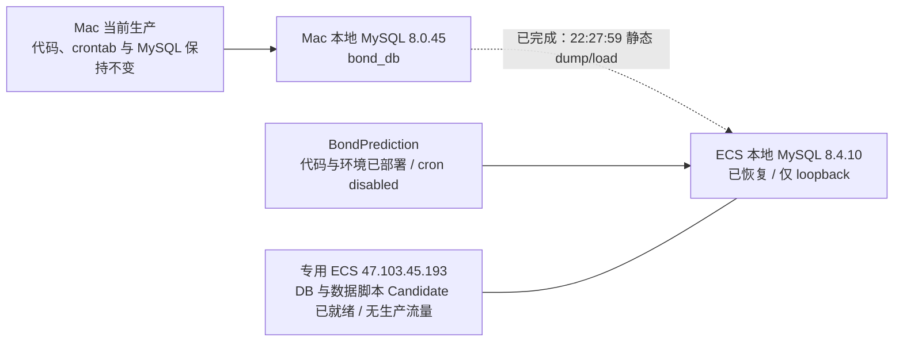
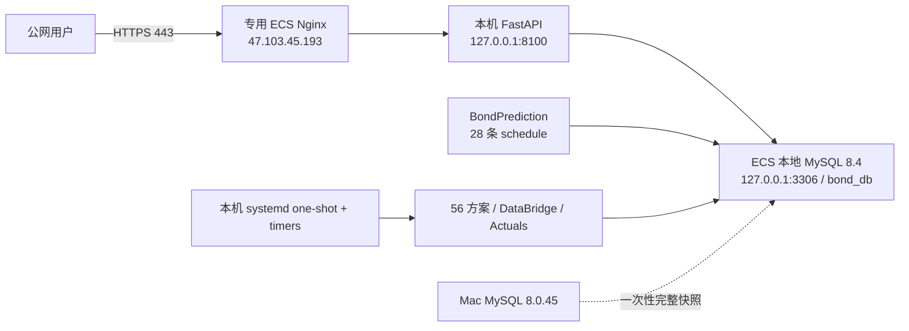
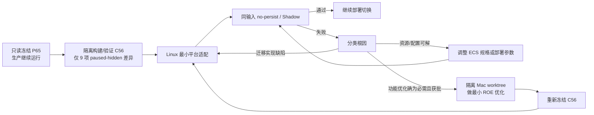
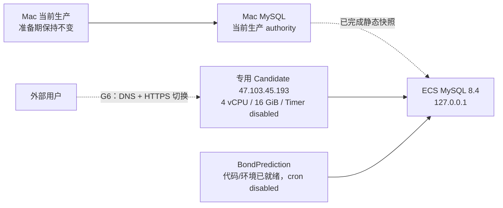

# Bond Factor Lab 阿里云迁移：第一性原理可行性评估与问题台账

**文档状态**：`CURRENT`

**目标读者**：迁移实施、平台运维和项目负责人

## 0.0 当前最高优先级决策：完整数据库克隆 + 云端独立增量更新（v1.21）

2026-08-16，用户用新的数据库实施方案取代了本文 1.19 及以前的“ECS 长期经 NATApp 直连 Mac MySQL”基线。**本节是当前数据库拓扑、`BondPrediction` 和数据更新调度的唯一执行 authority；本文后续仍出现的 `DB-A`、`DB-TRANSPORT-A`、ACCOUNT-A 公网直连、远程 DataBridge 或 NATApp 长期运行描述只保留为决策历史，不得据此实施。**应用与调度的其余既定范围继续有效：9 个 Darwin-only Native 保留代码但暂停隐藏，不运行历史回测，不夹带 DataBridge/队列/并发等功能优化。

当前批准的最小设计代号为 `DB-CLONE-A`：

1. 从 Mac 本地 MySQL 8.0.45 对完整 `bond_db` 做一次逻辑快照，经已固定 Host Key 的 SSH 通道传到专用 ECS；这不是主从复制，也不建立后续 Mac→ECS 增量链路。
2. ECS 使用本机 `127.0.0.1` MySQL 作为新的数据库 Candidate。2026-08-16 只读盘点确认源库含 322 张 BASE TABLE、5 个 VIEW、9 个 PROCEDURE、36 个 TRIGGER 和 3 个 ENABLED EVENT；InnoDB 数据/索引约 2.19 GB，另有一张约 0.33 MB 的 MyISAM 日志表 `sys_log`。这些对象全部进入迁移和恢复核验。
3. Ubuntu 26.04 仓库提供 MySQL 8.4.10；MySQL 官方将 8.0→8.4 LTS 的 logical dump/load 列为支持路径。恢复前关闭 Event Scheduler，恢复后保持 `event_scheduler=DISABLED`：三个历史回溯 Event 的定义保留但绝不执行，符合“不跑历史回测”的已确认边界。
4. dump 使用 `--single-transaction --quick --skip-lock-tables --routines --events --triggers --no-tablespaces --set-gtid-purged=OFF`。321 张 InnoDB 表取得非阻塞一致性视图；`sys_log` 仍完整复制，但因 MyISAM 不受事务快照保护，允许其时间点与 InnoDB 快照有秒级差异，不为日志表锁住 Mac 生产库。用户已明确要求直接导出当前静态快照，因此实际快照起点固定为 `2026-08-16 22:27:59 +08:00`，没有等待 `23:25` 任务，也没有暂停 Mac Writer。
5. `BondPrediction` 必须从 `/Users/macstudio0/bondprojectpro/BondPrediction` 的**当前工作目录 bytes**制作受控快照，不能用 Gitee clone 代替：现场有生产所需的未提交修改和新增文件。发布包排除 `logs/`、`tmp/`、`outputs/`、cache 和 `__pycache__`，保留生产脚本、`config/`、`juyuan/`、shell 入口与测试。
6. Mac 现场运行环境是 Python 3.13.12、NumPy 2.5.1、Pandas 3.0.0；ECS 系统 Python 是 3.14.4，仓库 `requirements.txt` 的 NumPy 1.26.4 又与现场漂移。ECS 已在 `/opt/bondprediction/venv` 建立 Python 3.13.12 环境，安装 NumPy 2.5.1、Pandas 3.0.0、Selenium 4.38.0、MySQL Connector 9.5.0、SQLAlchemy 2.0.44，以及 Chrome/ChromeDriver 151.0.7922.137；Linux 测试重新得到 `74 passed, 6 subtests passed`。
7. 当前 Mac 用户 crontab 中精确识别到 28 条有效 `BondPrediction` 数据更新触发；用户已明确确认另外 4 条 `forecast_project` 定时任务不需要，**不得迁移、复制、生成或启用**。只有 28 条 `BondPrediction` schedule 已按 Asia/Shanghai 和 Linux 路径生成到 ECS `/opt/bondprediction/cron.disabled`，但全部是注释状态，`root` crontab 仍不存在；Mac crontab 未改变。
8. 本阶段不做 24 小时 Mac/ECS 双跑，也不等待自然日、自然周或自然月观察。ECS 已手工运行 `insertDateList.py --ensure-ahead-days 14`：首次从 6,088 行增加到 6,090 行，补入 2 个缺失日期；同命令再次运行仍为 6,090 行，证明该入口能增量写入且同键重跑幂等。`windApiDailyLastDay.py --rdate 2026-08-14 --dry-run` 完成 404 个成功项、0 跳过，且 `api_wind_daily` 行数不变；这验证了外部合同而未额外写入业务数据。
9. 通过上述验证即可判定“云端数据库具备每日增量入库能力”。正式启用 ECS cron 与停止 Mac 对应 28 条 cron 必须作为同一个后续切换动作；本阶段不启用云端自然调度，因此既不产生双份外部数据源请求，也不影响 Mac 当前服务。
10. MySQL 仅监听 loopback，不开放公网 3306；dump、数据库管理员凭据和应用凭据均不得进入 Git、本文、命令参数或普通日志。安装、恢复并清理临时安装包后，40 GiB 系统盘已使用约 14 GiB、可用约 24 GiB；其中 `/var/lib/mysql` 约 8.3 GiB、压缩快照约 318 MiB。当前 Candidate 空间充足，`sync_outbox`、binlog 和日志增长仍须在后续自然运行中观测。

`DB-CLONE-A` 的 Candidate 实施与本阶段验收已经完成：源/目标对象结构一致，36 个 Trigger 与 9 个 Procedure 可读回，3 个 Event 定义保留但全局 Event Scheduler 为 `OFF`，Linux 测试通过，代表任务完成首次增量写入与同键重跑且无重复。它不要求历史回测、24 小时双跑、主从复制、RDS、LKG 或远程 DataBridge。**这只完成数据库克隆与 `BondPrediction` 增量能力迁移，不表示 Bond Factor Lab Web、DataBridge、56 个算法、Actuals、systemd timer、Nginx、DNS 或生产流量已经迁移。**

### 0.0.1 已完成实施回填（2026-08-16）

| 验收项 | 实际结果 |
|---|---|
| 静态快照 | `2026-08-16 22:27:59 +08:00` 开始；压缩文件 `332,565,676` bytes，解压 SQL `3,491,167,430` bytes；SHA-256 `1e5c443148153815b2818b26441846c6c3c8af9600a10baec1d568c6000e57af` |
| 快照位置 | Mac 受控副本 `/Users/macstudio0/bond-factor-lab-migration-docs/artifacts/bond_db_static_20260816T222759_CST.sql.zst`；ECS 受控副本 `/var/backups/bond-factor-lab/bond_db_static_20260816T222759_CST.sql.zst`；两端字节数、SHA-256 和 `zstd -t` 一致，权限均为 `0600` |
| 恢复 | ECS MySQL 8.4.10；恢复耗时 826 秒；`bond_db` 为 `utf8mb4/utf8mb4_0900_ai_ci`；MySQL 仅监听 `127.0.0.1:3306/33060` |
| 对象闭包 | 源/目标均为 322 BASE TABLE、5 VIEW、9 PROCEDURE、36 TRIGGER、3 EVENT；table/column/index/routine/trigger/event 六类规范化元数据 SHA-256 全部逐类一致；`mysqlcheck --check --quick --silent bond_db` 通过；对象 DEFINER 缺失数为 0 |
| Event 边界 | 3 个 Event 的定义和原状态被恢复，但全局 `event_scheduler=OFF` 已 `SET PERSIST` 并经 MySQL 重启后复核；历史 Event 不会执行 |
| 本地账号适配 | Ubuntu MySQL 的 `root@localhost` 使用 `auth_socket`，不适合作为脚本 TCP 账号；保留该 socket 管理账号，并新增仅本机可用的 `bond_app@localhost`。`BondPrediction` 目标配置仅把用户名改为 `bond_app`，仍使用受保护 Secret，文件权限 `0600`；Mac 原配置未改 |
| `BondPrediction` 发布 | 当前工作目录 bytes 已复制到 `/opt/bondprediction/current`，共 80 个文件、约 2.1 MiB 业务代码；排除 `.git`、cache、日志、临时和输出目录；发布 SHA-256 清单位于 `/opt/bondprediction/DEPLOYMENT_SHA256SUMS` |
| Linux 环境 | `/opt/bondprediction/venv` 为 Python 3.13.12；`pip check` 无破损依赖；Chrome 与 ChromeDriver 均为 151.0.7922.137；通过 `SE_OFFLINE=true` 使用本地 Driver，Selenium smoke 通过 |
| 测试与增量写入 | `python -m pytest -q tests check/test_*.py`：`74 passed, 6 subtests passed in 8.15s`；日期入口首次增加 2 行、同命令重跑 0 行；精确 cron shell 命令也运行成功；Wind 日频 dry-run 为 404 成功、0 跳过、目标表 0 行变化 |
| Cron | 28 条 Linux 候选任务已写入 `/opt/bondprediction/cron.disabled`，Mac 受控副本为 `/Users/macstudio0/bond-factor-lab-migration-docs/artifacts/bondprediction.cron.disabled`，SHA-256 均为 `8ccfbb2adaf168bf3c24272d1d6459830ecbf1d5621b1e71596589a08a835aee`；语法和 12 个唯一脚本路径通过核验，内容不含 `forecast_project`；所有任务保持注释，`root` crontab 仍为 absent。Mac 的 28 条有效 `BondPrediction` 与 4 条 `forecast_project` 任务保持原状；后者明确不迁移 |
| 资源余量 | 清理临时安装包后根盘约 14 GiB 已用、24 GiB 可用；内存约 1.2 GiB 已用、13 GiB available；无 Swap；MySQL 与 cron service active，0 failed unit |

本次是**静态**快照，不是持续复制。快照之后 Mac 新写入的数据不会自动出现在 ECS；ECS cron 又尚未启用，所以 Candidate 会自然落后。后续 Writer 正式切换若要求零遗漏，只需在切换窗口重新取一次最终静态快照，或按明确业务日期补齐快照后的空窗，再启用 ECS cron；这不是本次“脚本能否增量入库”的验收卡点。

源/目标六类规范化对象 hash 的共同值为：tables `3a8a5e8982a15aa72526aae3995876a16e2cfda2090cd34407d5049287c11cbf`、columns `22fde81fe2a6176def4eb2eb7405ac1a6767a577ec42d126e0929f5e37eac119`、indexes `b2992c24df8dc5c588e7666661aa9481f0d79abb3fc3323acfd475dfaee390d0`、routines `8f7bc92dff94eefe13416c9bb2b590b061a7280b702bdd41610f7a3c83658e5f`、triggers `09f0052d2ce81020d8dc24a0cdaa822cf482bc9891649db60f3a779597df1350`、events `5c1f75f108f9594123d8f5dd00d3444316d27660acd6f106d20cc18e84ece313`。

## 0. 单一迁移交接入口（先读）

本节是新接手人员的第一入口。除非注明“目标/待实施”，下列值均为 2026-08-16（Asia/Shanghai）对专用 ECS 的现场实施与读回结果。数据库克隆、`BondPrediction` 发布和手工增量验证已完成；Web、DataBridge、算法、Actuals、systemd timer、Nginx、DNS 与生产流量尚未部署或切换。任何超出第 0.0.1 节已完成范围的 Reload、启停、写库、切流或安全组操作，仍须取得对应授权。本文的服务器资源基线只以本节记录的专用 ECS 为准。

### 0.1 一页速查

| 类别 | 已核实值 / 当前决定 | 状态 |
|---|---|---|
| 专用 ECS 公网 EIP | `47.103.45.193` | 本文唯一记录和管理的云服务器 |
| Bond Factor Lab 目标域名 | `bond.finailab.cn` | G6 在本服务器完成 Nginx/TLS 后，把域名切到该 EIP；当前尚未切流 |
| 目标访问地址 | `https://bond.finailab.cn/bond-factor-lab/` | URL 保持不变；DNS/TLS 切换属于独立生产操作 |
| 专用 ECS SSH | `root@47.103.45.193:22`，仅公钥认证 | 2026-08-16 已用受控私钥只读登录；Host Key 见 0.2 |
| 本机 SSH 私钥引用 | `/Users/macstudio0/.ssh/finlab-key.pem`，权限 `0600` | 仅记录位置，不在本文保存或展示私钥内容；此路径只对当前 Mac 有效 |
| 专用 ECS 身份/网络 | `i-uf68h8wsd7ks5wqod85s`；EIP `47.103.45.193`；私网 `172.22.56.176/20` | 已由实例元数据核实；`cn-shanghai-e` |
| 专用 Candidate 资源 | **`ecs.u1-c1m4.xlarge`；4 vCPU；Guest 可见 `16,061,423,616` bytes（约 14.96 GiB）；40 GiB ext4 系统盘** | 2026-08-16 已通过 SSH/元数据读回生效；可开始 Candidate 准备，但功能/生产容量尚未验收 |
| 专用 Candidate 系统 | Ubuntu 26.04 LTS；Linux `7.0.0-28-generic`；x86_64；systemd 259；无 Swap | 已核实；系统 Python 3.14.4，不可替代项目要求的独立 3.12/3.13 环境 |
| Candidate 当前状态 | ECS 本地 MySQL 和 `BondPrediction` Candidate 已部署并通过手工增量验证；无 Nginx、FastAPI、DataBridge、算法服务或生产流量 | 数据库步骤完成；自然 cron 未启用，整套服务迁移仍在继续 |
| 阶段一数据库 | `DB-CLONE-A`：Mac MySQL 8.0.45 的完整 `bond_db` 已一次性 dump/load 到 ECS 本机 MySQL 8.4.10；运行期连接 `127.0.0.1` | **Candidate 已完成并验收**；不建立复制，后续由 ECS `BondPrediction` 独立增量更新 |
| 阶段一数据库账号 | ECS 使用仅本机可连接的 `bond_app@localhost` 承载 `BondPrediction`，后续也供 Backend、Dashboard、DataBridge、scheduler/Actuals 使用；凭据只落 root-only 配置 | 已保留 `root@localhost` 的 socket 管理语义；未复制 `mysql` 系统库、未开放公网 3306；DEFINER coverage 已通过 |
| Secret 交付 | `BondPrediction` 的既有配置合同已在目标机 root-only 文件中交付，用户名适配为 `bond_app`；Bond Factor Lab 的 `/etc/bond-factor-lab/bond-factor-lab.env` 尚未创建 | 已完成数据更新脚本所需部分；Web/算法部署时再完成平台环境文件；Secret 不进入 Git、release、unit 正文、命令行、日志或本文 |
| 阶段一数据库传输 | 一次性 `mysqldump` 压缩快照已经固定 Host Key 的 SSH 传输；两端 SHA-256 与压缩完整性一致并已恢复 | NATApp 只保留为历史端点/必要只读核验，不再是应用运行期数据库链路 |
| 阶段一算法范围 | 17 个可迁 Native + 39 个 Blackbox，共 56 个；9 个 Darwin-only Native 采用“暂停隐藏、代码保留” | 展示与运行语义已确认；机器强制尚未实施 |
| 阶段一回测范围 | **不执行历史回测，不补跑或持久化新的 `t_backtest_*` 结果**；保留 backtest 代码、既有历史数据及 Dashboard/API 只读展示 | 用户已确认；迁移验收聚焦 live schedule、当前输入和 no-persist/fixture 证据 |
| 阶段一调度范围 | `LIVE-SCHEDULE-ONLY`：DataBridge 每日 06:30；日频周一至周五 07:03；周频周六 11:30；月频每月 15 日 18:00；Actuals 每日 08:30、19:00、23:45 | 用户已确认所有 live 日/周/月任务按各自日历正常运行；不包含历史回测、历史补跑或自动 backfill |
| 阶段一部署基线 | **最小整仓搬迁到专用 Candidate**：干净 C56 release + ECS 本地 MySQL + `BondPrediction` + Linux 环境 + Candidate 本地 DataBridge + Blackbox 直接执行 + systemd one-shot/timer + 本机 Nginx/HTTPS | 本地 MySQL、`BondPrediction` 和其 Python/Chrome 环境已完成；其余组件待继续实施 |
| Web 内部监听 | FastAPI 仅监听 `127.0.0.1:8100`，本机 Nginx 直接反代该地址；8100 不对公网开放 | 目标设计已确定、尚未安装；仓库现有 Nginx 模板按另一拓扑生成，不能原样复制 |
| Timer 错过触发 | 所有 live timer 固定 `Persistent=false`、`RandomizedDelaySec=0`；ECS 停机期间错过的触发不在开机后自动补跑 | 与“无历史补跑/无 startup catch-up”一致；漏跑记失败并告警，人工重跑须走独立受控操作 |
| G6 证书引导 | 当前域名 A 记录尚未指向 Candidate；切流前默认以 DNS-01 预签证书，切流后再把自动续期收敛到本机 HTTP-01/webroot 并 dry-run | 不阻止 G0B–G5；G6 只需确认 DNS/TXT 操作权限和切换窗口，不引入长期 DNS API Secret |
| 实施原则 | 冻结 Mac 当前行为，只做必要 Linux 平台适配；与迁移无关的 DataBridge 共享、队列、并发、LKG/RDS 均后置 | 已确认 |
| 切流前零干扰边界 | 当前 Mac 生产目录、65 方案运行状态、launchd、服务进程、生产 DB/Registry、DataBridge、28 条数据采集 cron 和公网链路保持不变；ECS 只对克隆库做受控手工验证 | 已复核 Mac MySQL 8.0.45/327 对象和原 crontab 均正常；不做 24 小时双跑；ECS cron 启用与 Mac 对应 cron 停用留到同一个后续切换动作 |
| 当前生产切换判定 | **No-Go（仅表示整套服务尚未切换）** | 数据库和数据更新脚本 Candidate 已通过；ECS cron、Bond Factor Lab Writer、Web/Nginx/DNS 和生产流量均未启用 |

### 0.2 SSH 连接方式与主机身份

对新同事或新电脑，`/Users/macstudio0/.ssh/finlab-key.pem` 不会自动存在，且不得通过本文、Git、IM 明文或普通邮件分发。应由 ECS/密钥责任人通过受控渠道发放独立凭据或批准新公钥；私钥落盘后权限必须为 `0600`。首次连接前先比对 Host Key，不能把 `StrictHostKeyChecking=no` 当作便利配置：

```bash
ssh \
  -i /Users/macstudio0/.ssh/finlab-key.pem \
  -o IdentitiesOnly=yes \
  -o StrictHostKeyChecking=yes \
  root@47.103.45.193
```

| Candidate Host Key 类型 | 2026-08-16 已核实指纹 |
|---|---|
| ED25519 | `SHA256:ue5OMfnTmotUaVbS/f5cqQ3aGcdDxF5VPfF3rYLpDCs` |

本轮为避免未经确认写入常规 `known_hosts`，实际连接使用一次性受控 known-hosts 文件；新同事首次连接仍须先从可信渠道比对上述指纹，再把公钥写入自己的受控 known-hosts。仅运行 `ssh-keyscan` 不构成身份认证。

可用下面的只读命令查看当前网络返回的 ED25519 指纹，并与上表通过可信渠道核对；`ssh-keyscan` 本身不证明主机身份：

```bash
ssh-keyscan -t ed25519 47.103.45.193 2>/dev/null | ssh-keygen -lf -
```

该 SSH Server 当前已核实的有效边界为：监听 IPv4/IPv6 的 22 端口，`PermitRootLogin yes`、`PubkeyAuthentication yes`、`PasswordAuthentication no`、`KbdInteractiveAuthentication no`。因此“root + 共享私钥引用”是已观察到的阶段一现状，不是推荐的长期权限模型。2026-08-16 用户已确认具备阿里云控制台、安全组查看、重启、升配和续费权限，云端失联时有控制面接管能力。密钥保管/轮换、离职回收和是否改成个人账号 + sudo 属于后续运维治理，见 MIG-021C，不阻止首次功能部署。

### 0.3 专用 ECS 的资源、网络与操作系统盘点

| 项目 | 已核实现场值 | 解释 |
|---|---|---|
| 实例名称 / ID / 主机名 | `灰度实验室v1` / `i-uf68h8wsd7ks5wqod85s` / `iZuf68h8wsd7ks5wqod85sZ` | 截图与实例元数据、SSH Guest 三方一致 |
| 地域 / 可用区 | `cn-shanghai` / `cn-shanghai-e` | 实例元数据结果 |
| 实例规格 | `ecs.u1-c1m4.xlarge` | 4 vCPU / 16 GiB；已真实生效，不再是待配置值 |
| 镜像 | `ubuntu_26_04_x64_20G_alibase_20260720.vhd` | 实例元数据结果 |
| OS / Kernel / libc | Ubuntu 26.04 LTS；Linux `7.0.0-28-generic`；glibc 2.43；x86_64 | 必须用独立项目环境做兼容性 Spike |
| CPU | 4 vCPU；Intel Xeon Platinum；2 cores × 2 threads；KVM；单 NUMA；AVX2/AVX-512 | u1 平台可能变化；本次具体 CPU flags 已取证，性能需重复测量 |
| 内存 / Swap | Guest `MemTotal=16,061,423,616` bytes（约 14.96 GiB）；数据库和数据更新环境部署后约 1.2 GiB 已用、13 GiB available；无 Swap | 当前余量充足；仍须以完整 C56 串行批次验收，Swap 不作为容量 |
| 系统盘 | 控制台云盘 `d-uf68h8wsd7ks5wqo5jxr`；ESSD 40 GiB；Guest `/dev/vda3` ext4 | 数据库恢复、环境安装与临时文件清理后约 14 GiB 已用、24 GiB 可用；`/var/lib/mysql` 8.3 GiB、受控压缩快照 318 MiB |
| 公网 / 私网 | EIP `47.103.45.193`；私网 `172.22.56.176/20`；网关 `172.22.63.253`；MTU 1500 | EIP 来自控制台与 metadata `eipv4`；当前仅 SSH 对外监听 |
| VPC / vSwitch | `vpc-uf67yzmupy4ozrdtnjjf3` / `vsw-uf6oktv3w5xyj06dhsdq4`，vSwitch CIDR `172.22.48.0/20` | 本文唯一记录的云网络位置 |
| 公网带宽 | 控制台显示按固定带宽 3 Mbps | Guest 不能证明计费/限速细节；不做消耗性 speed test，G5/G6 用真实流量验证 |
| 付费 / 到期 | 包年包月；截图显示手动续费；到期 `2026-09-16 23:59:59` | 足够短期 Spike，但若进入持续 Shadow 或生产，必须在到期前明确续费，不能当长期资源 |
| 时钟 | `Asia/Shanghai`；NTP enabled/synchronized；Local RTC=no | 满足 systemd Timer 日期语义基础条件 |
| systemd / 安全能力 | systemd 259；AppArmor enabled；cgroup v2（含 cpu/io/memory/pids）；UFW inactive；无 failed unit；无 OOM 事件 | 安全组仍是公网边界 authority；本轮未修改任何设置 |
| 当前监听 | 公网 `22/tcp`；MySQL 仅监听 `127.0.0.1:3306/33060`；另有本地 resolver/Agent loopback | 尚无 Nginx/FastAPI 公网服务，不承载生产流量；3306 不进安全组 |
| 已有工具/运行时 | 系统 Python 3.14.4、Git 2.53.0、GCC/G++ 15.2、make、curl/wget/rsync、OpenSSL 3.5.5；MySQL 8.4.10；`/opt/miniconda3`；`/opt/bondprediction/venv` Python 3.13.12；Chrome/ChromeDriver 151.0.7922.137 | 数据更新脚本环境已完成；Bond Factor Lab Service/算法环境仍须独立重建 |
| 尚未安装/部署 | Nginx、FastAPI、DataBridge、C56 算法 release、项目 systemd unit/timer、Docker、Podman | 与当前最小迁移阶段一致；本地数据库和 `BondPrediction` 不在此缺口中 |
| 系统状态 | cloud-init done；system state running；MySQL 和 cron service active；0 failed unit；logrotate/fstrim timer enabled；root crontab absent | 数据库 Candidate 在线但无自然数据任务、无业务流量；当前状态可安全继续部署 |
| 基础连通 | PyPI/Conda/GitHub/Google Chrome 下载链路可用；本地 `bond_app@localhost` 对 `bond_db` 的真实应用 TCP 连接通过 | NATApp 基础连通仅是历史证据，不再参与当前运行拓扑；完整 DataBridge/算法仍待后续验证 |

2026-08-16，用户把该实例指定为本次迁移唯一专用服务器，并要求按 4C16G 验证。现场已证明规格、内存和网络真实生效，因此“是否有可用 Candidate 主机”已关闭；MIG-002 只剩功能/容量实验，不再等待资源配置。该节点目前已运行 loopback-only MySQL，并保存 Timer-disabled 的 `BondPrediction` Candidate，但没有 Nginx、FastAPI、DataBridge、算法或生产业务进程；Web 与 Batch 部署后会共享这 4C16G，必须在 G5 观测。

实例 Guest 内仍无法可靠回答 Security Group 精确规则、自动快照策略和带宽计费细节。用户已确认具备控制台权限，因此这些按其实际 Gate 回填，不阻止 Timer-disabled Candidate 准备。云盘 40 GiB 在数据库恢复和环境安装后仍有约 24 GiB 可用，足够继续完成首期功能部署；它不构成长周期无界增长保证，正式运行后仍需观测 MySQL、binlog、Artifact 与日志增长。

本文把“是否 OK”拆成两级，避免仅凭启动成功做容量承诺：**功能试跑 OK**表示代表 Native/Blackbox 及完整 C56 串行 Shadow 可执行、无 OOM/残留进程且结果等价；**生产容量 OK**还要求完整日/周/月批次满足批准的 deadline、峰值资源保留安全余量，并且 Batch 期间本机 API 无不可接受退化。4C16G 是待验证输入，不是结论；CPU 核数也不授权迁移时增加队列或并发。

阿里云官方规格表中的 canonical 名称是 `ecs.u1-c1m4.xlarge`，确认其为 4 vCPU/16 GiB、基础网络带宽 1.5 Gbit/s、基础云盘 IOPS 2 万、基础云盘带宽 1.5 Gbit/s。官方同时说明 u1 创建时可能落在不同服务器平台，生命周期中也可能迁移，不同平台间可能存在明显性能差异。因此试验必须记录 `model name`、CPU flags 和实例身份，并至少重复 3–5 次；一次跑通只能证明该次环境，不能把墙钟外推为所有 u1 主机的固定性能。

### 0.4 专用 ECS 当前状态



当前 Candidate 状态为：

| 组件 | 当前配置 / 状态 |
|---|---|
| 公网监听 | `22/tcp` SSH；80/443 尚无服务；MySQL 仅在 loopback；实际 Security Group 规则待 G6 读回 |
| Nginx / TLS | 均未安装或配置；目标是在本机承载 `bond.finailab.cn` |
| FastAPI / 前端 | 尚未部署 |
| DataBridge / 算法 / Actuals | 尚未部署 |
| MySQL | 8.4.10 active；`bond_db` 已恢复；`event_scheduler=OFF` 已持久化并经重启复核；本地应用连接通过 |
| `BondPrediction` | `/opt/bondprediction/current` 与 Python/Chrome 环境已部署；测试、增量写入、幂等重跑和 Wind dry-run 通过 |
| 数据更新 schedule | `/opt/bondprediction/cron.disabled` 已生成并通过语法/路径检查；所有 28 条均未安装，root crontab absent |
| Bond Factor Lab systemd unit/timer | 尚未创建；后续创建时保持 Timer disabled，直到 G7 独立授权 |
| 生产流量 | 0；当前 Mac 生产保持原状 |

任何未来 installed Nginx/systemd 配置和 loaded state 才是本机运行 authority；尚未安装的目标配置不得冒充现场事实。

### 0.5 阶段一目标拓扑：最小迁移，不夹带优化



2026-08-16，用户正式确认采用**最小整仓搬迁 + 本地数据库克隆基线（Minimal Lift-and-Shift + Local DB Clone）**。数据库先从 Mac 做一次完整逻辑快照并恢复到 ECS，本次迁移后的 Backend、Dashboard、DataBridge、算法调度、Actuals 和 `BondPrediction` 全部只连 ECS loopback MySQL；后续数据新增由迁到 ECS 的既有 `BondPrediction` 脚本及其 28 条 schedule 独立完成，不建立 Mac→ECS 持续同步链路。

| 组件 | 阶段一最小动作 | 性质 |
|---|---|---|
| 前端 + FastAPI | 在新专用 Candidate 部署同一份干净 C56 release，安装 Linux Service 依赖并令 FastAPI 仅监听 `127.0.0.1:8100` | 部署，不改业务功能；8100 不进入 Security Group 公网入站 |
| 数据库 | 完整 `bond_db` 已 dump/load 到 ECS MySQL 8.4.10；运行期固定 `BOND_DB_HOST=127.0.0.1`、`BOND_DB_PORT=3306`，未改 Schema 和业务 SQL | **已完成并验收**；一次性数据迁移 + 配置替换；不做复制、RDS、双写或公网 3306 |
| `BondPrediction` | 已复制 `/Users/macstudio0/bondprojectpro/BondPrediction` 当前生产工作目录 bytes，重建 Python 3.13 + Chrome 环境，并等价生成 28 条 Linux schedule | **Candidate 已完成并手工验证**；schedule 保持 disabled |
| DataBridge | 从 ECS 本地 `bond_db` 生成 current Artifact；不再依赖 Mac 数据库或 NATApp | 现有能力换主机运行；不实施批次共享或一次校验优化 |
| 39 个 Blackbox | 使用锁定 Linux Python 环境直接启动子进程，去除运行路径对 macOS `sandbox-exec` 和 `/opt/homebrew` 的依赖 | 必需 Linux 适配；不改 39 份算法 |
| 调度与 Actuals | 用真实 `systemd_one_shot` unit/timer 承载现有一次性入口、时间和失败语义 | 必需 Linux 适配；不新增第二 Python 控制面 |
| 9 个延期 Native | C56 中 paused-hidden，代码和历史保留，不在 Linux 执行 | 已批准的阶段范围差异 |
| 公网入口 | 在本机安装 Nginx/Certbot，受控签发或部署 `bond.finailab.cn` 证书；G6 将 DNS 切到 `47.103.45.193` | 单服务器目标已收敛；安装、证书、Security Group、DNS 和切流仍分别需要授权 |

这里的“整仓”对两个代码源有不同的精确含义：Bond Factor Lab 使用绑定 exact commit 的干净 C56 release；`BondPrediction` 因现场存在生产所需的未提交文件，使用当前工作目录 bytes 制作带 SHA-256 清单的受控发布包。两者都排除 `.git`、本机 Conda 环境、日志、cache、`outputs/`、历史 `runtime_inputs` 和临时产物；数据库/应用 Secret 单独受控交付，不混入普通 release。DataBridge current、日志和运行目录在 ECS 重新生成。9 个延期方案的后端代码/加密包保留，但由 paused-hidden 机器边界保证不会加载。

目标变化只有：把 Nginx/HTTPS、FastAPI、DataBridge、17 个可迁 Native、39 个 Blackbox、Actuals 和一次性调度入口部署到这台专用 Linux ECS。用户已选择阶段一直接使用 root 身份，不创建非 root 服务用户；FastAPI 的目标内部监听已固定为 `127.0.0.1:8100`，但部署目录、Python 环境目录和 systemd unit 名尚未实施，不能冒充现场事实。G6 只负责把 `bond.finailab.cn` 的 HTTPS 读流量切到该 EIP。

阶段一不包含：9 个 Darwin-only Native、DataBridge 批次共享、队列/并发、逐方案容器、LKG、RDS、自动故障转移或算法功能调整。只有某项优化被证据证明为迁移必要条件并满足 ROE 六项准入时，才回 Mac 的隔离 worktree 独立实现、验证和重新冻结 C56；P65 仍不变。

### 0.6 数据库连接与 Secret 边界

| 项目 | 当前结论 |
|---|---|
| 运行期 Endpoint | `127.0.0.1:3306`；MySQL 仅监听 loopback，安全组不开放 3306 |
| Database / Server | `bond_db`；源 MySQL 8.0.45，目标 Ubuntu 包 MySQL 8.4.10 |
| 数据传输 | 一次性完整 logical dump，经固定 SSH Host Key 的加密通道传输并做 SHA-256 校验；不建立主从复制或后续增量传输 |
| 阶段一可用性 | 数据库与应用同机，消除 Mac/NATApp 运行期依赖；仍是单 ECS/单 MySQL，实例或本地 MySQL 故障时 Dashboard/API 返回 503、批任务失败 |
| 账号 | `root@localhost` 保留 Ubuntu `auth_socket` 管理语义；应用 TCP 使用仅本机的 `bond_app@localhost`。未复制 `mysql` 系统库；对象 DEFINER coverage 已通过，Bond Factor Lab 其余四类连接仍待部署后逐条核验；密码不得写入本文 |
| Event Scheduler | 恢复前后保持 `DISABLED`；3 个 Event 定义保留但不执行，防止历史回溯任务运行 |
| NATApp | 仅保留为历史公网端点和必要的只读诊断备用，不进入任何 ECS 运行期配置 |

阶段一启用的 Bond Factor Lab 路径由 `BOND_DB_HOST`、`BOND_DB_PORT`、`BOND_DB_USER`、`BOND_DB_PASSWORD`、`BOND_DB_NAME` 和 `BOND_DB_CHARSET` 配置，目标 host/port 固定为 loopback。`BondPrediction` 中仍读取其既有受保护配置的脚本没有重写业务逻辑，只在目标配置中完成 Ubuntu MySQL 所需的本地用户名适配；其真实连接和代表入口已命中 ECS 本地库。Backend、Dashboard、DataBridge 和 scheduler/Actuals 要在各自部署后逐条核验。历史 backtest runner 不执行；9 个 source-runtime Native 不进入本次运行范围。

严禁把 DB 密码、旧 NATApp Token、SSH 私钥、TLS 私钥、阿里云 AccessKey 或 Session Token 写入本文、Git、unit 文件、命令行历史或日志。本文只记录 Secret 的用途、责任和受控引用位置。`BondPrediction` 的受保护配置已完成目标交付，权限为 `0600`；后续 Bond Factor Lab 部署时再交付 `/etc/bond-factor-lab/bond-factor-lab.env`，同样要求 `root:root`、`0600`。普通 release 不包含 Secret。

### 0.7 凭据、配置与 Authority 顺序

| 对象 | Authority / 当前位置 | 当前缺口 |
|---|---|---|
| SSH 私钥 | 当前 Mac `/Users/macstudio0/.ssh/finlab-key.pem`，`0600`；只记录引用，不读取内容 | 责任人、独立账号/公钥发放、轮换和回收未文档化 |
| SSH Host Key | 当前 Mac `known_hosts` + 本节指纹 | 新设备首次信任必须人工核对 |
| 阿里云控制面 | Aliyun ECS 控制台/API；2026-08-16 用户确认可查看安全组并执行重启、升配和续费 | 操作权限已闭环；Candidate 的 EIP/带宽、付费/到期和云盘基本值已回填，Security Group 精确规则、自动快照和长期续费动作仍按 Gate 闭环 |
| Candidate Nginx | 未来本机 `/etc/nginx/` installed config、`nginx -T` 与 systemd loaded state | 当前未安装；仓库模板不能代替 installed state，也不能原样复制。ECS 渲染版必须把 upstream 指向 `127.0.0.1:8100`，并保证 proxy-header snippet 的实际安装文件名与 `include` 精确一致，最后以 `nginx -t` 验收 |
| Candidate TLS | 未来本机受控证书路径 + Certbot/systemd timer | 当前不存在；当前 DNS A 尚未指向 Candidate，不能把 Candidate 直连 HTTP-01 当作切流前签发路径。G6 默认先用 DNS-01 预签，切流后为 HTTP-01/webroot 提供最小 ACME challenge location、建立自动续期并 dry-run；私钥不得进入本文 |
| Candidate DB Secret | Mac 当前受保护运行配置 → ECS 本地 MySQL 账号、`/etc/bond-factor-lab/bond-factor-lab.env` 与 `BondPrediction` 既有受保护配置路径 | `BondPrediction` 目标配置已交付并为 `0600`；平台环境文件尚未创建，待 Web/调度部署；全程不得回显或进入普通 release |
| 专用 Candidate | `i-uf68h8wsd7ks5wqod85s` 的实例元数据、Guest readback 与未来 installed systemd state | MySQL、`BondPrediction` 目录/环境和 disabled cron 候选已存在；Nginx、FastAPI、DataBridge、算法与项目 unit 尚不存在，本文不得混淆已完成和目标状态 |
| Mac 调度 | installed plist + `launchctl print` 优先 | 仓库 plist 只是期望配置；启停/替换需另授权 |
| Mac 活跃生产代码 | `/Users/macstudio0/bond-factor-lab`；Backend、DataBridge、日/周/月预测和 Actuals 的 installed plist 均以此为 `WorkingDirectory` | 该目录不是安全的迁移开发目录；切流前不得在其中切分支、改代码/config、改依赖或生成会被生产读取的制品 |
| Mac 活跃 checkout 身份 | 2026-08-16 只读复核：branch `codex/audit-bugfixes-20260613`，HEAD `e593c86cd8a3e8ba5f2a849c2e77b1e50c46ecb3`；已有两个与本迁移无关的 untracked 路径 | 不把“生产分支应为 `master`”误当成现场事实；P65 冻结需记录现状并保留用户文件，不能为制造 clean tree 而清理、切分支或覆盖 |
| ECS 未来调度 | installed systemd unit/timer + `systemctl show/cat` 将成为 authority | 当前尚不存在项目 unit/timer，名称和路径待实现 |
| 应用 release | exact Git commit + 锁定依赖 bytes/hash + 部署清单 | 当前调研 HEAD 为 `e593c86cd8a3e8ba5f2a849c2e77b1e50c46ecb3`；生产 release 尚未冻结 |

Authority 顺序固定为：**云控制台/实例元数据与 installed/loaded state（事实） > 经核实的部署清单（期望） > 仓库模板（设计） > 本文中过往历史描述**。本文是迁移需求、决策和交接的单一入口，但不能让旧的文档快照覆盖变化后的真实现场；每次生产动作前仍须只读复核，并把新的可复现事实回写本文。

### 0.8 新同事最小接手步骤

1. 先阅读本节、1.2–1.3 的范围原则、5 的问题台账和 13 的阶段 Gate；不要从旧的 0.6/0.8 历史版本恢复已撤销的容器、共享输入或并发方案。
2. 由当前 ECS/密钥责任人安全发放个人可审计的访问方式，核对 Host Key 后只读登录；不要复制本文中的路径并假设私钥在自己的电脑存在。
3. 在专用 ECS 用 `hostnamectl`、`free -h`、`df -hT`、`ss -lntp`、`systemctl status mysql` 和 `systemctl --failed` 复核当前 Candidate；不得把 MySQL 的存在误当成整套服务已上线。Nginx 尚未安装时，`systemctl status nginx` 失败不表示系统故障。
4. 保留第 0.0.1 节的快照 hash、对象闭包、测试和 disabled cron 证据；不得安装 `/opt/bondprediction/cron.disabled`，除非进入独立 Writer 切换授权。
5. 继续在独立 worktree 构建 C56 和 Bond Factor Lab Linux release，不得把 `/Users/macstudio0/bond-factor-lab` 当迁移开发 worktree，不得修改 Mac crontab。
6. 下一步部署 FastAPI、DataBridge、56 方案、Actuals 和 Timer-disabled systemd unit，并逐路径验证 ECS 本地数据库。正式启用 ECS cron、停用 Mac 对应 cron、启用业务 Writer、Nginx/TLS/DNS 和生产流量仍是后续独立切换动作。

### 0.9 控制面确认台账（含已确认项）

| 事项 | 当前事实 / 为什么实例内部无法确认 | 状态 / 最晚 Gate |
|---|---|---|
| 阿里云控制台操作权限 | 2026-08-16 用户确认可查看安全组，并拥有重启、升配和续费权限 | **RESOLVED**；首次部署不再受“无人能操作控制面”阻断 |
| 专用 ECS 的 Security Group 精确规则 | Guest 只能证明当前监听 22，不能据此证明云边界 | 安装/Shadow 阶段不开放应用公网端口；G6 前精确读回并批准 80/443 规则 |
| Candidate EIP/带宽 | `47.103.45.193`；控制台显示固定带宽 3 Mbps | **RESOLVED FOR INVENTORY**；不做消耗性 speed test，真实 API/依赖下载在 G2/G6 观察 |
| Candidate 付费/到期 | 包年包月、手动续费、到期 `2026-09-16 23:59:59` | **OPEN OPERATIONAL**；不阻止短期 Spike，进入持续 Shadow/生产前必须续费或确认替代资源 |
| Candidate 云盘/快照 | ESSD 40 GiB；数据库和环境完成后约 24 GiB 可用；静态逻辑快照已保留，阿里云自动云盘快照策略未知 | 继续部署/短期 Shadow 可用；长期 Artifact/日志增长未闭环。IOPS 在 G5 实测，自动快照与恢复策略在 G8 确认 |
| Candidate 试验资源 | **`ecs.u1-c1m4.xlarge`，4 vCPU/16 GiB 已在新专用实例真实生效** | **RESOLVED FOR TRIAL**；MIG-002 进入功能/容量实验，不再等待实例或规格读回 |
| 公网入口归属 | 目标统一为本机 EIP `47.103.45.193` + 本机 Nginx/TLS | **DESIGN DECIDED / IMPLEMENTATION PENDING**；G6 前完成 Security Group、证书、DNS TTL 和回滚设计，切流仍需独立授权 |
| ECS 部署目录、Python 环境、systemd unit/timer 名 | `BondPrediction` 已使用 `/opt/bondprediction/{current,venv,logs}`；Bond Factor Lab release、Service/算法环境和项目 unit/timer 尚未实施；阶段一运行身份为 root | 剩余路径/名称在 G4 冻结；不再创建非 root 服务用户 |
| Candidate 准备权限 | 2026-08-16 用户明确允许基于当前开发分支在隔离 checkout/worktree 构建 Candidate，并在本机以现有 root 身份安装依赖、创建部署目录和 Timer-disabled systemd unit | **RESOLVED / 部分已执行**；数据库与 `BondPrediction` Candidate 已完成；不含 P65、生产 DB/Registry、Nginx/TLS/DNS、launchd、Timer enable/Writer、安全组或生产流量变更 |
| 阶段一 ECS 运行身份 | 用户明确选择直接使用现有 root 权限，不创建非 root 服务用户 | **DECIDED / ACCEPTED_RISK**；部署更简单，但 Candidate/服务/算法拥有整机权限，可能读取其他 root 可读文件或影响同机服务；不得声称已做进程权限隔离 |
| 本地数据库 Secret 与增量验证 | 已从 Mac 受保护配置完成不回显交付，在 ECS 创建 `bond_app@localhost` 并写入 root-only 目标配置；已对克隆库运行代表性入口及同键重跑 | **RESOLVED FOR BondPrediction**；克隆库仅为验收增加 2 个日期行；ECS cron 仍 absent，Mac cron 保持原状；平台环境文件待应用部署 |
| SSH/DB/应用 Secret 的长期保管、轮换和回收机制 | `BondPrediction` 首次本地账号 Secret 已完成交付；平台环境文件待应用部署，长期 owner/轮换/回收尚未治理 | G4/G8；不阻止首次 Timer-disabled 部署 |
| 实例业务 Owner、值班与升级联系人 | 控制台操作能力已确认，但长期故障响应责任尚未指定 | 正式稳态运行前确认；不阻止首次部署 |
| 9 个延期方案的 Registry/API 展示与历史数据语义 | 2026-08-16 用户确认：暂时隐藏、不执行、不产生新结果；保留后端代码、加密 `.so`、配置和全部历史/审计数据 | **DECIDED**；G0B 只在 Mac 隔离 worktree/fixture 中形成 C56，P65 不变；G1 证明 Linux release 不会误执行；MIG-017 |
| SLO、批次 deadline、RTO/RPO、混合阶段期限 | 需要业务决策，不能由机器推导 | G0A/G5/G8 |

### 0.10 文档信息

| 项目 | 内容 |
|---|---|
| 文档用途 | 从本节即可获得 ECS 连接、资源、网络、当前/目标拓扑、Secret 边界与接手步骤；正文继续记录从 Mac Studio 迁移到阿里云 Linux ECS 的事实证据、对抗性审查、真实阻断、可解问题、架构选项、资源需求和阶段 Gate |
| 文档位置 | 仓库 canonical：`docs/operations/ALIYUN_MIGRATION_ASSESSMENT.md`；外部工作副本：`/Users/macstudio0/bond-factor-lab-migration-docs/ALIYUN_MIGRATION_ASSESSMENT.md` |
| 仓库位置 | `/Users/macstudio0/bond-factor-lab` |
| 调研/生产基线分支 | `codex/audit-bugfixes-20260613`；远端调研文档基线 `6403059` |
| 本次实施分支 | `codex/aliyun-db-clone-20260816`，从 `origin/codex/audit-bugfixes-20260613@6403059` 隔离创建；数据库方案提交起点 `a64acc8` |
| 本次迁移分支基线 | 用户已授权把验证后的文档同步到远端开发分支和 `master`；实施始终在独立 worktree 进行，未切换、清理或改写 P65 活跃工作目录。该授权不等于生产流量或 Writer 切换授权 |
| 评估日期 | 2026-08-16（Asia/Shanghai） |
| 当前阶段 | 专用 ECS `i-uf68h8wsd7ks5wqod85s` 的 `DB-CLONE-A`、MySQL 8.4.10、`BondPrediction` 工作目录/Python/Chrome 环境、静态 disabled cron 和手工增量验收已完成；Mac P65、MySQL 与 28 条有效 `BondPrediction` cron 未变。下一步是 Bond Factor Lab C56 release、DataBridge、算法、Actuals 和 Timer-disabled systemd 部署 |
| 当前总判定 | **数据库完整克隆和每日增量脚本的 Linux 能力已经通过，可以继续整套服务部署；4C16G 当前有约 13 GiB 可用内存、24 GiB 可用盘，但 56 方案完整批次与 Web 同机容量仍须实测。生产切换继续 No-Go，因为 ECS cron、应用 Writer、Web/Nginx/DNS 和流量均未启用；全量 65 个方案继续延期** |
| 文档版本 | 1.21 |

自 1.19 起，仓库内 `docs/operations/ALIYUN_MIGRATION_ASSESSMENT.md` 是本文的 canonical 版本，外部同名文件仅保留为工作副本，不得覆盖 Git 中更新的内容。用户已明确授权将本文提交并推送至远程开发分支和 `master`。本文包含公网 IP、实例/VPC 标识和本机 SSH 私钥路径引用，但不包含私钥内容、数据库密码、Token 或云 AccessKey，仍应按内部运维资料控制仓库访问。1.21 回填 `DB-CLONE-A` 的实际快照、恢复、环境、测试和增量验证结果；仍不授权启用 ECS cron、停用 Mac cron、运行历史回测、切换应用 Writer/域名/流量或修改 Mac 生产代码与服务。

## 1. 需求重述与第一性原理目标

### 1.1 原始需求

目标是把当前运行在 Mac Studio 上的 Bond Factor Lab 整套服务部署到阿里云 Linux ECS，包括：

- 公网域名、HTTPS 和前端静态资源；
- FastAPI 后端；
- DataBridge；
- 日频、周频、月频和 Actuals 定时任务；
- 26 个 Native V1 与 39 个 Blackbox V2 active 执行身份；
- Runtime Artifact、Cache、Journal 和必要日志；
- 监控、告警、备份、恢复和回滚能力。

第一阶段同时迁移数据库与数据更新能力：Mac 本地 MySQL 只作为一次性完整快照源；恢复完成后，ECS 上的所有应用连接 `127.0.0.1:3306/bond_db`，并由迁移后的 `BondPrediction` 脚本继续增量入库。旧公网端点 `ac8d81722546a052.natapp.cc:33306` 不再承担运行期数据库链路。

### 1.2 已确认的阶段一范围与实施基线

2026-08-15，用户确认 9 个 source-runtime Native 现阶段拿不到源码，并决定阶段一先排除这 9 个方案。阶段一算法范围因此改为：

- 17 个其余 Native Adapter；
- 39 个 Blackbox V2；
- 合计 56 个方案执行身份；
- 9 个 source-runtime Native 不在阶段一 Linux 执行、容量、Shadow 和上线验收分母中。

这是**业务范围延期**，不是 MIG-006 的技术修复。它可以解除 MIG-006 对阶段一 56 个方案部署的阻断，但全量 65 个方案迁移仍未完成。并且，“跳过”必须在生产切换前落实成明确的调度、Registry/API、监控和 Writer 状态；仅在文档中减去 9 个、而让当前 active 配置继续被调度发现，不构成有效排除。

2026-08-16，用户进一步确认这 9 个方案采用统一的**阶段性暂停隐藏（paused-hidden）**语义：

- 当前生产目录中 9 份 `config.yaml` 仍是 `status: active`，这是已核实的 P65 现场。在明确切换窗口前不得修改；目标 `status: paused` 先只在隔离 worktree 的 C56 候选 release 中实现和验证，使其严格 discovery 与日/周/月 scheduled runner 不把这 9 个纳入候选；
- 对应 composite `t_scheme_registry` 目标状态统一为 `paused`。切流前只在隔离测试数据库/fixture 验证；生产 Registry 继续保持现状，直到 Writer 停止且用户对切换窗口另行授权。切换后 Backend、Dashboard、`/api/schemes`、metrics 和 backtest 公网读模型只读取 `status='active'`，所以这 9 个方案不再出现在前端/API；直接访问 paused registry ID 也不得返回当前业务数据；
- 不单独做前端 CSS/名称黑名单。隐藏的 authority 是 Registry `paused`，停止执行的 authority 是 config `paused`，两层必须同时成立，避免“界面隐藏但仍在跑”或“停止运行但界面仍显示”；
- 自暂停生效起不再调度，不再产生新的成功 live business run 或 prediction，不纳入缺批告警、批次成功率、容量、Shadow 或上线验收分母；专门的负面测试可以保留 `skipped/denied` 审计证据，但不得执行算法或写业务结果；
- `schemes/{scheme_id}/`、adapter、配置、加密 Darwin `.so` source package、`source_evidence`、benchmark/backtest 代码和 Harness 证据全部保留，不删除、不改写、不以相似算法替换；
- 既有预测、回测、run、log 和 actual 数据不删除。它们从公网 active 读模型隐藏，但继续留在数据库/审计面；共享 actual 表仍服务其余 active 方案，不能按这 9 个 scheme 做物理清理；
- 当前 exact version 与既有 Gate/激活证据保留作审计，不因暂时隐藏而伪造新的算法版本。以后取得权威 Linux bundle/源码后，必须重新开启 MIG-006、通过适用 Gate 并取得专项激活授权，不能只把两个 `paused` 改回 `active`；
- 这是完成 56/9 范围迁移所必需的业务范围适配，不是性能优化。按“功能变化先在 Mac 验证”原则，它必须在 Mac 的**隔离 worktree + 隔离测试数据**中作为独立变更完成验证并形成 C56 候选基线；“先在 Mac 验证”绝不等于先改当前 Mac 生产。Linux runner/systemd 适配基于 C56 继续推进，但生产 config/Registry/launchd 直到独立切换窗口前保持不变。

“保留后端代码”在本文中的准确含义是**不删除仓库和受控证据中的实现/二进制**。不可执行的 Darwin `.so` 是否物理进入 Linux 生产部署包不影响暂停语义，也不是阶段一功能前置；部署清单只需证明它们即使存在也不会被 discovery、timer 或手工 live 路径加载。

为避免“当前基线”混淆，本文从 1.3 起使用两个精确名称：

- **P65（Production-65）生产基线**：当前 `/Users/macstudio0/bond-factor-lab`、生产 DB/Registry、installed launchd 和 65 个 active 方案的真实现场；迁移开发与验证期间只读、零变更、持续正常运行；
- **C56（Candidate-56）候选基线**：从 P65 的 exact commit/行为复制到隔离 worktree，只增加已批准的 9 个 paused-hidden 范围差异；其 config/Registry fixture、API、调度和监控语义先在隔离环境验收，是 Linux 等价迁移的目标基线。

C56 通过不改变 P65。只有最终切换窗口才把“停止旧 Writer、生产 Registry 九项 paused、启用云端 C56、验证单 Writer和公网读模型”作为一个受控状态转换；失败回滚也必须使用已准备的 C56-compatible Mac rollback release，不能恢复会重新运行 9 个方案的旧 P65 Writer。

2026-08-16，用户进一步把迁移验收收敛为 **live-schedule-only**：本次不执行历史回测，不补跑历史区间，不调用 backtest runner 生成或持久化新的 `t_backtest_*` 结果。仓库中的 backtest 实现、既有数据库历史结果、审计证据和 Dashboard/API 对既有结果的只读展示全部保留；“不跑”不等于删除代码、清表或关闭既有只读页面。Linux 等价性使用当前/最近可用调度输入、固定 fixture、contract、Compare 和 no-persist Shadow 证明，不能把历史回测重新包装成迁移 Gate。

用户同时确认“保证每天的调度运行正常”的精确定义是 **`LIVE-SCHEDULE-ONLY`**：整套 live schedule 按各自日历运行，包括 DataBridge 每日 06:30、日频 prediction 周一至周五 07:03、周频 prediction 周六 11:30、月频 prediction 每月 15 日 18:00，以及 Actuals 每日 08:30、19:00、23:45。周/月不因其触发频率较低而移出阶段一，历史回测、历史补跑和自动 backfill 仍明确排除。

验收分两段：G4/G5 在 Timer-disabled Candidate 上校验每个 `OnCalendar`、下一次触发时间、时区、持久化/错过触发语义，并用当前或最近可用 live 输入手工启动对应 one-shot 做 no-persist 验证；G7 后观察自然 live 触发。日频和 Actuals 的自然证据不能替代周/月，第一轮自然周频和月频分别发生后补齐其生产验收证据；在此之前可以判定“已部署并进入观察”，但不得宣称全部 live cadence 已完成自然运行验收。

#### 1.2.1 “不影响这台机器”的精确定义

“不影响”不能只理解为“不改仓库文件”，还包括不争抢到足以影响生产的 CPU、内存、磁盘 I/O 和 MySQL 能力。本文按阶段定义边界：

| 阶段 | 对 Mac 允许的动作 | 必须保持不变的结果 |
|---|---|---|
| G0B–G2/G4/G5 准备与离线验证 | 低开销只读盘点；隔离 worktree 中的短时、有界单元/契约测试 | P65 代码与依赖、installed launchd、进程/端口、生产 DB/Registry、DataBridge current、公网服务、任务准点性和业务结果均不变；全量 Shadow/容量测试在 ECS 完成 |
| G3 完整快照与本地库验证 | 在 Mac 最后一个当日数据任务后执行一次非阻塞 logical dump；在 ECS 恢复后只对克隆库做受控写入与同键重跑 | 不改 Mac 数据、代码、crontab 或服务；不在 Mac 执行额外 Writer，不做 24 小时双跑 |
| G6 Web 切换 | 仅在独立授权窗口启用本机 Nginx/HTTPS 并切换 `bond.finailab.cn` DNS | Mac Writer、DB、Registry、launchd 和代码保持不变；按切流前写入受控变更记录的 DNS 值回滚 |
| G7 Writer 切换 | 只有独立授权后，按受控顺序停止旧 Writer、更新九项 Registry、启用云 Writer | 这是有意的生产 ownership 转换，不属于准备期“零变化”；必须有单 Writer 证据和 C56-compatible Mac 回滚路径 |

因此，方案 B 的承诺不是“永远不触碰 Mac”——最终 Writer 接管在逻辑上必然要求旧 Writer 停止——而是**切流前不改变、不干扰；切流时另行授权、最小改变、可验证回滚**。本轮只更新方案文档，不授权上述任何实施或切流动作。

2026-08-16，用户进一步确认阶段一的 Blackbox 实施方向：

- 不以“每次预测创建一个无网络、只读、限资源 Linux 容器”作为首期前置；
- 39 个 Blackbox 在 Linux 使用同一套锁定的 Python 环境，由平台直接启动子进程；迁移本身不新增队列、Kubernetes、分布式调度或逐次 OCI 生命周期；
- `BatchInputSession` 的设计仍保留为候选优化，但当前不实施：重复校验/复制/物化是已知低效，尚无证据证明它阻止 Linux 部署；
- 第一轮 Linux Candidate 必须按当前逐方案 DataBridge 准备和串行语义做 no-persist 等价迁移，不提前实现共享 view；
- 只有当前行为在目标环境可复现地无法满足已批准的内存、磁盘或批次 deadline，且修正迁移缺陷或调整合理 ECS 资源/配置仍不能接受时，才允许回到 Mac 开启最小 `BatchInputSession` 优化；
- 队列/并发同样不进入当前迁移范围；目标 Candidate 即使有 4 vCPU，也不构成增加并发的正确性、吞吐收益或内存安全证据。若未来成为迁移必需优化，仍须先在隔离 Mac worktree 实现、验收和重新冻结 C56，不触碰 P65。

这些是当前已确认的设计基线，不表示代码、ECS 或生产调度已经变更。容器级网络/文件系统隔离改为后续硬化项，文档不将“直接运行”伪装成已经具备同等 Sandbox 强度。

2026-08-16 较早版本曾选择 **DB-A**（ECS 经 NATApp 长期连接 Mac MySQL），并相继讨论 ACCOUNT-A 与 DB-TRANSPORT-A。用户随后以 `DB-CLONE-A` 明确取代该运行拓扑：完整库一次性恢复到 ECS，运行期只连本地 MySQL，`BondPrediction` 在 ECS 独立执行增量更新。旧选择只解释版本演进，不再授权公网数据库连接或远程 DataBridge。

当前最小整仓迁移仍不引入 RDS、LKG、主从复制、双写、自动故障转移、共享 DataBridge、队列/并发、逐方案容器或算法调整。必须新增的只有数据库 dump/load、Linux 依赖环境、`BondPrediction` 代码与 schedule 映射、Blackbox direct runner、`systemd_one_shot` 和 Nginx 本地 upstream；其中 schedule 在当前验收阶段保持 disabled。

### 1.3 核心原则：纯迁移优先，功能优化只作必要例外

2026-08-16，用户进一步收紧范围：**不是先把所有已知优化在 Mac 做完再迁移，而是默认不做任何与迁移无直接必要关系的功能优化。**先冻结当前功能行为并做最小 Linux 等价迁移；只有证据证明某项功能优化是完成迁移的必要条件，才回到当前 Mac Studio 设计、实现和验证该最小优化。

本文采用统一术语：

- **P65 生产基线（Production-65 Baseline）**：只读冻结当前生产 exact commit、依赖/配置身份、65 方案状态、输入、预期输出、逐方案 DataBridge 准备和串行执行语义；它描述真实现场，迁移实施不得修改它；
- **C56 候选基线（Candidate-56 Baseline）**：在隔离 worktree/环境/测试数据中复制 P65，仅加入用户批准的 9 个 paused-hidden 范围差异；它是 Linux 迁移的唯一目标基线；
- **Linux 迁移轨（M-track）**：只把 C56 搬到 Linux，并做不可避免的平台适配、等价性验证和资源定容；
- **必要优化例外（Required Optimization Exception，ROE）**：只有 M-track 被可复现证据阻断，且平台修正或合理资源/配置调整不能解决时，才允许在隔离 Mac worktree 开启的最小功能优化；它仍不得触碰 P65 生产；
- **延期优化（Deferred Optimization）**：有收益但未证明为迁移必要条件的优化，不进入本次范围。

旧版本中的未限定词“Current Frozen Baseline”从本文 1.3 起废止：描述当前真实生产时使用 P65，描述 Linux 迁移目标时使用 C56，不能再把两者混称为同一份可修改基线。

默认顺序固定为：



这个原则同时控制两个风险：一是避免功能优化与操作系统迁移混在一起导致差异无法归因；二是避免为了“顺便做得更好”扩大迁移范围。已知低效、架构债务或未来收益都不是开工理由，**不能迁移的决定性证据**才是。

#### 1.3.1 默认冻结当前行为，不先优化

当前迁移基线保留：

- scheduled runner 的逐方案串行执行；
- 每个 Blackbox 各自打开 DataBridge snapshot、校验并物化 runtime view；
- 当前 Request/Output、失败隔离、日期、落库和日志语义；
- 当前 API/Registry/监控业务语义，但 9 个不可移植 Native 的阶段范围仍须按已批准业务决定形成明确目标配置。

因此，`BatchInputSession`、共享 view、队列/并发、缓存优化、查询合并和 LKG/RDS 都不因“看起来更合理”而进入首期。先验证当前行为是否能够在合理 ECS 规格上完成部署和 deadline。

#### 1.3.2 ROE 的六项准入条件

任何功能优化进入迁移范围前必须同时满足：

1. 已有只读 P65 证据和隔离 C56 候选基线，能够证明 56 个保留方案行为未变且 9 个仅发生批准的 paused-hidden 差异；
2. 必要的 Linux 平台适配已经完成，失败不是缺包、路径、权限、runner、systemd、Secret 或配置错误；
3. 在固定输入和目标候选环境中可稳定复现明确阻断，例如 OOM、磁盘空间不足、无法完成批准 deadline，或迁移必须保持的数据一致性条件无法满足；
4. 已比较合理的 ECS 升配、磁盘扩容或部署参数调整；若基础设施调整更简单且成本可接受，优先调整资源，不改功能；
5. 拟议优化与阻断存在直接因果关系，且范围是解除阻断所需的最小改动；
6. 用户明确批准开启该项 ROE。

缺少任一条件，该优化都保持 `DEFERRED_OPTIMIZATION`。性能更快、磁盘写入更少、架构更漂亮或未来可能有用，都不足以证明“迁移必须”。

#### 1.3.3 ROE 一旦触发，仍必须先在隔离 Mac 环境验证

ROE 不能直接在 ECS 或 P65 生产目录上开发。顺序固定为：

1. 记录 Linux 阻断证据和已排除的平台/资源方案；
2. 回 Mac 的隔离 worktree/环境单独实现最小功能优化，不修改 `/Users/macstudio0/bond-factor-lab` 生产目录；
3. 用固定输入完成优化前后正确性、失败语义和回滚对照；
4. 形成新的 exact commit、输入 hash、预期输出和测试/Gate 证据；
5. 重新进入 M-track，并重跑所有受影响的 Linux 等价性与容量验证。

迁移提交若同时包含平台适配与 ROE 功能改动，仍必须拆开。用户对“必要优化”的批准也不自动授权合并 `master`、修改 installed plist、重启生产或写业务表。

#### 1.3.4 M-track 允许的最小平台适配

“纯迁移”不等于 Linux 上绝对零改动。以下属于不可避免的平台适配，不算功能优化：

- `launchd` 到 `systemd` 的 one-shot/unit/timer 映射与真实 provenance；
- Linux Python/conda 包、ABI、wheel bytes、BLAS/OpenMP 和 environment fingerprint；
- Blackbox 从 macOS `sandbox-exec` 切换为已批准的 Linux direct runner；
- Linux 文件路径、服务用户、权限、日志、进程回收和部署包；
- ECS 本地 MySQL 的 endpoint/Secret/连接参数、一次性 dump/load，以及 Nginx/upstream/健康检查；
- 目标 ECS 的容量测量、实例规格、磁盘和部署参数选择。

这些适配不得改变算法、DataBridge 生成/校验规则、Request/Output Contract、日期语义、落库业务键或调度业务语义。若变化会改变功能或运行机制，即使发生在同一个 executor 文件中，也不再属于 M-track。

#### 1.3.5 具体 Case：日频 25 个 Blackbox

假设固定同一个 `predict_date` 和 DataBridge generation：

1. **只读冻结 P65 路径**：25 个方案仍各自校验、复制和物化，只采集已有或不会干扰生产的 Request/Output/snapshot 身份与当前耗时；
2. **隔离形成 C56，再做纯 Linux 迁移**：9 个 paused-hidden 在隔离环境验收；25 个 Blackbox 只完成 Linux direct runner/环境适配，仍按 P65 相同行为串行运行；
3. **若结果正确且能在批准资源与 deadline 内完成**：迁移继续，`BatchInputSession` 与并发优化保持延期，即使它们理论上能更快；
4. **若稳定 OOM、磁盘不足或超出 deadline**：先排除依赖/路径/权限缺陷，并比较合理升配或磁盘扩容；
5. **只有资源方案不可接受且证据表明重复准备是直接瓶颈**：经用户批准后，才在隔离 Mac worktree 实现串行 `BatchInputSession`，验收并重新冻结 C56；P65 不变，并发仍是另一项独立 ROE，不能自动附带。

截至本文 1.3，现有“约 1.2 GiB 重复临时写入”“代表任务约 11.5 秒”和既有双进程内存数据只证明存在优化机会，尚未证明当前串行路径无法在本机迁移。因此 `BatchInputSession` 和队列/并发都不是当前迁移前置。

#### 1.3.6 当前事项的范围判定

| 事项 | 是否为当前迁移必需 | 当前处置 |
|---|---|---|
| Linux Python 环境与 Blackbox direct runner | 是；现有 macOS profile/`sandbox-exec` 不能在 Linux 使用 | M-track 实施 |
| `launchd → systemd` 与真实调度 provenance | 是；Linux 没有 launchd | M-track 实施 |
| ECS 本地 MySQL、完整 dump/load、账号配置和受控保存 | 是；所有云端服务与 `BondPrediction` 必须使用同一克隆库 | M-track 部署配置；逐路径验证 loopback endpoint，不改 DB 业务代码 |
| 56/9 目标范围的机器强制 | 是；9 个 Darwin-only Native 不能在 Linux 执行，且用户已确定采用 paused-hidden | 在隔离 Mac worktree/测试 Registry 实施双暂停并形成 C56；P65 不变。生产双暂停只在另行授权的切换窗口生效 |
| `BatchInputSession`、一次校验和共享 view | 否；当前只证明低效，未证明无法迁移 | `DEFERRED_OPTIMIZATION` |
| 有界队列、并发度 2 | 否；当前并行实测不加速且内存更高 | `DEFERRED_OPTIMIZATION`，首期串行 |
| LKG、RDS、复制、自动故障转移 | 否；当前先完成单 ECS 本地数据库能力 | 后续稳定性需求 |
| 逐方案 OCI/强 Sandbox | 否；用户已接受首期 direct runner 的残余风险 | 后续安全硬化 |
| 合理 ECS 升配、磁盘和部署参数 | 属于部署定容，不是功能优化 | 在 M-track 实测选择 |

这张表的默认状态不能因为开发方便或代码邻近而扩大；改变“否”为“是”必须走 ROE 证据与用户批准。

### 1.4 不能把“部署到了云上”当作完成

从第一性原理看，真正需要验收的是以下四个结果，而不是代码所在主机：

1. **访问结果**：`bond.finailab.cn` 的 HTTPS、静态资源和 Dashboard 达到明确的可用性、延迟和访问控制目标；
2. **计算结果**：阶段一范围内 56 个精确版本都能在目标平台按相同输入、日期和算法语义运行，并在业务截止时间内完成；被延期的 9 个方案不得被伪装为已迁移或已成功；
3. **数据完整性**：阶段一范围内任何 cadence 只有一个自然生产 Writer，运行来源、版本、输入 authority、日志和落库结果可相互证明；
4. **可恢复性**：节点、调度、数据库链路或算法失败后，可在约定 RTO/RPO 内恢复，且不会双写、自动补跑或用旧 Artifact 伪装成功。

### 1.5 “稳定”必须拆成多个 SLI/SLO

“稳定对外访问”不能只用一个 60/60 探针定义，至少需要分别定义：

- 入口 HTTPS 可用性；
- 静态页面可用性；
- Dashboard/API 可读性；
- Dashboard p95/p99 延迟；
- 数据最大允许陈旧时间；
- 日/周/月预测完成截止时间；
- 数据完整性和单 Writer；
- RTO、RPO 和人工响应时间。

当前 Dashboard 每次请求都会同步访问 MySQL、建立一致性只读快照，并返回 `Cache-Control: no-store`。数据库异常会直接返回 503；`/api/health` 也会执行 `SELECT 1`。`DB-CLONE-A` 已把运行期数据库移到同一 ECS 的 loopback，消除了 Mac 电源、本地网络和 NATApp 对每次 Dashboard 请求的串联依赖。

这仍不是高可用：ECS 实例或本地 MySQL 故障时，Dashboard/API 仍返回 503，当前也没有 LKG、只读副本或自动故障转移。阶段一接受“先完成单机功能迁移，再按真实观测优化”的边界；后续稳定性讨论围绕 ECS/MySQL 单机备份、恢复和监控，不再围绕 NATApp 运行链路。

### 1.6 第一阶段的准确名称

在 9 个方案正式从阶段一运行面排除、数据库克隆到 ECS 后，第一阶段应称为：

> 单 ECS 本地数据库 + 56 方案执行面的阶段一云端部署

数据库与 `BondPrediction` Candidate 已不依赖 Mac/NATApp，但整套服务还没有完成部署或切流；因此当前只能称为“数据库与数据更新能力 Candidate 已完成”。最终阶段一可以是约定范围内的完整云端部署，但仍不是“65 个方案全量迁云”，也不是多节点高可用架构。9 个延期方案不在 Mac/ECS 双跑，而是生产切换时 paused-hidden。

### 1.7 迁移时不能改变的不变量

- 输入只能经 `shared.input_artifacts`；
- 写库只能经规定的 repository/updater；
- Native core 不写库、不跨方案 import；
- source-backed Native 不允许用 L2 算法改写解决跨平台问题；
- Blackbox 阶段一保留批准输入目录、独立 Request/Output、不通过 Request、命令行或子进程环境主动注入 DB Secret、超时和进程树回收；由于阶段一直接使用 root，这不等于算法无法读取主机上其他 root 可读文件，强网络/宿主文件系统隔离不再作为首期功能上线前置，但必须显式记录为残余风险与后续硬化；
- 生产调度只能有一个 OS 级 one-shot 控制面；
- 不恢复 APScheduler、ledger、occurrence、epoch、自动 backfill 或第二 Python 控制面；
- `gray_live`、`scheduled_live`、三日期、Registry、exact version 和 Source Fidelity 语义不变；
- Linux 真实运行不能继续伪装成 `launchd_one_shot`；
- 任何生产安装、启停、写库、激活和切换仍分别需要明确授权；
- M-track 不得混入功能优化；只有满足六项 ROE 准入条件并经用户批准，才能在隔离 Mac worktree 做最小优化并重新冻结 C56；P65 始终不变。

### 1.8 当前授权边界

2026-08-16，用户明确授权进入 Candidate 准备阶段。允许范围为：

- 从 `origin/codex/audit-bugfixes-20260613@6403059` 在独立 worktree 和分支 `codex/aliyun-db-clone-20260816` 构建迁移 Candidate，进行本次迁移必需的 Linux 平台适配和隔离测试；
- 使用新专用 ECS `i-uf68h8wsd7ks5wqod85s` 的 root SSH/运行身份安装 Candidate 所需依赖，明确部署/日志/Artifact 目录，并创建 Timer-disabled 的 systemd service/unit/timer；阶段一不创建非 root 服务用户；
- 使用 fixture/离线 Artifact 做不访问生产 DB、不写业务表的启动、导入、contract 和 no-persist 验证；
- 按已授权边界从 Mac 当前受保护的运行配置读取必要 Secret，整个过程不回显；`BondPrediction` 目标配置已经以 `0600` 交付，Bond Factor Lab 后续再把必要的 `BOND_DB_*` 写入 ECS `/etc/bond-factor-lab/bond-factor-lab.env`，设置 `root:root`、`0600`，并仅由 systemd `EnvironmentFile=` 引用；
- Secret 安全落盘后执行单连接 `SELECT 1`、`DATABASE()`/server identity 和有界小查询，确认 endpoint 与账号有效；随后在实施时确认 P65 无在途重任务，完成一次最近可用 live 调度日的单并发、no-publish DataBridge 只读验证，输出只落 ECS Candidate，带超时、停止阈值和硬结束条件；
- 只读核对上述 Candidate 文件、root 运行身份、权限和 disabled unit 状态。

本次“可以实施”仍不授权：

- 修改、切分支、更新依赖或生成会被读取的制品到当前 P65 目录 `/Users/macstudio0/bond-factor-lab`；
- 未经验证发布生产可执行 release；用户已独立授权本文档在验证后同步到远端开发分支和 `master`，该文档授权不外推为代码发布或生产部署授权；
- 把任何 DB Secret 明文输出到对话、本文、Git、release、unit 正文、命令行、日志或报告；发布或覆盖 Mac DataBridge `current`，或写生产 DB/Registry/Schema；
- 执行任何历史 backtest runner、补跑历史区间或向 `t_backtest_*` 写入新结果；既有 backtest 代码和数据只保留并由 Dashboard 只读验证；
- 修改、Reload 或切换 Nginx，修改/停用 Mac launchd，启用 ECS timer/Writer，或承接生产流量；
- ECS 重启、升配/降配、购买新实例、安全组/EIP/证书变更；
- 生产 Writer/Registry 九项切换、RDS 数据迁移或任何自动补跑。

因此，当前可以准备“不会被生产触发的云端候选”，不能把 disabled unit 的存在解释为已上线或已授权切流。任何真实 DB 负载、服务启用和生产动作仍按后续 Gate 单独确认。

root 选择的精确含义是：部署命令、Candidate 手工进程以及后续未另行改变 `User=` 的 systemd 服务/算法子进程都可能拥有整机 root 权限。Candidate 当前已有 MySQL、数据库 Secret、快照和 `BondPrediction` 业务文件，因此环境变量剥离仍只能避免平台主动把 `BOND_DB_*` 注入算法，不能阻止 root 子进程读取本机 root 可读 Secret/部署文件，也不能从内核权限层阻止其修改系统。用户为简化阶段一部署接受该爆炸半径；它不再作为首期卡点，但验收不得写成“算法无法访问宿主 Secret/文件”。未来若改为专用服务用户、namespace 或容器，按独立硬化需求处理。

## 2. 执行摘要：修订后的可行性结论

原文“当前 No-Go”的方向正确，但“迁移在技术上可行”“预设未经验证的大规格”“7–15 个工程日完成”的表述过早。对抗性复核后，结论应按目标层级拆分：

| 目标 | 当前判定 | 原因 |
|---|---|---|
| 在 Linux 部署前端和只读 FastAPI PoC | 条件可行、待实施 | 静态前端和 Service Python 可重建；ECS 本地数据库已就绪，后续 Dashboard 不再依赖远程 DB |
| 在 Linux ECS 做无写入 Shadow/容量实验 | 数据层已就绪，算法层待准备 | 4 vCPU/16 GiB 已现场读回；MySQL 与 `BondPrediction` 环境已完成，待 C56 Service/算法环境按当前串行行为做 Spike 与完整 Shadow |
| 39 个 Blackbox 在 Linux 运行 | 工程可解、实施边界已确认 | 交付不含 Darwin 专有二进制；M-track 只实现 Linux runner/profile，先保留当前逐方案输入准备和串行语义 |
| 17 个保留 Native 在 Linux 运行 | 待实验验证 | 不依赖本节已确认的 9 套 Darwin-only source runtime，但仍须重建 Linux 环境并完成逐方案 Gate、性能和数值验证 |
| 阶段一 56 个方案迁到 Linux | MIG-006 已移出主路径，仍为 **Stop-Ship** | 9 个不可移植方案已由用户排除；DB 与数据更新 Candidate 已完成，但 C56、Linux direct runner、systemd、单 Writer 和完整 Shadow 尚未完成 |
| 65 个方案全部迁到 Linux | **延期/仍硬阻断** | 被延期的 9 个 Native 仍只有 CPython 3.13 Darwin ARM64 Mach-O 扩展，仓库无 Linux 构建 |
| 云端接管生产 Writer | **Stop-Ship** | ECS 本地库与数据脚本已验证，但 Mac/ECS 调度启停围栏、无在途批次证明、C56 应用 Writer 和恢复演练尚未实施 |
| Mac/NATApp 短断时仍稳定可读 | 运行拓扑问题已消除 | 目标运行期使用 ECS loopback MySQL，不再经 NATApp；仍受单 ECS/单 MySQL 故障影响 |
| 阶段一摆脱 Mac 的运行期依赖 | 数据层已闭合，整套服务待完成 | 完整静态库和 `BondPrediction` 增量生产能力已迁入 ECS；仍须完成应用/算法调度与 Writer 切换，Wind/外部数据源许可按真实任务验证 |

### 2.1 当前最重要的五个结论

1. **MIG-006 没有被技术解决，而是被明确移出阶段一范围。**阶段一可继续推进 56 个方案；未来恢复全量 65 个时，任何 Linux ECS、Linux ARM、容器或更大内存仍不能加载 Darwin Mach-O 扩展。
2. **NATApp 已退出运行期拓扑。**`bond_db` 已恢复到 ECS loopback MySQL，`BondPrediction` 的真实本地连接和增量写入已通过；后续不需要为每次数据库访问跨公网。剩余单点是这台 ECS 与本机 MySQL，而不是 Mac/NATApp。
3. **按方案重复的 DataBridge 校验和物化是已知低效，但当前只进入延期优化清单。**代表方案总墙钟约 11.5 秒，算法子进程约 1.9 秒，算法启动前的平台准备约 7–8 秒。这些数据说明优化潜力，不证明不优化就无法迁移；首轮 Candidate 保留当前路径。
4. **队列/并发也不进入当前迁移范围。**既有两个独立进程并行实验约 21.35 秒，串行约 19.78 秒，聚合进程树峰值约 2.34 GiB。现有证据没有证明并发带来收益；先做串行纯迁移和本机定容，只有满足 ROE 六项条件才在隔离 Mac worktree 单独优化。
5. **本次不需要 RDS。**完整静态库与既有 `BondPrediction` 增量脚本已经一起迁到 ECS，单机 MySQL 足以满足首期功能目标；RDS、只读副本和自动故障转移只在后续可用性要求提高时另立需求。

### 2.2 端到端可用性的串联上限

当前目标架构的一次 Dashboard 请求串联：

```text
专用 ECS
  -> 本机 FastAPI
  -> 本机 MySQL loopback
```

它消除了 Mac/NATApp 运行链路，但仍是同一实例上的单机故障域。端到端可用性不会高于 ECS、Nginx/FastAPI 和 MySQL 中最弱环节；监控能缩短发现时间，不能替代备份和恢复。

## 3. 已核实的现状与证据

### 3.1 Mac Studio

- macOS 26.4，Apple M3 Ultra，ARM64；
- 32 CPU 核；
- 512 GiB 内存；
- 约 6.6 TiB 可用磁盘；
- `bond_factor_lab_service`：Python 3.12，约 475 MB；
- `forecast_env`：Python 3.13，约 948 MB；
- `forecast_env_blackbox_v1`：约 948 MB。

### 3.2 专用阿里云 Candidate

- 名称 `灰度实验室v1`；实例 `i-uf68h8wsd7ks5wqod85s`；EIP `47.103.45.193`；私网 `172.22.56.176/20`；
- `cn-shanghai-e`；VPC `vpc-uf67yzmupy4ozrdtnjjf3`；vSwitch `vsw-uf6oktv3w5xyj06dhsdq4`；
- `ecs.u1-c1m4.xlarge`，4 vCPU，Guest 可见约 14.96 GiB 内存，无 Swap；
- Ubuntu 26.04 LTS，Linux `7.0.0-28-generic`，glibc 2.43，x86_64，systemd 259；
- Intel Xeon Platinum/KVM，2 cores × 2 threads，单 NUMA，具备 AVX2/AVX-512；active tuned profile 为 `virtual-guest`；
- ESSD 40 GiB，`/dev/vda3` ext4；数据库恢复、环境安装和临时文件清理后约 14 GiB 已用、24 GiB 可用；
- `Asia/Shanghai`、NTP synchronized、cgroup v2、AppArmor enabled、UFW inactive；0 failed units、0 OOM event；
- MySQL 8.4.10 已 active 且仅监听 loopback，完整 `bond_db` 已恢复；`BondPrediction` 代码、Python 3.13.12、Chrome/Driver 与 disabled cron 候选已部署；Nginx、FastAPI、DataBridge、算法 release 和项目 unit 尚未部署；
- 系统 Python 3.14.4；`BondPrediction` 已使用独立 3.13.12 环境，项目 Service 3.12、Native/Blackbox 锁定环境仍须独立重建；
- PyPI/Conda/GitHub/Chrome 下载与 ECS 本地 MySQL 应用连接通过；
- Host Key ED25519 指纹 `SHA256:ue5OMfnTmotUaVbS/f5cqQ3aGcdDxF5VPfF3rYLpDCs`；root 公钥登录有效，密码/交互认证关闭；
- 控制台显示固定公网带宽 3 Mbps、包年包月、手动续费、到期 `2026-09-16 23:59:59`。

结论：该实例已经满足继续 Timer-disabled Linux 环境准备和代表任务 Spike 的主机前提，不再等待升配或新购。数据库和数据更新脚本已验证；尚未验证的是 Ubuntu 26.04 上的 Bond Factor Lab 锁定依赖、17 个 Native/39 个 Blackbox、完整 DataBridge、剩余磁盘峰值以及完整批次 deadline。这些是下一阶段工程实验，不是数据库迁移或资源是否存在的问题。

### 3.3 专用 ECS 的当前与目标公网路径

```text
当前：47.103.45.193 -> 公网仅 SSH 22；无项目流量
  -> 本机 MySQL 127.0.0.1:3306（已恢复，不对公网）

G6 目标：bond.finailab.cn -> 47.103.45.193
  -> 本机 Nginx :443
  -> 本机 FastAPI
  -> 本机 MySQL 127.0.0.1:3306
```

- 当前尚未安装 Nginx/Certbot，没有本机证书、Site 配置或访问日志可验收；
- G6 前必须在本机完成 Nginx 配置、证书签发/续期、80/443 Security Group、健康检查、DNS TTL 和回滚演练；
- 现有公网访问结果不作为本机 Linux Backend + 本地 DB 路径的验收证据；该路径要在 FastAPI 部署后单独验收。

### 3.4 当前生产调度

| 单元 | 时间/模式 |
|---|---|
| Backend | KeepAlive |
| DataBridge | 每日 06:30 |
| 日频 | 周一至周五 07:03 |
| 周频 | 周六 11:30 |
| 月频 | 每月 15 日 18:00 |
| Actuals | 每日 08:30、19:00、23:45 |

仓库模板、installed plist 和 loaded state 的既有只读漂移检查通过。但 Linux 迁移不是“把 plist 翻译成 timer”即可：执行器、repository、健康接口、DataBridge publisher 和审计代码均嵌入了 launchd 身份。

### 3.5 活跃方案与耗时

严格发现共 65 个 active 方案：

- 39 个 Blackbox V2；
- 26 个 Native Adapter；
- 42 个日频；
- 15 个周频；
- 8 个月频。

按本轮阶段一范围决策，Linux 候选执行集合改为 56 个：

- 39 个 Blackbox V2 与 17 个保留 Native Adapter；
- 39 个日频、12 个周频、5 个月频；
- 当前仓库配置和生产 Registry 尚未因此发生变更，现状仍是 65 个 active；“56”目前是迁移范围决策，不是已经落地的运行状态。

最近完整日频批次证据：

- 42 个任务全部成功；
- 墙钟跨度约 3 小时 4 分钟；
- 最慢单个 Native 约 41 分 34 秒；
- 17 个 Native 累计约 10,787 秒，占约 97.53%；
- 25 个 Blackbox 累计约 273 秒，占约 2.47%；
- 当前 Runner 串行，并使用本机全局文件锁阻止 cadence 重叠。

因此，不能用 Blackbox 的 8 线程和 64 GiB 上限推导整机 CPU/内存规格。

排除 9 个方案会同时排除 3 个日频 Native。现有 42 项日批的 3 小时 4 分钟、Native 10,787 秒等数据不能直接当作新 39 项日批的容量基线；必须先从逐任务历史和 Linux Shadow 中重新计算保留集合。

Blackbox 的专项实测进一步显示：

- 最近完整日频 25 个 Blackbox 批次约 261–277 秒；
- 一个代表方案 no-persist 总墙钟约 11.51 秒，单进程最大 RSS 约 565 MiB，完整进程树取样峰值约 1.09 GiB；
- 时间线显示算法子进程约在第 7.8 秒才启动，约 1.9 秒后完成；大部分墙钟在父进程的 DataBridge 检查、快照、cutoff 和 runtime view 准备；
- cProfile 的绝对时间被 profiler 放大，但热点形状明确：`check_current_dataset` / `validate_dataset`、`create_snapshot_from_frames`、`_validate_blackbox_snapshot` 与复制/哈希是主要平台侧成本；
- 两个方案用两个独立进程同时运行约 21.35 秒，串行约 19.78 秒，聚合进程树峰值约 2.34 GiB；该证据不足以证明 4C16G Candidate 上并发会加速，因此首轮仍不测试新并发；
- 12 份交付文件包含 `multiprocessing.Pool` 和默认 `n_workers=10` 的历史/辅助代码，但对 39 个 active Blackbox 的形式 `main -> predict` 调用图核验后，这些 `Pool` 调用可达数为 0；不能再将“12 个方案实盘会默认启 10 worker”当成定容事实。

因此，首轮迁移保持当前逐方案串行路径。既有测试的主要价值是证明“把现有流程直接并发化”没有观察到加速，不能把并行偷偷塞进迁移工作；它并未证明串行路径无法在当前 4C16G 上迁移，也未触发 ROE。

### 3.6 全量 65 方案的 Native Linux 硬阻断

[`shared/source_runtime_database.py`](../../shared/source_runtime_database.py) 明确列出 9 个 source-runtime Native：

- `daily_1y_xgb_1y13_0629`
- `daily_5y_lgbm_5y10_0629`
- `daily_10y_lgbm_10y04_0629`
- `monthly_1y_rf_top30_0629`
- `monthly_5y_knn_top20_0629`
- `monthly_10y_rf_top5_0629`
- `weekly_avg_1y_lgbm_0529`
- `weekly_avg_5y_lgbm_0529`
- `weekly_avg_10y_lgbm_0529`

三套冻结 source package 中共发现 40 个 `*.cpython-313-darwin.so`：

| Source package | 数量 | `file(1)` 结果 |
|---|---:|---|
| `daily_0629` | 17 | `Mach-O 64-bit bundle arm64` |
| `monthly_0629` | 13 | `Mach-O 64-bit bundle arm64` |
| `weekly_average_0529` | 10 | `Mach-O 64-bit bundle arm64` |

入口 Python 文件只是导入 `_run_daily_impl`、`_run_monthly_pipeline_impl` 或 `_run_weekly_impl` 二进制 shim；active adapter 的 live 路径会复制并直接执行这些冻结包。Linux x86_64 和 Linux ARM64 都不能加载 Darwin Mach-O。

用户已经把这 9 个方案从阶段一迁移范围中延期，因此本事实不再阻断 56 方案的候选部署；它仍然阻断未来恢复全量 65 方案。技术状态没有改变。

### 3.7 Blackbox 当前平台身份与 Linux 直接执行边界

[`deploy/blackbox_v2/runtime_profile_v1.json`](../../deploy/blackbox_v2/runtime_profile_v1.json) 和 [`environment_manifest.json`](../../deploy/blackbox_v2/environment_manifest.json) 显示：

- 平台为 `osx-arm64`；
- profile 为 `blackbox-v2-v1`；
- 8 线程是允许上限，不是保证占有 8 核；
- 64 GiB 是终止阈值，不是实测 Peak RSS；
- Sandbox 使用 macOS `libsandbox`/`sandbox-exec` 语义和 `/opt/homebrew` 路径；
- 39 个 active Blackbox 当前共享一个已持久化的环境指纹和 profile。

Linux 环境会产生新指纹。当前已放弃“先建立逐次 OCI Sandbox，再让 39 个配置逐一形成新 revision”作为迁移验证前置。首期最小路径是：

1. 在 Linux 主机建立一套锁定 Python ABI、依赖版本和安装 bytes/hash 的共享执行环境；
2. 实现一个明确的 Linux direct execution mode/profile，跳过 macOS `sandbox-exec` 实现，但仍使用现有 Request/Output Contract、超时和进程组回收；
3. 保留现有 Mac profile/fingerprint 历史证据，不用 Linux bytes 静默覆盖它；
4. 先在 no-persist/Timer-disabled 候选环境记录一份部署级 Linux environment fingerprint，完成 39 个 `--help`/代表 predict/全量 Shadow；
5. 生产 Writer 启用前，再把该 Linux 环境身份纳入现有 exact-version/Gate 的最小兼容路径；不预设一定需要 39 份人工 revision，也不允许零证据地替换环境。

这是一个待实现的最小平台适配，不需要修改 39 份算法脚本。

### 3.8 Artifact 与磁盘

当前工作区约 24 GB，其中：

| 项目 | 约占用 |
|---|---:|
| `backtest_artifacts` 总计 | 23 GB |
| 历史 `runtime_inputs` | 21 GB |
| Backtest 产物 | 821 MB |
| Input Generation | 513 MB |
| Runtime Cache | 496 MB |
| Reports | 98 MB |
| 当前 DataBridge 输出 | 24 MB |

上述 23 GB `backtest_artifacts` 和 821 MB Backtest 产物只用于盘点 Mac 工作区，不进入 C56 release、不复制到 ECS，也不进入 40 GiB Candidate 定容。用户已明确本次不运行历史回测；既有数据库回测结果仅由 Dashboard/API 只读使用。

2026-08-14 的 41 个 Runtime Input 文件共 367,736,576 bytes，但只对应 6 个唯一内容哈希，唯一内容合计 48,048,914 bytes，约有 7.65 倍按方案复制膨胀。此前把 350.7 MiB 直接乘 365 天得出约 125 GiB/年，混入了 3 个本次延期的日频 Native，并把只在交易日触发的正式日频任务错误按自然日年化，不能作为 C56 云盘定容依据。剔除当日 3 个延期日频方案后，17 个保留 Native 的对应持久增量约 288.7 MiB/交易日；按约 240–250 个交易日估算约 68–71 GiB/年、约 5.8–6.1 GiB/月。周频保留方案增量相对很小。

干净 release 约 40 MiB；数据库已经落在 ECS，当前 `/var/lib/mysql` 约 8.3 GiB，受控压缩 dump 约 318 MiB，DataBridge 约 24 MiB 且正常发布后轮换 previous，Liwei cache 有代际/容量边界，Blackbox snapshot/runtime view 正常结束后清理。真正无界的是现有 scheduled Native 日期 CSV 保留；任何固定云盘在无限保留时最终都会满。当前 ESSD 40 GiB 在恢复与安装后约 24 GiB 可用；容量 Gate 按“数据库/系统/环境/双 release/日志/临时峰值/Native 保留增长/安全余量”验证。Native 保留策略如需改变，仍作为独立功能/运维优化处理，不因迁移顺手修改。

实时 Blackbox 路径还有另一层临时 I/O 重复：每个方案先从 current DataBridge 重新校验并写出一份父快照，再把父快照重新校验、复制到私有 runtime view，复制后再哈希。以约 24 MiB 的三频输出计，日频 25 个 Blackbox 仅“父快照 + runtime view”两层写出就约为 1.2 GiB，尚未计算多轮全文件读取、CSV 解析和哈希。批次共享输入可能同时改善性能和磁盘，但它不解决 Linux 兼容性；在纯迁移实测证明必要前，保持 `DEFERRED_OPTIMIZATION`。

### 3.9 数据库与 NATApp（历史源端证据，运行拓扑已替代）

本节记录为什么早期公网直连方案不适合作为长期基线。当前 authority 是第 0.0 节：ECS 本地 MySQL 已恢复并只监听 loopback，下面的 NATApp 证据不得再用于部署配置。

- MySQL 8.0.45 Community；
- 数据库 `bond_db`；
- 约 327 张表；
- 估算数据量约 2.04 GiB；
- 本机 `lower_case_table_names=2`；
- MySQL 支持 TLS 1.2/1.3；
- `require_secure_transport=OFF`；
- 应用账号权限偏大并包含 `GRANT OPTION`；
- Source Runtime 账号已按项目合同做只读授权预检。

端点恢复后的只读现场证据还显示：

- NATApp Client 当时由交互式 zsh 手工启动，没有 launchd/daemon 监督；终端退出或 Mac 重启后可能再次离线；
- 通过 NATApp 连接时，MySQL 看到的客户端来源是 `127.0.0.1`，不是 ECS EIP；
- 因此 MySQL `user@host` 不能通过该反向隧道识别真实 ECS 来源；固定 EIP 只有配置在 NATApp 产品侧 IP 白名单时才可能形成网络限制；
- Source 账号虽然限制为本机来源，但任何持有其凭据并能访问公网 NATApp 端点的客户端，也会被隧道转换成本地来源；
- 当前多个应用连接工厂只传 user/password/host/port/database/charset，没有统一 SSL/CA/hostname 参数；Source Runtime 的严格 JSON 合同也不接受 TLS 字段。

所以，手工客户端成功协商 TLS 1.3 只能证明端点能力，不能证明 Backend、Dashboard、scheduler/Actuals 和 DataBridge 四类阶段一生产运行路径均已加密并验证身份。历史 backtest runner 和 source runner 不在本阶段执行范围。

### 3.10 DataBridge 的真实依赖

DataBridge 不是数据库里的共享服务，而是每台主机本地文件系统上的 current authority：

- 所有 fresh Blackbox 在运行前读取本机 DataBridge；
- fresh 模式要求 `refresh_date == predict_date`；
- active Blackbox 同时覆盖日、周、月；
- DataBridge exporter 在一个 MySQL 一致性只读快照中构建日/周/月三份输出；
- SQL 主要使用 `rdate <= end_date`，会经远程链路读取较长历史数据，最终 24 MB 输出不能代表 WAN 传输量。

原文建议的 `DataBridge -> Actuals -> 日频 -> 周频 -> 月频` 独立切换顺序因此不成立：停掉 Mac DataBridge 后，仍留在 Mac 的周/月 Blackbox 会失去 fresh 本地输入。并且现有 prediction runner 按 cadence 执行该频率的全部 Native 与 Blackbox，并没有可直接使用的 runtime-type ownership filter；在不新增机制时，最小无歧义切换组是 `DataBridge + 全部日/周/月 prediction cadences`。

当前 scheduled Blackbox 还有一个既存的批次内正确性风险：每个方案各自打开和释放 current DataBridge 读锁。如果刷新恰好发生在两个方案之间，同一个 cadence 批次的前后方案可能读到不同 generation。`BatchInputSession` 能通过批次级锁定 `generation_id/refresh_date/content id` 修正该风险，但这不是 Linux 可移植性的必要条件；按已确认的纯迁移原则，C56 暂时继承 P65 现状，不在迁移中顺手修复。它保持 `DEFERRED_OPTIMIZATION`，只有独立功能迭代或满足 ROE 六项条件时再重开。

### 3.11 `/Users/macstudio0/bondprojectpro` 的只读核验

为判断它能否解除 MIG-006，已对用户指定目录做只读核验，没有执行其中脚本：

- 目录约 22 GB、33,555 个文件，包含多个 `forecast_project` 当前/备份工作目录、输出、日志和 Git 历史；
- 全目录未发现 `.so`、`.whl`、`.pyx`、`.c` 或 `.cpp`，也未发现 9 个精确 source-runtime 的 20 个核心 Python 模块；
- 在当前目录、备份、可达 Git 历史、unreachable Git objects、`.pyc` 和 zip 中，未匹配到最终 9 方案的关键身份，例如 `1Y13`、`5Y10`、`10Y04`、`1Y-RF30`、`WEEKLY-1Y-LGBM-01`；
- 目录内现有日频代码使用通用 LGBM 路径，而精确 D1Y `1Y13` 是 XGBoost；现有周频目标为 `WI3C`，精确 weekly-average 包固定为 `WI1C`；现有月频使用 `StepwiseTrainer`，精确最终包为固定 KNN/RF 候选；
- 三套已归档 source package 与 `/Users/macstudio0/Desktop/方案/0629/forecast_project` 的交付内容高度一致，后者仍是 Darwin ARM64 二进制交付，不是 Linux build；
- 精确包文档指向的原开发路径是 `/Users/fengrl/Documents/factor_processing/final_select/forecast_project_0616`，当前机器的 Spotlight 与定向目录搜索未找到该路径或核心源码。一次更宽的 home 目录搜索因成本在 90 秒终止，因此不把它表述为全盘穷尽搜索。

结论：`bondprojectpro` 对理解上游工程结构、DataBridge/DB 来源和未来 Linux 环境有帮助，但不能证明其源码与当前 9 个 active 精确算法等价，也不能作为 MIG-006 的 Linux 可执行交付。用户随后确认现阶段无法取得这 9 个算法的源码，并选择阶段一延期它们。

## 4. 从第一性原理分类：哪些可解，哪些是真卡点

### 4.1 分类定义

| 分类 | 含义 |
|---|---|
| `HARD_BLOCKED` | 当前仓库和现有权限无法自行解决，需要上游交付、业务取舍或外部 authority |
| `STOP_SHIP` | 技术上可解决，但在证据形成前禁止生产切换 |
| `DECISION_REQUIRED` | 不同选择会改变架构、成本或 SLO，不能由实施人员静默代选 |
| `EXPERIMENT_REQUIRED` | 不能靠静态分析决定，必须用目标环境实验 |
| `OPEN` | 可排期的普通工程工作 |
| `PRE_MIGRATION_GATE` | 必须先冻结当前行为、证据或范围边界；默认不要求功能优化，不得与 Linux 平台变更混合 |
| `DEFERRED_OPTIMIZATION` | 有潜在收益但未证明是迁移必要条件；不进入当前范围，只有满足 ROE 六项条件才可重开 |
| `DEFERRED_BY_SCOPE` | 技术问题未解决，但相关能力经用户明确延期，不再进入当前阶段的验收分母；恢复范围时自动重新成为阻断 |
| `ACCEPTED_RISK` | 风险已被明确说明并由用户在限定阶段接受，不再阻断该阶段；实现和验收必须如实记录风险，范围、数据敏感性或安全要求变化时自动重开 |
| `RESOLVED` | 在明确狭义范围内已有完整证据 |

### 4.2 真正的硬卡点

1. **未来恢复全量 65 个方案的 Linux 权威可执行物**：9 个延期方案仍须由上游提供 Linux x86_64 CPython 3.13 同算法构建，或提供可审计源码/构建链。当前按 `DEFERRED_BY_SCOPE` 管理，不再阻断阶段一 56 方案。

旧版“阶段一完整云独立数据 authority”已不再是当前硬卡点：`BondPrediction` 上游代码、环境、28 条 schedule 和代表性增量写入已经随完整数据库克隆迁到 ECS。剩余自然任务/许可观察属于生产验收，不再要求先设计 RDS。

原先“继续混合运行还是移除 9 个方案”的范围取舍已经解决：按用户“先跳过、不影响部署”的指示，阶段一目标架构不执行这 9 个，也不采用“Mac 留 9、云跑 56”的拆分执行。当前 Mac 生产状态没有因此改变；真正暂停、Registry/配置变更和调度启停仍是后续独立生产操作。MIG-017 从业务决策转为机器强制的 Stop-Ship 工程。

### 4.3 可解决但会阻止生产切换的问题

- 把已验证的 ECS 本地数据库配置通过不进入 release/unit 正文的受控环境引用交付给 Backend、Dashboard、DataBridge、scheduler/Actuals，并逐路径核对有效 loopback host/port/database；`BondPrediction` 配置交付已完成，不为此重构业务连接层；
- 实现 Blackbox Linux 直接执行模式与可重建环境指纹；
- 冻结当前逐方案 DataBridge 输入准备和串行执行证据，确保 Linux 迁移对照有明确基线；不在本阶段默认实现共享输入；
- 实现真实 `systemd_one_shot` 控制面和审计，并以 `Persistent=false` 明确禁止 ECS 重启后的自动补跑；
- 渲染本机直连版 Nginx 配置，将 upstream 固定为 `127.0.0.1:8100`，闭合 snippet 安装名与 `include`，并按 DNS-01 预签、切流后 HTTP-01 自动续期的顺序完成 TLS 引导；
- 把 56/9 的阶段范围变成机器可验证的发布和调度边界；
- 建立跨独立数据库的**调度启停围栏**：云 Timer/cron 在旧 Mac Writer 持久停用并确认退出、快照后空窗已处理前始终 disabled；不新增复制、双写或分布式锁；
- 完成一致性备份和隔离恢复演练；
- 完成阶段一 56 方案 Shadow、Source Fidelity 和环境生命周期证据；
- 告警实际送达责任人。

### 4.4 必须通过实验决定的问题

- ECS CPU、内存、实例族、磁盘容量和 ESSD 等级；
- 17 个保留 Native 在 M3 ARM64 与目标 x86 CPU 之间的缩放和数值差异；
- 保留当前逐方案 DataBridge 准备时，Blackbox 算法子进程与准备阶段各自的实际 Peak RSS/CPU，而不是 64 GiB 配置上限；
- 当前串行路径在目标 ECS 上的墙钟、聚合 RSS、I/O 等待和对本机 FastAPI/Nginx 的影响；并发度 2 不属于当前试验，除非以后满足 ROE 并形成新基线；
- 完整 Dashboard、DataBridge、保留 Native 输入和阶段一完整日批访问 ECS 本地数据库时的性能；
- Web 与 Batch 能否在同一节点通过 cgroup/slice 隔离；
- Artifact 最小保留期和每日唯一内容增长；
- systemd 的 `Persistent=false`、无自动补跑、重启、长任务跨触发和失败语义是否按既定设计真实生效。

### 4.5 可以后置的硬化

在最小生产 Gate 已满足且 SLO 允许时，以下事项可后置，不必和第一阶段混在一起：

- 入口到计算节点 mTLS；
- MySQL 客户端证书认证；
- 若未来再次引入跨公网数据库，再评估 TLS/CA/hostname 或严格 Host Key 的 SSH/WireGuard 链路；当前 loopback 拓扑不需要；
- 逐方案 rootless OCI/容器、network namespace、只读 rootfs 和更强的宿主文件系统隔离；
- 自动短期 Secret/HSM；
- 每个 cadence 独立 Writer 用户；
- WORM/SIEM；
- 镜像签名的更高等级供应链证明；
- 多 AZ、多地域灾备；
- 持续性 Chaos 平台；
- 全部历史 Artifact 的长期冷归档。

## 5. 修订后的问题台账

| ID | 优先级 | 问题 | 当前状态 | 阻断范围 |
|---|---|---|---|---|
| MIG-001 | P0 | 历史数据库公网端点拒绝连接 | RESOLVED / RETIRED BY TOPOLOGY | 端点曾恢复；`DB-CLONE-A` 后运行期不再使用该端点，不影响当前部署 |
| MIG-002 | P0 | 新专用 `ecs.u1-c1m4.xlarge` Candidate 的 4 vCPU/16 GiB 已真实生效，但完整逐方案准备 + 串行 C56 批次尚未实测 | EXPERIMENT_REQUIRED（主机资源门已通过） | G2 使用该专用节点做可移植性 Spike，G5 分别给出功能试跑与生产容量结论；不再等待规格配置，也不把 4C16G 写成未经完整负载验证的保证 |
| MIG-003 | P0 | 39 个交付本身未见 Darwin 二进制，但现有 Runner/profile 硬绑定 macOS Sandbox；Linux direct 基线已确认、尚未实现 | STOP_SHIP | 39 个 Blackbox 的 Linux 运行 |
| MIG-004 | P0 | 当前项目控制面只承认 launchd；Linux 必须采用一次性 `systemd` unit/timer，固定 `Persistent=false`、无 startup catch-up/自动补跑，代码与证据尚未实现 | STOP_SHIP（实施项，设计已确认） | Linux 生产调度和运行 provenance；语义已确定，不再需要用户选择控制面 |
| MIG-005 | P0 | 历史 DB-TRANSPORT-A 的 NATApp 默认连接缺少 TLS/hostname 校验 | RESOLVED BY TOPOLOGY | ECS 运行期只连 `127.0.0.1:3306`；一次性快照经固定 Host Key 的 SSH 传输，NATApp 不再承载业务数据库链路 |
| MIG-006 | P0 | 9 个 active Native 只有 Darwin ARM64 二进制 | DEFERRED_BY_SCOPE | 不阻断阶段一 56 方案；恢复全量 65 时重新成为 HARD_BLOCKED |
| MIG-007 | P1 | Artifact、Cache、Journal、Secret 和保留边界 | OPEN | 可恢复部署和长期磁盘 |
| MIG-008 | P0 | 静态快照后 Mac 与 ECS 是两个独立库；正式启用前必须处理快照后的空窗，并把 Mac 28 条数据任务停用与 ECS 28 条任务启用放在同一受控切换中 | STOP_SHIP（仅阻止 Writer 切换） | 当前 ECS cron absent、Mac cron 未变，因此没有双写；切换时可重做最终静态快照或按明确业务日期补齐空窗，不新增复制系统 |
| MIG-009 | P0 | Mac/NATApp 单点是否满足阶段一目标边界 | RESOLVED BY TOPOLOGY | 数据库与数据更新能力已迁入 ECS；运行期不再依赖 Mac/NATApp。单 ECS/单 MySQL 风险转入 MIG-010 的备份恢复与监控 |
| MIG-010 | P1 | 已保留并校验一份完整逻辑快照，但自动备份、保留周期、告警和恢复演练未闭环 | STOP_SHIP | 不阻止继续部署；阻止把单 ECS/单 MySQL 宣称为可运维生产稳定态 |
| MIG-011 | P0 | Linux 环境不得覆盖 Mac fingerprint；最小 direct profile/部署级 fingerprint 路径已确认、尚未接入生产 Gate | STOP_SHIP | 39 个 Blackbox 的环境可重建性和审计 |
| MIG-012 | P0 | 数据源增量生产者是否能脱离 Mac | RESOLVED FOR PHASE 1 | `BondPrediction` 当前工作目录、Python/Chrome 环境、28 条 schedule 和代表性增量写入已迁移验证；RDS 不再是首期前置，外部数据源许可与全量自然任务在后续 Gate 观察 |
| MIG-013 | P0 | SLO、RTO/RPO、混合期限、预算和责任人尚未最终定义 | DECISION_REQUIRED（后续 Gate） | 不阻止隔离 C56、G1–G4 和 no-persist Spike；阻止最终定容、切流与稳态验收 |
| MIG-014 | P0 | DataBridge + 全部日/周/月 prediction cadence 的统一切换组已确定，但对应 launchd/systemd 启停步骤和现场证据尚未实施 | STOP_SHIP（设计已解决，实施待完成） | 应用 Writer 切换顺序；`BondPrediction` 的 28 条数据任务另按 MIG-008 同步切换；不阻止 Timer-disabled/no-persist 部署验证 |
| MIG-015 | P0 | ECS 本地账号与 `BondPrediction` root-only 配置/真实连接已通过；Bond Factor Lab 的环境文件和 Backend、Dashboard、DataBridge、scheduler/Actuals 四类 endpoint 尚未部署验证 | STOP_SHIP（应用部分待完成） | `BondPrediction` 数据能力不再受阻；其余应用路径必须统一命中 loopback，Secret 不得进入 release/unit 正文/日志；历史 backtest runner 不进入验证范围 |
| MIG-016 | P1 | Linux 包/镜像 bytes、SBOM 和 exact release identity 未闭环 | OPEN | 供应链和可重复部署 |
| MIG-017 | P0 | 9 个延期 Native 已决定采用 paused-hidden：config/Registry 双暂停、前端/API 隐藏、调度不执行、代码与历史保留；机器强制尚未落地 | STOP_SHIP（实施项，业务决策已解决） | 在隔离 Mac worktree/测试 Registry 形成 C56，P65 不变；阶段一 Linux release、调度、Registry/API、监控和 Writer 切换必须证明只包含 56 个 |
| MIG-018 | P1 | scheduled Blackbox 按方案重复 DataBridge 全量校验/快照/复制，且同批可跨 generation | DEFERRED_OPTIMIZATION | 当前不是 Linux 兼容前置；只有纯迁移实测满足 ROE 六项条件才回 Mac 实现 |
| MIG-019 | P0 | Mac MySQL/crontab/工作树的零干扰证据已读回，隔离迁移 worktree 已建立；C56 目标配置及其与 Linux M-track 的完整机器可审计边界尚未形成 | PRE_MIGRATION_GATE（部分完成） | 数据库/BondPrediction 步骤已隔离完成；剩余应用迁移不得在活跃生产目录开发或提交混合功能优化 |
| MIG-020 | P2 | 有界队列/并发能力尚未实现 | DEFERRED_OPTIMIZATION | 首期明确保持串行；只有未来成为迁移决定性阻断并满足 ROE 时才单独重开 |
| MIG-021A | P0 | 是否有人具备本实例的阿里云控制台、安全组查看、重启、升配和续费权限 | RESOLVED | 2026-08-16 用户明确确认具备全部上述权限；不再是迁移卡点 |
| MIG-021B | P0 | Candidate 的包年包月、手动续费和 `2026-09-16 23:59:59` 到期已读回；Security Group 精确规则与实际续费动作尚未闭环 | OPEN（部分已核实） | 不阻止安装与 no-persist Spike；Security Group 在 G6 切流前确认，进入持续 Shadow/生产前完成续费或确认替代资源 |
| MIG-021C | P1 | Candidate EIP 与固定 3 Mbps 带宽、ESSD 40 GiB 已读回；实际 IOPS、自动快照、长期值班和 SSH 密钥生命周期尚未闭环 | OPEN（部分已核实） | IOPS/真实流量进入 G5/G6，快照进入 G8，值班/密钥进入稳态运维；不阻止首次功能部署 |
| MIG-022 | P0 | 仓库 Nginx 模板仍按反向隧道拓扑生成，且当前 DNS A 尚未指向 Candidate；模板不能原样安装，Candidate 直连 HTTP-01 也不能作为切流前证书签发路径 | STOP_SHIP（仅阻止 G6，设计已解决） | ECS 渲染版固定 upstream `127.0.0.1:8100` 并闭合 snippet；切流前 DNS-01 预签，切流后建立 HTTP-01/webroot 自动续期。它不阻止 G0B–G5 |

## 6. MIG-001：数据库端点恢复的狭义结论（历史证据）

本节保留故障调查时间线；`DB-CLONE-A` 完成后，NATApp 端点不再是 ECS 运行期依赖。任何“阶段一继续 DB-A”的句子均只描述当时决策，不得覆盖第 0.0 节。

### 6.1 时间线

初始故障：

```text
2026-08-15 16:35:33 CST
DNS: ac8d81722546a052.natapp.cc -> 47.97.153.27
TCP: 47.97.153.27:33306 -> Connection refused
```

恢复后：

```text
2026-08-15 16:49:48 CST
Mac TCP: succeeded
MySQL protocol greeting: protocol 10 / MySQL 8.0.45

2026-08-16 专用 ECS
DNS: ac8d81722546a052.natapp.cc -> 47.97.153.27
TCP 33306: 3/3 succeeded, 10.0–20.6 ms
```

只读进程检查发现 NATApp Client 已恢复并与服务端保持控制连接；启动时间与端点恢复窗口一致。因为没有 NATApp 平台审计，本结论只表达“Client 恢复与端点恢复高度一致”，不武断断言平台端具体变更。

### 6.2 当前保留的验证证据

| 验证项 | 状态 / 结果 |
|---|---|
| DNS 解析 | PASS |
| Mac TCP 建连 | PASS |
| 专用 ECS TCP 建连 | PASS，3/3；10.0–20.6 ms |
| 外网端点映射到正确实例 | PASS；实例身份一致，未输出或落盘 UUID |
| Mac 应用账号基础只读 | PASS，`SELECT 1` |
| Mac Source 账号完整只读 Preflight | PASS |
| 专用 ECS MySQL 凭据/协议/查询 | **PENDING**；本轮未向该主机交付 DB Secret，不能沿用其它节点的握手或查询数据 |
| 专用 ECS 完整 DataBridge | **PENDING**；进入 G3 受控只读窗口后执行 |
| 手工客户端 TLS 能力 | TLS 1.3，`TLS_AES_256_GCM_SHA384` |
| 默认可信 CA/主机校验 | FAIL，`CERTIFICATE_VERIFY_FAILED` |
| 突发短连接 | WARN，曾出现握手未完成和 MySQL 2013 |

### 6.3 MIG-001 不代表什么

`RESOLVED` 不表示：

- NATApp Client 已被监督并能跨重启自动恢复；
- NATApp 套餐、SLA、到期和平台告警已确认；
- 实际应用连接已使用 MySQL TLS；
- CA/hostname 验证已通过；
- 权限和公网暴露已达标；
- 完整 Dashboard、DataBridge 或全日批远程运行已通过；
- 45 分钟空闲、短断和 Client 重启已通过；
- 混合链路满足任何已批准生产 SLO。

**MIG-001 的历史端点故障已恢复；当前又被 `DB-CLONE-A` 从运行拓扑中移除。MIG-005/MIG-009 的 NATApp 风险随之关闭，单 ECS/单 MySQL 的可运维性转由 MIG-010 承担，Bond Factor Lab 剩余路径的 Secret/endpoint 验证仍由 MIG-015 承担。**

## 7. 真正硬卡点与范围延期的闭环要求

### 7.1 MIG-006/MIG-017：9 个 Native 延期与未来恢复

#### 阶段一：让“跳过”成为真实运行边界

MIG-006 当前状态为 `DEFERRED_BY_SCOPE`，而非 `RESOLVED`。用户已确定采用 paused-hidden，精确范围如下：

| Base scheme ID | Cadence / target | Composite Registry ID | 阶段一目标 |
|---|---|---|---|
| `daily_1y_xgb_1y13_0629` | daily / 1Y / h1 | `daily_1y_xgb_1y13_0629__h1__1Y` | config paused；Registry paused；不展示、不执行 |
| `daily_5y_lgbm_5y10_0629` | daily / 5Y / h1 | `daily_5y_lgbm_5y10_0629__h1__5Y` | config paused；Registry paused；不展示、不执行 |
| `daily_10y_lgbm_10y04_0629` | daily / 10Y / h1 | `daily_10y_lgbm_10y04_0629__h1__10Y` | config paused；Registry paused；不展示、不执行 |
| `monthly_1y_rf_top30_0629` | monthly / 1Y / h30 | `monthly_1y_rf_top30_0629__h30__1Y` | config paused；Registry paused；不展示、不执行 |
| `monthly_5y_knn_top20_0629` | monthly / 5Y / h30 | `monthly_5y_knn_top20_0629__h30__5Y` | config paused；Registry paused；不展示、不执行 |
| `monthly_10y_rf_top5_0629` | monthly / 10Y / h30 | `monthly_10y_rf_top5_0629__h30__10Y` | config paused；Registry paused；不展示、不执行 |
| `weekly_avg_1y_lgbm_0529` | weekly_average / 1Y / h6 | `weekly_avg_1y_lgbm_0529__h6__1Y` | config paused；Registry paused；不展示、不执行 |
| `weekly_avg_5y_lgbm_0529` | weekly_average / 5Y / h6 | `weekly_avg_5y_lgbm_0529__h6__5Y` | config paused；Registry paused；不展示、不执行 |
| `weekly_avg_10y_lgbm_0529` | weekly_average / 10Y / h6 | `weekly_avg_10y_lgbm_0529__h6__10Y` | config paused；Registry paused；不展示、不执行 |

阶段一不要求取得源码或 Linux bundle，但在任何生产 Writer 切换前必须满足：

- 固定一份精确的 56 个保留 scheme ID 与 9 个延期 scheme ID 清单，并绑定 exact release；
- 9 个 config 均为 `paused`，Linux strict discovery、systemd timer 和批次摘要不能把它们作为候选；手工 scheduled-live 负面调用必须在算法和业务写入前 skip/deny；
- 9 个 composite Registry 行均为 `paused`；Dashboard、`/api/schemes`、metrics/backtest 公网接口和前端矩阵均不呈现它们，paused ID 的直接业务读取按现有合同返回 404；
- 缺批次监控不再要求这 9 个产生新信号，批次成功率和“已迁移数量”分母固定为 56，不能把“没有新结果”误报为成功，也不能继续承诺 65 个方案均在云端生产；
- 仓库中的方案目录、adapter、配置、加密 `.so`、source evidence、benchmark/backtest 和 Harness 证据全部保留；既有业务表/审计表行不删除、不覆盖，暂停只改变当前运行资格和公网可见性；
- Mac 与 ECS 不得在没有受治理 ownership filter、双端 DataBridge 和独立 Writer fence 的情况下拆分执行同一 cadence；
- 容量、Shadow、上线验收和自然观察的分母明确为 56；
- 没有执行任何生产暂停、Registry 变更、配置变更或调度启停，直到另行取得对应授权。

“跳过”原本存在两个不同运行解释：

| 解释 | 架构后果 | 当前建议 |
|---|---|---|
| 9 个方案 paused-hidden，生产切换时不再产生新结果 | 56 个方案可作为完整执行范围迁移；9 个从 active 产品读模型隐藏，但代码与历史数据保留 | **已采用并已明确展示语义** |
| 9 个方案继续由 Mac 执行 | 不是简单跳过，而是云/Mac 拆分执行；必须新增受治理 ownership、双端 Artifact/DataBridge 和跨主机 Writer 设计 | 未采用；除非用户以后明确改变范围 |

当前已经解决业务处置、实施时点与展示语义，但没有授权现在修改 config、Registry 或暂停 Mac 任务。MIG-017 保持实施型 `STOP_SHIP`：先在隔离 Mac worktree/测试 Registry 形成 C56，证明双暂停、API 隐藏、历史保留和监控分母正确，P65 全程不变；随后 Linux release 的 strict discovery、Registry/API、监控、自然切换和负面测试继续证明 9 个方案不会被执行，也不会被伪装为阶段一成功。生产双暂停只在明确授权的切换窗口、旧 Writer 完全停止后生效。

#### 未来：恢复全量 65 个方案

可接受的解除条件只有两类：

1. 上游交付同算法、同接口、CPython 3.13 Linux x86_64 权威 bundle；或
2. 上游交付可审计源码和构建链，由受控流程构建 Linux bundle。

最小证据：

- 交付 owner 和来源明确；
- 40 个 Darwin-only 模块都有 Linux 对应物；
- 平台、Python ABI、架构、动态依赖和文件 hash 固定；
- 不反编译、不修改算法内部逻辑；
- 九个方案 live runner 可导入、可运行；
- Source Benchmark、CompareGate、内部 score/confidence、日期截止和输入 hash 通过；
- 未产生 L2 算法改动。

重新把这 9 个方案纳入 Linux 范围时，以上条件全部恢复为硬 Gate。不能通过换成 Linux ARM、容器、Rosetta 或更大 ECS 解决，也不能把 `bondprojectpro` 中语义相近但身份不一致的代码当作等价源码。
即使 paused-hidden 期间保留了当前 exact version、代码和历史证据，未来恢复也不能仅把 config/Registry 改回 `active`；必须先取得权威 Linux 可执行物、完成适用 Gate，并取得独立激活与生产操作授权。

### 7.2 MIG-012：RDS 与源数据 authority

`DB-CLONE-A` 已证明首期无需 RDS：现有 MySQL 数据和持续写入它的 `BondPrediction` 能力已经一同迁到 ECS。以下内容只在未来把单机 MySQL升级为 RDS/高可用服务时重新盘点，不阻止当前阶段：

- 谁在何时写入 `api_wind_date`、`api_wind_daily/weekly/monthly` 及 derivative/metadata 表；
- 上游使用何种软件、主机、账号和许可；
- Wind/数据许可是否允许上传和长期存储到阿里云；
- 上游能否直接写 RDS，或需建立 CDC/复制；
- 源表水位、失败、补数和审计责任人；
- 327 张表、视图、时区、字符集和 `lower_case_table_names=2` 的兼容性；
- 切换和回切时谁是唯一数据 authority；
- RDS 备份、恢复和 RPO。

只复制数据库而不迁生产者确实不能形成独立 authority；本次已经把生产者代码、运行环境和 schedule 一并迁移并完成代表性增量验证。自然任务的持续运行仍要在 Writer 切换后观察，但不再是 RDS 设计卡点。

### 7.3 MIG-013：后续切流与稳态前需要确定的目标

用户选择方案 B 后，**当前没有新的业务架构选择阻止隔离构建 C56、Linux no-persist Spike 或工程方案细化**。技术实现、测试设计和证据整理由迁移实施方负责，不应把普通工程问题继续抛给用户。以下事项只在对应的后续 Gate 到来时确认，不要求现在一次性回答：

- Dashboard/HTTPS 可用性目标；
- Dashboard p95/p99 和最大陈旧时间；
- 日/周/月批次 deadline；
- RTO/RPO；
- 阶段一接受单 ECS/单 MySQL 故障时 Dashboard/API 返回 503，且不启用 LKG；若未来要求更高可用性，重新打开 MIG-010 的副本/恢复方案；
- Timer-disabled Candidate 阶段最长持续多久；
- 若纯迁移出现决定性阻断，谁负责确认 ROE 六项证据并授权最小功能优化；当前 `BatchInputSession` 和队列/并发均不进入首期；
- 9 个延期方案采用 paused-hidden：不作为 active 业务卡片、API 方案或缺批对象；既有历史结果和后端代码保留在数据库/仓库审计面，但不通过当前公网 active 读模型呈现；
- 当前开发分支上的精确 migration release commit；用户已确认本次不要求先合并 `master`，最终 commit 仍须在迁移变更完成后冻结；
- P65 只读证据与 C56 候选基线的签收人，以及 M-track 变更分类/越界退回责任人；P65 在整个准备期保持正常运行已由用户明确；
- 高可用数据库/流量/自动快照的未来稳态预算；阶段一 Candidate 的 CPU/内存资源已由用户负责协调，不再作为当前讨论项；
- DB 管理员、未来 bundle owner、告警接收人和值班责任人。

最晚决策点为：4 vCPU/16 GiB `ecs.u1-c1m4.xlarge` 已完成现场读回，不再是待决项；G5 仍须做功能与容量验收。本机 Security Group、DNS/TXT 操作权限、DNS TTL 与切换窗口在 G6 前确认；Nginx upstream、systemd 错过触发和证书技术顺序已经由现有约束确定，不再列为用户架构选择。生产 Registry 双暂停、旧 Writer 停止和新 Writer 启用在 G7 前取得一次独立授权；SLO/RTO/RPO、告警和值班责任在 G8 稳态验收前闭环。未到这些 Gate 时，不重复要求用户做同一决定。

### 7.4 当前信心排序与用户确认队列

必须区分“需要实验回答”和“必须由用户选择”。普通 Linux 工程问题不向用户反抛；只有会改变目标 release、生产影响、成本或切换责任的事项才进入确认队列。

| 排名 | 事项 | 当前信心 | 决定性证据 / 处置 |
|---:|---|---|---|
| 1 | 17 个保留 Native 的 Linux x86_64 环境、数值等价性和批次耗时 | **中低；当前最大技术未知** | 未发现 9 个延期包同类的确定性 Mach-O 阻断，但依赖 NumPy/Pandas/LightGBM 等带原生代码的科学计算栈，当前没有 Linux lock；逐方案导入、固定输入 Compare/Gate 和资源采样决定结果 |
| 2 | 完整 DataBridge 从 ECS 本地 MySQL 构建的墙钟、内存和磁盘峰值 | **中；数据库链路已简化，完整负载待测** | 不再受 WAN/NATApp 影响；仍须用固定 live 日期、no-publish、带超时/停止阈值的受控实测，并记录本机 MySQL 与 Artifact 资源 |
| 3 | 4 vCPU/16 GiB Candidate 对完整串行 C56 的资源余量和 deadline | **主机已就绪；单任务内存有合理余量、批次时长未知；不是用户选择卡点** | 代表 Blackbox 完整进程树峰值约 1.09 GiB、双进程实验约 2.34 GiB，说明 16 GiB 值得作为串行试验档，但不能证明 17 个 Native 全部峰值或整批 deadline；用 Timer-disabled、串行 no-persist 完整 Shadow 验收 |
| 4 | Blackbox direct runner 与 `launchd → systemd_one_shot` | **中高** | 阻断点和最小改动已在代码中定位，属于确定性工程；仍需 Linux 测试，但不需要新的业务选择 |
| 5 | 静态前端、FastAPI、Nginx/TLS 和 DB endpoint 环境替换 | **高** | 前端无构建步骤，阶段一连接由 `BOND_DB_*` 配置；FastAPI/Nginx 已固定为本机 `127.0.0.1:8100`，证书采用 DNS-01 预签后再收敛 HTTP-01 自动续期。主要剩配置落地与四类生产运行路径验证 |

需要用户确认的事项按依赖顺序排列；每次只讨论一项：

1. **C56 的源/发布分支（已确认）**：用户明确选择 `codex/audit-bugfixes-20260613` 作为 lineage；实施已从远端 `6403059` 建立隔离分支 `codex/aliyun-db-clone-20260816`，没有直接修改生产正在读取的 `/Users/macstudio0/bond-factor-lab` 工作目录。用户已授权验证后的文档同步到开发分支与 `master`；生产可执行 release 仍须在迁移变更完成后冻结。
2. **Candidate 实施授权与 ECS 身份（已确认）**：用户允许创建隔离 checkout/worktree，并使用专用 ECS root 权限安装依赖、创建部署目录和 Timer-disabled unit；不创建非 root 服务用户。授权边界以第 1.8 节为准：当前只准备不被生产触发的 Candidate，不改 Mac、生产 DB/Registry、Nginx/TLS/DNS、launchd 和生产 Writer。root 整机权限风险按阶段一 `ACCEPTED_RISK` 管理。
3. **数据库 Secret 与增量能力（数据脚本部分已完成）**：目标本地账号和 `BondPrediction` root-only 配置已交付，真实连接、增量写入和幂等重跑通过；Bond Factor Lab 的 `/etc/bond-factor-lab/bond-factor-lab.env` 在其应用部署时完成，不授权自然 cron 或生产 Writer。
4. **完整 DataBridge 本地库验证（实施项，不再是用户决策）**：使用最近可用 live 调度日完成一次 no-publish、单并发、带超时和停止阈值的导出；输出只落 ECS Candidate，不运行历史回测，不写业务表或 `t_backtest_*`。不再需要避开 Mac 数据库批次，因为读取的是 ECS 克隆库。
5. **Candidate 试验资源（已确认且已就绪）**：专用实例 `i-uf68h8wsd7ks5wqod85s` 已读回 `ecs.u1-c1m4.xlarge`、4 vCPU、约 14.96 GiB Guest RAM、无 Swap 和 ESSD 40 GiB；本文只以该配置为当前基线。G5 用 live-schedule no-persist Shadow 分别判定功能与生产容量；不执行历史回测。如果业务没有更严格目标，阶段一 deadline 先参考 P65 触发时间和历史完成分布，不先引入并发优化。40 GiB 的长期增长风险另行验收。
6. **G6/G7 两个独立生产窗口（临近切换时）**：G6 前确认域名 DNS/TXT 的操作权限，再单独授权 Nginx Web 切换；稳定后再单独授权 Mac Writer 持久停用、九项 Registry paused 和 ECS Writer 启用。不能用本节的方案确认代替生产操作授权。
7. **稳态运维目标（G8）**：告警接收人、响应时间、RTO/RPO 和混合阶段期限在进入持续运行前确认；不阻止前述 Timer-disabled 功能部署。

第 1–3、5 项已经解决，第 4 项是普通实施验证；**当前没有新的用户方案决策阻止剩余 G1–G5 推进**。第 6–7 项都未到必须立即回答的时点。容量、Native 兼容、DataBridge 性能、systemd/runner 实现均先由工程证据回答，不能让用户替代实验做技术猜测。历史回测执行已明确排除，不再作为时间、容量或数据库 Gate。

## 8. 可解决的 Stop-Ship 工程

### 8.1 阶段一本地数据库基线与安全边界

当前唯一运行期数据库路径是 ECS 本地 `127.0.0.1:3306/bond_db`。早期 NATApp、SSH tunnel 和 RDS 三选一已经被实际完成的 `DB-CLONE-A` 替代，不再是待实施选项。

本地库的最小正确实现包括：

- MySQL 只监听 loopback，安全组不开放 3306；当前监听和应用 TCP 连接已经验证；
- 完整逻辑快照通过固定 Host Key 的 SSH 传输，两端 SHA-256 与压缩完整性一致；对象、DEFINER、结构 hash 与 `mysqlcheck` 已通过；
- `event_scheduler=OFF` 持久生效，3 个历史 Event 只保留定义，不运行历史回测；
- `BondPrediction` 通过 `bond_app@localhost` 命中本地库；Backend、Dashboard、scheduler/repository（含 Actuals）和 DataBridge/data_service 在部署后也必须逐路径命中相同 loopback endpoint，不能只用 CLI 或 `SELECT 1` 代替；
- Secret 只通过 root-only 配置引用交付，不进入 Git、release、unit 正文、命令行或日志，也不主动注入算法子进程；
- 不增加 LKG、复制、双写、自动重放或隐式 stale-read；失败保持显式，人工判断是否重跑；
- 静态快照之后的空窗不靠后台同步自动消失。生产切换时必须选择“最终重做静态快照”或“按明确日期补齐空窗”，再把 Mac 28 条任务停用和 ECS 28 条任务启用作为同一受控动作。

### 8.2 数据库连接工厂覆盖

数据库业务代码不需要改造，但不能只验证一个 Engine 就推断整套生产服务均已切换。阶段一至少要逐项启动验证：

1. Backend 主 Engine；
2. Dashboard 专用 Engine；
3. scheduler/repository（含 Actuals）；
4. DataBridge/data_service；

历史 backtest runner 明确不在阶段一执行或连接验证范围。仓库代码、既有 `t_backtest_*` 数据和 Dashboard/API 对这些既有结果的只读展示继续保留；Dashboard 读取它们时随第 2 项一并验证，不启动 backtest 计算、不补历史区间、不产生新回测写入。

Source Runtime 的独立 PyMySQL 路径只属于未来恢复 9 个延期 Native 时的 Gate。阶段一不执行这 9 个方案，因此不得为了该未启用路径扩大当前代码改动范围；未来重开 MIG-006 时，再根据届时的传输要求决定是否扩展其 TLS 参数合同。

每条启用路径都要记录实际解析的 host/port/database、连接成功/失败结果，并证明 host 是 loopback；连接池和超时先保持现有默认行为，除非真实验证证明它们阻止迁移。账号与 endpoint 相同不代表一次 Backend 探针能够替代 DataBridge、scheduler 或 Actuals 的真实路径验证。

### 8.3 ECS 本地共用账号与 Secret

用户选择“继续共用当前账号”的本质要求是首期不做按角色拆账号。恢复现场发现 Ubuntu MySQL 的 `root@localhost` 使用 `auth_socket`，脚本通过 TCP 连接会得到认证错误；因此实施做了最小目标环境适配：

- 保留 `root@localhost` 的 socket 管理账号，不改变 Mac 账号或配置；
- 创建仅本机可连接的 `bond_app@localhost`，阶段一由 `BondPrediction` 及后续 Backend、Dashboard、DataBridge、scheduler/repository 和 Actuals 共用；不在本次迁移中继续拆成 `backend_ro`、`source_ro` 或 `runtime_writer`；
- `BondPrediction` 目标配置仅改为该本地用户名，Secret 从受保护来源不回显交付，目标文件 `0600`；真实 TCP 连接与代表任务已通过；
- 后续平台服务通过 `/etc/bond-factor-lab/bond-factor-lab.env` 获得同一组 `BOND_DB_*`，文件要求 `root:root`、`0600`，不进入 Git、部署包或 unit 正文；
- 公网管理 POST 仍由 Nginx 拒绝并受 `BOND_ADMIN_TOKEN` 二次保护；数据库账号不改变 API 写操作授权边界；
- 算法子进程环境继续剥离全部 `BOND_DB_*`、`MYSQL_PWD` 和 URL 型凭据；但 root 子进程仍可能读取宿主 root 可读文件，不能声称已实现文件系统 Secret 隔离。

这里不要求为了迁移新增统一连接抽象或重写连接工厂。若平台变量缺失、host 不是 loopback，或连接命中错误 database，部署 Gate 直接失败，不进入公网或 Writer 切换。

### 8.4 双库阶段与单一生产 authority

Mac 和 ECS 现在是两个独立数据库，跨主机 `flock`/UPSERT 覆盖不再是同一数据库上的直接冲突；真正风险变成数据分叉、重复调用外部数据源和“用户到底读哪一份”的 authority 歧义。最小方案仍只用**调度启停围栏**，不新增复制、ledger、分布式锁或双写：

- 准备与验证期，ECS 的 28 条数据 cron 和所有应用 Writer timer 保持 disabled；Mac 继续是生产 authority；
- handoff 固定在空窗，先停用精确 Mac Writer，并等待所有父/子进程退出；
- 对 `2026-08-16 22:27:59 +08:00` 静态快照之后的空窗，选择重新做最终静态快照，或按明确业务日期补齐；不得静默忽略；
- 只有目标库水位验收通过后，才启用 ECS 的对应 cron/timer；28 条 `BondPrediction` 数据任务作为一组切换，DataBridge + 全部日/周/月 prediction cadence 作为另一依赖组切换，Actuals 可单独切换；
- 回滚先停 ECS cron/timer 和进程，再根据两库实际水位决定是否恢复 Mac；不能直接双开两边来“保证有一个成功”；
- 任一时刻对外 DNS/应用连接与被授权 Writer 必须指向同一个数据库 authority，日志记录来源与切换时间。

这是一项生产切换操作约束，不是功能优化，也不影响先完成 ECS 的 Timer-disabled 功能部署。

### 8.5 systemd 控制面

需要完成的不只是六个 unit/timer：

- 批准 `systemd_one_shot` 或等价真实 provenance；
- executor、repository、Backend health、DataBridge publisher 和审计合同同步迁移；
- `Asia/Shanghai`、`Persistent=false`、`RandomizedDelaySec=0`；
- 无 catch-up、无自动补跑、无第二控制面；
- installed unit hash 与 desired 配置漂移检查；
- loaded/enabled/active、PID、退出码和日志位置证明；
- 按用户选择使用现有 root 身份和明确的读写目录，保留现有 timeout 与进程树回收语义；不把 root 运行写成权限隔离已完成；
- Mac launchd 与云端 systemd 的互斥/回滚语义。

专用非 root 用户、`NoNewPrivileges`、`ProtectSystem/Home`、`PrivateTmp`、额外 namespace、复杂 cgroup/slice 等 systemd hardening 不作为首次功能部署前置；阶段一只落地基础路径、日志和进程回收，root 权限爆炸半径如实记录，避免把安全强化重新包装成迁移必需项。

### 8.6 Blackbox Linux 直接执行：只属于 M-track

#### 8.6.1 已核实的执行边界

39 个 active Blackbox 均为一份 `.py` 和一份 `.json` 交付。对 39 份交付的 AST、路径字面量、随包文件和形式调用图做只读核验后：

- 未发现随交付携带的 `.so`、`.dylib`、`.whl`、pickle/joblib 或其他平台二进制；
- 未发现直接导入 socket、HTTP client、PyMySQL、SQLAlchemy、subprocess 或 ctypes；
- 未发现硬编码 `/Users`、`/opt/homebrew`、Darwin/osx/arm64 路径或 URL；
- 12 份文件虽包含 `multiprocessing.Pool` 和 `n_workers=10`，但在正式 `main -> predict` 路径中均不可达；正式路径的模型设置使用 `n_jobs=1`，不应把历史/辅助代码当成实盘并行事实；
- 39 个 active config 全部绑定 `blackbox-v2-v1`，频率分布为 25 日频、9 周频、5 月频。

因此，MIG-003 的主要 Linux 阻断不在算法交付，而在平台执行层：`scheduler/blackbox_v2_runner.py` 和当前 Runtime Profile 硬绑定 `sandbox-exec`、macOS 路径与 `osx-arm64` environment manifest。这些需要做 Linux 最小适配，但不需要改写 39 份算法。

#### 8.6.2 已批准的阶段一最小执行模型

阶段一不在每次 Blackbox 预测时创建 OCI 容器或 namespace Sandbox。最小模型是：

```text
systemd one-shot / 批次 runner
  -> 一个锁定的 Linux Python 环境
  -> 直接启动算法 Python 子进程
  -> 每个方案独立 request/output/log
  -> 平台验证 Contract 后才由 repository 落库
```

首期保留的最小控制：

- 平台不通过 Request、命令行或子进程环境向算法注入数据库密码、Writer credential 或完整服务 `.env`；阶段一算法随服务以 root 运行，仍可能主动读取主机上其他 root 可读 Secret/文件，这项整机权限风险已被用户接受，不能写成凭据或文件系统隔离已经实现；
- 每个方案使用独立 Request、Output 和日志目录；
- 保留超时、独立进程组、异常退出、输出大小限制和整棵子进程回收；
- 首轮保留当前逐方案 `open_blackbox_input_snapshot` 和私有 `open_blackbox_runtime_view` 行为，包括既有校验、复制、哈希与清理；
- 交付默认被当作已经入库验收的受信代码；输入和输出仍按现有 Contract 校验，不在 M-track 新增共享目录或批次级失败语义。

该模型不能像容器/namespace 一样从内核层阻止算法访问网络或其他同用户可读文件。这是用户为了先完成功能部署而接受的阶段一残余风险；后续可根据实际暴露和成本再增加 systemd hardening、namespace 或 OCI，不在首期一次性堆叠。

#### 8.6.3 Linux 环境与运行身份的最小方案

- 优先用一套共享 Linux Python 3.12/3.13 环境满足实际交付，不先为每个方案创建独立环境；
- 锁定 Python ABI、平台、依赖版本、wheel/conda package hash、OpenMP/BLAS 和环境 fingerprint；
- 建立一个 Linux direct execution profile，保留现有 Mac profile/fingerprint 不变；
- no-persist Spike 先用部署级 environment manifest 记录证据，不要求在第一个 Linux 功能样本前就完成 39 份人工 revision；
- 在生产 Writer 启用前，必须将 Linux profile/fingerprint 接入现有 Gate 可验证路径，但实现应选最小兼容改动，不先扩展一对多环境治理模型。

#### 8.6.4 M-track 通过条件

- 输入准备必须复现 C56 从 P65 继承的逐方案 snapshot/runtime view 合同，M-track 不重新设计或首次实现共享输入；
- Linux 锁定环境中 39 个 `--help` 通过；
- 代表日/周/月方案可直接子进程运行，不依赖 macOS `sandbox-exec` 或 `/opt/homebrew`；
- 同一固定输入在 Mac 与 Linux 上比较方向、日期、内部字段、snapshot/cutoff 身份、确定性和运行时间；任何差异先定位平台/依赖原因，不改算法或 DataBridge 逻辑贴结果；
- Linux 记录当前路径的每方案校验/复制次数、临时空间、墙钟和 RSS，作为是否触发 ROE 的证据；“次数很多”本身不是失败，只有违反批准的硬约束才构成阻断；
- 超时、异常退出和人工中止后整个算法进程树消失；
- 输入目录前后轻量指纹不变，算法只写独立 output；
- 迁移初始执行方式保持串行；不得在 Linux Spike 中首次新增队列/并发代码或改变失败语义。

### 8.7 条件性 ROE 候选：`BatchInputSession`（当前不实施）

当前代码证据显示，这项优化与 Linux 兼容本身无关：`scheduler/launchd_prediction_runner.py` 逐方案串行调用 `execute_scheme`，而每次 Blackbox 执行都会在 `scheduler/executor.py` 内重新调用 `open_blackbox_input_snapshot` 和 `open_blackbox_runtime_view`。相关实现属于平台共享 Python 功能路径。

因此本节只保留应急设计，不代表当前排期。只有第 1.3.2 节六项 ROE 条件全部满足并经用户明确批准，才执行后续设计；否则不得因为已经写了方案就开始实现。

#### 8.7.1 批次共享输入设计

共享输入身份固定为：

```text
cadence + predict_date + DataBridge generation_id
```

每个批次按以下顺序执行：

1. 在任何 Blackbox 启动前执行一次 DataBridge readiness 和全量 schema/hash/row/column 校验；
2. 锁定 `generation_id`、`refresh_date` 和 content ID，生成一份批次级父快照；
3. 读取一次交易日历，计算一次该 cadence 共享的 `feature_date` 和三频 cutoff；日频 horizon 只影响各自 `target_date`，不影响共享 `feature_date`；
4. 对需要 `api-wind-date-v1` 的方案，在同一只读事务中只捕获一次 `api_wind_date.csv`；
5. 按精确文件集最多建立两个共享只读 view：三个 DataBridge 文件，以及三个 DataBridge 文件 + `api_wind_date.csv`；
6. 方案只生成自己的 Request、运行算法、验证 Output 和独立落库，不再打开 current DataBridge 或物化私有拷贝；
7. 全部方案结束且子进程已确认退出后，统一清理批次 view。

同一 cadence 内平台输入只有两类：

| 批次 | 仅 DataBridge | DataBridge + `api_wind_date.csv` | 共享 view 上限 |
|---|---:|---:|---:|
| 日频 25 Blackbox | 11 | 14 | 2 |
| 周频 9 Blackbox | 1 | 8 | 2 |
| 月频 5 Blackbox | 0 | 5 | 1 |

#### 8.7.2 失败语义

批次快照/全量校验失败时，所有 Blackbox 在启动前统一失败；某个算法失败时可记录失败并继续后续方案，但后续方案仍使用同一 generation；如果共享输入指纹改变或子进程终止状态不确定，立即中止批次并保留现场供人工处理。DataBridge 中途刷新只对下一批生效。

#### 8.7.3 仅在 ROE 获批后的 Mac 验收条件

- 先记录未优化路径在固定 DataBridge generation、predict date 和方案集合下的结果与指标；
- 新路径只在 Mac 隔离 worktree/环境以 no-persist、低资源上限的受控测试运行，不使用 P65 目录或生产 DB；方向、三日期、内部字段、记录数、Request、snapshot/cutoff 身份与批准合同一致；
- 每个 cadence 的 DataBridge readiness/全量 schema/hash/row/column 校验计数为 1，父快照为 1，共享 view 不超过对应输入文件集合数；
- 方案仍保持独立 Request/Output/log，单个算法失败、超时和中止的行为符合已批准语义；
- 中途 DataBridge refresh、父快照失败、共享 view 被改动和清理失败均有负面测试；
- 本变更不包含 Linux profile、systemd、DB 公网 endpoint、ECS 路径或资源规格修改；
- 通过相关单元/集成/Harness 后形成 exact commit、输入 hash、结果对照和回滚点，再成为新的 C56 候选；P65 保持不变。

#### 8.7.4 队列与并行继续延期

即使未来 `BatchInputSession` 因 ROE 获批，首次验收也保持当前串行方案执行，避免一次同时改变输入共享和调度并发。只有共享输入仍无法解除已证明的迁移阻断时，并发才可能作为第二项独立 ROE：

1. 单独提出有界队列/并发变更；
2. 在 Mac 隔离 worktree/环境验证并发 1/2 的结果确定性、资源上限、失败隔离、顺序无关性和零双写，不占用 P65 生产资源；
3. 形成新的 C56 候选基线；
4. Linux 只对已经存在的并发配置做目标机容量测试，不在迁移提交中新增队列逻辑。

当前 MIG-020 已按用户原则明确延期：阶段一 Linux 默认保持串行。只有纯迁移出现批准资源无法解除的 deadline/容量硬阻断，且共享输入等更小措施仍不足时，才重新打开并发讨论。

### 8.8 备份、恢复、监控

初始完整逻辑快照已经完成真实恢复、对象/结构校验和完整性检查；这证明“能迁入”，不等于长期备份体系已建立。任何生产 Writer 切换前还必须：

- 生成一致性、加密、异机保存的数据库备份；
- 在隔离 MySQL 完成真实 restore；
- 校验 schema、关键表、watermark 和业务查询；
- 实测 RTO/RPO；
- 把关键 systemd、部署、Writer ownership、数据库和备份日志异机保存；
- 实际触发 DB、Timer、缺批次、DataBridge stale、OOM、磁盘、备份过期和证书到期告警，并确认有人收到。

## 9. 对抗性审查发现的遗漏

### 9.1 产品读取对数据库零缓冲

Dashboard 一次请求会在同一一致性事务读取 Registry、Target、Prediction、Actuals、Backtest 和 Signal Status。没有 Last-Known-Good 快照，短断直接 503。

该问题的阶段一取舍已经完成：

- 采用 ECS 本地 MySQL，数据库路径失败时返回 503，不读取旧快照；
- LKG、读副本和 RDS 都不是阶段一功能迁移前置；
- 不做自动故障转移，不自动补跑/补写；
- 上线后若真实 503、延迟或批次失败不可接受，再用观测数据选择连接池、带明确陈旧上限的 LKG、只读副本或 RDS。

这是一项有边界的简化，不是“稳定性已解决”：阶段一消除了 Mac/NATApp 依赖，代价是数据能力的可用性上限仍由单 ECS 与单 MySQL 决定。

### 9.2 真实数据库负载未测

恢复校验、`SELECT 1` 和单个增量脚本不能代表：

- 完整 Dashboard 多查询快照；
- DataBridge 全历史读取和三频构建；
- 17 个保留 Native 的按方案输入构建；
- 阶段一 39 项日批中的连接数、SQL 数和传输字节；
- 9 个延期方案不执行，因此不进入当前负载分母；
- Actuals 与日批可能重叠时的负载。

### 9.3 DataBridge 切换依赖图

正确的切换单位应按依赖图，而不是按文件名排列：

- Actuals 可独立设计；
- 在 9 个延期方案不进入阶段一执行、且当前 runner 不支持 runtime-type ownership filter 的前提下，`DataBridge + 56 方案全部日/周/月 prediction cadences（保留 Native 与 Blackbox）` 是最小无歧义切换组；
- 首轮迁移保留每个 Blackbox 的私有 snapshot/runtime view；`BatchInputSession` 不改变 DataBridge 与全部 prediction cadence 必须协调切换的依赖关系，也不是完成切换的前置；
- 如果 9 个方案继续留在 Mac 执行，现有 runner 和本地 DataBridge 不能把 56/9 当作天然可分割边界，必须先新增并验收 ownership 与 Artifact 机制；
- 如果坚持逐 cadence 切，必须先选择并验收：迁移期双端本地 DataBridge refresh、经过 hash/provenance 验收的跨主机 Artifact 发布，或新增受治理的 ownership filter；
- 双端 refresh/Artifact 发布会增加 authority 和恢复复杂度，必须有唯一来源证明、明确到期日和清理方案，不能默认引入。

### 9.4 外部数据与算法许可

源表生产逻辑已通过 `BondPrediction` 目录和任务清单定位并完成代表性迁移验证；算法包仍包含加密的上游二进制。生产启用前仍需确认：

- Wind/外部数据是否允许云存储和云执行；
- 上游算法 bundle 是否允许上传到阿里云；
- 云盘、快照和日志是否需加密；
- core dump、临时目录和备份是否可能泄露模型/数据。

### 9.5 Web 与 Batch 资源争用

专用 Candidate 已核实为 4 vCPU/16 GiB，当前已运行 MySQL 并保存 `BondPrediction` 环境，但没有 Nginx、FastAPI、DataBridge、算法或生产业务进程。目标设计会让本机 MySQL、Nginx/FastAPI 与间歇性批计算共享同一 4C16G，算法的 CPU/RSS/OOM、临时文件、文件句柄和磁盘满可能影响公网 API。首轮忠实复现 C56 从 P65 继承的逐方案输入准备和串行执行，同时观测本机 API；不得因 4 核而先实现共享输入或测试两路并行。只有实证显示同机方案影响 Dashboard，才独立评估简单 systemd slice/cgroup 或拆分 Web/Batch 节点。

### 9.6 供应链与跨平台数值

锁 package 名称和版本不等于锁实际 bytes。Linux wheel/conda build、BLAS/OpenMP、CPU 指令和底层算法可能不同。需固定安装包 hash/环境 fingerprint，并在正确性 Gate 与性能试验中同时验收；阶段一不以容器镜像 digest 作为唯一证据形式。

## 10. 原设计中冗余或过早的部分

### 10.1 把未验证的资源假设写成生产保证

当前已生效的 **4 vCPU/16 GiB、`ecs.u1-c1m4.xlarge`、ESSD 40 GiB** 是唯一服务器资源基线；该配置不替代 G5 实测：

- 64 GiB 是 Blackbox 上限，不是峰值；
- Runner 串行，不能简单叠加多个任务上限；
- Native 才是主要 CPU 时间；
- x86_64 Linux 与 M3 Ultra 的单核/向量化表现不同，批次 deadline 只能实测；
- 磁盘增长中存在约 7.65 倍重复内容；
- C56 持久 Native 输入按当前行为约增长 68–71 GiB/年，任何固定云盘在无保留策略时最终都会满；
- 4 vCPU/16 GiB 是已批准的试验输入，不是“肯定足够”或已定容生产的验收结论。

### 10.2 单台专用 ECS 不等于高可用

阶段一选择单台专用 ECS 直接承载 Nginx、FastAPI 和 Batch，是当前最简单的迁移方案；它没有多机冗余，不应宣称为高可用。

观察期后是否拆分 Web/Batch 或增加冗余，应由以下条件决定：

- Web/Batch 是否需要资源隔离；
- 是否需要更快的 DNS/服务回切；
- SLO 是否值得额外节点成本。

### 10.3 过早把逐方案容器当成功能前置

每次预测都创建 rootless OCI/Podman 容器会把镜像、mount、network namespace、cgroup delegation、清理和负面 probe 一次性带入首期。用户已确认这不是当前功能部署基线。首期直接执行已经入库验收的受信 Blackbox，保留最小 Request/Output/超时/进程回收边界；强 Sandbox 作为后续硬化，不在此阶段并行堆叠 Podman、AppArmor、seccomp 和多套自定义隔离。

### 10.4 阶段一不为单机数据库预建高可用复杂度

`DB-CLONE-A` 已按最简单方式把数据和增量生产者搬到 ECS，因此阶段一不同时建设 LKG、读副本、自动故障转移和 RDS。必要的 Secret、权限、loopback 连接、备份和失败可观测仍要完成；更复杂的数据高可用设计，以迁移后的真实故障数据和 SLO 为触发条件单独评估。

### 10.5 仪式性 Gate

“60/60 公网成功”和“100 次连接无失败”可作为 smoke test，但不能作为生产稳定结论。更有意义的是：

- 24–72 小时真实 Dashboard synthetic；
- p95/p99 和失败率；
- 完整 DataBridge；
- 阶段一完整日批；
- 本地 MySQL 重启、应用重连和数据库恢复；
- 连接泄漏、池耗尽和最大实际并发。

### 10.6 不需要引入的新复杂系统

当前不需要 Kubernetes、多节点 active-active scheduler、ledger、epoch、分布式调度数据库、复制/双写、自动补跑、逐次容器、`BatchInputSession` 或并发队列。最小正确方案是：冻结当前逐方案串行行为，再以本地 MySQL + OS one-shot + 调度启停围栏 + 现有单机锁 + Linux 直接子进程等价部署。只有纯迁移实证触发 ROE 时，才增加解除阻断所需的最小功能改动。

### 10.7 把功能优化和部署迁移捆绑是冗余设计

原计划把 `BatchInputSession`、Linux direct runner、systemd、远程数据库和基于 CPU 数量臆测的并发放进同一个 Spike，表面上减少阶段，实际增加了需求耦合：

- 正确性变化无法归因于输入优化还是 Linux 依赖差异；
- 性能变化无法归因于去重 I/O、CPU 架构、磁盘或并发；
- 一个功能缺陷会阻塞全部迁移验证；
- 回滚无法只撤销平台迁移或只撤销优化；
- Mac 与 Linux 没有共同、可比较的精确基线。

因此同时废止两种执行方式：“边迁移边优化”，以及“为了迁移先把所有已知优化做完”。任何变更先按下表分类：

| 变更类型 | 示例 | 处理规则 |
|---|---|---|
| `ROE/O-track` 必要功能优化 | 仅限已由六项证据证明为迁移必要的 BatchInputSession 等最小改动 | 经用户批准后只在 Mac 独立实现和验收；通过后冻结新基线 |
| `M-track` 平台适配 | systemd、Linux 环境/profile、路径/权限、DB endpoint、Nginx 配置 | 允许在迁移变更中出现，但必须证明业务行为等价 |
| `MIXED` 混合变更 | 同时改输入物化和 Linux runner，或同时加队列和 systemd | 禁止进入迁移实施；平台部分进入 M-track，优化部分延期，除非另行通过 ROE |
| `DEFERRED_OPTIMIZATION` 延期优化 | 当前的 BatchInputSession、队列/并发、缓存、查询合并、LKG/RDS、强 Sandbox | 不进入本次迁移；迁移后另立需求，或满足 ROE 后最小重开 |

代码文件是否相同不是分类依据；判断标准是“该变化是否会改变功能/运行语义”。例如在同一个 executor 文件中增加 Linux 进程启动适配属于 M-track，改变 DataBridge 校验次数属于延期优化（只有 ROE 后才进入 O-track）；二者即使技术上容易同时修改也不能一起提交。

## 11. 架构选项与当前推荐

### 11.1 选项比较

| 选项 | 能解决什么 | 不能解决什么 | 适用条件 |
|---|---|---|---|
| O：保持当前 Mac 生产，不实施迁移 | 最小风险；维持已验证生产 | 不实现阶段一迁云 | 若迁移目标被暂停 |
| A：当前 Timer-disabled ECS Candidate | 验证本地 DB、`BondPrediction`、C56 direct execution、DataBridge、systemd 和容量，不影响 Mac | 不承接自然 cron、生产 Writer 或公网流量 | **当前执行路径；DB 与 `BondPrediction` 已完成** |
| B：阶段一单 ECS 完整部署 | ECS 本地 MySQL + 数据更新 + Web/API + 56 方案 + Actuals，可摆脱 Mac 运行期依赖 | 不恢复 9 个延期方案；单 ECS/单 MySQL不是高可用 | **当前目标**；全部 Stop-Ship Gate 通过后切换 |
| C：未来托管/高可用数据库 | 提高数据库备份、恢复和可用性 | 增加成本与迁移复杂度；当前没有功能必要性 | 真实 SLO/故障数据触发后再评估 |

### 11.2 当前建议的候选拓扑

保持 P65 现网不变。新专用 Candidate 的本地数据库与 `BondPrediction` 数据能力已完成；剩余 C56 应用继续在无自然 Writer、Timer-disabled 的状态下做 M-track 迁移验证：



Candidate 只用于：

- 56 方案 Linux 环境和直接执行 Spike；
- 验证当前逐方案 DataBridge snapshot/runtime view 行为在 Linux 等价运行，并采集是否存在真实容量阻断的证据；
- 真实本地数据库 Dashboard/DataBridge/Native 读取；
- systemd 语义和 hardening；
- no-persist Shadow；
- 容量和成本测量。

### 11.3 以已生效的专用 4 vCPU/16 GiB Candidate 做串行试验

用户已提供阶段一专用 Candidate：**`ecs.u1-c1m4.xlarge`、4 vCPU + 16 GiB RAM**。实例、Guest 与网络读回均通过。顺序固定为：

1. **已完成主机与数据门**：实例 `i-uf68h8wsd7ks5wqod85s`、`ecs.u1-c1m4.xlarge`、x86_64、4 vCPU、约 14.96 GiB Guest RAM、无 Swap、40 GiB 盘和基础网络均已读回；MySQL/BondPrediction Candidate 已实施，当前约 13 GiB available 内存、24 GiB可用盘；
2. 冻结当前逐方案串行行为后，在 Timer-disabled Candidate 运行一个代表 Blackbox 和一个代表 Native，验证 Linux 环境与单任务峰值；
3. 用并发度 1 完成日频 Blackbox、17 个保留 Native 以及阶段一完整日/周/月串行 Shadow，同时观测本机 API；
4. 先给出“功能试跑 OK/不 OK”；只有完整批次满足 deadline、资源余量和本机 API 稳定条件，才给出“生产容量 OK”。若无法满足，先修正迁移缺陷并向用户报告精确资源曲线；资源调整由用户协调，不自动触发功能优化；
5. 只有基础设施方案仍不可接受且满足 ROE 六项条件，才停止 M-track、回隔离 Mac worktree 设计最小功能优化；P65 仍不变。

4 核也不等于当前算法天然适合并发。两个独立进程的既有实验没有加速且峰值约 2.34 GiB；因此首轮仍只测串行，不能利用资源变更机会顺手加入共享输入、队列或并发。

只有完整 56 方案可执行、阶段一全量 Shadow 和资源曲线完成后，才确认：

- 4 vCPU/16 GiB 在目标 deadline 下的实际余量；
- Candidate 上 Nginx/FastAPI + Batch 同机时是否相互影响；
- 实际云盘/ESSD 的吞吐、容量和保留窗口；
- 是否存在需要用户进一步协调的基础设施问题。该结论由证据产生，不重新打开已经关闭的首轮 CPU/内存选型讨论。

## 12. 基于实验的容量与成本方法

### 12.1 先定义边界

- 阶段一完整日批最晚完成时间；
- 周/月 deadline；
- API 与 Batch 是否同机；
- Shadow 可允许的运行时长；
- Artifact、日志和 Snapshot 保留天数；
- 失败时是否允许人工重跑；
- 成本上限和按量/包年选择。

### 12.2 试验矩阵

目标实例 **`ecs.u1-c1m4.xlarge`、4 vCPU/16 GiB** 已读回。只有 MIG-017 已在隔离环境把 56/9 范围做成可验证 C56 发布边界、MIG-019 已冻结 P65/C56 证据后，才运行容量矩阵；MIG-018/MIG-020 不再是前置：

- 固定 4 vCPU/16 GiB，并发度 1；
- 首轮只测试当前串行行为，不测试并发度 2；
- 从代表单任务到完整日/周/月批次逐级扩大，任何 OOM、deadline 或 I/O 异常先归因；
- 如目标资源仍不足，输出 CPU/RSS/I/O/墙钟证据交由用户协调资源，不在迁移中静默改算法或加入并发。

固定相同 input snapshot，执行：

- 5 个最慢的保留 Native；
- 39 个 Blackbox；
- 完整 39 项阶段一日批；
- 阶段一 12 项周频和 5 项月频批次；
- API 与 Batch 并行；
- 冷启动、热启动、错过触发和失败场景。

Blackbox 需额外分解为：

- 当前逐方案输入准备的 wall/CPU/RSS/I/O，以及整批累计临时写入；
- 算法子进程自身的 wall/CPU/RSS；
- 串行完整批次是否满足批准的内存、磁盘和 deadline；
- 每方案校验、snapshot 和 runtime view 次数保持 C56 从 P65 继承的语义；这些重复先作为观测数据，不因数值较大自动判失败。

每档至少 3–5 次，全部 no-persist/shadow。

### 12.3 采集指标

- wall time、user/system CPU、CPU seconds；
- Peak RSS/PSS、swap、cgroup memory events/OOM；
- 线程和子进程峰值；
- major faults；
- disk read/write bytes、IOPS、临时目录峰值；
- 网络字节、SQL 次数、建连次数；
- DataBridge 时长和 DB `Bytes_sent` 增量；
- 批次输入校验/物化开销与算法子进程开销；
- Batch 峰值时 Dashboard p95/p99 和失败率。

### 12.4 选择规则

- CPU：在当前 4 vCPU 上验证“阶段一完整日批 p95 不超过 deadline 的 70%–80%”；本轮不做向下选型；
- 内存：在暂定 16 GiB 上验证最坏单任务进程树和完整串行批次 p99 峰值，并扣除服务/内核及约 25%–30%余量；
- 磁盘：`双版本部署 + 活跃输入/缓存 + 保留天数 × 每日唯一增长 + 日志 + 临时空间 + 约 30%空闲`；
- ESSD 等级由实测吞吐/IOPS 决定，不由容量大小反推；
- 本轮目标是证明已配置档满足阶段一，而不是寻找理论最低价规格；若不满足，提供证据给用户协调资源。

### 12.5 完整 TCO

不能只算 ECS：

- 计算实例和可能的 Web/Batch 双节点；
- ESSD、Snapshot、镜像和 OSS 归档；
- EIP/SNAT 和流量；NATApp/数据库隧道已退出阶段一运行期 TCO；
- 日志和监控；
- Mac 与云双运行观察期；
- 未来可选的 RDS/高可用数据库（不计入当前阶段）；
- 两次迁移的工程和运维成本；
- 未来恢复 9 个延期方案所需的上游重新交付和 Gate 等待时间（不计入阶段一 TCO）。

## 13. 修订后的阶段计划

### G0A：目标与责任门

- 确定 SLO、RTO/RPO、批次 deadline 和混合期限；
- 2026-08-16 用户已确认具备阿里云控制台、安全组查看、实例重启、升配和续费权限，MIG-021A 已关闭；本次不额外建设 RAM 组织体系；
- 当前 `root + finlab-key.pem` 可继续用于受控迁移操作；个人账号、密钥轮换/回收和值班升级路径在稳态运行前完成，不作为首次部署前置；
- 固定已完成的数据库边界：阶段一采用 `DB-CLONE-A`，ECS 运行期只连接本地 MySQL；不使用 NATApp、复制、LKG/RDS、双写或自动补跑；单 ECS/单 MySQL 故障时显式 503/批次失败；
- 固定已完成的账号/传输边界：一次性 dump 经固定 Host Key 的 SSH 传输；Ubuntu 目标使用 `bond_app@localhost` 共用账号语义，MySQL 仅监听 loopback，不拆成多个角色账号；
- 固定已确认的运行处置：阶段一不执行 9 个延期方案，不采用云/Mac 56/9 拆分执行；
- 固定已确认的 Blackbox 边界：首轮保留当前逐方案 DataBridge 准备和串行语义，Linux 只做 direct 子进程平台适配，容器隔离后置；
- 固定 MIG-018/MIG-020 为延期优化：不预先做 `BatchInputSession`、共享 view、队列或并发；只有六项 ROE 条件满足并获用户批准才重开；
- 确定预算和生产 DB 操作责任人；阶段一不要求其创建或拆分账号。告警和值班责任在正式稳态运行前确定，RDS 权限不属于阶段一前置；
- 未完成剩余业务目标项时，已完成现场读回的 4 vCPU/16 GiB `ecs.u1-c1m4.xlarge` 专用 Candidate 仍可继续首次安装和 no-persist Spike，但不执行生产切换。

### G0B：P65 零干扰证据与 C56 隔离候选门

- 对 P65 只做低开销只读取证：记录 branch/HEAD/既有 worktree 状态、相关文件与 installed plist hash、`launchctl` loaded state、进程/端口、65 个生产 Registry/config 状态、当前 DataBridge generation，以及已有 Request/Output、日志和运行指标；不得为了“补证据”在 P65 新跑全量预测、回测、DataBridge refresh 或压力测试；
- `/Users/macstudio0/bond-factor-lab` 在切流前视为不可变生产目录：不切分支、不改代码/config、不安装依赖、不清理既有 untracked 文件、不改变共享 Conda/Python 环境，不执行 `launchctl bootstrap/bootout/kickstart`，不替换 plist，不重启服务，不占用现有生产端口；
- 不写生产 DB/Registry，不修改生产账号权限，不刷新或发布 Mac `DataBridge current`，不改变公网链路。迁移准备期间 P65 的 65 方案、Backend、DataBridge、Actuals 和日/周/月任务继续按原状态正常运行；
- 从 P65 exact commit 在新的独立 git worktree 中形成 C56；使用独立 Python 环境、cache/artifact/log/tmp 目录和非生产端口。config/Registry 双暂停、API 隐藏、scheduled candidate/缺批监控排除只对 C56 配置与隔离 DB fixture 验证，绝不写入生产 Registry；
- Mac 上只允许有界、短时、低优先级的单元/契约测试；完整算法 Shadow、容量和压力试验全部放在 ECS Candidate。所需输入优先使用固定 fixture 或离线冻结 artifact，不对 Mac 生产数据库发起重复历史扫描；
- 固定 C56 exact candidate commit、clean tree、依赖/配置身份、输入 hash、预期输出、Gate 报告和 C56-compatible Mac rollback release。P65 只要求忠实记录其既有状态，不为制造 `clean tree` 而改变现场；
- 在 G0B 结束时再次读回 P65 的 commit/worktree、plist、loaded state、进程、端口、Registry 和 DataBridge 身份，证明迁移准备没有造成状态变化、任务漏跑或服务异常；
- 输出一份变更分类清单，证明 M-track 只剩第 1.3.4 节平台适配 allowlist，所有非必要优化均已排除。

本门未通过时，不开始有生产意义的 Linux 实施。任何一次 P65 状态变化、生产任务异常或可归因的资源退化都立即停止迁移试验并先恢复正常运行。若后续 M-track 失败，先完成根因与资源方案排查；只有 G2R 获批后才在隔离 worktree 修改功能并形成新的 C56，P65 始终不作为开发环境。

### G1：阶段一范围与 Linux 可执行物门

- 固定 56 个保留 ID 与 9 个延期 ID，并绑定 exact release；
- 对 C56 自动断言 9 个 `config.status == paused`，并在隔离 Registry fixture 中断言 9 个 composite Registry `status == paused`，而 56 个保留方案的目标状态与清单一致；生产 P65 config/Registry 此时仍保持 65 个 active，不把候选断言写入生产；
- 用自动化负面检查证明 Linux strict discovery、systemd 调度候选和批次结果均不包含 9 个延期 ID；手工 scheduled-live 调用在算法执行和业务写入前 skip/deny；
- Dashboard、`/api/schemes`、metrics/backtest 公网接口和前端均不呈现 9 个 paused ID，直接业务读取返回 404；缺批次监控不要求它们产生新信号；
- 证明 9 个方案目录、adapter、配置、加密 `.so`、source evidence、benchmark/backtest、Gate 证据和历史数据库行均未被删除或替换；
- 17 个保留 Native 在 Linux 可导入、可 dry-run，并完成依赖/ABI 清单；
- 未来恢复 9 个方案时，另行取得权威 Linux bundle/源码构建链并重新开启 MIG-006 全部 Gate。

### G2：低成本 Linux 可移植性 Spike

- 主机与数据资源门已通过：只在专用 `i-uf68h8wsd7ks5wqod85s` 上执行本 Gate；其 `ecs.u1-c1m4.xlarge`、4 vCPU/约 14.96 GiB Guest RAM和 40 GiB 根盘已读回，本地 MySQL/`BondPrediction` 已部署，当前约 13 GiB available 内存、24 GiB 可用盘；
- 只部署 C56；Timer 全 disabled，无业务写权限、不接生产流量，不改变当前 Mac 公网链路，也不在 Mac 启动迁移服务；
- 重建 Service、17 个保留 Native 和 39 个 Blackbox 的 Linux 环境；
- 实现 Blackbox Linux direct execution mode，不要求逐方案容器；
- 使用固定 fixture/离线 artifact 复现 C56 从 P65 继承的逐方案 snapshot/runtime view、全量校验、复制和串行执行；禁止在本 Gate 引入 `BatchInputSession`、共享 view 或并发；
- 证明子进程不注入 DB Secret、只使用批准输入和独立输出，且超时/中止后进程树被回收；
- 迁移适配变更逐项落在第 1.3.4 节 allowlist；出现功能变化则拒绝该变更；
- 记录完整串行批次的 wall/RSS/I/O/临时磁盘/deadline，失败时先区分迁移缺陷、资源不足和真正的功能瓶颈；
- 强网络/宿主文件系统 Sandbox 不进入本 Gate，按已批准残余风险后置。

### G2R：必要优化例外门（默认跳过）

只有 G2/G5 产生决定性阻断时才检查本门：

- 第 1.3.2 节六项 ROE 条件必须全部有证据；
- 先修迁移实现缺陷，再把 4 vCPU/16 GiB 下的精确资源证据交由用户协调基础设施，不把“目标资源上的一次失败”直接等同于“必须改功能”；
- 明确最小优化、直接因果、验收指标、回滚点和受影响 Gate；
- 取得用户对该单项 ROE 的明确批准；
- 回到 Mac 的隔离 worktree/环境独立实现和有界验证，P65 不变；冻结新的 C56 exact commit，再重跑受影响的 G2–G5。

没有满足本门时，MIG-018/MIG-020 保持延期，迁移计划不得实现它们。

### G3：数据库真实链路门

本 Gate 分成已完成的数据层和待完成的应用层。

**数据层已完成：**

- 从 Mac MySQL 8.0.45 直接导出 `2026-08-16 22:27:59 +08:00` 静态完整快照，经固定 Host Key SSH 传输并恢复到 ECS MySQL 8.4.10；
- 两端压缩文件 SHA-256 均为 `1e5c443148153815b2818b26441846c6c3c8af9600a10baec1d568c6000e57af`，对象数量、六类结构 hash、DEFINER coverage 与 `mysqlcheck` 通过；
- 全局 `event_scheduler=OFF` 已持久化并在 MySQL 重启后复核；MySQL 仅监听 loopback；
- `BondPrediction` 真实本地连接、日期表首次增量写入、同命令幂等重跑、精确 cron shell 命令和 Wind 日频 dry-run 均通过；
- 28 条 `BondPrediction` 候选 schedule 已生成但未安装，且明确不包含用户不需要的 4 条 `forecast_project` 定时任务；Mac MySQL、crontab、应用和生产服务未改。

**应用层待完成：**

- 部署 `/etc/bond-factor-lab/bond-factor-lab.env`，权限 `root:root`、`0600`，host/port 固定 `127.0.0.1:3306`；
- 覆盖 Backend、Dashboard、scheduler/repository（含 Actuals）和 DataBridge/data_service 四类真实运行路径；不启动历史 backtest runner，Dashboard 对既有 backtest 数据的只读访问随 Dashboard 一并验证；
- DataBridge 使用最近可用 live 调度日做 no-publish、单并发、带超时/停止阈值的本地库导出；用固定 Artifact 运行 Dashboard 和代表性保留 Native；
- 验证本地 MySQL 不可用时 Dashboard/API 明确 503、批处理明确失败，不存在 stale-read、自动补跑或延迟双写；
- 本 Gate 不运行历史回测、不补历史区间、不向 `t_backtest_*` 写入结果。

本 Gate 的当前结论是：数据库克隆和每日增量脚本能力已通过，不再是卡点；只有 Bond Factor Lab 四类应用路径仍待随应用部署完成。生产启用前另按 G7 处理静态快照后的空窗和双库 authority 切换。

### G4：systemd 与生命周期门

- 批准并实现真实 `systemd_one_shot`；
- 为 `LIVE-SCHEDULE-ONLY` 的 DataBridge 每日 06:30、日频周一至周五 07:03、周频周六 11:30、月频每月 15 日 18:00、Actuals 每日 08:30/19:00/23:45 建立精确 unit/timer 映射；
- 所有 timer 明确写入 `Persistent=false`、`RandomizedDelaySec=0`，不配置 startup catch-up、自动 retry 或历史补跑；ECS 停机期间错过的触发在开机后不得自动生成 run，人工重跑必须是另行授权、可审计的一次性操作；
- 用 `systemd-analyze calendar`、`systemctl cat/show` 和可控时钟/隔离 timer 测试核对 `Asia/Shanghai`、下一触发时间、星期/自然日，以及 `Persistent=false` 下重启和错过触发不会补跑；
- 在 Timer-disabled 状态分别手工启动各 cadence 的 one-shot，以当前或最近可用 live 输入做 no-persist 验证；不得用历史 backtest runner 替代调度验证；
- unit/timer hardening、漂移审计、退出码、日志和进程回收通过；
- 建立一个锁定的 Linux direct execution profile/部署级 fingerprint，保留 Mac fingerprint 不变；
- 优先选择与现有 Gate 兼容的最小实现，不把 39 份人工 revision 或一对多环境治理改造写成迁移 Spike 前置；
- Timer 仍全部 disabled。

### G5：容量与阶段一完整 Shadow Gate

- 只运行 live-schedule 的 no-persist/Shadow，不执行历史 backtest runner，不新增 `t_backtest_*` 结果；固定 fixture/Compare 只用于等价性，不扩展为历史回测；
- 执行第 12 节容量矩阵；
- 现场读回的 Candidate 为 4 vCPU/16 GiB `ecs.u1-c1m4.xlarge`，实际实例身份、内存、Swap 和云盘容量进入验收证据；
- 56 个阶段一 exact version 全部可运行；
- Native/Blackbox 的方向、日期、内部字段、confidence、输入 cutoff 和确定性通过；
- 无 L2 改动；
- 39 项日批、12 项周频和 5 项月频通过；
- Blackbox 逐方案输入准备、snapshot/cutoff、失败隔离和串行顺序与 C56 从 P65 继承的行为一致；不以重复次数较多为迁移失败；
- 完整串行 Shadow 在 4 vCPU/16 GiB 上先形成“功能试跑”结论；只有满足批准的资源/deadline 和在线服务稳定条件，才形成“生产容量 OK”。若有精确资源缺口，交由用户协调并在调整后重跑；只有通过 G2R 才能另行形成新的功能基线；默认不测试并发度 2；
- 9 个延期方案没有被发现、执行、写入新业务结果或计入成功率；在 C56 隔离 Registry/API 验收中不呈现且既有历史/代码保留。此时生产 Registry 仍为 P65 状态，不要求现网提前隐藏；
- DB 无业务写入。

### G6：只读 Web 切换

- 本 Gate 已进入有意切换公网读流量的阶段，必须另行取得窗口授权；G0B–G5 的“切流前零干扰”不自动授权本 Gate；
- 在专用 ECS 安装并验收 Nginx/Certbot，FastAPI 只绑定 `127.0.0.1:8100`；从阿里云控制台精确读回并批准 22/80/443 与必要出站 DNS/HTTPS 的 Security Group 规则；8100/3306 都不进入公网入站规则；
- 不原样复制仓库现有 Site 模板：渲染 ECS 本机直连版，把 upstream 精确设为 `127.0.0.1:8100`；将仓库 proxy-header snippet 安装为 Site `include` 使用的精确文件名，或同步修改两处引用；任何一种都必须由 `nginx -t` 和 `nginx -T` 证明闭合；
- 当前域名 A 尚未指向 Candidate，因此切流前默认用 DNS-01 的受控 TXT 记录为 `bond.finailab.cn` 预签证书；若届时已有可受控交付且覆盖该域名的有效证书，可作为等价替代，但不得把 Candidate 直连 HTTP-01 写成切流前已可验证；
- 证书预置后，用本地解析覆盖或等价方式在不改公网 DNS 的前提下验证 Candidate HTTPS、完整链、SNI、健康检查、错误页和回滚配置；
- 记录切流前 DNS 值和 TTL 到受控变更记录，然后把域名 A 切到 EIP `47.103.45.193`，并确认没有会把客户端导向其它主机的 AAAA 记录；
- DNS 生效后，为 HTTP 80 提供只限 `/.well-known/acme-challenge/` 的 webroot 路径，将后续自动续期收敛为本机 HTTP-01，完成 `certbot renew --dry-run` 和到期告警；不为了首期续期在 ECS 长期保存宽权限 DNS API Secret；
- 只切 Web 读流量到 Linux FastAPI，不同时切 Writer；
- 所有生产 Writers 仍留在 Mac；
- 不修改生产 Registry。由于 P65 的 9 个 Registry 此时仍是 active，G6 公网读模型会临时继续呈现当前 65 个方案；paused-hidden 只在 C56 隔离 fixture 中已验证，直到 G7 才正式生效。不得为了提前隐藏而在 G6 偷跑生产写库；
- 在真实 ECS 本地 DB 下观察 Dashboard 200/503、p95/p99、Snapshot consistency、gzip 和静态资源；
- 预演按切流前 DNS 值回滚，并确认 TTL/客户端缓存带来的恢复时间；
- Web 切换与 Writer 切换不放在同一窗口。

### G7：Writer 依赖组切换

G7 是第一次必须改变 Mac 生产 Writer 状态的阶段，因此不属于前述准备期授权。执行前必须由用户对具体时间窗、精确 unit、生产 Registry 九项更新和回滚命令做独立批准；“同意方案 B”本身不授权执行 G7。

在不新增 ownership 机制时，推荐切换单位：

1. 28 条 `BondPrediction` 数据更新 cron 作为一个组切换；用户明确不需要的 4 条 `forecast_project` 定时任务永不进入目标组；
2. Actuals 可独立切换；
3. 在 9 个方案不进入阶段一执行的前提下，DataBridge + 56 方案的全部日/周/月 prediction cadences（保留 Native 与 Blackbox）作为一个依赖组切换；
4. 不按 runtime type 拆分同一 cadence，验证整批只有一个 owner 和一种数据库 authority。

每次切换必须：

- 发生在无在途批次的空窗；
- 明确处理初始静态快照 `2026-08-16 22:27:59 +08:00` 之后的空窗：优先重新取最终静态快照；若选择按日期补齐，则先形成源/目标水位对账并记录范围；
- 预先在与 P65 分离的位置准备并验证 C56-compatible Mac rollback release；回滚不得重新启用会执行 9 个方案的旧 P65 prediction writer；
- 先持久停用精确的旧 Mac Writer unit；不改写 `/Users/macstudio0/bond-factor-lab` 中的 P65 代码；
- 确认旧 launchd/jobs/crontab 持久 disabled、旧进程/子进程退出且无在途批次；双库方案不使用按主机撤权来代替调度与水位证据；
- 以受控、可审计操作把生产 Registry 中精确 9 个 composite ID 改为 `paused`；C56 的 9 个 config 已是 `paused`，两层从此同时生效；
- 再启用新 Writer 和唯一 timer；
- 验证 DB run/prediction/log 只有一个来源、云端候选只有 56 个、9 个不产生新结果且公网读模型不再呈现它们；
- 回滚时严格先 disable/stop 云端新 Writer、确认退出，再启用预先验证的 C56-compatible Mac rollback Writer；生产 Registry 保持九项 `paused`。Web 可按 G6 的受控 DNS 记录独立回切，P65 Backend 会依据同一生产 Registry 隐藏这 9 个，但旧 P65 prediction writer 不得恢复。

若 9 个方案继续由 Mac 执行，或坚持逐 cadence 迁移，必须先验收迁移期双端 DataBridge、跨主机 Artifact 发布或受治理 ownership filter 中的一种，并为两端建立明确 Writer fence；否则不得停旧 DataBridge，也不得把现有 runner 当成可按 Native/Blackbox 或 56/9 自动分割。

### G8：自然观察与恢复演练

故障场景默认在 ECS Candidate 或隔离数据库注入；不得为了“证明能恢复”而主动中断 Mac 生产 MySQL 或 P65 服务。真实事件优先使用自然故障证据；若仍需受控重启，必须取得独立维护窗口授权并先确认回滚和影响通知。`BondPrediction` 的增量能力已按用户确认用手工真实入口和幂等重跑验收，不额外等待自然 cron 周期。

至少覆盖：

- 5 个日频交易日；
- 至少 1 个周频自然触发周期；
- Actuals 三个自然触发时点；
- 至少 1 个每月 15 日的月频自然触发；在此之前只能标记为“已部署并进入观察”，不能关闭全部 live cadence 的生产验收；
- Linux 重启；
- ECS 本地 MySQL 短断与应用重连；
- 隔离 MySQL 重启；生产 DB 重启仅在独立维护授权下可做；
- 算法 OOM/timeout；
- DataBridge 失败；
- 日志轮转、磁盘和证书告警；
- 隔离数据库 restore；
- Writer 回滚演练。
- 9 个延期方案不会触发错误缺批告警、不会被批次成功率吞掉，也不会在 Mac/ECS 意外产生新双写。

### G9：数据 authority 稳定态

G9 是后续可选的高可用演进，不是当前迁移完成条件：

- 依据真实 SLO/故障数据决定是否继续单机 MySQL，或迁到 RDS/等价托管 authority；
- 若迁托管库，再验证上游 `BondPrediction` 持续写入、新旧库数据、大小写、时区、账号、备份和回切；
- 未启动该演进时，ECS 本地 MySQL 是阶段一唯一 authority，并按 G8 的备份/恢复规则运维。
- 数据新鲜度不再依赖 Mac；
- 之后才讨论退役 Mac 数据/应用链路。

## 14. 上线验收证据

### 14.1 P65 零干扰、Release 与供应链

- P65 的实际 branch、exact commit、既有 worktree 状态和 untracked 清单被原样记录；不要求通过切分支、清理或覆盖把活跃生产目录伪造成 `master + clean tree`；
- G0B 开始/结束及每个 Mac 侧有界测试前后，P65 代码/config/依赖身份、installed plist hash、`launchctl` loaded state、进程/端口、生产 Registry、DataBridge generation 和业务任务结果一致；无迁移引起的重启、漏批、错误率或延迟退化；
- C56 位于独立 worktree，绑定一个 exact candidate commit 和 clean tree；它相对 P65 只有已经批准的九项 paused-hidden 范围差异，API/调度/监控行为用隔离 Registry fixture 验收；
- P65 的输入 hash、结果、既有测试/Gate、逐方案输入准备、串行语义和运行指标证据完整；重负载验证没有在 P65 上执行；
- 从 C56 到 Linux release 的差异清单逐项属于 M-track 平台适配，不含首次出现的 DataBridge、队列/并发、API、Registry、监控或落库语义优化；若有 ROE，另附六项准入、用户授权和新的 C56 证据；
- release archive hash 与 Linux environment fingerprint；如未使用容器，不虚构 image digest；
- 56 个保留 ID、9 个延期 ID 及其运行处置绑定同一 release 证据；
- Linux package hash、platform、Python ABI、SBOM 和构建记录；
- 部署包无 `.env`、`outputs/`、历史 `dist/`、明文 Secret 或非必要 Artifact。

### 14.2 网络与身份

- 实例 ID、EIP、私网 IP、VPC/vSwitch、地域/AZ 与本文 0.1–0.3 一致；Security Group 的 22/80/443 来源和出站规则有控制台/API 读回证据；
- SSH Host Key 与本文已核实指纹一致；生产运维账号、sudo、密钥轮换/回收和应急访问有责任人，不把共享 root 私钥当作未审计的默认长期模式；
- 计算节点 8100 不公网开放；
- MySQL 只监听 `127.0.0.1:3306/33060`，3306 不在公网安全组；Backend、Dashboard、scheduler/Actuals 和 DataBridge 四类生产运行路径均记录并验证 loopback endpoint；
- 一次性数据库传输使用已固定 Host Key 的 SSH，快照两端 hash 一致；未来若再次引入跨公网数据库，才重新打开 TLS/CA/hostname 或隧道 Gate。

### 14.3 权限与 Secret

- 所有启用路径均使用 ECS 本地 `bond_app@localhost`；该账号是 Ubuntu `root@localhost=auth_socket` 造成的目标环境必要适配，不做进一步角色拆分；
- 验收报告明确标记本地共用账号权限较宽，不宣称满足最小权限；
- Blackbox/Native 算法子进程环境不含任何 DB Secret；但阶段一 root 子进程仍可能读取主机上的 root 可读 Secret 文件，验收只能证明“未注入环境”，不得声称实现了文件系统 Secret 隔离；
- 管理凭据、MySQL root 或其它账号不在 service 环境；
- `BondPrediction` Secret 已从 Mac 受保护配置不回显交付到其目标合同路径，文件 `0600`；平台 `/etc/bond-factor-lab/bond-factor-lab.env` 在应用部署时完成，目标 `root:root`、`0600`；长期 owner/轮换/回收另有审计；
- 四类生产运行连接路径缺 Secret、空值或错误数据库身份时均在业务 SQL/写入前失败，不能默认 root/空密码/localhost；
- unit、Git、部署包、进程参数、journald 和报告扫描无明文。
- 历史 backtest runner 未启动，`t_backtest_*` 无迁移新增写入；既有历史结果只经 Dashboard/API 读取。

### 14.4 单 Writer 与数据完整性

- 切换前 ECS Writer timers 与 28 条数据 cron 均 disabled/absent，旧 Mac 仍是唯一生产 authority；4 条 `forecast_project` 定时任务不进入目标；
- 切换时保留两端调度状态、进程、数据库水位和 run 来源；先确认旧端退出并处理快照后空窗，才启用新端；
- 两端是独立数据库，不宣称存在自动复制或冲突防护；单一 authority 结论来自调度状态、目标 endpoint、水位和实际来源；
- 一旦发现两端同时请求外部数据源、旧端重启恢复或对外应用与 Writer 指向不同库，立即停云回滚并判 Gate 失败；
- 切换前后 source table watermark、business key、run linkage、version、feature/target date 和 DataBridge generation 对账无异常。

### 14.5 调度、直接执行与批次输入

- installed unit/timer hash 与 desired 一致；
- `Asia/Shanghai`、`Persistent=false`、无随机延迟和补跑；
- 重启/错过触发不会生成 run；
- 日志真实记录 `systemd_one_shot`；
- 服务按用户选择以现有 root 身份运行，验收报告明确标记整机权限爆炸半径为 `ACCEPTED_RISK`；超时/中断后整个 Blackbox 进程树回收通过；
- 平台不通过 Request、命令行或子进程环境向 Blackbox 注入 DB/Writer Secret，只传递批准输入路径与独立输出路径；不把这一点误报为 root 子进程无法读取宿主文件；
- Blackbox 保持 C56 从 P65 继承的逐方案 snapshot/runtime view、全量校验、复制、hash 和清理语义；
- 每个方案的 `generation_id/refresh_date/parent_data_snapshot_id/cutoff` 与固定输入下的 Mac 基线相符；不把“一批只校验一次”作为默认验收条件；
- 未做逐次容器/namespace 时，验收记录明确标注网络与宿主文件系统强隔离尚未实现，不将直接执行误报为 Sandbox 通过；
- strict discovery、timer candidate 和批次摘要均不包含 9 个延期方案；9 个 config/Registry 均 paused，Dashboard/API 不呈现且直接读取返回 404；
- 负面验收同时证明方案目录、加密 `.so`、source evidence、benchmark/Gate 和历史数据库行仍在，暂停没有被错误实现成物理删除。

### 14.6 算法与容量

- 39 个 Blackbox 的 Linux direct profile、环境 fingerprint、Gate 和 Shadow 证据完整；
- 17 个保留 Native 的适用 Source Fidelity 和 Linux 运行证据完整；
- 9 个延期 Native 不计入阶段一成功分母，且没有被执行或产生新云端结果；它们从 active 产品读模型隐藏，但代码和历史证据保留；
- 方向、日期、内部字段和 cutoff 通过；
- 完整日批 p95 满足已批准 deadline；
- Peak RSS、CPU、I/O 和磁盘余量满足定容规则；
- 生产保持串行，不把缺少并发优化判为迁移失败；若未来通过 G2R 引入并发，必须另附 Mac 验收、新基线和目标配置容量证据；
- Swap 未被当作算法容量。

### 14.7 数据库、备份与故障

- 完整 Dashboard、DataBridge 和日批真实链路通过；
- 本地 DB 短断/重连和隔离 DB 重启不产生重复或覆盖；不得主动重启 P65 MySQL 来制造验收证据；
- 初始一致性逻辑快照已异机保存并有 hash；生产启用前补齐自动备份/保留策略；
- 初始真实 restore 的 schema、对象、DEFINER、关键表结构和业务连接已通过；后续恢复演练继续验证 watermark 和业务查询；
- 实测 RTO/RPO 达标；
- stale `running`、缺批次和 DataBridge stale 可告警。

### 14.8 公网与告警

- 本机 Nginx/HTTPS/DNS、配置 hash、gzip、访问控制和错误页通过；
- 24–72 小时 Dashboard synthetic 满足 SLO；
- 受控 DNS 回切演练通过；
- 证书 renewal dry-run 通过；
- Timer、DB、身份错误、缺批次、OOM、磁盘、备份和证书告警均实际送达责任人。

## 15. 当前资源满足度

### 15.1 已满足

- 专用 ECS EIP `47.103.45.193` 和 root 公钥 SSH；
- 已核实本机实例 ID、地域/AZ、VPC/vSwitch、私网 IP、SSH 连接方法、Host Key、OS、CPU、内存、磁盘和主要监听；
- 用户已确认具备该实例的阿里云控制台、安全组查看、重启、升配和续费权限，控制面应急接管能力已满足；
- 新专用 Candidate `i-uf68h8wsd7ks5wqod85s` 已实际提供 `ecs.u1-c1m4.xlarge`、4 vCPU/16 GiB、ESSD 40 GiB；主机资源与首轮试验规格均已闭环，不再等待用户配置或读回；
- Candidate 已具备继续 Timer-disabled 环境准备与串行 no-persist Spike 的主机条件；MySQL/`BondPrediction` 安装后约 13 GiB available 内存、24 GiB 可用盘；
- 完整 `bond_db` 静态快照、SSH 传输、MySQL 8.4.10 恢复、对象/结构/DEFINER/完整性验证和 Event Scheduler 禁用均已完成；
- `BondPrediction` 当前工作目录、Python 3.13.12/Chrome 环境、Linux 测试、真实增量写入与幂等重跑已经通过；28 条目标 cron 已生成但未安装，4 条 `forecast_project` 定时任务明确不需要且未进入目标；
- 源代码、Harness、Registry 和历史运行证据；
- 当前 Mac 生产链路；
- 明确的 launchd 时间表和单 Writer 原则；
- 数据库运行期 endpoint 已固定并验证为 ECS loopback；公网端点仅保留历史诊断价值；
- 静态前端无构建步骤；
- 用户已明确阶段一算法范围为 56 个，MIG-006 不再阻断该范围。
- 用户已明确 9 个延期方案采用 paused-hidden，且要求保留后端代码、加密 `.so` 和历史数据；展示与保留语义不再需要业务决策。
- 用户已选择方案 B 并明确零干扰原则：G0B–G5 期间 P65 保持原样运行，C56 只在隔离 worktree/环境/fixture 构建；G6/G7 分别另行授权。
- 用户已授权 Candidate 准备：直接以当前开发分支为基线，在隔离 worktree 实施 Linux 必需适配，并允许使用新专用 ECS 的 root 身份安装依赖、创建部署目录和 Timer-disabled unit；阶段一不创建非 root 服务用户。数据库和 `BondPrediction` 部分已执行，本授权不外推到 Timer enable 或生产切换。
- Ubuntu MySQL 的目标环境必要账号适配已完成：保留 `root@localhost` socket 管理语义，应用使用本地 `bond_app@localhost`；不进一步拆分 Backend/Writer 角色，权限爆炸半径作为显式残余风险。
- 数据库传输已改为并完成一次性静态 dump + 固定 Host Key SSH + hash 校验；运行期不使用 NATApp、SSH 数据库隧道或 RDS。
- `BondPrediction` Secret 已不回显地交付到 `0600` 目标配置；Bond Factor Lab 平台环境文件待其应用部署时完成。
- 用户已明确阶段一不执行历史回测、不补跑历史区间、不新增 `t_backtest_*` 结果；backtest 代码、既有数据和 Dashboard/API 只读展示保留。
- 已只读确认 Backend、DataBridge、Actuals 和日/周/月预测的 installed launchd 均指向活跃目录 `/Users/macstudio0/bond-factor-lab`，因此“不得在该目录实施迁移开发”已有现场依据。

### 15.2 部分满足

- Linux 可重建常规 Python/科学计算环境，但无完整 Linux Lock/Fingerprint；
- systemd、AppArmor、cgroup v2 可用，但项目尚未适配；
- 新 Candidate 的 4 vCPU/16 GiB 已现场读回；但 17 个 Native、39 个 Blackbox、DataBridge 和完整串行 C56 尚未运行，因此只满足“主机资源存在”，尚未满足“应用兼容”和“生产容量”；
- 本地数据库和增量脚本已完成，但完整 DataBridge、Backend、Dashboard、scheduler/Actuals 四类路径尚未验证；
- 当前 `root + finlab-key.pem` 可登录且仅允许公钥认证，但个人账号、密钥责任/轮换/回收和应急访问尚未治理；
- Candidate 当前没有 Nginx/Certbot；目标入口、FastAPI `127.0.0.1:8100`、ECS Nginx 直连 upstream 和证书引导顺序已确定，但 Nginx、证书、Security Group、DNS 与回滚尚未实施；
- 9 个 Native 的 paused-hidden 业务语义已明确，但 config/Registry 双暂停、release/discovery/API/监控负面验收尚未实施；
- Blackbox 已确认 Linux 采用直接执行，但尚未实现或形成 Linux 运行证据；`BatchInputSession`/并发仅保留为延期优化，不是资源缺口。

### 15.3 不满足或未知

- 新 Candidate 上的完整 C56 Shadow、功能试跑与生产容量结论；主机规格已读回，这不是待用户选择的新规格问题；
- Security Group 精确规则和 Candidate 自动续费动作尚未闭环；其包年包月、手动续费和 `2026-09-16 23:59:59` 到期已读回，不阻止首次安装/no-persist Spike，但阻止把它当作未续期的长期生产资源；
- Candidate 的 EIP、固定 3 Mbps 带宽和 ESSD 40 GiB 已读回；实际 IOPS、自动快照、长期值班和 SSH 密钥生命周期仍按容量/稳态阶段确认，不作为首次功能部署前置；
- G6 的本机 Nginx/证书实际安装、DNS/TXT 操作权限、DNS 切换窗口、TTL 与回滚责任；
- P65 零干扰证据、隔离 C56 候选基线，以及 M-track/ROE/延期优化变更分类清单；
- Blackbox Linux direct execution mode 与锁定环境 fingerprint；
- C56 从 P65 继承的逐方案输入准备和串行语义在 Linux 上的迁移对照；
- 目标 ECS 上当前串行完整批次的资源/deadline 结论；
- 真实 `systemd_one_shot` 控制面；
- Bond Factor Lab 平台环境文件、文件权限和 Backend/Dashboard/DataBridge/scheduler-Actuals 四类 loopback endpoint 验证；`BondPrediction` 部分已经通过；
- 双库阶段的调度启停围栏、快照后空窗处理、无在途批次和唯一 authority 证明；阶段一不新增复制、双写或冲突拒绝逻辑；
- 初始 MySQL restore 已完成；自动备份、保留周期和后续隔离恢复演练仍待闭环；
- DataBridge + 全部 prediction cadence 统一切换组的现场启停和回滚证据；设计已确定；
- SLO、RTO/RPO、批次 deadline；
- 混合阶段期限；
- 精确生产 release commit；
- Wind/外部数据与算法在阿里云执行的许可确认；RDS 只作为未来可选高可用演进，不是当前缺口；
- Candidate 的长期出站/SNAT 假设、自动快照及备份恢复条件；实例、规格、EIP 和基础出站已经读回；
- 告警接收人和运维值班。

以下资源不再是阶段一前置条件，但未来恢复全量 65 方案时仍不满足：

- 9 个延期 Native 的 Linux bundle/源码构建链。

## 16. 工期：撤回固定 7–15 日承诺

原 7–15 工程日没有包含：

- P65 零干扰证据、隔离 C56 的形成与签收；
- Blackbox Linux direct execution 和最小环境指纹接入；
- systemd 控制面合同替换；
- 四类 Bond Factor Lab 生产运行 DB 连接路径；数据库和 `BondPrediction` 路径已完成，历史 backtest runner 已排除；
- 双库阶段的快照空窗、唯一 authority 和调度切换；
- 阶段一 56 方案 Gate 的实际历时和失败返工；
- 外部数据/算法许可与后续可选高可用数据库；
- 自然周/月观察期。

9 个 Native 的上游交付等待和 40 个二进制等价物验证已从阶段一工期中移除，只计入未来恢复 65 方案的未知工期。这个范围缩减降低了工作量，但不自动关闭上述 Stop-Ship 项，因此仍不能重新承诺 7–15 日。

因此当前不能给出可信总工期。可采用“通过一门再估下一门”的方式：

| 阶段 | 纯工程量初步范围 | 不包含 |
|---|---:|---|
| 目标、owner、资源和上游盘点 | 1–3 工程日 | 外部决策等待 |
| P65 低开销只读取证 + 隔离 C56 构建/验证 | 待按固定样本/Gate 范围估算 | 不含 P65 全量重跑、任何生产启停或写库授权 |
| Linux 17 Native/39 Blackbox 直接执行与等价性 Spike | 2–5 工程日 | 功能优化；运行失败返工、生产 Gate/授权 |
| 完整数据库克隆 + `BondPrediction` 环境/增量验证 | **已完成** | 自然 cron 启用与切换未执行；4 条 `forecast_project` 不迁移 |
| Bond Factor Lab 四类本地 DB 路径与 DataBridge 负载实验 | 待应用部署后实测 | 平台环境文件与完整 DataBridge；不含账号拆分 |
| systemd、调度启停围栏与平台环境交付工程 | 3–8 工程日 | 生产授权和返工；不含复制、双写或 DB 冲突逻辑改造 |
| 56 方案 live-schedule Shadow、Gate 和容量矩阵 | 取决于实际运行分布 | 不含历史回测；包括 Linux 兼容和失败返工 |
| Web/Writer 切换准备 | 2–4 工程日 | 自然观察期 |
| 未来 RDS/高可用演进 | 当前不计入 | 真实 SLO/故障数据触发后另行估算 |
| 未来恢复 9 个 Native | 暂不可估 | 源码/权威 Linux bundle 的上游交付 |
| 条件性 ROE 功能优化 | 当前不计入 | 只有纯迁移实证触发并获批后另行估算 |

这些范围不能相加成承诺日期。G0B、G1、G2、G3 和 G4 的结果可能直接改变后续架构；任何 ROE 在触发前都不应预埋进当前工期。

## 17. 当前可执行建议

按已确认的最小整仓搬迁基线，实施顺序收敛为：

1. **保护 P65，隔离形成 C56。**只读记录当前生产身份，在独立 worktree/环境/fixture 中落实 56 个保留方案和 9 个 paused-hidden；当前 Mac 生产目录、launchd、Registry、DataBridge、服务和公网链路均不变。
2. **形成干净 Linux release。**绑定 exact commit，只包含运行所需代码、配置、静态前端、迁移/部署文件；不复制 `.git`、Mac 环境、`.env`、日志、cache、`outputs/`、历史 `runtime_inputs` 和其它 24 GB 工作区状态。
3. **数据库与数据更新能力（已完成）。**完整静态库已恢复到 ECS loopback MySQL，`BondPrediction` 代码/Python/Chrome 环境、Linux 测试、增量写入和幂等重跑已通过；28 条 cron 仅保存为 disabled 候选，4 条 `forecast_project` 定时任务明确不迁移。接下来只需在部署 Bond Factor Lab 时创建 `/etc/bond-factor-lab/bond-factor-lab.env` 并逐条验证四类本地连接；此时不开放公网业务流量。
4. **在 ECS 本地生成 DataBridge。**使用现有 exporter/输入合同读取 ECS 本地 `bond_db`；只增加 Linux/systemd admission 所需适配，不实现共享 view、一次校验或缓存优化。
5. **迁移算法执行。**17 个保留 Native 重建 Linux 依赖；39 个 Blackbox 使用共享锁定 Linux 环境直接启动子进程；不改算法、不加容器、不加队列、不加并发，只做 live-schedule 串行 no-persist/Shadow，不运行历史回测。
6. **迁移调度但保持 Timer disabled。**把现有一次性入口和时间表映射为真实 `systemd_one_shot` unit/timer，验证 provenance、退出码、日志和进程回收；在 G7 前不得产生云端生产写入。
7. **在已就绪的 4 vCPU/16 GiB `ecs.u1-c1m4.xlarge` Candidate 上做串行试验。**主机读回门已通过；记录完整保留集合的墙钟、RSS、磁盘和本机 API 响应。先判定功能能否完整跑通，再判定是否满足生产 deadline 与余量；若不足，提交精确曲线由用户协调资源，不先建设新并发能力，也不把 16 GiB 写成未经实测的保证。
8. **G6 单独切 Web。**取得授权后在本机安装并验收 Nginx/HTTPS，批准 80/443 Security Group，记录切流前 DNS 值与 TTL，再把 `bond.finailab.cn` 切到 `47.103.45.193`。不在同一窗口切 Writer；按受控 DNS 记录回滚。
9. **G7 单独切 Writer。**取得授权后在空窗持久停用 Mac Writer、确认进程和批次退出，重做最终静态快照或按明确日期补齐当前快照后的空窗，再启用 ECS 的 28 条数据 cron 和应用 timer；4 条 `forecast_project` 不迁移。同时使生产九项 Registry paused；不伪称存在复制、双写或数据库级凭据围栏。
10. **所有优化继续后置。**`BatchInputSession`、DataBridge 去重/共享、队列/并发、容器/namespace、额外 systemd hardening、连接层重构、LKG/RDS 和自动故障转移不进入上述步骤；只有迁移实证满足 ROE 六项条件后才重新讨论。

## 18. 外部参考

- NATApp TCP 隧道与数据库使用：<https://natapp.cn/article/tcp>
- 阿里云 ECS 通用算力型 u1 规格与平台差异说明：<https://help.aliyun.com/zh/ecs/user-guide/general-work-force>
- NATApp FAQ/SLA 说明：<https://natapp.cn/article/faq>
- NATApp IP 白名单与访问 Token：<https://natapp.cn/article/whitelist>
- NATApp 访问日志：<https://natapp.cn/article/access_log>
- NATApp Client/系统服务：<https://natapp.cn/download>
- 阿里云 ECS 配置变更：<https://www.alibabacloud.com/help/en/ecs/user-guide/overview-of-instance-configuration-changes>
- 阿里云内存型实例：<https://www.alibabacloud.com/help/en/ecs/user-guide/memory-optimized-instance-families-1>
- 阿里云安全组建议：<https://www.alibabacloud.com/help/en/ecs/user-guide/security-groups-for-different-use-cases>
- 阿里云 RDS 内外网地址：<https://www.alibabacloud.com/help/en/rds/apsaradb-rds-for-mysql/view-and-change-the-internal-and-public-endpoints-and-port-numbers-of-an-apsaradb-rds-for-mysql-instance>
- MySQL 加密连接：<https://dev.mysql.com/doc/refman/8.0/en/using-encrypted-connections.html>
- systemd Timer（`Persistent=` 与错过触发）：<https://manpages.ubuntu.com/manpages/resolute/man5/systemd.timer.5.html>
- Let's Encrypt HTTP-01 / DNS-01 challenge：<https://letsencrypt.org/docs/challenge-types/>

## 19. 更新记录

以最新版本正文为当前执行基线；较旧行仅保留当时的调研/决策历史，其中被新版本替代的 A+L1/Podman 等推荐不再具有当前效力。

| 日期 | 版本 | 更新 |
|---|---|---|
| 2026-08-16 | 1.21 | 实际完成 `DB-CLONE-A`：从 Mac MySQL 8.0.45 直接取得 `22:27:59 +08:00` 静态完整快照，压缩文件 `332,565,676` bytes、SHA-256 `1e5c443148153815b2818b26441846c6c3c8af9600a10baec1d568c6000e57af`，经固定 Host Key SSH 传到 ECS 并恢复至 loopback-only MySQL 8.4.10。源/目标 322 BASE TABLE、5 VIEW、9 PROCEDURE、36 TRIGGER、3 EVENT 以及六类结构 hash 一致，DEFINER coverage 与 `mysqlcheck` 通过，`event_scheduler=OFF` 经重启复核。`BondPrediction` 当前工作目录已发布到 `/opt/bondprediction/current`，Python 3.13.12/Chrome 151 环境和 `74 passed, 6 subtests passed` 通过；日期入口首次增量 2 行、同键重跑 0 行，Wind 日频 dry-run 404 成功/0 跳过。28 条 `BondPrediction` Linux cron 只保存为 disabled 候选且 root crontab absent；用户进一步确认 4 条 `forecast_project` 定时任务不需要，明确不得迁移、生成或启用。Mac MySQL、28+4 原任务、应用与生产服务未改；Web/DataBridge/算法/Actuals/systemd/Nginx/DNS/流量仍待后续，生产切换继续 No-Go |
| 2026-08-16 | 1.20 | 用户以 `DB-CLONE-A` 取代长期 NATApp 公网直连：完整 `bond_db` 一次性 dump/load 到 ECS 本地 MySQL，复制 `BondPrediction` 当前工作目录生产 bytes，并以其现有 28 条数据采集 schedule 形成云端独立增量更新能力；4 条 `forecast_project` 任务、历史回测和 3 个历史回溯 Event 执行均排除。恢复后只做受控手工入口、同键重跑和对象/数据对账，不做 24 小时 Mac/ECS 双跑；ECS cron 保持 disabled，正式启用与 Mac 对应 cron 停用留到后续同一切换动作。旧 `DB-A`/`DB-TRANSPORT-A`/NATApp 运行期描述降为历史，不得实施。用户已授权开始 ECS 安装、完整 dump/load、代码发布和手工验证，但未授权自然 cron、Mac 停任务或业务流量切换 |
| 2026-08-16 | 1.19 | 按用户明确授权，将迁移评估从仓库外工作文档升级为仓库内 `CURRENT` 运维文档；canonical 路径为 `docs/operations/ALIYUN_MIGRATION_ASSESSMENT.md`，并由 `docs/operations/README.md` 登记。开发分支继续使用 `codex/audit-bugfixes-20260613`，文档提交随后同步到 `master` 并推送两个远程分支；ECS 不创建或跟踪开发分支。入库前执行敏感值扫描，文档只保留已授权的基础设施标识和密钥路径引用，不包含私钥内容、数据库密码、Token 或云 AccessKey。本版本只进行文档/Git 集成，不连接或变更 ECS、数据库、Nginx、DNS、Security Group、systemd/launchd、任务或生产流量 |
| 2026-08-16 | 1.18 | 最后一轮实施可执行性反查补齐三项此前未在所有章节写死的合同：一，所有 live systemd timer 固定 `Persistent=false`、`RandomizedDelaySec=0`，ECS 停机期间错过触发不在开机后自动补跑；二，FastAPI 目标内部监听固定 `127.0.0.1:8100`，仓库现有 Nginx 模板不能原样安装，ECS 渲染版必须修改 upstream 并闭合 proxy-header snippet 的安装名/`include`；三，只读 DNS 核验确认当前 A 尚未指向 Candidate，G6 默认先用 DNS-01 预签，公网 A 切换后再提供最小 HTTP-01 webroot、建立自动续期并 dry-run。三项都属于可解决的实施条件，不增加阶段一功能，不阻止 G0B–G5，也不需要当前新增业务架构决策；G6 仍只需届时确认 DNS/TXT 权限和切流窗口。本轮只读核对 DNS 与仓库配置并更新仓库外文档，没有读取/交付 Secret、连接或变更服务器、修改仓库代码/数据库/Nginx/DNS/Security Group/systemd/launchd、启停任务或切换流量 |
| 2026-08-16 | 1.17 | 按用户确认纠正 DataBridge 验证的分类：它不是架构方案，也不再是需要提前讨论的固定窗口。`SECRET-A` 交付后，实施方可在现场确认 P65 无在途重任务时，使用最近可用 live 调度日执行一次单并发、no-publish、带超时/停止阈值的完整 DataBridge 只读验证；输出只落 ECS Candidate，不发布 Mac `current`、不写业务表、不运行历史回测。具体钟点由现场决定。当前没有新的用户方案决策阻止 G0B–G5 推进；G6/G7 生产切换和 G8 稳态责任仍到对应阶段另行确认。本轮只更新仓库外文档，没有读取或交付 Secret，没有连接或变更服务器、代码、数据库、Nginx、DNS、Security Group、launchd/systemd、生产流量或调度 |
| 2026-08-16 | 1.16 | 用户确认“每天调度正常”的精确范围为 `LIVE-SCHEDULE-ONLY`：DataBridge 每日 06:30、日频周一至周五 07:03、周频周六 11:30、月频每月 15 日 18:00、Actuals 每日 08:30/19:00/23:45 均按各自自然日历运行；历史回测、历史补跑和自动 backfill 继续排除。G4/G5 在 Timer-disabled Candidate 上校验 OnCalendar/时区/错过触发并以当前或最近可用 live 输入手工启动 no-persist one-shot；G7 后分别观察自然触发，至少一个自然周频和一个自然月频后才能关闭全部 cadence 的生产验收。本轮只更新仓库外文档，没有读取或交付 Secret，没有连接或变更服务器、代码、数据库、Nginx、DNS、Security Group、launchd/systemd、生产流量或调度 |
| 2026-08-16 | 1.15 | 记录用户选择 `SECRET-A`：授权从 Mac 当前受保护运行配置读取 ACCOUNT-A 且不回显，交付到 ECS `/etc/bond-factor-lab/bond-factor-lab.env`，目标为 `root:root`、`0600`，systemd 只用 `EnvironmentFile=` 引用；授权包含轻量只读身份/小查询，不包含完整 DataBridge 负载、业务写库或生产启用。同步排除历史 backtest runner、历史补跑和新的 `t_backtest_*` 结果，保留 backtest 代码、既有数据及 Dashboard/API 只读展示；数据库 Gate 从五类改为四类生产运行路径。日/周/月 live 调度的完整范围随后由 1.16 确认。本轮只更新仓库外文档，没有读取或交付 Secret，没有连接或变更服务器、代码、数据库、Nginx、DNS、Security Group、launchd/systemd、生产流量或调度 |
| 2026-08-16 | 1.14 | 将服务器资源基线收敛为 `i-uf68h8wsd7ks5wqod85s` / `47.103.45.193` / `172.22.56.176` / `ecs.u1-c1m4.xlarge`，公网目标为本机直接承载 Nginx/HTTPS；G6 通过受控证书、Security Group 和 DNS 切换上线，切流前 DNS 值只进入受控变更记录。本文只呈现当前专用服务器的连接、资源、网络、运行状态、目标职责与验收 Gate。本轮仅更新仓库外文档，没有连接或变更服务器、代码、数据库、Nginx、DNS、Security Group、launchd/systemd、生产流量或调度 |
| 2026-08-16 | 1.10 | 记录用户对 ECS 运行身份的明确决定：阶段一 Candidate 和后续首期服务直接使用 root 权限，不创建非 root 服务用户。root 进程可读取本机 root 可读 Secret/部署文件并修改系统，用户接受该阶段一爆炸半径；平台仍不通过 Request、命令行或子进程环境主动注入 DB/Writer Secret |
| 2026-08-16 | 1.9 | 记录用户对 Candidate 准备的明确授权：允许基于 `codex/audit-bugfixes-20260613@e593c86` 在隔离 checkout/worktree 实施必要 Linux 平台适配和离线/fixture 测试；允许在专用 ECS 安装依赖、创建部署/日志/Artifact 目录和 Timer-disabled systemd unit。授权不包含修改 P65、生产 DB/Registry、Nginx/TLS/DNS、Timer/Writer enable、安全组或生产切换 |
| 2026-08-16 | 1.8 | 记录用户对第一个确认项的决定：本次 C56 branch lineage 和迁移 release 直接使用当前开发分支 `codex/audit-bugfixes-20260613`，冻结起点为 `e593c86`，不要求先合并 `master@db131f5`。精确定义“直接使用开发分支”不等于直接修改当前 production-owned 工作目录；`/Users/macstudio0/bond-factor-lab` 继续作为 P65 零变更现场，迁移实现必须在隔离 checkout/worktree 中完成，验证后更新该开发分支的最终 release commit、部署和切换仍分别需要授权。确认队列第 1 项关闭，下一项改为 Candidate 实施授权。本轮仅更新仓库外文档，未创建 worktree/分支、未修改代码、未推送、未变更数据库/ECS/Nginx/launchd/systemd 或运行状态 |
| 2026-08-16 | 1.6 | 记录用户正式确认“最小整仓搬迁基线”：部署绑定 exact commit 的干净 C56 release，数据库不迁移，只通过 `BOND_DB_*` 使用 `ac8d81722546a052.natapp.cc:33306`；在专用 ECS 本地生成 DataBridge，39 个 Blackbox 使用 Linux 直接子进程，调度改为真实 systemd one-shot/timer，公网由本机 Nginx/HTTPS 承载。共享 DataBridge、队列/并发、容器、RDS/LKG 与额外硬化继续后置 |
| 2026-08-16 | 1.5 | 记录用户选择数据库传输方案 T-A，canonical 名称为 DB-TRANSPORT-A：阶段一继续使用 NATApp + 当前 PyMySQL 默认连接，不强制 TLS、不校验 CA/hostname、不新增 SSH/WireGuard 数据库隧道。将公网可能明文、被动监听、主动中间人、无端点身份校验和来源限制未闭环列为 MIG-005 `ACCEPTED_RISK`，不再阻断阶段一；当时要求所有启用路径记录实际 `Ssl_cipher`，1.15 已进一步把执行范围收敛为四类生产运行路径并排除历史 backtest runner。ACCOUNT-A Secret 安全保存、缺失/错误配置 fail-closed 和算法子进程无 DB Secret 仍是硬边界。本轮仅更新仓库外文档，未修改代码、MySQL、NATApp、launchd、网络或运行状态 |
| 2026-08-16 | 1.4 | 记录用户选择数据库账户方案 A，canonical 名称为 ACCOUNT-A：阶段一应用路径继续共用当前应用账号，不创建、拆分、授权、回收或修改 MySQL 用户/grants。将当前宽权限及 `GRANT OPTION` 的爆炸半径列为显式接受的阶段一残余风险；1.15 已进一步排除历史 backtest runner，并将 `SECRET-A` 交付方式单独授权。Secret 不入文档/Git/unit、启用路径缺失或错误配置时 fail-closed、算法子进程不获得 DB Secret 等边界保持不变。本轮未读取账号/密码，未修改代码、数据库账号/grants、服务或任何运行状态 |
| 2026-08-16 | 1.3 | 记录用户选择 paused-hidden 的方案 B：9 项双暂停先只在隔离候选中实现和验证，迁移准备不得影响 Mac 正常生产。引入 P65 与 C56 双基线；G0B–G5 使用低开销只读取证、独立 worktree/环境/fixture 与 ECS 全量 Shadow，G6/G7 分别授权 Web 与 Writer 切换，并保留 C56-compatible Mac 回滚要求 |
| 2026-08-16 | 1.2 | 记录用户对 9 个延期 source-runtime Native 的最终阶段一处置：采用 paused-hidden，前端/API 暂时隐藏、调度不执行、不产生新业务结果，但完整保留方案目录、adapter、配置、加密 Darwin `.so`、source evidence、benchmark/backtest、Gate 证据和历史数据库记录。只读代码核验确认当前 9 个 config 仍为 active、scheduler 候选按 config active 过滤、Dashboard/API 按 Registry active 过滤，因此目标必须是 config + composite Registry 双暂停，不能只做前端 CSS 隐藏。新增精确 9 个 base/composite ID 清单、Mac 先实施/验证/冻结要求，以及 discovery、直接调用、API 404、监控分母、历史保留和未来重新激活的负面 Gate；MIG-017 保持实施型 Stop-Ship，但业务处置与展示语义已解决。本轮未修改代码、config、Registry、数据库或生产调度 |
| 2026-08-16 | 1.1 | 记录用户确认具备该 ECS 的阿里云控制台、安全组查看、重启、升配和续费权限，关闭“无人可操作云控制面”的真实卡点。将原来过度打包的 MIG-021 拆为：MIG-021A 控制面权限 `RESOLVED`；MIG-021B Security Group 精确规则和实例到期状态在切流/持续观察前读回；MIG-021C EIP、云盘/IOPS、快照、值班和 SSH 生命周期按容量与稳态阶段处理。明确后两组不阻止首次安装和 no-persist Spike，也不为阶段一建设额外 RAM/RDS 权限体系；同步更新 G0A、G6 和资源满足度 |
| 2026-08-16 | 0.9 | 进一步落实用户的范围控制原则：从“所有优化先在 Mac 做完”收紧为“纯迁移优先，功能优化只作必要例外”。Current Frozen Baseline 默认冻结现有逐方案 DataBridge 校验/复制/物化和串行语义；`BatchInputSession` 与队列/并发改为 `DEFERRED_OPTIMIZATION`，不再是迁移前置或当前工期。新增六项 ROE 准入条件和 G2R：只有最小 Linux 适配完成后仍有可复现硬阻断、迁移缺陷已排除、合理 ECS 资源/配置方案不可接受、优化与阻断有直接因果且用户明确批准，才回 Mac 做最小优化、重新冻结并重跑 Linux Gate。同步撤销 Linux Gate 中“一批只校验一次/共享 view/并发 1/2”的默认验收要求，首轮 Candidate 忠实复现当前串行行为 |
| 2026-08-16 | 0.8 | 落实用户的核心“先优化、后冻结、再迁移”原则：新增 Mac O-track、Frozen Baseline 与 Linux M-track，禁止在同一变更中混合功能优化和平台迁移；把 `BatchInputSession` 从 Linux Spike 移到 Mac 前置优化，首次保持串行；队列/并发再拆成独立 Mac 优化，目标 ECS 只做已冻结能力的 1/2 容量配置测试；新增 MIG-019、MIG-020、G0B、变更分类表、退回/重冻结规则，并同步修订架构、验收、资源、工期和执行顺序。明确 systemd、Linux runner/profile、路径/权限和 DB 配置仍是允许的最小平台适配，不把“只迁移”误写成 Linux 绝对零改动 |
| 2026-08-16 | 0.7 | 记录用户对第一项卡点的明确决策：阶段一选择数据库可用性方案 A（文中记为 DB-A），云端服务直接连接 Mac Studio MySQL 公网端点；Mac/MySQL/NATApp/公网短断时 Dashboard/API 返回 503、批处理失败，不使用 LKG、读副本、RDS、自动故障转移或自动补跑；MIG-009 在该狭义阶段边界内改为 RESOLVED，连接稳定性按迁移后的真实观测后续优化；同时明确该决策不关闭 MIG-005/MIG-015，也不批准明文、宽权限或不安全 Secret |
| 2026-08-15 | 0.5 | 将用户“9 个方案先跳过、不影响部署”落实为阶段一不执行、且不采用 Mac/ECS 56/9 拆分架构的设计决定，MIG-017 转为机器强制 Stop-Ship；继续拆解 MIG-003/MIG-011，确认 39 个 Blackbox 交付无随包 Darwin 二进制或直接网络/DB/硬编码 macOS 路径，平台阻断集中在 libsandbox、单一 macOS Runtime Profile/manifest 与生命周期证据；记录 64 包环境、12 个 multiprocessing/10-worker 方案和 Mac Sandbox 基线；比较 rootless OCI、bubblewrap/systemd、无 Sandbox 三条路线，并推荐新 `blackbox-v2-linux-v1` + 39 个受控 revision 的 A+L1 PoC |
| 2026-08-15 | 0.4 | 记录用户决定阶段一延期 9 个拿不到源码的 source-runtime Native；MIG-006 改为 `DEFERRED_BY_SCOPE`，阶段一验收范围改为 17 Native + 39 Blackbox 共 56 个；新增 `bondprojectpro` 只读核验、MIG-017 运行处置决策、56/9 机器强制边界，并同步修订架构、容量、Gate、资源与工期口径 |
| 2026-08-15 | 0.3 | 三个独立对抗评审后重构结论；确认 9 个 active Native/40 个 Darwin ARM64 扩展为全量 Linux 硬阻断；纠正 NATApp 源 IP、实际应用 TLS、DataBridge 切换、单 Writer、RDS 上游、资源定容和工期假设；新增分层目标、阶段 Gate、实验定容与真实 Stop-Ship 台账 |
| 2026-08-15 | 0.2 | 验证 NATApp 端点恢复；确认应用与 Source 只读访问；MIG-001 标记为 RESOLVED，证书校验与突发建连问题移交 MIG-005 |
| 2026-08-15 | 0.1 | 建立仓库外迁移调研文档；记录资源盘点、可行性结论、方案、阶段、Gate 和 MIG-001 至 MIG-010 问题台账 |
