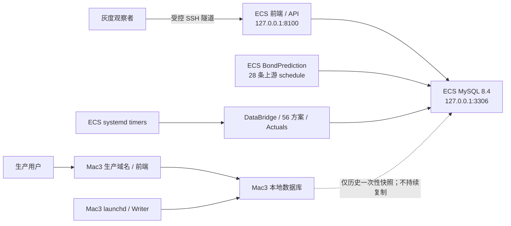

# 阿里云 ECS 独立灰度迁移交接

**文档状态**：`CURRENT`

**最后核验时间**：2026-08-18 15:51（Asia/Shanghai）

**当前阶段**：ECS 部署闭环已完成，正在进行独立自然灰度观察；生产切换尚未批准。

本文只记录当前有效事实、运行边界和下一道决策门。部署过程、已否决方案和旧状态不在工作树重复
保存，需要追溯时使用 Git 历史。精确 release、手工真写库、缓存、资源和 timer 启用证据见
[ECS 灰度 release 验收报告](ALIYUN_ECS_GRAY_RELEASE_ACCEPTANCE_20260818.md)。

## 1. 当前结论与阶段边界

云服务器迁移的部署主体已经完成：ECS 具备独立数据库、上游增量数据链、DataBridge、Linux 算法
环境、56 个 active base、Actuals、systemd 调度和 localhost 前端。五个项目 timer 已启用，ECS 正按
自己的数据库和日历运行。

当前不是生产切换阶段：

- Mac3 继续承载生产域名、生产前端和生产 Writer；
- ECS 是独立灰度实验室，不是 Mac3 的热备、复制节点或双写节点；
- 两端使用各自的数据库、DataBridge、Registry 和运行记录，数据允许自然分叉；
- ECS 不承载生产公网流量，不安装生产 Nginx/TLS，不修改 DNS；
- 自然灰度达标不会自动触发切换，仍须重新开会确定窗口、范围和回滚方案。

因此当前准确状态是：**ECS 部署完成，灰度观察进行中，整个生产迁移尚未关闭。**

## 2. 当前双主机拓扑与 authority



现场 authority 顺序：

1. installed/loaded 服务状态、数据库读回和当前 release symlink；
2. 本验收报告中的固定执行证据；
3. 仓库 systemd/launchd 模板与部署矩阵；
4. 本交接文档。

文档不能覆盖现场事实。任何服务修改前必须重新只读核对。

## 3. 已完成的部署闭包

| 范围 | 当前结果 |
|---|---|
| 数据库 | Mac `bond_db` 已完整恢复到 ECS loopback MySQL 8.4；结构、对象、Trigger、Procedure 和 Event 定义完成核验，`event_scheduler=OFF` |
| 增量数据链 | `BondPrediction` 已部署到 `/opt/bondprediction/current`，28 条有效数据任务在 ECS 本地运行；4 条 `forecast_project` 任务明确不迁移 |
| Python 依赖 | `BondPrediction` requirements 已包含 `cryptography`；项目三套 Linux 环境使用 conda-forge-only，依赖完整性和数据库连接已验证 |
| 项目 release | current 指向不可变 release `a749b17d5ad3e3f248a1cb788d892aa36d30f518` |
| 方案范围 | canonical 源码保持 65 个 base；ECS 由 `aliyun-gray` 部署矩阵发现 56 base / 60 composite，9 个 Mac-only base 不进入 ECS 执行 |
| Registry | ECS 为 60 active / 9 paused；部署矩阵不自动改写 Registry 生命周期 |
| DataBridge | 使用 ECS 本地数据库发布 current generation，严格健康检查通过 |
| Liwei 缓存 | 7 个 family 复用迁移 parent；首次消费者只 append 唯一缺失交易日，同 family 后续消费者 hit；没有 full rebuild |
| 手工真写库 | daily 39/39、weekly 12/12、monthly 5/5 全成功，分别写入 43、12、5 条预测；Actuals 成功更新 |
| 数据闭环 | run/prediction linkage 完整、业务键无重复、残留 running 为 0、9 个 Mac-only base 零新增 |
| Backend / 前端 | Backend `active/static`，只监听 `127.0.0.1:8100`；首页和 `/api/health` 均为 HTTP 200，页面实际数据已渲染 |
| 自动调度 | DataBridge、daily、weekly、monthly、Actuals 五个 timer 均为 `enabled/active/waiting` |

本阶段没有执行 macOS/Linux 数值 CompareGate，也不声明跨平台数值等价。该取舍不修改新方案首次技术
入库的 CompareGate 规则，也不授权修改任何 exact scheme version。

## 4. ECS 当前运行配置

### 4.1 主机与资源

| 项目 | 当前值 |
|---|---|
| 主机 | 阿里云 ECS，Ubuntu 26.04，x86_64，4 vCPU / 16 GiB |
| MySQL | 8.4.10，仅监听 loopback |
| 系统盘 | 40 GiB；2026-08-18 15:51 读回已用 23 GiB、可用 15 GiB、使用率 62% |
| 内存 | Guest 可见约 14 GiB；同次读回约 13 GiB available；无 Swap |
| 项目 failed unit | 0 |
| 时区 | `Asia/Shanghai`，NTP synchronized |

### 4.2 systemd 调度

| Timer | 触发规则 | 批次总时限 |
|---|---|---:|
| DataBridge | 每日 06:30 | 1 小时 |
| daily | 周一至周五 07:03 | 2 小时 |
| weekly | 周六 11:30 | 2 小时 |
| monthly | 每月 15 日 18:00 | 2 小时 |
| Actuals | 每日 08:30、19:00、23:45 | 1 小时 |

所有 timer 均保持：

- `Persistent=false`：停机期间错过的触发不在开机后补跑；
- `RandomizedDelaySec=0`：不随机漂移业务触发时间；
- service 为 one-shot，只启用 `.timer`，不启用 `.service`；
- `TimeoutStopSec=300`、`KillMode=control-group`；
- 不增加内存限制；daily 超过两小时按任务或算法效率问题处理。

Backend 按用户决定保持 `static`，不设置开机自启。服务器通常不重启；若发生重启，必须由运维人员
只读检查后手工启动 Backend。

`/api/health` 中 `daily_schedule.overall=not_enabled`、`LEDGER_RETIRED` 表示旧 ledger 控制面已经退役，
不是 systemd timer 未启用。ECS 调度的真实状态只认 `systemctl` installed/loaded readback。

### 4.3 localhost 前端访问

ECS 前端不开放公网端口。当前 Mac 可使用 SSH 本地转发：

```bash
ssh -N \
  -L 127.0.0.1:18100:127.0.0.1:8100 \
  -i /Users/macstudio0/.ssh/finlab-key.pem \
  -o IdentitiesOnly=yes \
  -o StrictHostKeyChecking=yes \
  root@47.103.45.193
```

随后访问：

- 前端：`http://127.0.0.1:18100/`
- 健康检查：`http://127.0.0.1:18100/api/health`

新设备不得假设上述本机私钥存在；应由责任人通过受控渠道发放独立访问方式并先核对 SSH Host Key。

## 5. 自然灰度观察标准

当前唯一进行中的迁移工作是收集自然运行证据，不继续改代码或重建环境。

最低观察范围：

- 多个连续交易日的 DataBridge、daily 和 Actuals；
- 至少一次自然 weekly；
- 至少一次自然 monthly；
- 每个 active base 的 latest run、prediction 数量和最终状态；
- `predict_date`、`feature_date`、`target_date` 日期链；
- DataBridge generation、refresh date、business digest 和 ready gate；
- 7 个 Liwei cache family 的 parent reuse、append/hit 和 full rebuild 计数；
- 批次墙钟、Peak RSS、OOM、CPU/I/O、磁盘增长和日志异常；
- 批次运行期间 localhost Backend、首页和关键 API 可用性。

验收原则：

1. 周频/月频只在各自自然日历验收，不改成每日运行。
2. 停机错过任务不自动 backfill；任何人工补跑必须独立授权。
3. 任何任务失败、日期链错误、意外 full rebuild、OOM、磁盘不足或前端不可用都必须先闭环。
4. 手工批次成功不能替代自然触发证据。
5. 观察周期不预设自动结束日期，由完整证据和会议决定共同关闭。

## 6. 未授权的生产切换范围

以下操作当前均未批准：

- 停止或替换 Mac3 launchd、Writer、数据库或生产前端；
- 把 ECS release 晋级到 Mac3；
- 在 ECS 安装生产 Nginx、Certbot 或公网 TLS；
- 修改 Security Group、DNS、生产域名或 upstream；
- 把生产流量或生产 Writer authority 切到 ECS；
- 在两库之间建立复制、双写或自动同步；
- 执行历史回测、自动 backfill 或额外业务写入；
- 修改 Registry、scheme lifecycle、算法配置或 exact version；
- 调整 MySQL、systemd 资源限制、并发或单方案超时。

未来生产切换至少拆成两个独立窗口：

1. Web：公网入口、证书、域名、健康检查和回滚；
2. Writer：两端任务围栏、数据空窗、Registry、最终水位和回滚。

两个窗口都必须在自然灰度通过后重新设计、只读预检并取得明确授权。

## 7. 当前运行风险与停止条件

| 风险 | 当前处理 |
|---|---|
| 磁盘增长 | 当前约 15 GiB 可用；持续记录 MySQL、Artifact、Native CSV 和日志增长。空间趋势不足时停止晋级并提交扩盘/保留策略 |
| 实例到期 | 控制台记录为手动续费、到期 2026-09-16 23:59:59；首次自然 monthly 为 2026-09-15，必须提前确认续费和责任人 |
| 单机故障 | ECS 是单实例、单 MySQL；当前只承载灰度，不宣称高可用或自动故障转移 |
| 无 Swap | 当前内存余量充足且批次峰值低于主机容量；只观察，不夹带内存保护或 Swap 改造 |
| Backend 非自启 | 用户明确接受；主机重启后必须手工检查并启动，不把它误报为自动恢复 |
| 上游与 DataBridge 时序 | cron 与 systemd timer 没有依赖机制；持续确认 05:15 derivative 任务在 06:30 DataBridge 前完成 |
| 外部数据源双份请求 | Mac 与 ECS 上游状态在生产切换前重新核对；当前两端数据库独立，Mac 仍是对外 authority |
| 运行期沙箱 | Blackbox 运行期 OS 沙箱已退役；保证来自 StaticGate、版本哈希和运行后输入目录指纹，不宣称 OS 级隔离 |

立即停止晋级并调查的条件：

- timer、one-shot、数据库或 Backend 状态与本文不一致；
- active base 数量、Registry 状态或 Mac-only 排除范围变化；
- 批次超时、失败、残留进程或错误写库；
- 缓存发生意外 full rebuild 或 lineage 校验失败；
- OOM、磁盘余量不足或批次期间 API 明显不可用；
- 需要修改 Mac3、域名、生产流量或扩大当前授权范围。

## 8. 运维接手与只读检查

每次观察先执行只读检查，不以仓库模板代替现场：

```bash
readlink -f /opt/bond-factor-lab/current
systemctl is-enabled bond-factor-lab-backend.service
systemctl is-active bond-factor-lab-backend.service
systemctl list-timers 'bond-factor-lab-*'
systemctl --failed
curl -fsS http://127.0.0.1:8100/api/health
df -h /
free -h
```

查看单个批次：

```bash
systemctl status bond-factor-lab-prediction-daily.service --no-pager -l
journalctl -u bond-factor-lab-prediction-daily.service --since today --no-pager
```

只读健康检查：

```bash
cd /opt/bond-factor-lab/current
set -a
. /etc/bond-factor-lab/bond-factor-lab.env
set +a
/opt/miniconda3/envs/bond_factor_lab_service/bin/python \
  scripts/check_production_daily_health.py --predict-date YYYY-MM-DD
```

不得在诊断输出、文档或提交中记录数据库密码、Token、私钥内容、云 AccessKey 或完整 DSN。

## 9. 文档与 Git 权威

当前文档职责：

| 文档 | 职责 |
|---|---|
| `AGENTS.md` / `CLAUDE.md` | 项目根约束、分支边界和双主机运行原则 |
| `docs/CURRENT_STATUS.md` | 当前稳定事实 |
| `docs/TODO.md` | 尚未批准实施的工作和下一道决策门 |
| 本文 | ECS 当前迁移交接、观察标准和未来切换边界 |
| `ALIYUN_ECS_GRAY_RELEASE_ACCEPTANCE_20260818.md` | release 部署、手工真写库和 timer 启用的精确证据 |

Git 当前职责：

- `codex/aliyun-db-clone-20260816`：唯一活动集成分支；
- `master@2b62a2e9ae7c661f4a7f1741b5ff6c351819a4ad`：冻结备份点，未经新授权不得移动或推送；
- `codex/audit-bugfixes-20260613`：Mac3 当前 checkout 使用的既有分支，不在清理中切换或删除；
- Mac3 与 ECS 不创建长期环境分支；两个主机接收同一精确源码 release，通过部署目标适配环境差异；
- ECS 保持 release-only，不保存 Git checkout，不执行 `git pull` 或主机本地源码修改。

完成计划、关闭的设计讨论和旧迁移状态不保留在当前工作树；需要追溯时使用 Git 历史、systemd journal、
数据库 run/prediction 记录和验收证据。
