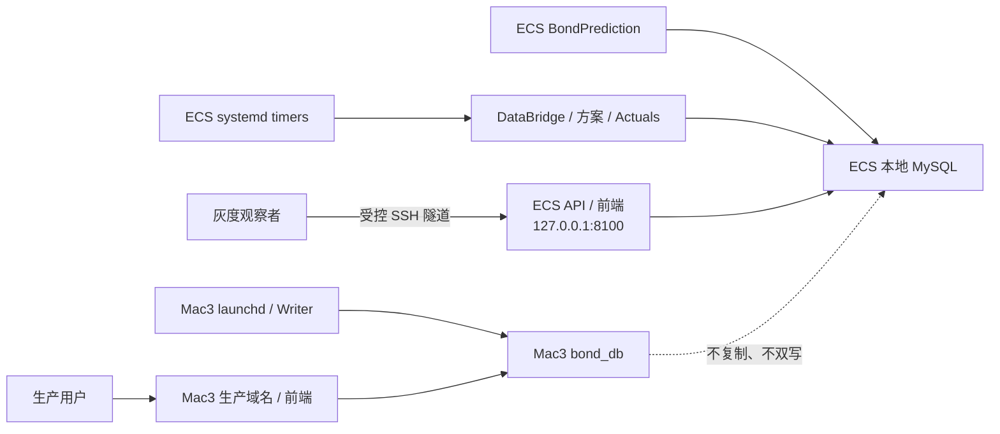

# 阿里云 ECS 独立灰度运行与迁移交接

**文档状态**：`CURRENT`

**最后核验时间**：2026-08-20 08:25（Asia/Shanghai）

**当前阶段**：ECS 部署闭环和压缩式调度等价验收均已完成；Mac3 immutable release R1 已冻结，
installed launchd 尚未切换，今日 Mac3 生产运行不受影响。

本文是 ECS 迁移、运行和接手的唯一当前入口。已完成计划、旧候选、一次性测试过程和中间验收报告
不留在工作树；需要追溯时使用 Git、ECS root-only evidence、systemd journal 和数据库审计记录。

## 1. 当前结论

ECS 已具备独立数据库、增量数据链、DataBridge、算法环境、项目 release、systemd 调度、Actuals 和
loopback Backend。五个 timer 已启用，daily 保持两小时总运行上限。冻结同源数据下的 DataBridge、
daily、weekly、monthly 和 Actuals 已按 systemd one-shot 等价路径完成隔离真写库；Phase-A 的 7 个
family 全部复用 parent 并执行有限 suffix，没有全量重建。无需再把“等待五个自然日”作为本轮上线门。

代码治理也已落地为单一代码线：

- `codex/develop` 是唯一活动集成分支；不维护 Mac3/ECS 两条长期环境分支；
- 单一 archive、不可变 release 和小型平台适配器能力已经实现，ECS 已实际采用；Mac3 仓库候选也已
  具备最小 release launcher，但后续只能在独立窗口晋级 ECS 已验证的同一精确 archive；
- ECS 使用不可变 `releases/<commit>` 和 `current/previous`，不保留 Git checkout、不执行 `git pull`、
  不允许主机本地修改 release；
- Mac3 与 ECS 的差异只存在于 launchd/systemd、部署目标、环境文件、部署矩阵和平台依赖 manifest；
  scheduler、repository、算法和 scheme config 不复制；
- Mac3 目前仍由既有 checkout 和 installed launchd 承载生产。把 Mac3 切到不可变 runtime release
  是灰度达标后的独立生产窗口，不属于本轮已完成操作。

因此需要区分两个结论：**ECS 迁移部署已完成**；**生产域名和 Writer 从 Mac3 切换到 ECS 尚未开始**。

## 2. 双主机边界



- Mac3 继续承载生产域名、生产前端和生产 Writer。
- ECS 是独立灰度实验室，不是 Mac3 热备、复制节点或共享数据库节点。
- 两端各自维护数据库、DataBridge、Registry、run、prediction、调度状态和回滚指针。
- ECS Backend 只监听 `127.0.0.1:8100`；本阶段不安装生产 Nginx/TLS，不修改 DNS 或生产流量。
- 灰度达标不会自动触发切换；Web、Writer、域名、窗口和回滚范围必须再次明确授权。

## 3. ECS 当前运行状态

| 范围 | 当前状态 |
|---|---|
| 数据库 | ECS loopback MySQL 8.4，独立 `bond_db`；应用经 `BFL_DATABASE_ENV_FILE` 读取 root-only 环境文件 |
| 增量数据链 | `/opt/bondprediction/current` 独立运行；requirements 已包含 `cryptography` |
| Python 环境 | service、forecast、Blackbox 三套 Linux conda 环境；依赖来源为 conda-forge-only |
| 项目 release | `current=fd296812e7acef2869f54f706ba8f4f0bc776896`；`previous=b0470d43ac26cb0674f83b7a980ab093f2e483c6` |
| 外置状态 | `/var/lib/bond-factor-lab/state`；DataBridge、artifact、日志和第三方 cache 均位于 release 外 |
| Liwei 热缓存 | 7 个 family 位于独立 cache root；当前 generation 均通过 secure loader |
| 方案范围 | ECS discovery 为 56 active base / 60 active composite；9 个 Mac-only base 不进入 ECS runner |
| Backend | systemd service 运行，`/api/health` 返回 `status=ok`，仅监听 loopback |
| 调度 | DataBridge、daily、weekly、monthly、Actuals 五个 timer 均为 `enabled/active/waiting` |
| 生产影响 | Mac3、launchd、Nginx、DNS、域名和生产流量均未改变 |

### 3.1 systemd 计划

| 职责 | 触发 | 总时限 |
|---|---|---:|
| DataBridge | 每日 06:30 | 1 小时 |
| daily | 工作日 07:03 | 2 小时 |
| weekly | 周六 11:30 | 2 小时 |
| monthly | 自然月 15 日 18:00 | 2 小时 |
| Actuals | 每日 08:30、19:00、23:45 | 1 小时 |

所有 timer 均为 `Persistent=false`；停机或禁用期间不补跑。systemd installed unit/timer 和现场
`systemctl` 是运行 authority，仓库模板只表示期望配置。

## 4. 数据修订与缓存规则

历史业务预测和 Phase-A 派生缓存必须分开：

- 已写入 `t_scheme_predictions` 的历史预测表达当时可获得数据下的决策，事后数据修订不得回写；
- Phase-A cache 是未来预测的内部加速状态，可以在安全边界内更新；
- 普通同结构数值修订只有在 spec 携带 canonical dependency proof 时才能重算有限 suffix；
- `safe_lookback=max(horizon, purge_gap)`，当前十个 Liwei adapter 的边界为 5 个交易日；
- suffix 之前的 cache 必须保持 parent digest 不变，受影响 suffix 必须通过 cold equivalence 和 lineage；
- 算法、spec、ABI、publisher、schema、字段类型、历史日期删除、交易日或 date-to-week 结构改变仍然
  full/fail-closed；不得把不兼容输入包装成增量成功。

该设计只复用既有 `build_mode=suffix`、manifest、CompareGate、acceptance lineage 和 `current.json`
原子发布；没有新增数据库表、revision ledger、后台服务、第二套 cache 或算法分支。

## 5. 压缩式调度验收与后续灰度

为避免等待多个自然日，2026-08-20 已在 ECS 创建一次性隔离库、冻结源数据和热缓存副本，使用与
installed service 相同的 Python 环境、release、控制面变量、超时和 `systemd` cgroup 语义，直接模拟
自然 DataBridge、daily、weekly、monthly 和 Actuals。隔离环境不连接生产写库路径；验收结束后，
隔离数据库、缓存副本、临时环境文件和 transient unit 已全部删除。

| 批次 | 真写库结果 | 墙钟 | 峰值内存 |
|---|---:|---:|---:|
| daily（2026-08-19） | 39/39 run 成功，43 条 prediction | 1 小时 1 分 38 秒 | 1.9 GiB |
| weekly（2026-08-15） | 12/12 run 成功，12 条 prediction | 7 分 34 秒 | 768 MiB |
| monthly（2026-08-15） | 5/5 run 成功，5 条 prediction | 1 分 51 秒 | 436 MiB |
| Actuals（截止 2026-08-18） | daily 14,165、weekly 5,954、monthly 刷新 684 条 | 27 秒 | 81 MiB |

验收同时确认：

- 60 条 prediction 全部关联 success run，重复键、孤儿记录、写入计数不一致和残留 running 均为 0；
- daily 的 `predict_date/feature_date` 为 `2026-08-19/2026-08-18`，weekly 和 monthly 的
  `predict_date/feature_date` 为 `2026-08-15/2026-08-14`，全部为 `scheduled_live`；
- 9 个 Mac-only paused base 均未执行；Registry 保持 60 active / 9 paused；
- 7 个 Liwei cache family 均为 `build_mode=suffix`，从 parent 重算 `2026-08-11` 起的有限区间，
  full build 为 0；
- 生产 `bond_db` 的最大 run 仍为 3408、prediction 总数仍为 2965，7 个生产 cache pointer 哈希、
  `current/previous` release、Backend 和五个 timer 均未改变；DataBridge 测试状态已恢复并通过 check-only。

自然 timer 继续承担日常运行和故障监控，但不再要求等待五个自然日后才能认定 ECS 灰度部署可用。
后续若进入生产切换评审，仍须重新确定 Web、Writer、Mac3、切换窗口、DNS/Nginx、数据库 authority
和回滚范围；本轮验收不授予这些生产切换操作。

### 5.1 Mac3 immutable release R1

R1 只完成仓库基础设施、长期测试、文档和 deterministic archive 冻结，不在白天修改 Mac3 现场：

```text
/Users/macstudio0/bond-factor-lab                 # Git 开发工作区
/Users/macstudio0/bond-factor-lab-production/
├── current -> releases/<exact_commit>
├── previous -> releases/<prior_commit>
└── releases/<exact_commit>/                     # 只读、无 .git
/Users/macstudio0/bond-factor-lab-runtime/        # 日志、状态和第三方 cache
```

六个应用 launchd 候选模板从 production `current` 启动，先由隔离模式的系统 Python 执行
`scripts/run_launchd_release.py`，核验并加载安装器生成的 `.bfl-release.env`，再执行原 conda 命令；
launcher 同时拒绝外层 `PYTHONPATH/PYTHONHOME`。SSH tunnel 不执行项目代码，但其工作目录和日志也
必须脱离 Git。候选模板、launcher 或 R1 archive 存在都不能证明 Mac3 已切换，installed plist 和
`launchctl` 仍是现场 authority。

夜间窗口建议位于 23:45 Actuals 完成后、次日 06:30 DataBridge 之前，并避开仍在运行的批次。该窗口
必须另行授权，按“只读预检 → 预安装 → source 校验 → current CAS 激活 → 替换六个应用 plist →
独立替换 SSH tunnel plist → 读回七个 loaded state → Backend/DataBridge check-only/release identity
→ 保留回滚”执行。tunnel 重载可能短暂重连，只能在窗口内进行。验收完成前不得切换 Mac3 Git 根
分支；完成后可在保留未跟踪文件的前提下切到 `codex/develop`，此时双主机单一代码线治理才算闭环。

installed plist 不能用仓库模板直接覆盖：Backend 的真实 `BOND_ADMIN_TOKEN` 必须从现有 installed
配置原位保留且不得输出，SSH tunnel 的本地 key/user 也不得由占位符覆盖。窗口前先以
`scripts/audit_launchd_config_drift.py` 读取脱敏差异；审计必须确认 installed/loaded Backend 都保留
非空、非占位的 token，installed/loaded tunnel 都已替换真实 key/user，且七个任务日志路径与候选
精确一致。任何超出批准本地 secret 与本次 release 路径变更的 drift 都必须停止切换。

R1 已冻结为 tag `mac3-immutable-r1-20260820`，archive SHA256 为
`654795f268fc4b25287cc33f4205a17ffc7eda1b9ea10e282fd553539ecd720f`。因此前端和两个新方案的开发
现在即可继续，不需要等待夜间窗口。前端先在 ECS 灰度验证再决定 Mac3 晋级；两个新方案分别执行
Blackbox V2 Intake/Gate/ECS-only activation，不得合并为一个不可独立回滚的上线单元。

## 6. 接手检查

以下命令均为只读；执行前仍须使用受控 SSH 和严格 Host Key 校验：

```bash
readlink -f /opt/bond-factor-lab/current
readlink -f /opt/bond-factor-lab/previous

systemctl list-timers 'bond-factor-lab-*' --all
systemctl show bond-factor-lab-prediction-daily.service \
  -p ActiveState -p SubState -p Result -p ExecMainStatus \
  -p ExecMainStartTimestamp -p ExecMainExitTimestamp

curl --fail --silent http://127.0.0.1:8100/api/health

cd /opt/bond-factor-lab/current
env BFL_DATABASE_ENV_FILE=/etc/bond-factor-lab/bond-factor-lab.env \
  PYTHONNOUSERSITE=1 PYTHONDONTWRITEBYTECODE=1 \
  /opt/miniconda3/envs/bond_factor_lab_service/bin/python \
  scripts/check_production_daily_health.py --predict-date YYYY-MM-DD --strict-runs
```

发现以下任一情况必须停止自动外推结论：任务超时或 failed、残留 running、预测缺失或重复、DataBridge
日期/摘要不一致、cache lineage 拒绝、source digest 改变、timer/installed unit 漂移、Backend 不健康、
磁盘空间不足或需要修改数据库 schema/业务数据。

## 7. Release 与回滚边界

- 构建只允许 clean Git HEAD，archive、manifest、commit、tree 和批准 SHA-256 必须一致。
- 目标机必须使用候选同版本安装器，并设置 `PYTHONDONTWRITEBYTECODE=1`；不得从旧 `current` 调用旧
  安装器，也不得直接从不可变 release 内执行 Python 后再声称 source integrity 不变。
- 激活必须使用 `expected-current` CAS；安装器不顺带操作数据库、systemd、Nginx、DNS 或 Registry。
- 对已经发布 proof-bearing suffix generation 的 family，回滚旧代码时必须同时恢复发布前保存的
  7 个 `current.json` parent pointer；只切代码 symlink 不是完整回滚。
- 回滚不得删除 run、prediction、日志或失败 evidence，不得修改历史预测以伪造成功。
- release、installed unit、service、timer、数据库和 cache pointer 变更继续是独立生产操作。

## 8. 仓库长期保留边界

以下测试是长期合同，必须保留：

| 测试 | 长期职责 |
|---|---|
| `tests/test_liwei_0616_revision_suffix_contract.py` | 固定十个 adapter 的 canonical dependency proof 和有限 lookback |
| `tests/test_liwei_0616_private_cache.py` | 固定 suffix/qualification lineage、secure consumer 和原子 publication/prune |
| `tests/test_source_release_tools.py` | 固定 deterministic archive、批准 hash、source integrity 和 CAS 激活 |
| `tests/test_launchd_release_launcher.py` | 固定 Mac3 immutable current、release 环境核验和 Git 工作区解耦 |
| `tests/test_launchd_config_drift_audit.py` | 固定 template/installed/loaded 三层漂移与本地秘密脱敏 |
| `tests/test_systemd_control_plane.py` | 固定 ECS one-shot、部署目标、timer 和两小时 daily 上限 |

一次性 ECS validation 脚本、迁移 rebind 脚本、候选专项测试和时点验收文档不属于长期代码，已经从
工作树删除。后续新的临时验证也只能写入隔离目录或 `/tmp`，完成后删除；不能重新污染仓库。

## 9. 文档与 Git authority

- `AGENTS.md` / `CLAUDE.md`：根约束和单一代码线治理；两者必须字节一致。
- `docs/CURRENT_STATUS.md`：当前稳定事实。
- `docs/TODO.md`：尚未批准工作的唯一队列。
- 本文：ECS 当前运行、观察、接手和切换边界。
- Git、ECS evidence、systemd journal 和数据库：历史与精确时点证据。

`codex/develop` 是唯一活动集成分支。`master` 继续保持冻结备份，未经授权不得移动。Mac3 当前生产
仍绑定旧 checkout；只有 R1 夜间窗口验收完成后才能切换开发根分支。ECS 保持 release-only，不保存
环境分支或 Git 工作区。
