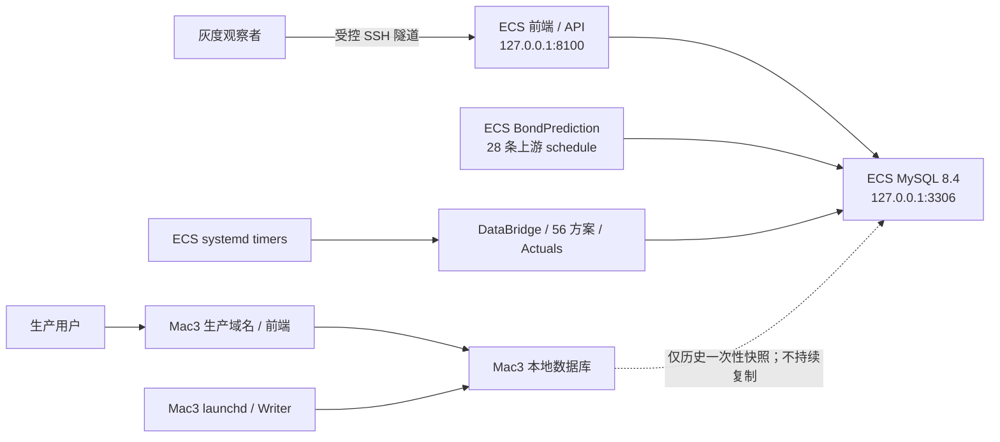

# 阿里云 ECS 独立灰度迁移交接

**文档状态**：`CURRENT`

**最后核验时间**：2026-08-18 21:24（Asia/Shanghai）

**当前阶段**：ECS 部署闭环已完成，正在进行独立自然灰度观察；生产切换尚未批准。

本文只记录当前有效事实、运行边界和下一道决策门。部署过程、已否决方案和旧状态不在工作树重复
保存，需要追溯时使用 Git 历史。精确 release、手工真写库、缓存、资源和 timer 启用证据见
[ECS 灰度 release 验收报告](ALIYUN_ECS_GRAY_RELEASE_ACCEPTANCE_20260818.md)。

## 1. 当前结论与阶段边界

云服务器迁移的部署主体已经完成：ECS 具备独立数据库、上游增量数据链、DataBridge、Linux 算法
环境、56 个 active base、Actuals、systemd 调度和 localhost 前端。五个项目 timer 已启用，ECS 正按
自己的数据库和日历运行。

当前不是生产切换阶段：

- Mac3 继续承载生产域名、生产前端和生产 Writer；
- ECS 是独立灰度实验室，不是 Mac3 的热备、复制节点或双写节点；
- 两端使用各自的数据库、DataBridge、Registry 和运行记录，数据允许自然分叉；
- ECS 不承载生产公网流量，不安装生产 Nginx/TLS，不修改 DNS；
- 自然灰度达标不会自动触发切换，仍须重新开会确定窗口、范围和回滚方案。

因此当前准确状态是：**ECS 部署完成，灰度观察进行中，整个生产迁移尚未关闭。**

## 2. 当前双主机拓扑与 authority



现场 authority 顺序：

1. installed/loaded 服务状态、数据库读回和当前 release symlink；
2. 本验收报告中的固定执行证据；
3. 仓库 systemd/launchd 模板与部署矩阵；
4. 本交接文档。

文档不能覆盖现场事实。任何服务修改前必须重新只读核对。

## 3. 已完成的部署闭包

| 范围 | 当前结果 |
|---|---|
| 数据库 | Mac `bond_db` 已完整恢复到 ECS loopback MySQL 8.4；结构、对象、Trigger、Procedure 和 Event 定义完成核验，`event_scheduler=OFF` |
| 增量数据链 | `BondPrediction` 已部署到 `/opt/bondprediction/current`，28 条有效数据任务在 ECS 本地运行；4 条 `forecast_project` 任务明确不迁移 |
| Python 依赖 | `BondPrediction` requirements 已包含 `cryptography`；项目三套 Linux 环境使用 conda-forge-only，依赖完整性和数据库连接已验证 |
| 项目 release | current 指向不可变 release `a749b17d5ad3e3f248a1cb788d892aa36d30f518` |
| 方案范围 | canonical 源码保持 65 个 base；ECS 由 `aliyun-gray` 部署矩阵发现 56 base / 60 composite，9 个 Mac-only base 不进入 ECS 执行 |
| Registry | ECS 为 60 active / 9 paused；部署矩阵不自动改写 Registry 生命周期 |
| DataBridge | 使用 ECS 本地数据库发布 current generation，严格健康检查通过 |
| Liwei 缓存 | 7 个 family 复用迁移 parent；首次消费者只 append 唯一缺失交易日，同 family 后续消费者 hit；没有 full rebuild |
| 手工真写库 | daily 39/39、weekly 12/12、monthly 5/5 全成功，分别写入 43、12、5 条预测；Actuals 成功更新 |
| 数据闭环 | run/prediction linkage 完整、业务键无重复、残留 running 为 0、9 个 Mac-only base 零新增 |
| Backend / 前端 | Backend `active/static`，只监听 `127.0.0.1:8100`；首页和 `/api/health` 均为 HTTP 200，页面实际数据已渲染 |
| 自动调度 | DataBridge、daily、weekly、monthly、Actuals 五个 timer 均为 `enabled/active/waiting` |

本阶段没有执行 macOS/Linux 数值 CompareGate，也不声明跨平台数值等价。该取舍不修改新方案首次技术
入库的 CompareGate 规则，也不授权修改任何 exact scheme version。

## 4. ECS 当前运行配置

### 4.1 主机与资源

| 项目 | 当前值 |
|---|---|
| 主机 | 阿里云 ECS，Ubuntu 26.04，x86_64，4 vCPU / 16 GiB |
| MySQL | 8.4.10，仅监听 loopback |
| 系统盘 | 40 GiB；2026-08-18 15:51 读回已用 23 GiB、可用 15 GiB、使用率 62% |
| 内存 | Guest 可见约 14 GiB；同次读回约 13 GiB available；无 Swap |
| 项目 failed unit | 0 |
| 时区 | `Asia/Shanghai`，NTP synchronized |

### 4.2 systemd 调度

| Timer | 触发规则 | 批次总时限 |
|---|---|---:|
| DataBridge | 每日 06:30 | 1 小时 |
| daily | 周一至周五 07:03 | 2 小时 |
| weekly | 周六 11:30 | 2 小时 |
| monthly | 每月 15 日 18:00 | 2 小时 |
| Actuals | 每日 08:30、19:00、23:45 | 1 小时 |

所有 timer 均保持：

- `Persistent=false`：停机期间错过的触发不在开机后补跑；
- `RandomizedDelaySec=0`：不随机漂移业务触发时间；
- service 为 one-shot，只启用 `.timer`，不启用 `.service`；
- `TimeoutStopSec=300`、`KillMode=control-group`；
- 不增加内存限制；daily 超过两小时按任务或算法效率问题处理。

Backend 按用户决定保持 `static`，不设置开机自启。服务器通常不重启；若发生重启，必须由运维人员
只读检查后手工启动 Backend。

`/api/health` 中 `daily_schedule.overall=not_enabled`、`LEDGER_RETIRED` 表示旧 ledger 控制面已经退役，
不是 systemd timer 未启用。ECS 调度的真实状态只认 `systemctl` installed/loaded readback。

### 4.3 localhost 前端访问

ECS 前端不开放公网端口。当前 Mac 可使用 SSH 本地转发：

```bash
ssh -N \
  -L 127.0.0.1:18100:127.0.0.1:8100 \
  -i /Users/macstudio0/.ssh/finlab-key.pem \
  -o IdentitiesOnly=yes \
  -o StrictHostKeyChecking=yes \
  root@47.103.45.193
```

随后访问：

- 前端：`http://127.0.0.1:18100/`
- 健康检查：`http://127.0.0.1:18100/api/health`

新设备不得假设上述本机私钥存在；应由责任人通过受控渠道发放独立访问方式并先核对 SSH Host Key。

## 5. 自然灰度观察标准

当前唯一进行中的迁移工作是收集自然运行证据，不继续改代码或重建环境。

最低观察范围：

- 多个连续交易日的 DataBridge、daily 和 Actuals；
- 至少一次自然 weekly；
- 至少一次自然 monthly；
- 每个 active base 的 latest run、prediction 数量和最终状态；
- `predict_date`、`feature_date`、`target_date` 日期链；
- DataBridge generation、refresh date、business digest 和 ready gate；
- 7 个 Liwei cache family 的 parent reuse、append/hit 和 full rebuild 计数；
- 批次墙钟、Peak RSS、OOM、CPU/I/O、磁盘增长和日志异常；
- 批次运行期间 localhost Backend、首页和关键 API 可用性。

验收原则：

1. 周频/月频只在各自自然日历验收，不改成每日运行。
2. 停机错过任务不自动 backfill；任何人工补跑必须独立授权。
3. 任何任务失败、日期链错误、意外 full rebuild、OOM、磁盘不足或前端不可用都必须先闭环。
4. 手工批次成功不能替代自然触发证据。
5. 观察周期不预设自动结束日期，由完整证据和会议决定共同关闭。

## 6. 未授权的生产切换范围

以下操作当前均未批准：

- 停止或替换 Mac3 launchd、Writer、数据库或生产前端；
- 把 ECS release 晋级到 Mac3；
- 在 ECS 安装生产 Nginx、Certbot 或公网 TLS；
- 修改 Security Group、DNS、生产域名或 upstream；
- 把生产流量或生产 Writer authority 切到 ECS；
- 在两库之间建立复制、双写或自动同步；
- 执行历史回测、自动 backfill 或额外业务写入；
- 修改 Registry、scheme lifecycle、算法配置或 exact version；
- 调整 MySQL、systemd 资源限制、并发或单方案超时。

未来生产切换至少拆成两个独立窗口：

1. Web：公网入口、证书、域名、健康检查和回滚；
2. Writer：两端任务围栏、数据空窗、Registry、最终水位和回滚。

两个窗口都必须在自然灰度通过后重新设计、只读预检并取得明确授权。

## 7. 当前运行风险与停止条件

| 风险 | 当前处理 |
|---|---|
| 磁盘增长 | 当前约 15 GiB 可用；持续记录 MySQL、Artifact、Native CSV 和日志增长。空间趋势不足时停止晋级并提交扩盘/保留策略 |
| 实例到期 | 控制台记录为手动续费、到期 2026-09-16 23:59:59；首次自然 monthly 为 2026-09-15，必须提前确认续费和责任人 |
| 单机故障 | ECS 是单实例、单 MySQL；当前只承载灰度，不宣称高可用或自动故障转移 |
| 无 Swap | 当前内存余量充足且批次峰值低于主机容量；只观察，不夹带内存保护或 Swap 改造 |
| Backend 非自启 | 用户明确接受；主机重启后必须手工检查并启动，不把它误报为自动恢复 |
| 上游与 DataBridge 时序 | cron 与 systemd timer 没有依赖机制；持续确认 05:15 derivative 任务在 06:30 DataBridge 前完成 |
| 外部数据源双份请求 | Mac 与 ECS 上游状态在生产切换前重新核对；当前两端数据库独立，Mac 仍是对外 authority |
| 运行期沙箱 | Blackbox 运行期 OS 沙箱已退役；保证来自 StaticGate、版本哈希和运行后输入目录指纹，不宣称 OS 级隔离 |

立即停止晋级并调查的条件：

- timer、one-shot、数据库或 Backend 状态与本文不一致；
- active base 数量、Registry 状态或 Mac-only 排除范围变化；
- 批次超时、失败、残留进程或错误写库；
- 缓存发生意外 full rebuild 或 lineage 校验失败；
- OOM、磁盘余量不足或批次期间 API 明显不可用；
- 需要修改 Mac3、域名、生产流量或扩大当前授权范围。

## 8. 运维接手与只读检查

每次观察先执行只读检查，不以仓库模板代替现场：

```bash
readlink -f /opt/bond-factor-lab/current
systemctl is-enabled bond-factor-lab-backend.service
systemctl is-active bond-factor-lab-backend.service
systemctl list-timers 'bond-factor-lab-*'
systemctl --failed
curl -fsS http://127.0.0.1:8100/api/health
df -h /
free -h
```

查看单个批次：

```bash
systemctl status bond-factor-lab-prediction-daily.service --no-pager -l
journalctl -u bond-factor-lab-prediction-daily.service --since today --no-pager
```

只读健康检查：

```bash
cd /opt/bond-factor-lab/current
set -a
. /etc/bond-factor-lab/bond-factor-lab.env
set +a
/opt/miniconda3/envs/bond_factor_lab_service/bin/python \
  scripts/check_production_daily_health.py --predict-date YYYY-MM-DD
```

不得在诊断输出、文档或提交中记录数据库密码、Token、私钥内容、云 AccessKey 或完整 DSN。

## 9. 双主机源码与发布治理（方案 A′）

2026-08-18 已批准采用方案 A′：**单一代码线、不可变源码 release、ECS 与 Mac3 两个独立部署
环境**。本节批准的是后续治理设计和实施计划，不表示已切换 Mac3 installed plist、已修改 ECS
`current`，也不授权任何服务重启、生产写入或域名切换。

该决定采用成熟项目的四项稳定约定：GitHub Flow 用短期工作分支合入单一集成线；部署环境表达
灰度/生产目标而不是维护环境源码分支；release 创建后不可修改；宿主机通过
`current -> releases/<release_id>` 发布，并将跨 release 状态放在 release 外。参考：
[GitHub Flow](https://docs.github.com/en/get-started/using-github/github-flow)、
[GitHub deployments and environments](https://docs.github.com/en/actions/reference/workflows-and-actions/deployments-and-environments)、
[Twelve-Factor build/release/run](https://12factor.net/build-release-run) 和
[Capistrano directory structure](https://capistranorb.com/documentation/getting-started/structure/)。

### 9.1 不变量

1. Mac3 与 ECS 不建立长期环境分支，也不在主机上维护不同算法源码。
2. 一个候选只从一个精确 Git SHA 构建一次源码 archive；ECS 先灰度，Mac3 后续只能晋级同一
   archive，两个主机读回的 archive SHA256 必须一致。
3. release 目录创建后只读、不可原地修补。任何代码或受版本控制配置变化都产生新 release ID。
4. `current` 只在安装、清单、依赖、路径和只读健康预检全部通过且没有相关 one-shot 正在运行时
   原子切换；`current` 替换前的失败保持旧版本，替换后或调用结果不确定时，以 `current` 现场读回
   为唯一 authority。
5. 源码 release、Python/conda 环境、数据库 schema 和运行期状态是四个独立版本维度。切回源码
   symlink 只表示代码回滚，不能自动宣称数据库、环境或缓存已经回滚。
6. ECS 继续作为独立灰度实验室；Mac3 继续作为生产 authority，直到自然灰度达标、切换方案另行
   设计并再次获得明确授权。

### 9.2 Git 生命周期

迁移期保留当前约束：

- `codex/develop` 是唯一活动集成分支；它已由 `codex/aliyun-db-clone-20260816` 原地改名，
  没有创建第二条分叉分支；
- 功能或修复需要并行时，从活动集成提交创建短期 `codex/<task>`，验证后合回并删除；
- `master` 在迁移期继续冻结，未经用户明确授权不得移动；它是阶段性基线，不是 Mac3 环境分支；
- 稳定期是否恢复 `master` 为默认集成线是未来独立决策。发布备份最终应由精确 Git SHA、release
  tag、archive 校验和与部署记录共同表达，而不是永久依赖一个含义逐渐陈旧的冻结分支。

### 9.3 两端目标目录

Mac3 同时作为开发机和生产机，但两个职责必须使用不同目录：

```text
/Users/macstudio0/bond-factor-lab/             # Git 开发工作区
/Users/macstudio0/bond-factor-lab-runtime/     # 未来生产运行根
├── current -> releases/<release_id>
├── previous -> releases/<previous_release_id>
├── releases/<release_id>/
├── shared/
├── state/
└── revisions.log
```

ECS 保持 release-only：

```text
/opt/bond-factor-lab/
├── current -> releases/<release_id>
├── previous -> releases/<previous_release_id>
├── releases/<release_id>/
├── shared/
├── state/
└── revisions.log
```

Mac3 的 installed launchd 当前仍以现场读回为准；只有在专项变更窗口完成空闲检查、候选 plist
审计、备份和回滚演练后，才允许把 `WorkingDirectory`/程序路径从 Git 工作区切到 runtime
`current`。ECS 也不得仅因仓库模板更新就推断 installed systemd 已替换。

### 9.4 运行期状态边界

`shared/` 不能成为无条件复用所有旧文件的兜底目录。状态按兼容性分三类：

| 类型 | 示例 | 发布规则 |
|---|---|---|
| 永久外置状态 | 日志、部署记录、运维报告 | 保留在 release 外，跨 release 延续 |
| 兼容性约束状态 | DataBridge generation、Liwei/source cache、输入 artifact | 可跨 release 复用，但必须先通过现有 manifest、lineage、business digest、input state 和 ready gate；不兼容时停止发布，不静默重建或错绑 |
| 临时状态 | 解包 staging、临时下载、失败候选 | 不链接进 `current`，失败后可独立清理 |

数据库继续位于应用 release 外，但 schema/data 变更不属于 `shared/` 文件复用。任何 migration apply、
恢复或跨库动作继续遵守数据库专项授权和 identity 校验。

### 9.5 最小代码与配置改动面

实施时只允许一个集中式路径适配器，不新增平台抽象层：

1. 扩展现有 `shared/runtime_paths.py`，以显式 `BFL_RUNTIME_ROOT` 解析 runtime 根；生产服务缺失或
   使用相对路径时 fail-closed，开发/Harness 保留与生产隔离的默认目录。
2. `shared/artifact_paths.py`、DataBridge、Liwei cache、daily/monthly source cache 通过该适配器
   取得路径；业务算法、repository 和 scheme config 不感知 Mac/ECS 路径。
3. `deploy/launchd/` 与 `deploy/systemd/` 只声明各自的 `BFL_RUNTIME_ROOT`、
   `BFL_DEPLOYMENT_TARGET` 和既有平台环境清单；平台差异不得进入算法代码或环境分支。
4. Blackbox 环境指纹已在 `codex/develop` 候选中按目标平台选择仓库已有的 Linux/macOS
   manifest，不再硬编码只指向 Linux 文件；两端允许不同依赖环境，但运行同一个源码 release，
   未知平台 fail-closed。该候选尚未部署到任一主机。
5. `shared/service_instance.py` 必须从已校验 release manifest/显式环境读取精确 commit；开发环境
   才允许回退到 `git rev-parse`。生产 release 不包含 `.git`，不得因服务指纹当前未启用而把这一
   缺口带入 Mac3。
6. 已新增 `scripts/build_source_release.py` 负责 clean SHA 的 archive、manifest 和 checksum，
   `scripts/install_source_release.py` 负责目标主机的 checksum 校验、staging 安装、只读预检、原子
   symlink 和 revision 记录；共同合同放在 `tests/test_source_release_tools.py`。两者不得顺带操作
   数据库、Registry、DNS、Nginx 或启停调度。

预计新增代码只集中在现有路径适配器和小型 release 工具，不复制 scheduler、算法、配置或服务
模板，不引入容器、GitOps 配置仓库、Capistrano 或第二套部署框架。

### 9.6 后续实施顺序与验收

以下阶段必须依次完成；每个生产操作仍需单独授权：

1. **分支与文档收敛（2026-08-18 完成）**：已将当前活动集成分支原地改名为
   `codex/develop` 并同步当前治理文档。验收读回只有一个长期活动集成线，`master` 未移动，
   Mac3 checkout 和 installed launchd 未改变。
2. **路径适配器（2026-08-18 develop 候选完成，未部署）**：已为显式根、开发默认、相对路径
   拒绝和缓存/DataBridge 路由补测试，并最小修改现有路径调用点。生产目标缺少显式状态根时
   fail-closed；算法输出和 repository 写库接口未改变。
3. **可重复 release（2026-08-18 develop 候选完成，未部署）**：已实现 clean Git HEAD 的
   deterministic source archive、manifest 和 SHA256。安装必须另传批准的 archive SHA256，默认
   只做隔离解包、source tree digest 和只读预安装；独立激活会重新核验 archive/tree、目录权限与
   expected-current CAS，拒绝同 SHA，并将 `current` 原子替换留作最后文件动作。该完成状态只描述
   `codex/develop` 候选，不表示 ECS/Mac3 已安装。
4. **ECS 演练**：不改变自然灰度业务范围，在无批次运行时安装新 release，核验 checksum、环境、
   DataBridge/cache compatibility 和 Backend 只读健康，再原子切换 `current` 并记录 revision。
   验收为失败可保持/切回 previous，现有 timers、Registry 和数据库 authority 未被部署工具修改。
5. **Mac3 解耦**：自然灰度达标后另开生产窗口，把同一已验 archive 安装到 Mac3 runtime 根，
   审计候选 plist 并演练回滚；经再次授权才替换 installed plist 和重启对应服务。验收为 launchd
   不再执行 Git 工作区，开发切分支不改变生产 release，Mac3 仍只运行批准的精确 SHA。
6. **长期规范化评审**：双主机稳定后再决定是否让 `master` 恢复默认集成职责，并为实际部署 SHA
   建立 tag/发布记录。该步骤不是当前迁移自动动作。

任一阶段发现正在运行的 one-shot、dirty worktree、archive checksum 不一致、状态兼容检查失败、
需要数据库变更或需要重启服务时立即停止；不得用现场编辑 release、重建缓存或强制切换绕过。

### 9.7 实施前只读验证（2026-08-18）

本轮验证没有修改 installed plist、launchctl/systemd、数据库、业务文件或两个主机的 `current`。
为验证路径无关性建立的 APFS 临时克隆已移入本机废纸篓，没有留在仓库或生产路径。

| 检查项 | 证据与结论 |
|---|---|
| Mac3 控制面 | Backend、DataBridge、daily、weekly、monthly、Actuals 六个 installed plist 全部以 `/Users/macstudio0/bond-factor-lab` 为 `WorkingDirectory`，且均未声明统一 runtime root；候选模板要求的 `BFL_DEPLOYMENT_TARGET` 尚未安装，当前代码切换不能只换 symlink |
| Liwei 主热缓存 | 现有 7 个 current family、27 个 baseline 的 manifest 只保存相对 baseline 路径，input state 由数据/schema/digest 构成；把 496 MiB cache clone 到全新绝对根后，候选代码 secure loader 7/7 读回成功，generation ID 与 baseline 数量不变。结论：主热缓存可直接换根复用，不需要 full rebuild 或 migration rebind |
| DataBridge | Mac3 canonical data 约 24 MiB、runtime state 约 108 KiB，文件和 manifest 未包含旧 project/release 绝对路径；复制到新根并将 data/runtime 根收紧为 `0700` 后，候选严格只读校验通过，generation、refresh date、business digest 与三频行数保持不变。结论：可原样 handoff，目录 owner/mode 是安装前硬门 |
| Native runtime inputs | 当前约 22 GiB；`build_*_input_artifact` 每次从数据库生成并原子替换目标 CSV，不读取旧文件作为计算缓存。结论：这批是历史/审计 artifact，不是热缓存；不得为换根整批复制，旧路径暂留作历史证据，新 run 写入外置 runtime root |
| daily/monthly source cache | Mac3 遗留约 92 MiB/80 KiB 文件使用旧字段和旧目录结构；候选代码要求 database identity 与 immutable input token，且当前 scheduled 环境没有该 token，因此这些旧文件不会命中。结论：不做不安全字段补写，也不把它们纳入首轮 handoff；这不影响已验证的 Liwei 主缓存复用 |
| Blackbox 临时目录 | Mac3 仍有历史 runtime snapshot/view/debris；其中 active path marker 含绝对临时路径，但只用于受控清理，不属于跨 release 身份。结论：不迁移 active/debris；新 runtime 根重新创建临时目录，持久 DataBridge authority 单独 handoff |
| release commit 身份 | `git archive` 不含 `.git`；已复现 installed 版本调用 `_git_commit` 会失败。`codex/develop` 候选现改为生产必须读取由已校验 release 生成的 `BFL_RELEASE_COMMIT`，只有无部署目标的开发环境才回退 Git。结论：代码阻断已在候选关闭，ECS installed release 仍未改变 |
| ECS release 现场 | 已连接 ECS 并固定 ED25519 Host Key，后续核验使用严格 Host Key 校验。`current` 指向 release `a749b17d5ad3e3f248a1cb788d892aa36d30f518`，目录不含 `.git`；五个业务 timer 均为 enabled/active，Backend 正常运行，五个 one-shot 当前均为成功后的 inactive。六个 unit 均以 `/opt/bond-factor-lab/current` 为工作目录，并声明 `BFL_DEPLOYMENT_TARGET=aliyun-gray` |
| ECS 热缓存 | Liwei 主缓存已经外置到 `/var/lib/bond-factor-lab/cache-builds/linux-x86_64-20260817-v1/liwei_0616`，不是 release-local 状态。使用当前 release 与 `forecast_env` 对 7 个 current family 执行 secure loader，7/7 成功、共读回 27 个 baseline，未触发重建。结论：该缓存可由后续同架构 release 直接复用 |
| ECS DataBridge | data 与 refresh runtime 仍分别绑定在 `/opt/bond-factor-lab/current/data/data_bridge` 和 `/opt/bond-factor-lab/current/backtest_artifacts/data_bridge_refresh`。现场严格只读校验通过：generation `full-20260818-130421-9cdf0632d47a`、refresh date `2026-08-18`，daily/monthly/weekly 分别为 3899/200/852 行。结论：当前可正常运行，但下一次 release 前必须先外置并保持 owner/mode 与 manifest 校验 |
| ECS release 治理缺口 | `/opt/bond-factor-lab/previous` 当前不存在；同时无 Git release 仍缺少 `BFL_RELEASE_COMMIT` 的稳定注入。结论：现有灰度运行不因此中断，但在首次执行同源 release 原子切换前，必须补齐 release commit 适配、manifest 校验和 `current/previous` 回滚指针 |

另发现 Mac3 2026-08-15 自然 monthly 为 partial：3 个旧月频成功，5 个
`cgb_a4_fundseason_*` 因 DataBridge `refresh_date=2026-08-14` 不满足当日要求而失败；这 5 个业务
键已于 2026-08-17 以同一 `predict_date` 成功写入。业务缺口已补齐，但 8 月自然 monthly 触发本身
不能记为全成功证据。该问题不由目录换根造成，仍须作为 Mac3 调度/DataBridge 日历的独立观察项。

### 9.8 develop 候选实现证据（2026-08-18）

本阶段只修改 `codex/develop` 隔离 worktree 与远程开发分支候选，没有切换 Mac3 checkout、修改
installed launchd/systemd、重启服务、写数据库或改变 ECS `current`。集中路径适配器保留“单项
显式路径优先”语义，因此 ECS 既有 Liwei 外置根可直接继续复用；DataBridge 后续可单独 handoff
到统一 runtime 根，不要求捆绑重建缓存。

候选合同覆盖：路径优先级与逃逸拒绝、生产缺根 fail-closed、DataBridge/Liwei/source cache/
artifact/lifecycle 路由、Native 子进程环境 allowlist、systemd release env、无 Git commit 身份、
Linux/macOS Blackbox manifest 选择、同 commit 可重复构建、独立批准 hash、dirty/checksum/
unsafe tar 拒绝、source tree 防篡改、只读预安装、同 SHA 拒绝、expected-current CAS 和
`previous/current` 切换。全仓库验证结果为 `870 passed, 476 subtests passed`。下一道门是 ECS
安装前 handoff 与原子切换演练；该门随后已获授权并执行，现场结果与未闭环项见 9.9。

### 9.9 ECS 首次同源 release 演练与 Native 编译缓存设计（2026-08-18）

用户已授权并完成 `b0470d43ac26cb0674f83b7a980ab093f2e483c6` 的 ECS 首次同源 release
演练。archive SHA-256 为
`13bd822ac0a91db02ba0b5a58d7331cbe4940a8fd7a141b7ad8bf00768ad64dc`；DataBridge data/runtime
已经从 release-local 路径原样 handoff 到 `/var/lib/bond-factor-lab/state/data-bridge/{data,refresh}`，
两个显式 DataBridge override 也已精确改为这两个外置路径。旧 release 对外置 authority 的严格
只读校验通过，因此该配置同时保留 legacy rollback 兼容性。

本次精确 release 的 installed one-shot 真写库结果为：DataBridge 3 分 5 秒成功；daily 39/39、
43 条、43 分 38 秒成功；weekly 12/12、12 条、7 分 34 秒成功；monthly 5/5、5 条、1 分 49 秒
成功；Actuals 29 秒成功。数据库读回为 56 个 success run、60 条 prediction linkage、0 linkage
mismatch、0 重复业务键、0 残留 running，9 个 Mac-only base 零新增，Registry 仍为 60 active /
9 paused。Backend、五个 timer 和 canonical DataBridge 均保持正常，所有手工临时 env 已删除。

该结果关闭了业务执行与写库验证，但尚未关闭不可变 release 验收。最终 source digest 复核发现：

- Native 中声明 `cache=True` 的 Numba kernel 在 12 个 `schemes/*/core/__pycache__` 下生成
  `.nbi/.nbc`；`PYTHONDONTWRITEBYTECODE` 只约束 Python bytecode，不约束 Numba 编译缓存；
- 既有 `MPLCONFIGDIR` 仍在 source release 下创建了空的 `backtest_artifacts/matplotlib`；
- 安装器因此正确拒绝该 active release，返回 `existing release source integrity differs`。

这些运行文件不改变本次业务结果，但 `b0470d4` 只能作为功能正常、source integrity 未闭环的灰度
证据，不得晋级到 Mac3，也不得通过删除现场文件把它重新声明为不可变 release。两次预激活失败
候选已经整体隔离在 `/var/lib/bond-factor-lab/failed-releases/`，保留为审计证据。

#### 9.9.1 已批准方案 A

2026-08-18 用户在比较三种方案后批准方案 A：由 release 自动生成、按精确 commit 隔离的外置
Native 编译/绘图库缓存。安装器生成的 `.bfl-release.env` 在既有两项之外增加：

```text
NUMBA_CACHE_DIR=<runtime-root>/cache/native/<commit>/numba
MPLCONFIGDIR=<runtime-root>/cache/native/<commit>/matplotlib
```

Native 子进程环境 allowlist 只增加 `NUMBA_CACHE_DIR`；`MPLCONFIGDIR` 已在 allowlist。两个目录按需
创建在 release 外，同一 commit 后续运行可复用，新的 commit 自动进入新目录。不得改 Native
算法、Numba decorator、scheme config 或 repository 接口，也不新增第二套缓存框架。Mac3 与 ECS
继续使用同一 source archive 和相同规则，只由各自主机的 `runtime-root` 区分物理目录。

没有采用的方案及理由：主机 `/etc` 单独配置会把 authority 分散到 ECS 与 Mac3 并产生 installed
配置漂移；每次子进程使用临时 Numba cache 虽隔离最强，但会放弃日常 JIT 复用并增加 daily 墙钟
波动。方案 A 只扩展现有 release 环境合同和 Native allowlist，以最小代码面兼顾不可变性和效率。

#### 9.9.2 实施与验收门

实施必须使用新 Git commit 和新 source archive，不得原地修补 `b0470d4`：

1. 先更新 release installer 环境合同、Native allowlist、合同测试和本节完成状态；全仓库测试通过后
   才能构建新 archive。
2. ECS 只预安装新 release，复核 archive/source digest、外置 DataBridge、56/60 discovery 和
   Blackbox Linux 环境；没有 one-shot 运行时才可用 expected-current CAS 激活。
3. 至少执行一个确定会生成 `.nbi/.nbc` 的 Native 方案两次：文件只能位于
   `<runtime-root>/cache/native/<commit>/numba`；第二次必须复用同目录，不能回写 `schemes/*/core/`。
4. 代表性验证后重新运行安装器 source digest；只有仍与 archive 完全一致，才允许执行完整
   DataBridge、daily、weekly、monthly、Actuals installed one-shot 验收或进入自然观察。
5. 最终验收必须同时满足：source release 无额外文件、五类任务 exit 0、run/prediction linkage
   完整、0 running、60 active / 9 paused、9 个 Mac-only base 零新增、Backend 健康、五个 timer
   仍为原 enabled/waiting 状态、`current/previous` 指向可读回且不同的精确 SHA。

失败时停止在当前可运行 release，不删除数据库审计记录，不重建 Liwei 模型缓存，不修改 Mac3、
Nginx、DNS 或域名。只有新的精确 release 同时通过业务与 source integrity 两类证据，ECS 的同源
release 阶段才可记为闭环。

### 9.10 日频数据修订与 Phase-A suffix 缓存语义（2026-08-19）

#### 9.10.1 现场事实与术语边界

`codex/develop` 已生成并推送原子候选
`d293f12224ee2c1790d60c3f5630f14bec1e886a`；本地全仓库结果为
`874 passed, 476 subtests passed`，source archive SHA-256 为
`3113a5d47d449d947f94016100feccd5e7d2222a2d08df2f17e87af8da53544b`。ECS 预检发现
2026-08-19 自然 daily 已在旧 release `b0470d4` 上运行满两小时并 timeout，因此按 fail-closed
停止；候选 archive 尚未传输或预安装，`current/previous`、installed units、timer 和服务均未改动。

根因不是 Numba、内存、磁盘或并发：当日 DataBridge 在新增 `2026-08-18` 的同时，把
`2026-08-17` 的 10 个 Wind 化工品现货价由前一交易日延用值更新为晚到正式值。Phase-A input
state 正确识别为 `revision`；7 个 publisher 没有有限 daily dependency proof，只能选择
`full/input_revision`。首个 10Y publisher 在自身 3600 秒上限失败，第二个 5Y publisher 随后被
systemd 两小时总上限终止；其余 37 个方案未启动。数据库没有 2026-08-19 prediction，但保留一条
failed run 和一条被 SIGTERM 中断的 running run，未获独立授权前不得清理、改终态或重跑。

本节固定两个不同对象：

- **历史业务预测**：已经写入 `t_scheme_predictions`、曾经真实发布的结果，表达当时可获得数据下的
  决策；后到数据不得回写其方向、分数或业务键。
- **Phase-A 派生缓存**：为未来预测加速的内部 baseline 结果，不是业务历史记录；为保证新的
  `feature_date` 使用最新输入，可以在严格等价门下局部更新受影响 suffix。

#### 9.10.2 已批准的最小设计

普通数据值修订不得再默认触发全历史重建，也不得把全部内部 cache 永久冻结。最早修订交易日为
`R` 时，Phase-A 以现有 spec 的 `horizon` 与 `purge_gap` 计算保守候选边界：

```text
safe_lookback = max(horizon, purge_gap)
suffix_start = R 向前 safe_lookback 个交易日
```

`suffix_start` 之前的内部 cache 通过现有 `parent_preserved_sha256` 原样复用；从该日到最新请求日只
执行现有 `build_mode=suffix`，训练时仍传入完整最新输入。该公式只是候选安全边界，必须由 7 个
cache family 的独立 cold CompareGate 逐一证明；任一 family 的同一 `feature_date` 输出不一致，
均保持 fail-closed，不得调参、降低精度或把 full rebuild 包装成增量成功。

本设计只复用现有 `daily_dependency_lookback_rows`、`daily_dependency_proof`、
`parent_generation_id`、`input_change`、`preserved_dates`、`affected_dates`、CompareGate 和
`current.json` 原子切换。不得新增数据库表、revision 文件、逐字段/逐日期 lineage、新 build mode、
第二套 cache、后台服务或调度任务，也不得修改 Native core、算法参数或历史业务预测。普通数值更新、
空值补齐和同结构晚到值可以申请 suffix；算法/spec/ABI/publisher/schema/字段类型改变、历史日期删除、
交易日历或 date-to-week 结构改变、cache 损坏仍必须 full/fail-closed。

#### 9.10.3 实施与验收门

代码实施前先用真实 2026-08-18/19 artifact 建立失败合同，随后只允许 L0 cache 适配。验收必须同时
满足：

1. 真实 revision 的决策由 `full/input_revision` 变为 `suffix`，`train_missing` 不得收到 2024 年
   以来的完整日期；
2. 7 个 family 的 preserved prefix 摘要与 parent 完全一致，suffix 与相同最新输入下的独立 cold
   输出逐字段一致；
3. 新预测使用修订后的最新输入，但运行前已经存在的 prediction business keys、方向和分数前后摘要
   完全不变；cache 构建路径不得调用 repository；
4. 任一 CompareGate、lineage、容量或 source integrity 检查失败时，不切换 cache generation、
   不写 prediction；
5. 修复后的完整 daily 必须在既有两小时总上限内完成，不以提高 timeout 代替效率修复。

该缓存修复、ECS failed unit reset、running run reconciliation、daily 重跑、`d293f122` 预安装/
激活和 installed unit 替换是不同操作权限；本设计确认不自动授予任何生产写入或 systemd 变更。

## 10. 文档与 Git 权威

当前文档职责：

| 文档 | 职责 |
|---|---|
| `AGENTS.md` / `CLAUDE.md` | 项目根约束、分支边界和双主机运行原则 |
| `docs/CURRENT_STATUS.md` | 当前稳定事实 |
| `docs/TODO.md` | 尚未批准实施的工作和下一道决策门 |
| 本文 | ECS 当前迁移交接、观察标准和未来切换边界 |
| `ALIYUN_ECS_GRAY_RELEASE_ACCEPTANCE_20260818.md` | release 部署、手工真写库和 timer 启用的精确证据 |

Git 当前职责：

- `codex/develop`：唯一活动集成分支，由 `codex/aliyun-db-clone-20260816` 原地改名；
- `master@2b62a2e9ae7c661f4a7f1741b5ff6c351819a4ad`：冻结备份点，未经新授权不得移动或推送；
- `codex/audit-bugfixes-20260613`：Mac3 当前 checkout 使用的既有分支，不在清理中切换或删除；
- Mac3 与 ECS 不创建长期环境分支；两个主机接收同一精确源码 release，通过部署目标适配环境差异；
- ECS 保持 release-only，不保存 Git checkout，不执行 `git pull` 或主机本地源码修改。

完成计划、关闭的设计讨论和旧迁移状态不保留在当前工作树；需要追溯时使用 Git 历史、systemd journal、
数据库 run/prediction 记录和验收证据。
