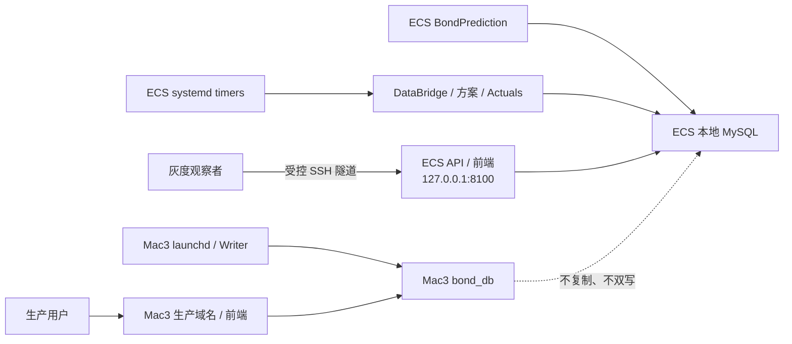

# 阿里云 ECS 独立灰度运行与迁移交接

**文档状态**：`CURRENT`

**最后核验日期**：2026-08-20

本文是 ECS 灰度运行、双主机 release 治理和未来生产切换边界的当前入口。迁移实施过程、旧候选、
一次性验收脚本和逐次运行证据不保留在工作树；需要追溯时使用 Git、systemd/launchd journal、数据库
审计和目标机 root-only evidence。

## 1. 当前结论

- ECS 独立灰度部署已经完成：独立 MySQL、增量数据链、DataBridge、三套 Python 环境、Backend、
  daily/weekly/monthly/Actuals 和五个 systemd timer 均已落地。
- Mac3 immutable release 解耦已经完成：生产应用从不可变 `current` 启动，运行配置、日志、DataBridge
  状态和第三方 cache 位于 release 外，生产进程不再依赖 Git 开发工作区。
- Mac3 与 ECS 当前运行同一精确 R2 source release；`codex/develop` 是唯一活动集成分支，不维护环境
  专用长期分支。
- Mac3 继续承载生产域名、生产数据库和 Writer；ECS 只监听 loopback，独立运行和观察，不接生产流量。

因此本轮“ECS 灰度部署 + 双主机单一 source release 治理”已经闭环。未来把域名或 Writer 切到 ECS
是新的生产项目，不属于本轮完成条件，也未由本轮授权。

## 2. 双主机运行边界



- 两端各自维护数据库、DataBridge、Registry、run、prediction、调度状态和回滚指针。
- ECS 不是 Mac3 热备或共享数据库节点；本阶段不安装生产 Nginx/TLS，不修改 DNS 或安全组公网入口。
- 仓库模板只表示期望配置。Mac3 的现场 authority 是 installed plist 与 `launchctl`；ECS 的现场
  authority 是 installed unit/timer 与 `systemctl`。
- 灰度健康不会自动授权切流；Web、Writer、数据库 authority、域名、窗口和回滚范围必须分别评审。

## 3. 当前部署基线

两端当前精确 release 为：

```text
tag:     mac3-immutable-r2-20260820
commit:  e692285d47e41c384dc915758abe0c51f9ac3aaf
archive: 9b414792f51f5a47fda46ae403dfdf5f8909fdebe511512fd4cead36f666dac4
```

| 范围 | ECS | Mac3 |
|---|---|---|
| 角色 | 独立灰度实验室 | 当前生产 Web / DB / Writer |
| 控制面 | systemd one-shot + timer | launchd one-shot + plist |
| Backend | `127.0.0.1:8100` | 生产域名现有入口 |
| release | `/opt/bond-factor-lab/current` | `/Users/macstudio0/bond-factor-lab-production/current` |
| 外置状态 | `/var/lib/bond-factor-lab/state` | `/Users/macstudio0/bond-factor-lab-runtime` |
| 本机配置 | root-only database env | `runtime/config/service.env` |
| Git 工作区 | 无 | `/Users/macstudio0/bond-factor-lab`，仅开发使用 |

ECS 使用 conda-forge-only 的 service、forecast 和 Blackbox 环境；BondPrediction requirements 已包含
`cryptography`。ECS discovery 为 56 active base / 60 active composite，9 个 Mac-only base 不进入
ECS runner。两端 release 的环境差异只由部署模板、目标矩阵和平台依赖 manifest 表达，不复制
scheduler、repository、算法或 scheme config。

## 4. 调度与运行上限

| 职责 | ECS 触发 | 总时限 |
|---|---|---:|
| DataBridge | 每日 06:30 | 1 小时 |
| daily | 工作日 07:03 | 2 小时 |
| weekly | 周六 11:30 | 2 小时 |
| monthly | 自然月 15 日 18:00 | 2 小时 |
| Actuals | 每日 08:30、19:00、23:45 | 1 小时 |

五个 timer 均为 `Persistent=false`，停机或禁用期间不补跑。已用冻结同源数据、隔离数据库和热缓存
副本按 installed one-shot 语义模拟完整调度：daily、weekly、monthly 和 Actuals 全部成功，daily 墙钟
约 62 分钟，低于两小时硬限；7 个 Liwei cache family 均走有限 suffix，未发生 full build。隔离库、
缓存副本、临时环境和 transient unit 已删除。该结果替代“等待五个自然日”作为本轮部署验收门，
自然 timer 继续承担日常运行与监控。

## 5. 数据修订与缓存规则

- 已写入 `t_scheme_predictions` 的历史预测表达当时可用数据下的决策，事后数据修订不得回写。
- Phase-A cache 是未来预测的内部加速状态，可以在安全边界内更新。
- 普通同结构数值修订只有在 spec 携带 canonical dependency proof 时才能重算有限 suffix；
  `safe_lookback=max(horizon, purge_gap)`，当前十个 Liwei adapter 的边界为 5 个交易日。
- suffix 之前的 cache 必须保持 parent digest 不变；受影响 suffix 必须通过 cold equivalence 和 lineage。
- 算法、spec、ABI、publisher、schema、字段类型、历史日期删除、交易日或 date-to-week 结构变化仍然
  full/fail-closed，不得伪装成增量成功。

实现继续复用 `build_mode=suffix`、manifest、CompareGate、acceptance lineage 和 `current.json` 原子
发布；不增加 revision ledger、数据库表、后台服务、第二套 cache 或算法分支。

## 6. Immutable release 与本机配置合同

`scripts/build_source_release.py` 只从 clean HEAD 生成 deterministic archive；目标机使用候选同版本的
`scripts/install_source_release.py` 校验 archive、manifest 和 source digest，并通过
`expected-current` compare-and-swap 更新 `current/previous`。release 目录无 `.git` 且只读，目标机
不得 `git pull` 或现场修改。

Mac3 的 `runtime/config/service.env` 是唯一生产应用本机配置 authority；Git 根 `.env` 只服务开发。
两者仅首次迁移时复制一次，此后不自动同步。launcher 使用目录 fd、`O_NOFOLLOW`、owner/mode、
语法、保留键和必要变量检查后才加载配置；任何 `PYTHON*`、release 身份或控制面覆盖均 fail-closed。
真实 secret 不写入 Git、release manifest、plist、日志或审计 JSON。

以后每次 release 更新仍按以下最小顺序执行：

1. clean HEAD 构建并固定 commit、tree 和 archive SHA-256；
2. 目标机只读预检和只读预安装；
3. 候选 Backend、DataBridge check-only 和 release identity 验证；
4. 在独立授权窗口执行 `current` CAS、替换 installed 配置并重载；
5. 读回健康、source identity、loaded state、调度空闲状态和 tunnel；
6. 保留可用 `previous`、installed 配置备份和运行审计。

具体工具、环境合同和 drift audit 见 [`deploy/README.md`](../../deploy/README.md)。

## 7. ECS 只读接手检查

执行前使用受控 SSH 和严格 Host Key 校验：

```bash
readlink -f /opt/bond-factor-lab/current
readlink -f /opt/bond-factor-lab/previous

systemctl list-timers 'bond-factor-lab-*' --all
systemctl show bond-factor-lab-prediction-daily.service \
  -p ActiveState -p SubState -p Result -p ExecMainStatus \
  -p ExecMainStartTimestamp -p ExecMainExitTimestamp

curl --fail --silent http://127.0.0.1:8100/api/health

cd /opt/bond-factor-lab/current
env BFL_DATABASE_ENV_FILE=/etc/bond-factor-lab/bond-factor-lab.env \
  PYTHONNOUSERSITE=1 PYTHONDWRITEBYTECODE=1 \
  /opt/miniconda3/envs/bond_factor_lab_service/bin/python \
  scripts/check_production_daily_health.py --predict-date YYYY-MM-DD --strict-runs
```

出现任务超时/failed、残留 running、预测缺失或重复、DataBridge 日期/摘要不一致、cache lineage 拒绝、
source digest 漂移、Backend 不健康、timer 漂移或磁盘不足时停止外推结论。数据库 schema、Registry、
业务数据、unit/timer、Nginx 或 DNS 的修改必须另行设计和授权。

## 8. 回滚与长期保留边界

- 回滚同时考虑 source release、installed 控制面和外置状态；只切代码 symlink 不是完整回滚。
- 对已经发布 proof-bearing suffix generation 的 family，回滚旧代码时必须恢复发布前保存的 7 个
  `current.json` parent pointer。
- 回滚不得删除 run、prediction、日志或失败 evidence，不得修改历史预测伪造成功。
- `master` 保持冻结备份，未经授权不得移动；日常修改只进入 `codex/develop`。
- 仓库只保留通用 release/launchd/systemd/cache 回归测试。一次性迁移脚本、候选专项测试、时点报告
  和已完成实施计划不得重新进入工作树；需要追溯时使用 Git 和现场审计证据。
