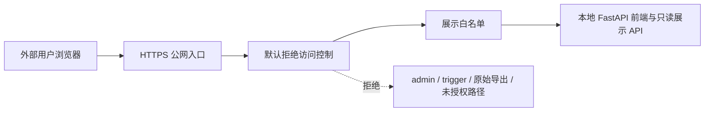
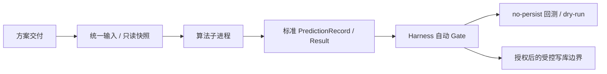

# Bond Factor Lab 灰度实验室说明手册

**文档状态**：`CURRENT`

**目标读者**：外部客户、业务负责人、合作方

**最后核验日期**：2026-08-02

**文档定位**：只读说明手册，不是生产晋级 SOP，不包含交易建议或收益承诺。

## 1. 灰度实验室定位

Bond Factor Lab 灰度实验室是一个国债因子方案的回测与实盘观察平台。它用于把不同预测方案放在统一任务格子下比较，展示历史回测、灰度实盘和正式实盘的预测方向、验证结果与准确率指标。

灰度实验室重点回答三个问题：

- 某个国债期限和任务类型下，目前有哪些候选方案。
- 每个方案在历史回测和实盘观察中的方向预测表现如何。
- 这些展示结果是否来自统一口径、只读访问和受控写库边界。

页面中的“涨 / 跌 / 平”指目标国债活跃收益率方向。“平”表示没有方向性信号或方向为平，不等同于预测正确或错误。

## 2. 页面功能导览

灰度实验室前端以“任务格子”为主线组织信息。一个任务格子由 `Y 标的 + 任务类型` 定义，例如 `10Y国债活跃 · 周度` 或 `5Y国债活跃 · T+5`。

### 2.1 任务格子矩阵

矩阵行是国债期限标的，当前包括 `1Y / 3Y / 5Y / 7Y / 10Y`。矩阵列是任务类型：

| 列 | 含义 |
|---|---|
| `T+1` | 预测下一交易日收益率方向 |
| `T+5` | 预测后续第五个交易日收益率方向 |
| `周度` | 预测下一周关键观察点方向 |
| `周平均` | 预测下一周平均收益率相对当前周平均的方向 |
| `月度` | 预测下月观察点相对本月观察点的方向 |

每个格子展示该任务下的最优指标和候选方案数量。点击格子后，下方排行与详情会切换到对应任务。

### 2.2 筛选与排行

页面支持按数据来源和月份区间筛选：

- `回测+实盘(全部)`：合并展示历史回测和实盘观察。
- `仅回测`：只看历史复现结果。
- `仅实盘`：只看灰度实盘和正式实盘记录。

排行可以按整体准确率、上涨准确率或下跌准确率排序。候选方案表展示排名、方案名称、区间准确率、样本数、上涨/下跌准确率、部署时间和备注。准确率括号中的 `正确数/指标分母` 是实际参与准确率计算的方向样本数，不一定等于样本总数。

### 2.3 方案详情

选中某个方案后，页面展示月度指标表、趋势图和明细入口。

月度指标表包括：

- 样本数。
- 真实涨/跌/平分布。
- 预测涨/跌/平分布。
- 整体准确率。
- 上涨准确率、上涨召回率。
- 下跌准确率、下跌召回率。
- 每日或周度验证明细入口。

趋势图展示所选方案在各月份的指标变化。在“全部”口径下，页面会在回测与实盘的交界处插入“实盘”分隔线，避免把历史回测和实盘观察混为同一段。

### 2.4 每日 / 周度验证明细

点击月度表中的日历按钮，可以打开验证明细。明细展示：

- 预测日：信号发出日。
- 目标日或目标周：用于验证的目标日期或目标周。
- 预测方向。
- 实际方向。
- 结果。

结果列的含义：

| 展示 | 含义 |
|---|---|
| `✓` | 有方向预测，且与实际方向一致 |
| `×` | 有方向预测，但与实际方向不一致 |
| `-` | 预测为“平”，不进入准确率分母 |
| `?` 或待验证 | 目标实际值尚未覆盖，暂不计入准确率 |

“待验证”通常表示目标日或目标周的实际收益率数据还没有到达，不代表预测失败，也不代表页面刷新异常。

## 3. 指标口径

灰度实验室把“展示样本数”和“准确率分母”明确分开。

| 名称 | 含义 |
|---|---|
| 样本数 | 已经可评价的预测记录总数，包含预测为“涨 / 跌 / 平”的记录 |
| 指标分母 | 只包含预测为“涨”或“跌”的方向样本，不包含“平” |
| 正确数 | 在指标分母内，预测方向与实际方向一致的样本数 |
| 整体准确率 | `正确数 / 指标分母` |
| 上涨准确率 | 预测为上涨的样本中，实际也上涨的比例 |
| 上涨召回率 | 实际上涨的样本中，被预测为上涨的比例 |
| 下跌准确率 | 预测为下跌的样本中，实际也下跌的比例 |
| 下跌召回率 | 实际下跌的样本中，被预测为下跌的比例 |

例如某月共有 8 条已验证样本，其中 1 条预测为“平”，3 条方向预测正确，4 条方向预测错误，则页面展示：

- 样本数：`8`
- 整体准确率：`3/7`

这里不是 `3/8`，因为预测为“平”的样本只参与样本数和方向分布，不参与准确率分母。

## 4. 日期与实盘阶段

灰度实验室统一使用三个日期字段：

| 字段 | 含义 |
|---|---|
| `predict_date` | 信号发出日 / 调度运行日 |
| `feature_date` | 数据截止日 / 预测站位日，模型只能使用该日及以前允许可见的数据 |
| `target_date` | 验证目标日，用于 actual join、去重和月度归属 |

`feature_date` 是对外解释“模型站在什么时候看数据”的标准字段。历史遗留或算法内部可能出现 `anchor_date`，但前端和业务说明不依赖它。

平台区分三类记录：

| 类型 | 阶段标识 | 典型含义 |
|---|---|---|
| 历史回测 | 不写实盘阶段 | 用历史样本复现方案表现，写入独立回测结果 |
| 灰度实盘 | `gray_live` | 受控补齐或部署观察期的实盘记录 |
| 正式实盘 | `scheduled_live` | scheduler 在真实时钟自然触发生成的实盘记录 |

灰度实盘也是实盘观察区，但它不等于正式调度自然发出。对日频任务，典型关系是：

```text
predict_date = T + 1
feature_date = T
target_date  = T + horizon
```

历史回测则保持：

```text
predict_date = feature_date = T
target_date  = T + horizon
```

前端按 `target_date` 把样本归属到月份。这样可以保证回测、灰度实盘和正式实盘在同一个展示矩阵里比较时，月份归属一致。

## 5. 沙盒化说明

灰度实验室的“沙盒化”不是一句宣传语，而是由访问、数据、执行和写库边界共同构成。

### 5.1 访问沙盒：公网只读展示

当灰度实验室通过公网路径开放时，目标访问路径为：

```text
https://bond.finailab.cn/bond-factor-lab/
```

公网入口采用默认拒绝策略，只放行渲染页面必需的最小集合：

| 类型 | 允许内容 |
|---|---|
| 静态资源 | 页面、CSS、JS、图片等前端资源 |
| 只读展示 API | `/api/factor-lab/dashboard` |
| 健康检查 | `/api/health` |

旧 `/api/schemes`、`/api/metrics/{registry_scheme_id}` 和
`/api/backtests/factor-lab` 只在公网 rollout 兼容阶段临时放行；final 配置必须拒绝。
FastAPI 本机仍保留这些路由用于 Harness 与回滚，但它们不属于最终公网白名单。

公网入口不开放以下能力：

- 触发预测。
- 同步或管理 Registry。
- 导出原始逐条预测。
- 导出原始 actual 明细。
- 读取回测 run 明细、diff 或数据检查接口。
- 访问未列入展示白名单的其他路径。

典型拒绝路径包括：

| 类型 | 路径 |
|---|---|
| 触发预测 | `POST /api/schemes/{scheme_id}/trigger` |
| 管理接口 | `POST /api/admin/registry/sync` |
| 原始预测导出 | `GET /api/predictions` |
| 原始实际值导出 | `GET /api/actuals` |
| 标的注册表导出 | `GET /api/targets` |
| 回测运行明细 | `GET /api/backtests/runs*` |
| 回测数据检查 | `GET /api/backtests/data-checks` |

访问链路可以概括为：



需要客观说明的是：前端是客户端渲染，展示页面所需的 JSON 会被浏览器请求，因此用户可以在浏览器开发者工具中看到这些展示数据。当前只读沙盒的边界是“公网暴露面收敛到页面展示所需的最小只读集合”，不是对已展示结果本身做加密隐藏。

### 5.2 数据沙盒：统一输入入口与只读快照

算法不能随意拼接数据库输入。平台规定算法输入只能通过统一输入入口生成：

- Native V1 存量方案通过统一输入 artifact 读取平台准备好的数据。
- Blackbox V2 新方案通过 DataBridge 三频快照读取 `daily / weekly / monthly` 三类只读 CSV。

Blackbox V2 的一次运行使用临时只读 Snapshot。平台在共享锁内复制同代三频文件，生成 `data_snapshot_id`，并把 `predict_date / feature_date / target_date` 及三频截止键作为 Request 交给算法。算法只需要读取快照和 Request，不直接访问业务数据库。

这保证了两个关键边界：

- 每次运行看到的是一份固定输入，不会在运行中被 current 数据替换。
- 算法只能按 `feature_date` 及平台提供的截止键理解数据可见性，不能自行把未来数据纳入当前预测。

### 5.3 执行沙盒：子进程、Gate 与 no-persist

平台把算法执行与业务写库分开：



自动 Gate 的固定顺序是：

```text
static -> input -> unit -> dry-run -> compare -> backtest -> api-readiness
```

自动段可以留下审计报告和控制面记录，但不得写正式预测表、正式回测结果表或 active 前端可见状态。`dry-run` 和 `no-persist` 的目的就是在不产生业务副作用的情况下验证结构、日期语义、确定性和结果格式。

真正的业务写入只允许发生在受控边界：

- scheduler 预测写库边界。
- actuals updater 实际方向写库边界。
- backtest repository 历史回测写库边界。
- 明确授权的管理动作。

### 5.4 当前沙盒与生产边界

Blackbox V2 已具备受控的生产路径，包括严格 Result 校验、文件读取 allowlist、最小环境变量、专用 Activation/Live 门禁、回测持久化和失败 reconciliation。自动 Gate 仍然只完成技术验收，不会自动写业务表或授予生产权限。

单个方案只有完成生产准备核验并取得专项授权后，才可进入 `active`、持久化回测或 live。当前已有真实方案完成专项生产灰度，但平台仍缺少日、周、月多种真实交付覆盖，因此不能把单方案结论扩大为所有 Blackbox V2 方案已普遍生产稳定。最新结论统一查看[当前状态](../CURRENT_STATUS.md)。

## 6. 生命周期与状态解释

### 6.1 方案运行时

平台支持两类运行时：

| 运行时 | 定位 | 当前政策 |
|---|---|---|
| Native V1 | 存量方案维护 | 只维护政策清单中的既有方案 |
| Blackbox V2 | 新增方案唯一入口 | 默认技术验收；生产运行须逐方案完成准备核验和专项授权 |

Native V1 和 Blackbox V2 从标准预测记录开始共用 Registry、actual join、指标、API 和前端展示。运行时差异只存在于交付检查、输入准备和算法执行方式。

### 6.2 Registry 状态

前端只展示 `active` 的业务方案。`paused` 和 `archived` 只用于管理或审计，不进入当前前端矩阵，也不允许公网触发。

业务方案 ID 使用 composite 形式，例如：

```text
{base_scheme_id}__h{horizon}__{target_tenor}
```

外部用户通常不需要记住这个 ID。页面会使用中文展示名、任务格子和方案名称帮助识别。

### 6.3 常见状态不要混用

| 表述 | 准确含义 |
|---|---|
| `active` | 前端和业务 API 可见，可按当前规则参与展示或调度 |
| `paused` | 暂停，不进入当前前端业务矩阵 |
| `shadow` | 技术登记和审计状态，不等于生产上线 |
| `gray_live` | 灰度实盘观察记录，不等于正式 scheduler 自然发出 |
| `scheduled_live` | 正式 scheduler 自然触发的实盘记录 |
| `GRAY_LAB_READY` | 可安排灰度实验室内 no-persist 预测、回测和对照实验；不等于 `gray_live` |
| Gate 通过 | 技术验收通过；不等于算法收益承诺或生产晋级完成 |

## 7. 如何读一个任务格子：示例

以 `10Y国债活跃 · 周度` 为例：

1. 在任务格子矩阵中点击 `10Y` 行和 `周度` 列的格子。
2. 在月份筛选中选择需要观察的区间。
3. 在口径筛选中选择 `回测+实盘(全部)`、`仅回测` 或 `仅实盘`。
4. 在排行表中查看候选方案数量、区间准确率和样本数。若样本较少，应优先把它视为观察样本，而不是稳定结论。
5. 点击某个方案后，查看月度指标表和趋势图。
6. 如果图表中出现“实盘”分隔线，分隔线前后分别是历史回测和实盘观察，不能混称。
7. 点击某个月的日历按钮，查看该月全部周度预测明细。
8. 若某行结果为 `?` 或待验证，先看目标周实际值是否已经到达；不要直接判断为模型错误。
9. 若某行预测为“平”，结果列显示 `-`，它计入样本数，但不进入准确率分母。

## 8. 边界与免责声明

灰度实验室用于观察和比较国债因子预测方案，不构成交易指令、投资建议或收益承诺。

需要特别避免以下误读：

- 不能把 Blackbox V2 的 shadow 验收写成已生产上线。
- 不能把 `GRAY_LAB_READY` 写成已经产生 `gray_live` 记录。
- 不能把 `gray_live` 写成正式 scheduler 自然发出的 `scheduled_live`。
- 不能把 Gate 通过写成算法一定有效或已完成生产晋级。
- 不能把 source benchmark 和 live 记录在不同执行口径下强行宣称“数值完全一致”。
- 不能把“待验证”理解为预测错误；它通常只是 actual 水位尚未覆盖。
- 不能把预测为“平”的样本计入准确率分母。

如需对外报告某个方案的阶段、样本数或准确率，应同时说明：

- 任务格子：例如 `10Y国债活跃 · 周度`。
- 数据口径：回测、灰度实盘、正式实盘或合并。
- 时间区间：起始月份和结束月份。
- 样本数与指标分母。
- 是否存在待验证样本。
- 是否跨过回测与实盘分隔线。

## 9. FAQ

**Q：灰度实验室是不是生产系统？**
A：它是回测和实盘观察平台。部分方案可以经过独立授权进入 active 和生产灰度，但单个方案的授权不能写成整个平台或所有 Blackbox V2 新方案都已完成生产晋级。

**Q：为什么公网说只读，但浏览器还能看到 JSON？**
A：页面是客户端渲染，展示所需 JSON 必须被浏览器读取。只读边界的含义是公网只放行展示所需的最小只读 API，不开放原始导出、管理或写库接口。

**Q：为什么样本数和准确率括号里的分母不一样？**
A：预测为“平”的样本计入样本数和方向分布，但不进入准确率、上涨准确率、下跌准确率等指标分母。

**Q：待验证是不是预测错了？**
A：不是。待验证表示目标实际方向还没有可用数据，暂时不计入准确率。

**Q：回测和实盘可以直接合并看吗？**
A：页面可以合并展示，但会保留实盘分隔。对外解读时必须说明区间中哪些属于回测，哪些属于灰度或正式实盘。

**Q：Gate 通过是不是说明方案已经上线？**
A：不是。Gate 通过只表示技术检查通过。是否进入 active、live 或生产调度，还需要满足生命周期、授权和生产准备条件。

**Q：客户能从公网触发预测吗？**
A：不能。公网入口不放行 trigger/admin 接口，管理写接口还需要本地后端管理员令牌作为第二道闸。

## 10. 内部事实源

本文依据仓库当前文档整理，主要事实源包括：

- `docs/README.md`
- `docs/CURRENT_STATUS.md`
- `docs/architecture/ARCHITECTURE.md`
- `docs/architecture/PREDICTION_SEMANTICS.md`
- `docs/architecture/HARNESS_ARCHITECTURE.md`
- `docs/architecture/BLACKBOX_V2_PLATFORM.md`

若本文与上述 CURRENT 文档或机器契约冲突，应优先核对机器契约和 CURRENT 文档，并更新本手册。
