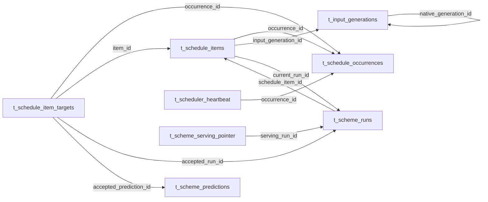

# G8.0：replay / ledger / legacy 最终退役事实与决策矩阵（2026-08-06）

**文档状态**：`HISTORICAL`

**性质**：只读设计记录；其中的“候选建议”尚未获得用户确认，不构成已批准的目标状态、DDL、生产操作或 installed plist 结论。

**范围**：仅依据仓库静态证据梳理 replay、daily ledger、legacy mode、`schedule_item_id`、migration 019、相关消费者/外键及仓库 launchd 模板。未读取数据库、installed plist、`launchctl`、服务日志或业务数据；未执行 DDL、写库、launchd 操作或代码改动。

## 1. 结论边界与证据等级

### 1.1 已确认的仓库事实

- [事实] [生产调度治理](../../architecture/PRODUCTION_SCHEDULING_GOVERNANCE.md)与根规范一致：`launchd + installed plist` 是唯一生产调度控制面；仓库 plist 只是 desired state；daily ledger、occurrence、epoch 和常驻 scheduler 不得作为新的或过渡生产路径。
- [事实] [launchd one-shot runner](../../../scheduler/launchd_prediction_runner.py)不保存 cron、ledger、occurrence 或 startup catch-up 状态；它以 `scheduled_live + launchd_one_shot` 调用 `scheduler.executor.execute_scheme()`。
- [事实] [repository](../../../scheduler/repository.py)明确允许 `launchd_one_shot` 的 `scheduled_live` run 没有 `schedule_item_id`，并拒绝其它无 ledger item 的 `scheduled_live` 路径。
- [事实] `scheduler/daily_ledger.py`、`scheduler/daily_coordinator.py`、`scheduler/daily_runtime.py`、`scheduler/scheduled_executor.py` 和 `scheduler.repository` 的 ledger 专属分支仍存在；它们是当前仓库消费者，不可在无替代/无测试的情况下删除。
- [事实] `harness/daily_real_replay.py`、`harness/daily_real_replay_operator.py`、`harness/daily_real_replay_mysql.py` 仍构成隔离 replay 闭包：它们要求受保护的 loopback 临时 MySQL、冻结 generation、专用 epoch 和严格 quiescence；不把 replay 描述为生产 scheduler。
- [事实] `migration 019` 的 SQL 是 `DROP TABLE t_scheme_serving_pointer`。其 runner 会验证旧表定义、外键、外部对象、018 的 `started_at` 目标形状并读取 row count；该 source 分类只要求 row count 是非负整数，并**不**要求为零。

### 1.2 本文不能建立的现场事实

| 未知事项 | 为什么仓库不能证明 | 后续只能由何种证据建立 |
|---|---|---|
| installed legacy plist 是否存在、内容为何、是否 loaded、是否自然触发过 | `deploy/launchd/` 是 desired template，当前仓库也没有已安装目录快照 | 经单独授权的 operator 只读记录：installed 文件身份/摘要、loaded state、对应日志和 run/prediction 的相互一致性 |
| 017/018/019 是否已应用或处于 `APPLYING` | release manifest 仅约束期望文件与 checksum | 受控 migration CLI 的只读 inspect 输出；不得在本设计工作流中连接或查询现场 DB |
| ledger 表、`schedule_item_id`、serving-pointer 表的实际行数和引用闭包 | SQL 定义不能说明数据是否为空、是否被历史审计依赖 | 经授权的只读 schema/data inventory，输出必须脱敏且不包含 DSN、UUID、token 或业务明细 |
| serving-pointer 的 view/trigger/routine/event 或 inbound FK 是否存在 | runner 具备检查逻辑，但未运行检查 | 019 专用只读 inspection；若任一对象存在，当前 019 必须 fail-closed |
| replay 是否仍具业务恢复价值 | 仓库能证明能力与约束，不能证明未来 operator 需求 | 用户确认保留目的、最大使用场景、允许的隔离边界和复核责任 |

### 1.3 本稿中的词义

- **事实**：可由当前仓库文件直接复核的定义、引用或约束。
- **推论**：由多个事实得出的风险或依赖关系，明确不等同于现场状态。
- **候选建议**：G8.1 前供用户确认的方向；不表示已经批准或可以执行。

## 2. 关系图：ledger 退役必须先处理的引用闭包

下图箭头表示 017 所定义的子表 FK 指向父表；它是仓库 schema 事实，不表示这些对象已经存在于任何现场数据库。

- [事实] `t_schedule_items.current_run_id → t_scheme_runs` 与 `t_scheme_runs.schedule_item_id → t_schedule_items` 形成双向引用；不能按“先删一个表”处理。
- [事实] `t_schedule_item_targets` 还引用 accepted run 和 accepted prediction；这些 run/prediction 是业务审计记录，不能因 ledger 清理而删除或重写。
- [推论] 如果现场存在非空 ledger，安全退役必须先冻结/导出完整引用闭包，再以经过验证的 archive/reference 解除 FK；单独 `DROP TABLE` 会丢失可追溯性或被 FK 阻断。

## 3. 逐项事实与候选决策矩阵

| 对象/范围 | 事实：当前定义与仓库消费者 | 事实：历史审计价值 / 生产影响 | 候选建议（未确认） | 保留或迁移边界 | 后续授权 |
|---|---|---|---|---|---|
| 隔离 real replay：`harness/daily_real_replay.py`、`daily_real_replay_operator.py`、`daily_real_replay_mysql.py` | replay 创建带专用 namespace 的 occurrence，只接受已验证的隔离 Engine 和冻结 generation；operator 有只读 control-plane/quiescence preflight；临时 MySQL 不读取生产 env、不应用 migration。它仍直接依赖 daily policy、ledger repository API、coordinator/epoch 和 `daily_control_plane_probe`。 | 它保留了一条严格隔离的“真实联跑/恢复诊断”能力；不是自然 `scheduled_live` writer。operator 的当前预检仍把旧 LaunchAgent labels 与 `legacy` mode 当作边界条件。 | **isolated recovery**。保留恢复/诊断目的，但把它明确为单独的隔离资产，不是 production control plane。 | 先把它所需 policy、ledger 领域模型、schema fixture、process probe 和 operator contract 收敛到隔离闭包；不得依赖 production ledger 表、production epoch 目录或已安装 legacy agent 才能启动。 | 用户确认 replay 的保留目的；任何实际 replay、临时 MySQL 启动、installed-state 读取或 source DB 预检均另需专项操作授权。 |
| 生产侧 ledger runtime：`scheduler/daily_ledger.py`、`daily_coordinator.py`、`daily_runtime.py`、`scheduled_executor.py` 及 `repository` 中 occurrence/item/attempt API | 这些模块冻结 Registry、生成 occurrence/item/target、claim/retry/fence/heartbeat 并写 ledger；`daily_runtime.main()` 仅接受 `ledger` mode。当前仓库的目标 prediction plist 不调用这些入口。 | 提供旧日批的 SLA、重试、进程 fence 和 historical run 解释；继续保留会维持第二生产控制面代码面。 | **migrate**，随后 retire production-facing consumers。 | 若保留 real replay，只迁移其必要的最小闭包到 isolated recovery；其余 production scheduler、watchdog、retry、heartbeat 和 legacy occurrence 入口必须在替代验证后删除。不得新增 ledger 过渡路径。 | G8.0 决策批准后的 repo-only 实施授权；若要修改任何运行进程、另需独立运行时授权。 |
| 日频 policy / direct authority / capacity：`deploy/daily_scheduler_policy_v1.json`、`v2.json`、`scheduler/daily_policy.py`、`daily_direct_authority.py`、`capacity_candidate_runtime.py`、`capacity_attestation.py` | policy V1 选择 `legacy_automatic`，V2 选择 `daily_ledger`；direct authority 仍加载 V2；capacity candidate 固定要求 ledger schema、017–019 migration 集和 epoch artifacts。 | 这些文件保留旧 capacity/identity 审计证据；同时它们会把日常 code path 绑定到 ledger schema，阻止真正的 schema 退役。 | **migrate**。 | 拆分“仍需的 input/cache/identity 规则”与“ledger occurrence/SLA 规则”；后者只能进入 isolated replay fixture 或归档，不能继续作为 launchd one-shot 的生产 prerequisite。 | 用户确认新 launchd-only authority 的最小语义；repo-only 测试批准。 |
| `BOND_DAILY_COORDINATOR_MODE`、`shared/daily_coordinator_mode.py`、rollout/epoch JSON、`shared.data_bridge.refresh/authority.py` | mode 合法值仍为 `legacy`/`ledger`；无 epoch chain 时 repository bootstrap 强制 `legacy`。DataBridge refresh 总会读取 coordinator identity；`ledger` 才要求 occurrence-bound publication capability，legacy 路径可返回无 capability。仓库 backend template 显式设置 `legacy`。 | **推论**：legacy 不授予 scheduler 权，但它仍是 DataBridge publication/epoch 分支的兼容条件；直接删除会改变 refresh 和 manifest authority 语义。 | **migrate**，不能直接 retire。 | 先以 launchd one-shot 的独立、可验证 publication identity 替代 legacy/epoch 分支，并覆盖 DataBridge current manifest、strict reader、backend/direct/gray 行为；Native 子进程现有 strip 仅是纵深隔离，不是完整迁移。 | 明确的 runtime semantics 决策；任何已部署环境变量、服务重启或 installed template 替换另需生产授权。 |
| Blackbox admission vocabulary：`scheduler/blackbox_scheduler_admission.py`、`deploy/blackbox_scheduler_admission_v1.json`、相关测试 | 枚举仍接受 `legacy_automatic`、`daily_ledger`、`direct_scheduled`、`launchd_one_shot`。一部分历史 formal identity 仍列 legacy/ledger capability；G3.1 的五个 exact identity 已被测试锁为 launchd-one-shot only；灰度 10Y 条目仍仅列 daily-ledger capability。 | capability 是业务准入语义，不是无害字符串；残留 capability 可能让旧 policy 继续选择本不应成为生产路径的 identity。 | **migrate**。 | 先按精确 identity 逐行确认哪些仅需 `launchd_one_shot`、哪些必须保持 `direct_scheduled` 的手动语义、哪些应为零 capability；然后在 admission code、JSON、policy 和 tests 中原子移除旧词。不得把 gray 或 direct 权限偷换成 launchd admission。 | 用户确认每个 exact identity 的目标 capability；repo-only 变更与契约测试授权。 |
| `t_input_generations` 与 self FK | 虽由 017 创建，但 `scheduler.repository`、input artifacts、native/DataBridge generation、gray-gap lineage 均读取/写入它；它还有 `native_generation_id` 自引用。ledger items 只是在其上增加一个 inbound FK。 | generation 的 sealed/invalidated lineage 是输入截止与审计的一部分，不等同于 ledger occurrence。 | **retain**。 | 保留本表及 native parent FK；ledger 退役只能移除 `t_schedule_items.input_generation_id` 这一 consumer，不能把 generation lineage 当成 ledger 一并删除。 | 未来 DDL 前的外键/行数只读 inventory；任何 schema 改动需单独 DDL 授权。 |
| `t_schedule_occurrences` | 保存 schedule key、日期、policy JSON/digest、completion/SLA/failure 状态；被 items、targets、heartbeat 引用。repository、daily runtime、control-plane probe 和 replay operator 都使用它。 | 是旧调度决策与 SLA 的历史审计主体；不是当前 launchd one-shot 所需的自然 writer 记录。 | **migrate**，再 retire。 | 先形成不可变 archive：主键、policy JSON/digest、日期、终态、时间字段和引用映射都需保持；archive 必须能按旧 occurrence 复核关联 run/target，且不得转写为新的 production ledger。 | 用户确认 audit retention 年限/存储位置；DB archive + DDL 专项授权。 |
| `t_schedule_items`、`t_schedule_item_targets`、`t_scheduler_heartbeat` | items 保存冻结身份、generation、状态、attempt/current run；targets 保存 accepted run/prediction receipt；heartbeat 保存旧 owner 状态。它们与 occurrence、run、prediction、generation 组成 FK 闭包。 | items/targets 提供“哪个旧计划接受了哪条 prediction”的解释；heartbeat 仅反映旧进程控制面。 | **migrate**，再 retire。 | archive 必须保留所有原始主键、FK 映射、accepted receipt、状态与摘要；heartbeat 可独立列为低优先级历史附件，但不得在没有闭包校验时先删 parent。 | 与 occurrence 相同的 DB/审计授权；额外需要 archive restore/readback 验收。 |
| `t_scheme_runs.schedule_item_id`、`uk_scheme_runs_schedule_attempt`、`fk_scheme_run_schedule_item` 及同批调度字段 | `schedule_item_id` 是 run→item FK；repository 的 ledger 专属完成/失败路径以它作 fence。`attempt_no`、`trigger_origin`、`queued_at`、`execution_token`、process fields 与 017 同批引入；而 launchd-one-shot `scheduled_live` 明确要求 `schedule_item_id` 为 null。 | run 和 prediction 本身仍是平台审计资产；删除 ledger linkage 不能删除、覆盖或重新编号 `t_scheme_runs` / `t_scheme_predictions`。 | **migrate**（先处理 linkage）；其它同批字段逐列分类，不能凭同一 migration 出身一并删除。 | 先把非空 `schedule_item_id` 的 run 与 archive item/target 映射可逆地固化；再解除双向 FK、唯一索引和 ledger-only guard。`failure_code` 不应自动视为 ledger-only，需单独证明无非 ledger consumer 后才处理。 | DB inventory、archive parity/readback、DDL 专项授权。 |
| `scheduler.repository` 的 frozen-key guard、generation reclaim 查询、ledger-only API | repository 仍会查询 ledger targets 以阻止 generic/gray mutation 绕过冻结 key，并会用 items 判断 generation 是否可回收；scheduled completion API 也读取 `schedule_item_id`。 | 这些是当前 remaining code consumers；若先删 schema，普通 prediction 或 generation cleanup 可能运行时报错或失去正确 guard。 | **migrate**。 | 以不依赖 ledger 的 normal business-key uniqueness/insert-only 验证替代 frozen-key guard；generation reclaim 仅检查保留的 generation/archival引用；迁移后保留 fail-closed，而不是静默跳过检查。 | repo-only 实施、repository contract tests；DB schema 变更另行授权。 |
| `scheduler/daily_control_plane_probe.py` 与 replay operator 的 installed-label/mode 假设 | probe 是 replay-only consumer；它会检查 `backend`、旧 `scheduler`、旧 `v2-preflight` labels，并让 operator 预检要求这些 installed plist 均为 legacy。当前仓库没有后两者的 desired templates。 | **推论**：此假设与 launchd-only desired state 不兼容；保留 replay 不等于保留或重装旧 agent。 | **migrate** 到 isolated recovery contract。 | 把 replay quiescence 定义为“不存在其它 writer/进程”的可证实条件，不把“旧 installed plist 仍存在且 legacy”设为前提。repo-only 先替换测试 fixture；现场只读证据以后独立采集。 | 用户确认 replay 边界；禁止借此对 installed plist 进行操作。 |
| 017 / 018 migration assets、manifest、runner 和 migration tests | release manifest、`migrations.runner`、`scripts/apply_migrations.py` 和 tests 仍将 017/018 作为历史链的一部分；018 调整 `t_scheme_runs.started_at`，019 前置其 target shape。 | 已应用 migration 文件与 checksum 是 schema history；删除或重写会破坏历史/recovery 解释。 | **retain**。 | 即使最终运行时/表已退役，保留 immutable 017/018 文件、manifest binding、runner recovery/inspect 契约和相应 tests。未来只新增 forward migration，不修改旧文件。 | 无写库的 repo-only 合约验证；生产 apply/recovery 仍须受控 CLI 和专门授权。 |
| `t_scheme_serving_pointer` | 005 定义该表及 `serving_run_id → t_scheme_runs` FK。当前应用源码无 serving-pointer 写/读 consumer；remaining references 是 019、runner、capacity artifact 与 tests。repo 不能证明数据库外部对象或数据为空。 | 表若非空可能保存旧 serving-selection 审计；019 的 source check 不会因 nonzero row count 自动拒绝 drop。 | **retire**，但仅在 archive/保留决定之后。 | 先执行 019 的只读 source/target inspection；若存在行或外部对象，先由用户决定 archive 或明确放弃。只有完整 archive/readback 或确认无审计价值后，才允许 forward DROP。 | 独立 DDL 授权；需 expected DB identity 参数但不得把值写入文档；禁止手工 SQL。 |
| migration 019、runner 019 inspection/recovery、`scripts/apply_migrations.py`、019 tests | 019 是 manifest 绑定的不可逆 forward DDL；runner 支持 APPLYING 的只读 inspect 和 digest-fenced recovery，要求 001–018 exact history、019 checksum、源/目标 closed-world state。 | 这是 serving-pointer 退役的唯一受控路径；不是 ledger 清理的一般工具，也不是运行时 admission。 | **retain**。 | 保留 SQL、manifest、runner 和 tests；不改写 migration 来“顺带”退役 ledger。若 019 已 COMPLETE，只保留 history/contract；若 APPLYING，只能先 inspect 后在新授权中恢复。 | 仅 migration 专项授权；本记录不授予 inspect、recover 或 apply。 |
| 仓库 launchd 模板：data-bridge refresh、daily/weekly/monthly predictions、actuals | 五个 scheduling template 分别调用 one-shot DataBridge、`scheduler.launchd_prediction_runner` 三个 cadence、`scheduler.actuals_runner`；均无 `BOND_DAILY_COORDINATOR_MODE`。仓库已无 daily-gray、v2-preflight、常驻 scheduler 模板。 | 这是 launchd-only desired state；不能证明 installed files、loaded state、自然执行或日志。 | **retain** 这组 desired templates，并 retain 已移除 legacy template 的仓库缺席状态。 | 不新增 legacy plist；repo template 的任何未来改动与 installed replacement 分开评审。 | repo-only 修改与 installed 变更必须分开；后者需独立生产授权。 |
| 仓库 backend template 与 installed legacy plist | backend desired template 仍显式设置 `BOND_DAILY_COORDINATOR_MODE=legacy`；installed backend 或任何 legacy plist 的实际内容/存在均未知。 | backend mode 可能维持兼容行为，但不能证明实际生产运行。物理移除 installed legacy plist 是独立的高风险操作。 | backend template：**migrate**；installed legacy plist：候选 **retire**，但现场证据不足。 | 先完成 DataBridge/epoch mode 迁移和 no-legacy regression；仅在 repo desired state 通过后，才把 installed 文件单列为最后阶段。 | 用户对每个 installed Label 的明确授权；需要 pre/post 文件摘要、loaded state、日志、run/prediction 证据和可恢复备份。 |

## 4. 迁移前的最小只读事实清单

以下清单是未来专项操作的输入，不是本任务可执行的命令清单。

1. **控制面证据**：对每个相关 installed Label，记录是否存在、文件摘要、loaded state、最近日志与其对应的 run/prediction；证明或否定同一 business key 的第二 writer。只读证据不能由 repo plist 替代。
2. **ledger 闭包**：记录五个 ledger 表的行数、非终态 occurrence/item、heartbeat、非空 `t_scheme_runs.schedule_item_id`、target 的 accepted run/prediction 引用和 `t_input_generations` 的被引用集合。内容只输出计数、hash 或受控审计附件，不泄露业务数据。
3. **schema/FK 证据**：用受控 migration inspect/fingerprint 记录 017/018/019 的 history state、ledger schema fingerprint、`t_scheme_runs.started_at` 形状、每个 inbound/outbound FK 和数据库外对象。任何定义漂移都阻断清理，而不是在现场修补。
4. **serving-pointer 证据**：取得 019 专用 inspection 的 source/target classification、row count、inbound FK、view/trigger/routine/event 结果。nonzero row count 先进入 audit archive 决策，不得隐含为“无用”。
5. **replay 价值与边界**：用户确认是否保留 isolated recovery，以及它允许使用的隔离 MySQL、source snapshot、operator 角色、保留期限和失败时的 stop 条件。若不保留，才能把其专用闭包列入 repo retire 范围。

## 5. 四个彼此独立的候选阶段

阶段按风险和依赖给出候选顺序。每个阶段都需要新的明确授权；前一阶段成功不自动授权后一阶段，也不能把本文件作为任何生产操作授权。

| 阶段 | 候选范围与停止边界 | 验证证据 | 回滚/恢复边界 |
|---|---|---|---|
| A. repo 清理与隔离闭包 | 先实现已确认的 admission vocabulary、legacy mode replacement、repo-only no-consumer checks；若保留 replay，则把它的依赖收敛为 isolated recovery。不得改 DB、installed plist、服务或 launchd。 | 单元/contract tests：launchd one-shot、admission、DataBridge authority、repository no-ledger paths、replay isolation、architecture boundaries；`git diff --check`。 | 普通 Git revert；不得用“恢复旧 scheduler”作为回滚。 |
| B. 运行时控制面语义 | 在无 installed 变更前，以只读证据确认 one-writer、无 legacy process/ledger writer、DataBridge freshness 和新兼容语义。任何需要重启服务、修改环境或 loaded state 的动作自动转入 D。 | 经授权的只读 installed/log/process/run/prediction 对照；明确记录与仓库 desired state 的差异。 | 本阶段不应改变现场；若证据不足或发现双 writer，停止并回到设计。 |
| C. DDL / migration | 先冻结 archive 方案并验证恢复读回；之后以新增 forward migration 退役 ledger FK/字段/表。019 只能作为 serving-pointer 的独立动作，经其专用 inspect 后处理。只能使用受控 migration CLI，绝不手工 SQL。 | archive 行数/主键/FK 映射 parity、隔离 restore/readback、schema postcondition、migration history、现有 run/prediction/registry 读回不变。 | `DROP` 没有自动 down migration；回滚仅能依赖已验证 archive/备份恢复到隔离环境或新受控恢复计划。未完成 archive 验收时不得 DDL。 |
| D. installed plist | 最后逐 Label 处理现场 legacy agent/template 漂移；先只读比对，再由用户明确批准一次独立生产操作。不得把 repo 删除或 DB 迁移视为 installed 已清理。 | 精确 pre/post installed 文件摘要、loaded state、日志、自然触发的 run/prediction，并确认没有第二 writer。 | 仅在另行授权下恢复已捕获的精确 prior plist/loaded state；未知 prior state 不得猜测或重建。 |

## 6. 不可跨越的实施约束

- [事实] `gray_live` 的受控历史修复与自然 `scheduled_live` 是不同阶段；G8 不得用历史 replay、ledger 或 legacy capability 把两者混同。
- [事实] `t_input_generations` 及 run/prediction/registry 是现有审计与业务数据面；ledger 最终退役不能删除它们或使输入截止/数据 lineage 失效。
- [建议] 任何 archive 都必须是只读、内容可验证、保留原始主键/映射的历史证据；不得把 archive 做成可重新调度的 ledger。
- [建议] 若 future discovery 发现 nonempty table、外部 DB object、installed legacy agent 或 active process，与本矩阵假设不同，应停止后重写 G8.1 计划，不能临场扩权。
- [建议] migration 019 与 ledger DDL 不应合并为同一 change set：目标、可逆性、source preflight 和审计价值均不同。

## 7. G8.1 的决策请求

在形成实施计划前，用户需要分别确认下列候选选择：

1. 是否将 real replay 保留为 **isolated recovery**；若保留，允许的用途和保留期限是什么。
2. 历史 `t_schedule_*`、非空 `schedule_item_id` 及 serving-pointer 行的审计保留策略：immutable archive、明确放弃，或其它经过说明的方案。
3. legacy/ledger capability 的精确目标词汇：每个 active Blackbox identity 是否仅保留 `launchd_one_shot`、是否保留 `direct_scheduled`，以及灰度 identity 的目标状态。
4. legacy coordinator/DataBridge publication 语义的替代模型；在该模型获批前不得删除 mode/epoch 代码或 backend template 环境变量。
5. 019 与 ledger DDL 是否各自立项、各自经过只读现场核验和独立授权。

在以上选择获得确认前，G8.1 只能继续做只读设计；不得删除代码、修改 migration、应用 DDL、读取/替换 installed plist、执行 `launchctl` 或写业务数据。
