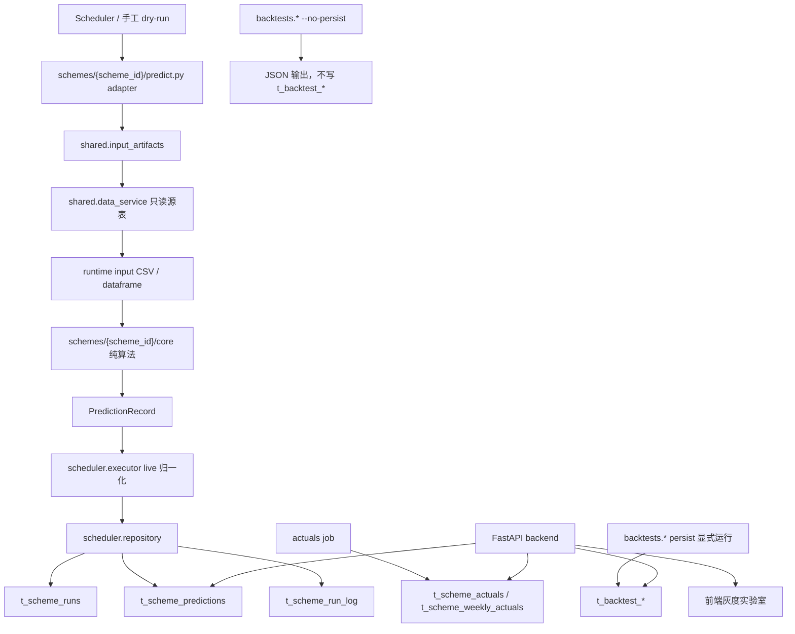
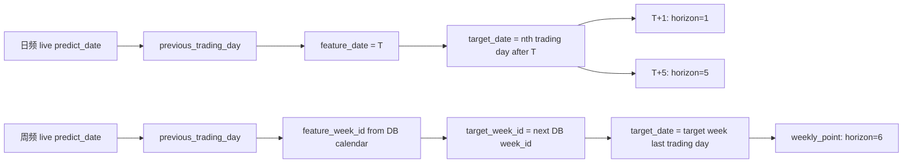
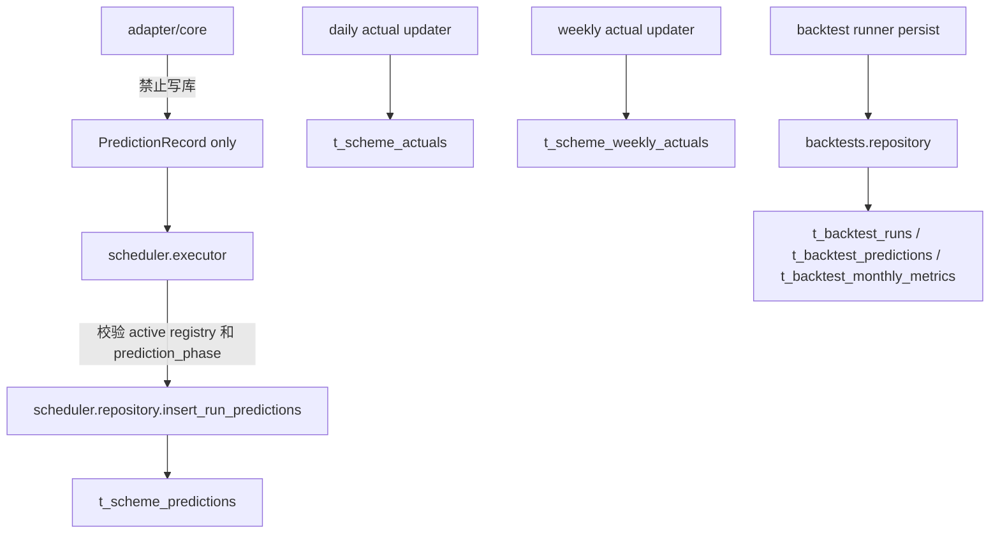

# Bond Factor Lab 全方案运行与数据体系检查报告

> **历史审计快照，非当前状态。** 本文记录的是 2026-06-28 当日的 registry、数据库水位、代码与运行结果。此后 active 方案范围、scheduler/actuals、source fidelity gate、周频无信号转平和 latest backtest 均有更新；文中的方案数量、run_id、待办和复核命令不得直接当作当前结论。当前规则与状态分别以 [SCHEME_CONTRACT.md](../../architecture/SCHEME_CONTRACT.md)、[PREDICTION_SEMANTICS.md](../../architecture/PREDICTION_SEMANTICS.md)、[SOURCE_ALGORITHM_FIDELITY.md](../../architecture/SOURCE_ALGORITHM_FIDELITY.md) 和 [CURRENT_STATUS.md](../../CURRENT_STATUS.md) 为准。

检查日期：2026-06-28

检查分支：`codex/all-schemes-system-check-20260628`

隔离 worktree：`/Users/macstudio0/bond-factor-lab-all-schemes-check-20260628`

基线提交：`168491f Support public bond factor lab path prefix`
旧标准来源：`/Users/macstudio0/Downloads/迁移模版old.md`

本报告按旧标准逐项检查当前 Bond Factor Lab 灰度实验室 API 可见方案。检查边界是只读 DB/API、静态代码、单测、adapter dry-run、backtest no-persist 或受控抽样，不修复代码、不执行 live 写库、不执行 backtest persist、不激活、不推送。运行中生成的 `backtest_artifacts/runtime_inputs/` 属于 ignored runtime artifact，不纳入代码提交。

## 一、总体结论

当前 API 可见 active registry 为 16 行，覆盖 12 个 active base scheme：2 个 T+1、11 个 T+5、3 个 weekly_point。配置、registry composite ID、active 可见性、预测表日期三元组、actual join 边界和前端/API 使用 active registry 的主路径总体符合当前新体系规范。

本轮发现的主要风险集中在运行耗时和 no-persist 复核完整度，而不是日期字段或写库边界错误：

1. `liwei_0616_10y02_cons_say_k3_div_k5` 在最新 live `predict_date=2026-06-25` 的 `scheduler.scheme_runner` dry-run 中 1800 秒超时。DB 中已有该方案 latest active run 成功，但日常巡检应单独关注耗时、超时和 run_log 非成功记录。
2. `daily_5y_2_v28` 与 `daily_7y_1_v28` 的 full backtest no-persist 成功，但分别耗时约 889 秒和 581 秒；作为值班巡检命令可用，但不适合高频人工重复执行。
3. `weekly_5y_direct_0529`、`weekly_7y_cross_d_overlay_0529` 当前 no-persist 输出行数分别为 71、68，DB 最新 persisted run 为 72；需要进一步确认 no-persist 当前代码与 DB 最新 run 的输入截止或排除规则差异。`weekly_10y_d_overlay_0529` no-persist 300 秒超时。
4. 5 个 Liwei source-backed 方案的 DB 最新 persisted backtest 均为 333 行、17 个月，source-compatible live extra 字段完整；但本轮未完成 Liwei full no-persist。除 `10y01`、`7y01`、`7y03`、`5y01` dry-run 成功外，`10y02` 最新 dry-run 超时，因此 Liwei 全量历史复现仍列为待人工确认。
5. 旧标准中的 `t_pre_market_forecast`、`t_shap`、SHAP 生产写入不再是当前体系合规项。当前系统以 `t_scheme_predictions`、`t_scheme_actuals`、`t_scheme_weekly_actuals`、`t_backtest_*` 替代。旧表仍有历史行：`t_pre_market_forecast=972`、`t_shap=30073`，应作为遗留保护表处理，不作为当前方案通过条件。

## 二、旧标准逐项对照

| 旧标准关键点 | 当前实现位置 | 检查结论 | 证据与说明 | 风险或建议 |
|---|---|---|---|---|
| 冻结生产合约：输入、运行日、目标期、输出、写库、重复运行、回滚 | `AGENTS.md`、`docs/SCHEME_CONTRACT.md`、`docs/PREDICTION_SEMANTICS.md`、`t_scheme_registry` | 通过 | 12 个 active base scheme 均有 `config.yaml`；16 个 active registry 均为 composite ID `{base}__h{horizon}__{tenor}` | registry 表当前无 `version` 字段，版本语义来自 config/model_version 与预测行 |
| 生产入口默认数据库输入，不读包内本地快照 | `shared/input_artifacts.py:70-181`、各 `schemes/*/predict.py` | 通过 | dry-run 输出均指向本次从 DB 构建的 runtime input artifact，例如 `backtest_artifacts/runtime_inputs/...` | runtime artifact 需保持 gitignore，不作为部署输入 |
| 日频运行日语义 | `shared/prediction_context.py:25-29` | 通过 | live dry-run 均满足 `predict_date=T+1`、`feature_date=T`、T+1 或 T+5 target date | `scheme_runner` 直接跑 adapter 时 `prediction_phase=null`，正式 live 由 executor 补齐 |
| 周频 week_id 权威来源，禁止自然周 | `shared/prediction_context.py:32-55`、`t_trade_calendar.rdate -> week_id` | 通过 | live weekly 行 extra `feature_week_id/target_week_id` 与 DB calendar week_id 全部一致 | 周频 h6 表示下一实际 DB 周，不是自然日 6 天 |
| 周频不得静默 fallback 到旧 week_id | `shared/prediction_context.py:35-39` | 通过 | 无自然周 fallback 证据；无法解析 week_id 时会抛错 | 继续保留固定回归样例检查 |
| dry-run 也要有审查文件 | `shared/input_artifacts.py`、dry-run artifact path | 部分通过 | 11 个 scheme dry-run OK 并生成 runtime input；10y02 超时无输出记录 | 建议对 10y02 建立单独巡检窗口或缓存策略 |
| 写库路径必须明确、幂等 | `scheduler/repository.py:247-306` | 通过 | live 预测 UPSERT 到 `t_scheme_predictions`，按 `scheme_id + target_tenor + horizon + target_date` 覆盖 | 不在 adapter/core 内写库 |
| actuals 写入路径必须独立 | `scheduler/repository.py:364-420`、`scheduler/main.py:126-139` | 通过 | 日频写 `t_scheme_actuals`，周频写 `t_scheme_weekly_actuals`；actual job 同时刷新两类 | 缺失 actual 主要来自 target_date 尚未到达 |
| 回测与 live 隔离 | `backtests/repository.py`、`t_backtest_*` | 通过 | latest persisted backtest 均在 `t_backtest_runs/t_backtest_predictions`，live 在 `t_scheme_predictions` | no-persist 与 DB latest 的行数差异需继续复核 |
| API/前端指标按 target_date 归属 | `backend/services.py:525-640`、`backend/services.py:643-648` | 通过 | metrics join 日频 `a.trade_date=p.target_date`，周频 `wa.target_date=p.target_date`，月度归属取 `target_date[:7]` | 不再按 predict_date 统计月度准确率 |
| SHAP 必须生产写入旧表 | 当前新体系 | 不适用 | 当前灰度实验室不以 `t_shap` 为合规写入项；source-backed 内部 score 进入 extra/benchmark | 旧表只做遗留计数和保护，不作为当前上线 gate |
| `t_pre_market_forecast` 预测写入 | 当前新体系 | 不适用 | 当前统一预测表为 `t_scheme_predictions` | 旧表有 972 行，避免误读为当前 live 结果 |

## 三、当前数据流与写库边界







核心代码证据：

| 边界 | 代码位置 | 证据 |
|---|---|---|
| 输入单点 | `shared/input_artifacts.py:70-181` | 日频/周频输入统一经 `data_service` 构建 CSV，再读回 dataframe，记录 hash、coverage、metadata |
| 日期语义 | `shared/prediction_context.py:25-55` | 日频 `feature_date=previous_trading_day(predict_date)`；周频从 DB calendar 解析 `week_id` |
| live phase 补齐 | `scheduler/executor.py:193-217` | executor 统一补齐 `feature_date` 与 `prediction_phase`，并校验 `anchor_date == feature_date` |
| live 写库 | `scheduler/repository.py:247-306` | 写 `t_scheme_predictions` 前强制 `feature_date` 与合法 phase |
| actuals 写库 | `scheduler/repository.py:364-420` | 日频 actuals 与周频 actuals 分表 UPSERT |
| API actual join | `backend/services.py:525-640` | 日频 join `t_scheme_actuals.trade_date=p.target_date`；周频 join `t_scheme_weekly_actuals.target_date=p.target_date` |

## 四、active registry 清单

| Registry ID | Base scheme | 频率 | task_type | horizon | tenor | cron | deployed_at | 结论 |
|---|---|---|---|---:|---|---|---|---|
| `daily_5y_2_v28__h5__5Y` | `daily_5y_2_v28` | daily | T+5 | 5 | 5Y | `3 7 * * 1-5` | 2026-06-12 | 通过 |
| `daily_7y_1_v28__h5__7Y` | `daily_7y_1_v28` | daily | T+5 | 5 | 7Y | `3 7 * * 1-5` | 2026-06-15 | 通过 |
| `liwei_0616_10y01_cons_say_k3_div_k10__h5__10Y` | `liwei_0616_10y01_cons_say_k3_div_k10` | daily | T+5 | 5 | 10Y | `3 7 * * 1-5` | 2026-06-22 | 通过 |
| `liwei_0616_10y02_cons_say_k3_div_k5__h5__10Y` | `liwei_0616_10y02_cons_say_k3_div_k5` | daily | T+5 | 5 | 10Y | `3 7 * * 1-5` | 2026-06-22 | 风险 |
| `liwei_0616_7y01_cons_say_k3_div_k10__h5__7Y` | `liwei_0616_7y01_cons_say_k3_div_k10` | daily | T+5 | 5 | 7Y | `3 7 * * 1-5` | 2026-06-21 | 通过 |
| `liwei_0616_7y03_cons_all_k3_div_k8__h5__7Y` | `liwei_0616_7y03_cons_all_k3_div_k8` | daily | T+5 | 5 | 7Y | `3 7 * * 1-5` | 2026-06-21 | 通过 |
| `liwei_0616_cons_sda_k3_div_k10__h5__5Y` | `liwei_0616_cons_sda_k3_div_k10` | daily | T+5 | 5 | 5Y | `3 7 * * 1-5` | 2026-06-21 | 通过 |
| `t1_daily__h1__10Y` | `t1_daily` | daily | T+1 | 1 | 10Y | `3 7 * * 1-5` | 2026-06-04 | 通过 |
| `t1_daily__h1__5Y` | `t1_daily` | daily | T+1 | 1 | 5Y | `3 7 * * 1-5` | 2026-06-04 | 通过 |
| `t5_daily__h5__10Y` | `t5_daily` | daily | T+5 | 5 | 10Y | `3 7 * * 1-5` | 2026-06-04 | 通过 |
| `t5_daily__h5__3Y` | `t5_daily` | daily | T+5 | 5 | 3Y | `3 7 * * 1-5` | 2026-06-04 | 通过 |
| `t5_daily__h5__5Y` | `t5_daily` | daily | T+5 | 5 | 5Y | `3 7 * * 1-5` | 2026-06-04 | 通过 |
| `t5_daily__h5__7Y` | `t5_daily` | daily | T+5 | 5 | 7Y | `3 7 * * 1-5` | 2026-06-04 | 通过 |
| `weekly_10y_d_overlay_0529__h6__10Y` | `weekly_10y_d_overlay_0529` | weekly | weekly_point | 6 | 10Y | `30 11 * * 6` | 2026-06-11 | 部分通过 |
| `weekly_5y_direct_0529__h6__5Y` | `weekly_5y_direct_0529` | weekly | weekly_point | 6 | 5Y | `30 11 * * 6` | 2026-06-10 | 部分通过 |
| `weekly_7y_cross_d_overlay_0529__h6__7Y` | `weekly_7y_cross_d_overlay_0529` | weekly | weekly_point | 6 | 7Y | `30 11 * * 6` | 2026-06-10 | 部分通过 |

## 五、预测表日期与 actual join 检查

全量 active base scheme 的 live/gray prediction rows 逐项检查结果：

| 检查项 | 结果 |
|---|---:|
| 缺失 `feature_date` | 0 |
| 缺失 `target_date` | 0 |
| 非法 `prediction_phase` | 0 |
| `feature_date >= predict_date` | 0 |
| `target_date <= feature_date` | 0 |
| extra 中 `feature_date` 与列值不一致 | 0 |
| extra 中 `prediction_phase` 与列值不一致 | 0 |

16 个 registry 行的预测覆盖与 actual join：

| Registry ID | rows | gray | scheduled | feature range | target range | actual joined | actual missing | mismatch |
|---|---:|---:|---:|---|---|---:|---:|---:|
| `daily_5y_2_v28__h5__5Y` | 23 | 13 | 10 | 2026-05-25..2026-06-25 | 2026-06-01..2026-07-02 | 18 | 5 | 0 |
| `daily_7y_1_v28__h5__7Y` | 23 | 15 | 8 | 2026-05-25..2026-06-25 | 2026-06-01..2026-07-02 | 18 | 5 | 0 |
| `liwei_0616_10y01_cons_say_k3_div_k10__h5__10Y` | 23 | 18 | 5 | 2026-05-25..2026-06-25 | 2026-06-01..2026-07-02 | 18 | 5 | 0 |
| `liwei_0616_10y02_cons_say_k3_div_k5__h5__10Y` | 22 | 19 | 3 | 2026-05-25..2026-06-24 | 2026-06-01..2026-07-01 | 18 | 4 | 0 |
| `liwei_0616_7y01_cons_say_k3_div_k10__h5__7Y` | 23 | 18 | 5 | 2026-05-25..2026-06-25 | 2026-06-01..2026-07-02 | 18 | 5 | 0 |
| `liwei_0616_7y03_cons_all_k3_div_k8__h5__7Y` | 23 | 18 | 5 | 2026-05-25..2026-06-25 | 2026-06-01..2026-07-02 | 18 | 5 | 0 |
| `liwei_0616_cons_sda_k3_div_k10__h5__5Y` | 23 | 18 | 5 | 2026-05-25..2026-06-25 | 2026-06-01..2026-07-02 | 18 | 5 | 0 |
| `t1_daily__h1__10Y` | 19 | 8 | 11 | 2026-05-28..2026-06-25 | 2026-06-01..2026-06-26 | 18 | 1 | 0 |
| `t1_daily__h1__5Y` | 19 | 8 | 11 | 2026-05-28..2026-06-25 | 2026-06-01..2026-06-26 | 18 | 1 | 0 |
| `t5_daily__h5__10Y` | 23 | 12 | 11 | 2026-05-25..2026-06-25 | 2026-06-01..2026-07-02 | 18 | 5 | 0 |
| `t5_daily__h5__3Y` | 23 | 12 | 11 | 2026-05-25..2026-06-25 | 2026-06-01..2026-07-02 | 18 | 5 | 0 |
| `t5_daily__h5__5Y` | 23 | 12 | 11 | 2026-05-25..2026-06-25 | 2026-06-01..2026-07-02 | 18 | 5 | 0 |
| `t5_daily__h5__7Y` | 23 | 12 | 11 | 2026-05-25..2026-06-25 | 2026-06-01..2026-07-02 | 18 | 5 | 0 |
| `weekly_10y_d_overlay_0529__h6__10Y` | 5 | 2 | 3 | 2026-05-29..2026-06-26 | 2026-06-05..2026-07-03 | 3 | 2 | 0 |
| `weekly_5y_direct_0529__h6__5Y` | 5 | 2 | 3 | 2026-05-29..2026-06-26 | 2026-06-05..2026-07-03 | 3 | 2 | 0 |
| `weekly_7y_cross_d_overlay_0529__h6__7Y` | 5 | 2 | 3 | 2026-05-29..2026-06-26 | 2026-06-05..2026-07-03 | 3 | 2 | 0 |

`actual missing` 均对应当前目标日尚未完全可评估的未来 target_date，未发现 tenor/horizon mismatch。周频 live 15 行的 extra `feature_week_id/target_week_id` 与 `t_trade_calendar.rdate -> week_id` 全部一致。

## 六、逐 base scheme 检查矩阵

| Base scheme | 配置与 registry | live 日期/写库 | dry-run | backtest no-persist | 结论 |
|---|---|---|---|---|---|
| `t1_daily` | active；daily；T+1；h1；5Y/10Y | 38 live rows；日期异常 0；actual 缺 2 行 | OK；2026-06-26；2 records；16.596s | full no-persist OK；674 rows；34 monthly；DB latest run 116 同 row_count | 通过 |
| `t5_daily` | active；daily；T+5；h5；3Y/5Y/7Y/10Y | 92 live rows；日期异常 0；actual 缺 20 行 | OK；2026-06-26；4 records；17.823s | full no-persist OK；1332 rows；68 monthly；DB latest run 113 同 row_count | 通过 |
| `daily_5y_2_v28` | active；daily；T+5；h5；5Y | 23 live rows；日期异常 0 | OK；2026-06-26；1 record；43.483s | full no-persist OK；333 rows；17 monthly；耗时 889.462s | 部分通过 |
| `daily_7y_1_v28` | active；daily；T+5；h5；7Y | 23 live rows；日期异常 0 | OK；2026-06-26；1 record；39.676s | full no-persist OK；333 rows；17 monthly；耗时 581.180s | 部分通过 |
| `liwei_0616_cons_sda_k3_div_k10` | active；daily；T+5；h5；5Y | 23 live rows；source-compatible extra 完整 | OK；2026-06-26；1 record；108.779s | DB latest run 130：333 rows；本轮 full no-persist 未完成 | 待人工确认 |
| `liwei_0616_7y01_cons_say_k3_div_k10` | active；daily；T+5；h5；7Y | 23 live rows；source-compatible extra 完整 | OK；2026-06-26；1 record；173.724s | DB latest run 125：333 rows；本轮 full no-persist 未完成 | 待人工确认 |
| `liwei_0616_7y03_cons_all_k3_div_k8` | active；daily；T+5；h5；7Y | 23 live rows；source-compatible extra 完整 | OK；2026-06-26；1 record；173.625s | DB latest run 126：333 rows；本轮 full no-persist 未完成 | 待人工确认 |
| `liwei_0616_10y01_cons_say_k3_div_k10` | active；daily；T+5；h5；10Y | 23 live rows；source-compatible extra 完整 | OK；2026-06-26；1 record；183.474s | DB latest run 127：333 rows；sample no-persist 未在本轮窗口返回 | 待人工确认 |
| `liwei_0616_10y02_cons_say_k3_div_k5` | active；daily；T+5；h5；10Y | 22 live rows；latest predict_date 2026-06-25；source-compatible extra 完整 | 1800s timeout；2026-06-25 | DB latest run 128：333 rows；本轮 full no-persist 未完成 | 风险 |
| `weekly_5y_direct_0529` | active；weekly_point；h6；5Y | 5 live rows；week_id 与 DB calendar 一致 | OK；2026-06-27；1 record；1.856s | no-persist OK；71 rows；DB latest run 118 为 72 rows | 部分通过 |
| `weekly_7y_cross_d_overlay_0529` | active；weekly_point；h6；7Y | 5 live rows；week_id 与 DB calendar 一致 | OK；2026-06-27；1 record；1.870s | no-persist OK；68 rows；DB latest run 119 为 72 rows | 部分通过 |
| `weekly_10y_d_overlay_0529` | active；weekly_point；h6；10Y | 5 live rows；week_id 与 DB calendar 一致 | OK；2026-06-27；1 record；26.556s | no-persist 300s timeout；DB latest run 108 为 72 rows | 风险 |

## 七、逐方案明细

### `t1_daily`

`t1_daily` 是日频 T+1 多标的 base scheme，对应 `5Y`、`10Y` 两个 active registry 行。live 语义为 `predict_date=2026-06-26`、`feature_date=2026-06-25`、`target_date=2026-06-26`。dry-run 生成 2 条记录，输入 artifact 为 `backtest_artifacts/runtime_inputs/t1_daily/daily_output_2026-06-26.csv`。DB live rows 共 38 行，日期字段异常 0。full no-persist 输出 `674` rows、`34` monthly，与 DB latest persisted run 116 的 row_count/monthly_count 一致。该方案未发现时间字段和写库边界问题。

### `t5_daily`

`t5_daily` 是日频 T+5 多标的 base scheme，对应 `3Y/5Y/7Y/10Y` 四个 active registry 行。dry-run 生成 4 条记录，均为 `predict_date=2026-06-26`、`feature_date=2026-06-25`、`target_date=2026-07-02`。DB live rows 共 92 行，日期字段异常 0。full no-persist 输出 `1332` rows、`68` monthly，与 DB latest persisted run 113 一致。actual missing 为 5 个未来 target_date 乘 4 个 tenor，共 20 行。

### `daily_5y_2_v28`

配置与 registry 均为 active，单标的 `5Y`、T+5。dry-run 在 `2026-06-26` 输出 1 条记录，`feature_date=2026-06-25`、`target_date=2026-07-02`，`model_scope=v28_feature_month_window`，有内部 score 审计字段。full no-persist 输出 `333` rows、`17` monthly，和 DB latest run 107 row_count 一致。主要风险是 full no-persist 耗时 `889.462s`，接近本轮 900 秒巡检上限。

### `daily_7y_1_v28`

配置与 registry 均为 active，单标的 `7Y`、T+5。dry-run 在 `2026-06-26` 输出 1 条记录，日期三元组与 `daily_5y_2_v28` 一致，`model_scope=v28_feature_month_window`。full no-persist 输出 `333` rows、`17` monthly，和 DB latest run 117 row_count 一致。主要风险是 full no-persist 耗时 `581.180s`，值班复核时建议作为低频或专项命令执行。

### Liwei source-backed 5 个方案

Liwei 方案均为 source-backed daily T+5，当前 DB live extra 中 `model_scope`、`baseline_scores`、内部 score 字段完整；`model_source_end` 与 live `feature_date` 范围一致，均未发现 extra feature/phase mismatch。source-backed 方案的历史 source-original 与 live-safe 语义必须区分：DB latest backtest 证明历史 persisted run 已成功，live 行只能用 live-safe oracle 或同口径 dry-run 验收，不能把固定 source batch 的未来 `source_end` 当作 live 逐日真值。

| Base scheme | live rows | model_scope | model_source_end range | dry-run | DB latest backtest |
|---|---:|---|---|---|---|
| `liwei_0616_cons_sda_k3_div_k10` | 23 | `liwei_0616_5y01_source_compatible_context` | 2026-05-25..2026-06-25 | OK；108.779s | run 130；333 rows；17 monthly |
| `liwei_0616_7y01_cons_say_k3_div_k10` | 23 | `liwei_0616_7y01_source_compatible_context` | 2026-05-25..2026-06-25 | OK；173.724s | run 125；333 rows；17 monthly |
| `liwei_0616_7y03_cons_all_k3_div_k8` | 23 | `liwei_0616_7y03_source_compatible_context` | 2026-05-25..2026-06-25 | OK；173.625s | run 126；333 rows；17 monthly |
| `liwei_0616_10y01_cons_say_k3_div_k10` | 23 | `liwei_0616_10y01_source_compatible_context` | 2026-05-25..2026-06-25 | OK；183.474s | run 127；333 rows；17 monthly |
| `liwei_0616_10y02_cons_say_k3_div_k5` | 22 | `liwei_0616_10y02_source_compatible_context` | 2026-05-25..2026-06-24 | timeout；1800s | run 128；333 rows；17 monthly |

Liwei 的风险不是当前 DB 日期字段错误，而是巡检可重复运行成本和 10y02 的最新 dry-run timeout。建议日常检查把 Liwei 分成 DB 日期/actual join 快速检查、latest run_log 检查、专项 dry-run 检查三层，而不是每次值班都跑 full no-persist。

### 三个 weekly 方案

周频方案均为 `weekly_point`、`horizon=6`。这里的 `horizon=6` 是 registry/composite ID 和指标列分组使用的周频点预测标识，实际 target 不是“自然日后 6 天”，而是从 DB `t_trade_calendar` 取得 `feature_week_id` 后的下一实际周 `target_week_id`，再取目标周最后一个交易日作为 `target_date`。本轮 live 表中所有 weekly 行的 `extra_feature_week_id/extra_target_week_id` 与 DB calendar week_id 一致。

| Base scheme | dry-run | live week_id 证据 | no-persist | 风险 |
|---|---|---|---|---|
| `weekly_5y_direct_0529` | OK；1.856s；feature_week_id 202624；target_week_id 202625 | 5 live rows 全部与 DB calendar 一致 | OK；71 rows；17 monthly | DB latest run 118 为 72 rows，需要复核行数差异 |
| `weekly_7y_cross_d_overlay_0529` | OK；1.870s；feature_week_id 202624；target_week_id 202625 | 5 live rows 全部与 DB calendar 一致 | OK；68 rows；17 monthly | DB latest run 119 为 72 rows，需要复核行数差异 |
| `weekly_10y_d_overlay_0529` | OK；26.556s；feature_week_id 202624；target_week_id 202625 | 5 live rows 全部与 DB calendar 一致 | 300s timeout | no-persist 性能或输入复核需专项处理 |

## 八、测试与运行证据

| 类型 | 命令 | 结果 |
|---|---|---|
| API health | `curl -sS http://127.0.0.1:8100/api/health` | HTTP 200；`{"status":"ok"}` |
| API schemes | `curl -sS http://127.0.0.1:8100/api/schemes` | 16 active registry |
| 静态/契约单测 | `conda run -n bond_factor_lab_service python -m unittest tests.test_harness_static_gate tests.test_config_schema tests.test_scheduler_discovery tests.test_prediction_context` | 50 tests OK |
| 逐方案/回测单测 | `conda run -n bond_factor_lab_service python -m unittest ...` | 273 tests OK |
| dry-run | `conda run -n forecast_env python -m scheduler.scheme_runner --scheme-id <base> --predict-date <latest>` | 11 OK；10y02 timeout |
| backtest no-persist | 多个 `python -m backtests.* --no-persist` | t1/t5、V28、weekly 5Y/7Y OK；weekly 10Y timeout；Liwei full 未完成 |

已完成 no-persist 与 DB latest persisted run 对照：

| Base scheme | no-persist row_count | DB latest run | DB row_count | 对照结论 |
|---|---:|---:|---:|---|
| `t1_daily` | 674 | 116 | 674 | row_count/monthly_count 一致 |
| `t5_daily` | 1332 | 113 | 1332 | row_count/monthly_count 一致 |
| `daily_5y_2_v28` | 333 | 107 | 333 | row_count/monthly_count 一致；比较脚本因 no-persist row 缺少 tenor/horizon 字段，逐键方向对照未完成 |
| `daily_7y_1_v28` | 333 | 117 | 333 | row_count/monthly_count 一致；逐键方向对照未完成 |
| `weekly_5y_direct_0529` | 71 | 118 | 72 | 行数不一致，需继续复核 |
| `weekly_7y_cross_d_overlay_0529` | 68 | 119 | 72 | 行数不一致，需继续复核 |
| `weekly_10y_d_overlay_0529` | timeout | 108 | 72 | 本轮 no-persist 未完成 |
| 5 个 Liwei | 未完成 full no-persist | 125/126/127/128/130 | 各 333 | 依赖 DB latest persisted、单测与 dry-run 交叉确认，full no-persist 待人工确认 |

## 九、日常复核命令清单

建议检查人员把日常检查拆成快速巡检、运行复核和专项复核三层。

快速巡检：

```bash
cd /Users/macstudio0/bond-factor-lab
git status --short --branch
curl -sS http://127.0.0.1:8100/api/health
curl -sS http://127.0.0.1:8100/api/schemes
```

日期与 actual join 只读 SQL：

```sql
SELECT scheme_id, COUNT(*) rows_n,
       SUM(feature_date IS NULL) missing_feature_date,
       SUM(target_date IS NULL) missing_target_date,
       SUM(prediction_phase NOT IN ('gray_live','scheduled_live')) bad_phase,
       SUM(feature_date >= predict_date) feature_not_before_predict,
       SUM(target_date <= feature_date) target_not_after_feature
FROM t_scheme_predictions
GROUP BY scheme_id
ORDER BY scheme_id;
```

```sql
SELECT r.scheme_id registry_id, COUNT(p.id) prediction_rows,
       SUM(CASE WHEN r.frequency='weekly' AND wa.id IS NOT NULL THEN 1
                WHEN r.frequency<>'weekly' AND a.id IS NOT NULL THEN 1
                ELSE 0 END) actual_joined_rows
FROM t_scheme_registry r
LEFT JOIN t_scheme_predictions p
  ON p.scheme_id=r.base_scheme_id
 AND p.target_tenor=r.target_tenor
 AND p.horizon=r.horizon
LEFT JOIN t_scheme_actuals a
  ON a.tenor=p.target_tenor
 AND a.trade_date=p.target_date
LEFT JOIN t_scheme_weekly_actuals wa
  ON wa.tenor=p.target_tenor
 AND wa.target_date=p.target_date
WHERE r.status='active'
GROUP BY r.scheme_id
ORDER BY r.scheme_id;
```

单方案 dry-run：

```bash
conda run -n forecast_env python -m scheduler.scheme_runner --scheme-id t1_daily --predict-date 2026-06-26
conda run -n forecast_env python -m scheduler.scheme_runner --scheme-id weekly_5y_direct_0529 --predict-date 2026-06-27
```

no-persist 复核：

```bash
conda run -n bond_factor_lab_service python -m backtests.daily_0529_reproduction --no-persist --n-jobs 4
conda run -n bond_factor_lab_service python -m backtests.daily_5y_2_v28_reproduction --no-persist --n-workers 4
conda run -n bond_factor_lab_service python -m backtests.weekly_5y_direct_0529_reproduction --no-persist
```

高风险专项复核：

```bash
conda run -n forecast_env python -m scheduler.scheme_runner --scheme-id liwei_0616_10y02_cons_say_k3_div_k5 --predict-date 2026-06-25
conda run -n bond_factor_lab_service python -m backtests.weekly_10y_d_overlay_0529_reproduction --no-persist
```

## 十、最终检查结论

当前系统的核心时间语义和写库边界是清晰的：live 使用 `predict_date/feature_date/target_date` 三元组，实际结果按 `target_date` join，周频 week_id 来自 DB 日历，业务方案身份来自 active registry composite ID。所有 active live prediction rows 在日期关系、phase、tenor/horizon 对齐方面未发现异常。

本轮不建议直接把“所有算法完全一致准确”作为最终表述。更准确的结论是：框架规范和数据写入边界通过；多数方案 dry-run 和 no-persist 可复核；Liwei 10y02、weekly 10Y、weekly no-persist 行数差异、V28/Liwei 耗时属于检查人员后续需要重点跟踪的运行风险。
