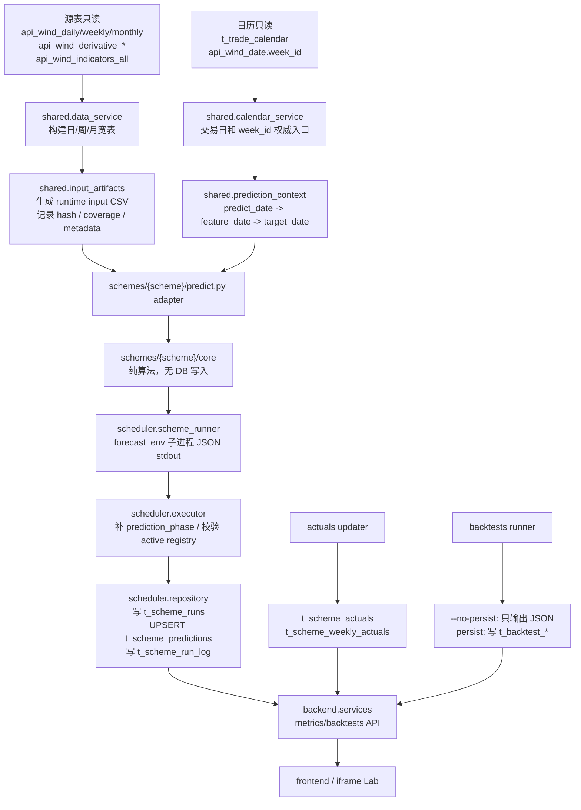
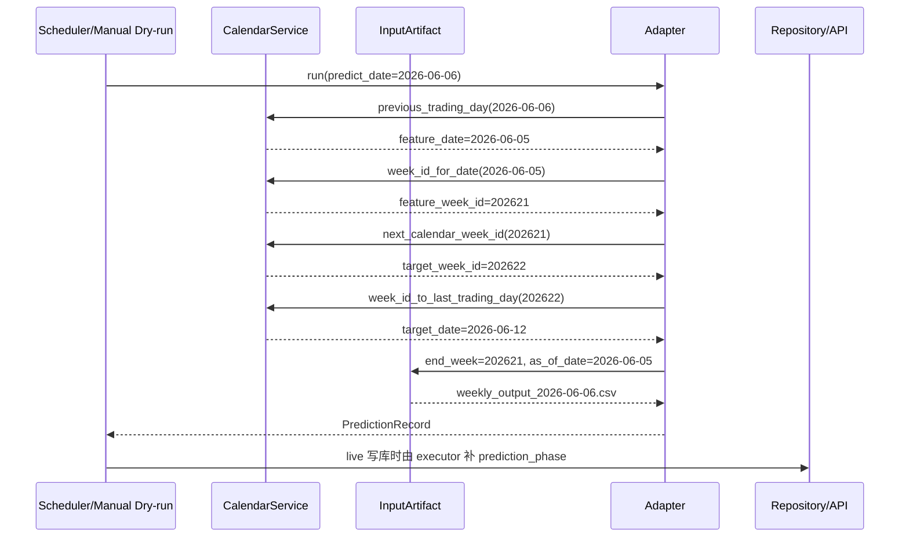
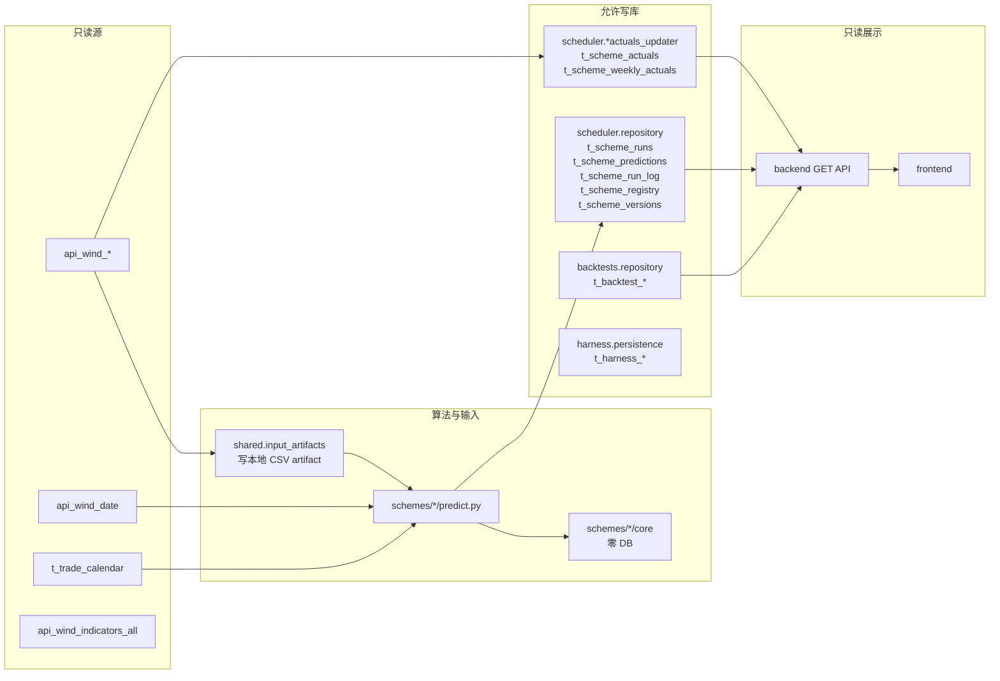

# Bond Factor Lab 运行与数据体系检查报告

**文档状态**：`HISTORICAL`

> **历史 runbook 对照快照，非当前规范。** 本文只保存 2026-06-28 当日对旧迁移模板的审计映射。此后 active registry、调度与 actuals、source fidelity、无信号转平和 latest backtest 已继续演进；文中的数量、run_id、差异和建议不得覆盖现行契约。当前规则与状态分别以 [SCHEME_CONTRACT.md](../../architecture/SCHEME_CONTRACT.md)、[PREDICTION_SEMANTICS.md](../../architecture/PREDICTION_SEMANTICS.md)、[SOURCE_ALGORITHM_FIDELITY.md](../../architecture/SOURCE_ALGORITHM_FIDELITY.md) 和 [CURRENT_STATUS.md](../../CURRENT_STATUS.md) 为准。

检查日期：2026-06-28

检查分支：`codex/system-check-20260628`

隔离 worktree：`/Users/macstudio0/bond-factor-lab-system-check-20260628`

对照旧标准：`/Users/macstudio0/Downloads/迁移模版old.md`
示范方案：`weekly_5y_direct_0529` / registry ID `weekly_5y_direct_0529__h6__5Y`

本报告按旧 runbook 的关键章节逐项映射当前 Bond Factor Lab。检查重点放在数据时间字段、周频 `week_id` 来源、输入截止、防未来数据、结果写入表、回测/live 隔离、actuals join、调度触发和 dry-run/no-persist 审计证据。本次仅做检查和报告记录，不执行 live 写库、不执行 backtest persist、不激活方案、不改当前 checkout `/Users/macstudio0/bond-factor-lab`。

## 结论摘要

整体结论：当前体系在“输入单点、时间字段语义、周频 week_id 权威来源、live/backtest 写入隔离、API 指标按 target_date 归属”上基本符合现行 Bond Factor Lab 规范，也覆盖了旧 runbook 最关注的数据可见性和写库审查点。旧 runbook 中的 `t_pre_market_forecast`、`t_shap`、SHAP 生产写入已经不再是本平台当前业务写入路径，应标为“不适用/已由新表体系替代”。

需要特别注意一项待人工确认差异：数据库 latest backtest 中 `weekly_5y_direct_0529` run_id=`118` 有 72 条明细，而当前代码 `--no-persist` 输出 71 条；多出的一条是 `feature_date=2025-08-22,target_date=2025-08-29,target_tenor=5Y,predicted_direction=0,label=-1,confidence=0.0`。其余 71 条方向和 label 一致。这个差异不影响 live 预测写库边界检查，但会影响“当前代码 no-persist 是否等于 DB latest”的审计判断，建议在确认后再把 run_id=`118` 作为当前代码完全复现证据。

## 当前体系一图



## 时间字段流转图

以 `weekly_5y_direct_0529` dry-run `predict_date=2026-06-06` 为例：



关键含义：

- `predict_date` 是信号发出日/调度运行日。
- `feature_date` 是唯一数据截止日，周频由 `previous_trading_day(predict_date)` 得到。
- `feature_week_id` 只能从 `api_wind_date.week_id` 读取，不能用自然周公式。
- `target_date` 是实际验证日、去重主键和月度归属字段。

## 写库边界图



## 旧标准逐项对照

| 旧标准关键点 | 当前实现位置 | 检查结论 | 证据 | 风险/建议 |
|---|---|---:|---|---|
| 1.1 三类代码职责差异：研究脚本、生产脚本、审查脚本要分工清楚 | `shared/`、`schemes/`、`scheduler/`、`backtests/`、`harness/` 五层 | 通过 | `AGENTS.md` 和 `docs/CODE_ARCHITECTURE.md` 定义 L1-L5；`schemes/*/core` 纯算法，adapter 只做平台适配 | 继续保持 core 不 import DB/共享写库模块 |
| 1.2/1.4 生产化目录关系和频率 project 模板 | 旧的 frequency project 被 scheme 插件目录替代 | 通过 | `schemes/{scheme_id}/config.yaml + predict.py + core/`；`weekly_5y_direct_0529/config.yaml` 声明 `frequency=weekly,horizon=6,task_type=weekly_point` | 旧模板使用者需要接受“方案插件”是新生产单元 |
| 1.3 根目录公共文件规范 | 公共逻辑集中在 `shared/`，不是旧 forecast_project 根目录复制 | 通过 | `shared.input_artifacts`、`shared.data_service`、`shared.calendar_service` 是输入/取数/日历单点 | 不建议再把公共工具复制到各方案目录 |
| 1.5 二次修正规则：数据服务统一、周频 week_id 不能自然周 | `shared.calendar_service`、`scheduler.weekly_actuals_updater` | 通过 | `week_id_for_date` 只查 `api_wind_date.week_id`；只读 SQL 核对 `2025-07-05 -> 202527`、`2026-06-13 -> 202622` | `CalendarService.week_id_to_last_trading_day` 在无交易日时有 fallback 到同周最大日期，建议若触发时打审计日志 |
| 2.1 数据获取通用原则：统一入口、禁止脚本散拉 DB | `shared.input_artifacts` 调 `shared.data_service` | 通过 | `build_weekly_input_artifact` 调 `build_weekly_output_from_db` 并保存 artifact；`predict.py` 不自拼 SQL | 当前 adapter 仍创建 engine 后传入 shared，属于现行白名单；长期可继续下沉 engine 生命周期 |
| 2.2 三频数据服务行为 | `build_daily/weekly/monthly_input_artifact` | 部分通过 | 静态确认三频入口存在；本次运行态重点核验周频 | 本次未对 active 月频做运行态核验；API 当前 active 中未见 `monthly` task_type |
| 2.3 日频 output 构建 | `shared.data_service.build_daily_output_from_db` | 通过 | 日频路径存在；相关 active registry 有 T+1/T+5 共 13 行 | 本报告未逐条重算日频样本，只做体系检查 |
| 2.4 周频 output 构建 | `shared.data_service.build_weekly_output_from_frames` | 通过 | `as_of_date` 过滤 `rdate <= cutoff`，再按 `start_week/end_week` 截断并按 `week_id+indicators_code` 去重；dry-run 生成 `weekly_output_2026-06-06.csv` | 周频 `start_week=current_week_id-60` 是方案内部窗口，需与 source 规则保持一致 |
| 2.5 月频 output 构建 | `shared.input_artifacts.build_monthly_input_artifact` | 部分通过 | 静态路径存在 | 本次未做月频 live/no-persist 样例 |
| 3.1 研究脚本改生产入口 | `predict.py::run(predict_date)->list[PredictionRecord]` | 通过 | `weekly_5y_direct_0529/predict.py` 返回 `PredictionRecord`，extra 中保留 `feature_week_id/target_week_id/input_artifact_path` | 新方案仍需先过 `SCHEME_CONTRACT` 和 StaticGate |
| 3.2 环境变量与 Python 环境 | conda 双环境：`forecast_env`、`bond_factor_lab_service` | 通过 | `forecast_env` scheme_runner dry-run 成功；`bond_factor_lab_service` 单测和 backtest no-persist 成功 | 隔离 worktree 无 `.env`，本次只读 DB 命令 source 了原 checkout `.env` |
| 3.3 sh 脚本入口与参数 | 已由 `scheduler.main`、APScheduler、`python -m scheduler.scheme_runner` 替代 | 通过 | `scheduler.main` 为 active 方案注册 cron；周频 `force=True` 允许周六运行 | 旧 sh 脚本检查项应改为检查 launchd/APScheduler/CLI |
| 4.1 日期口径：数据截止日、运行日、目标期、写库日 | `predict_date/feature_date/target_date/prediction_phase` | 通过 | DB 只读核对 305 条 `t_scheme_predictions`：缺失日期、非法 phase、`feature_date >= predict_date`、`target_date <= feature_date` 均为 0 | 历史回测与 live 不得混表比较；必须看 `prediction_phase` |
| 4.2 rdate、目标期和 effective fallback | `prediction_context` + `calendar_service` | 部分通过 | 周频 live 使用 `previous_trading_day`、`week_id_for_date`、`next_calendar_week_id`；无 week_id 时 fail-closed | `week_id_to_last_trading_day` 的 fallback 建议单独留痕；旧 runbook 的“禁止静默 fallback”仍应保留为审计要求 |
| 4.3 收益率方向到债券价格多空 | `weekly_actuals_updater._price_signal` | 通过 | actuals 中收益率上行为 `空`、下行为 `多`、平为 `平`；方向值来自 `target_yield-feature_yield` | 前端指标使用方向值，不直接用中文多空文本计算 |
| 4.4 默认频率列表与非默认模型 | `t_scheme_registry.task_type` | 通过 | API `/api/schemes` 返回 active 16 行：T+5 11 行、T+1 2 行、weekly_point 3 行 | 前端不得用 `frequency/horizon` 猜列，应继续用 `task_type` |
| 5.1-5.4 SHAP 计算与写入规则 | 当前平台不把 SHAP 作为生产写库路径 | 不适用/已替代 | 代码搜索没有当前 repository 对 `t_shap` 的生产写入；旧表存在 30073 行但不属于 BFL 当前写入链 | 如恢复 SHAP，需要另建新契约和写库白名单，不能沿用旧脚本直写 |
| 6.1 `t_pre_market_forecast` | 当前由 `t_scheme_predictions` 替代 | 不适用/已替代 | 旧表存在 972 行；当前 live 写入路径是 `insert_run_predictions` UPSERT `t_scheme_predictions` | 旧表可作为历史遗留表监控，但不应用来判定 BFL 当前预测结果 |
| 6.2 `t_shap` | 当前无生产写入 | 不适用/已替代 | `harness.table_guard` 把 `t_shap` 放入保护表 | 不建议把旧 SHAP 表纳入当前方案上线必需项 |
| 6.3 dry-run 写库审查 | `scheduler.scheme_runner` dry-run + `backtests --no-persist` + harness table guard | 部分通过 | scheme_runner 只输出 JSON 和 runtime input artifact；`--no-persist` 返回 `run_id=null`；table_guard 保护源表/预测表/回测表 | 本次未运行 `harness onboard --stage all`，因为 harness 会写 `t_harness_runs/t_harness_gate_results` 留痕，不是纯只读 |
| 7.1 必须保存审查内容 | input artifact、run log、harness reports、backtest summary | 部分通过 | artifact 有 hash/coverage/metadata；`t_scheme_runs` 和 `t_scheme_run_log` 保留执行审计 | 旧模板的统一 `check_data` 目录结构未完全等价；建议检查人员按本报告末尾命令补充当日快照 |
| 7.2 metadata 建议字段 | `InputArtifact` metadata + prediction extra + backtest summary | 通过 | weekly dry-run extra 含 `feature_week_id/target_week_id/target_rule/input_artifact_path`；backtest summary 含 `backtest_mode/backtest_max_as_of_date/original_benchmark_validation` | 对 source-backed 方案还要保留 internal score benchmark |
| 7.3 审查输出位置 | `docs/check/`、`reports/harness/`、`backtest_artifacts/` | 部分通过 | 本报告写入 `docs/check`；runtime input 写入 `backtest_artifacts/runtime_inputs` | `backtest_artifacts/` 和 `reports/` 是 gitignore，检查人员需在机器上保留，不要默认提交 |
| 8 日志增强规范 | `t_scheme_runs` + `t_scheme_run_log` | 通过 | executor 成功/失败都会 finish run 并写 run_log；repository 有 `write_run_log` | 日常检查应关注 failed/skipped run 的 error_msg |
| 9 性能与并行 | 方案 core 自控，scheduler 单任务 `max_instances=1` | 部分通过 | scheduler job 设置 `max_instances=1, coalesce=True` | 本次未做性能压测；旧 SHAP 性能项不适用 |
| 10 三频案例对照 | active daily/weekly，暂无 active monthly | 部分通过 | API active：daily 13、weekly 3、monthly 0 | 若新增月频，应按同样日期/写库/actuals join 检查 |
| 11 踩坑清单：环境、DB、长表转宽表、预测口径、周频 0606、cron | 当前均有对应规范或代码点 | 通过 | dry-run `2026-06-06` 输出 `feature_date=2026-06-05,target_date=2026-06-12`；cron 为周六 11:30 Asia/Shanghai | DB latest backtest 与当前 no-persist 的 1 行差异应加入新踩坑清单 |
| 12 上线 checklist | harness onboarding + active-only API gate | 部分通过 | 文档规定 `stage all` 为 static/input/unit/dry-run/compare/backtest/api-readiness，live/activate 需授权 | 本次是检查，不做 activate/live write；上线前仍需按 SOP 另行跑 gate |
| 13 推荐验证顺序 | 先静态、再 dry-run/no-persist、再 API/DB | 通过 | 本次顺序按计划执行 | 建议固化成检查人员日常命令 |
| 14 最小生产迁移模板 | 当前模板是 `SCHEME_CONTRACT` + `schemes/{id}` | 通过 | 新方案不改框架，放入 `schemes/` 后由 harness 驱动 | 旧模板字段要映射到 registry/config/prediction extra |
| 15 结论 | 新体系替代旧生产迁移体系 | 通过 | 写库表和 API 均已迁移到 BFL 新表体系 | 旧表存在不等于当前仍写旧表 |

## weekly_5y_direct_0529 示例链路

`weekly_5y_direct_0529` 是一个周频单点方案，`config.yaml` 声明 `horizon=6`、`task_type=weekly_point`、`schedule.cron="30 11 * * 6"`。adapter 的关键行为如下：

- `schemes/weekly_5y_direct_0529/predict.py:32-35`：读取 DB 日历并构建 weekly live context。
- `schemes/weekly_5y_direct_0529/predict.py:40-47`：调用 `build_weekly_input_artifact`，其中 `end_week=current_week_id`、`as_of_date=feature_date`。
- `schemes/weekly_5y_direct_0529/predict.py:61-73`：只使用 `current_week_id` 的投票信号，并从 context 取得 `target_week_id/target_date`。
- `schemes/weekly_5y_direct_0529/predict.py:75-97`：返回 `PredictionRecord`，extra 保留周编号、目标规则和 artifact 路径。

本次 dry-run 命令：

```bash
set -a
source /Users/macstudio0/bond-factor-lab/.env
set +a
conda run -n forecast_env python -m scheduler.scheme_runner \
  --scheme-id weekly_5y_direct_0529 \
  --predict-date 2026-06-06
```

输出摘要：

| 字段 | 值 |
|---|---|
| `scheme_id` | `weekly_5y_direct_0529` |
| `predict_date` | `2026-06-06` |
| `feature_date` | `2026-06-05` |
| `feature_week_id` | `202621` |
| `target_week_id` | `202622` |
| `target_date` | `2026-06-12` |
| `predicted_direction` | `-1` |
| `confidence` | `0.48333333333333334` |
| `input_artifact_path` | `/Users/macstudio0/bond-factor-lab-system-check-20260628/backtest_artifacts/runtime_inputs/weekly_5y_direct_0529/weekly_output_2026-06-06.csv` |

这个 dry-run 证明 adapter 站在 2026-06-06 发信号，数据截止到 2026-06-05，不读取 2026-06-06 所在周之后的数据；结果没有写入业务表。

## 数据时间与防未来数据检查

### 代码证据

- `shared/prediction_context.py:32-45`：周频 live context 固定为 `previous_trading_day(predict_date)` 得到 `feature_date`，再查 `feature_week_id` 和下一实际周 `target_week_id/target_date`。
- `shared/calendar_service.py:64-72`：`week_id_for_date` 唯一查询 `api_wind_date.week_id`。
- `shared/calendar_service.py:74-95`：`week_id_to_last_trading_day` 优先使用 `api_wind_date + t_trade_calendar` 取同周最后交易日。
- `shared.data_service.py:349-355`：周频宽表先按 `as_of_date` 截断 `rdate`，再按 `start_week/end_week` 截断 `week_id`。
- `shared.data_service.py:359-361`：同一 `week_id+indicators_code` 保留排序后的最后一条，避免长表重复行污染宽表。

### DB/API 证据

| 检查项 | 结果 |
|---|---|
| `/api/health` | `{"status":"ok"}` |
| `/api/schemes` | active 16 行；T+5 11 行、T+1 2 行、weekly_point 3 行 |
| `weekly_5y_direct_0529__h6__5Y` registry | active，`deployed_at=2026-06-10`，`schedule_cron=30 11 * * 6` |
| week_id 权威样例 | `api_wind_date`: `2025-07-05 -> 202527`，`2026-06-13 -> 202622` |
| `t_scheme_predictions` 日期关系 | 305 条中缺 `feature_date` 0、缺 `target_date` 0、非法 `prediction_phase` 0、`feature_date >= predict_date` 0、`target_date <= feature_date` 0 |
| `extra.feature_date` 与列值 | mismatch 0 |
| `extra.prediction_phase` 与列值 | mismatch 0 |
| `t_scheme_weekly_actuals` week_id 映射 | 2933 条中 feature week mismatch 0、target week mismatch 0 |

`/api/metrics/weekly_5y_direct_0529__h6__5Y` 返回 5 条 live/gray 明细：

| predict_date | feature_date | target_date | phase | predicted | actual | is_correct |
|---|---|---|---|---:|---:|---|
| 2026-06-06 | 2026-05-29 | 2026-06-05 | gray_live | 1 | 1 | true |
| 2026-06-06 | 2026-06-05 | 2026-06-12 | gray_live | -1 | 1 | false |
| 2026-06-13 | 2026-06-12 | 2026-06-18 | scheduled_live | -1 | -1 | true |
| 2026-06-20 | 2026-06-18 | 2026-06-26 | scheduled_live | 1 | null | null |
| 2026-06-27 | 2026-06-26 | 2026-07-03 | scheduled_live | -1 | null | null |

metrics 摘要：2026-06 已评价样本 3 条，正确 2 条，accuracy 66.7%。后两条因 `target_date` 尚未有 weekly actuals，API 保持 `actual_direction=null,is_correct=null`，没有提前评价。

## 结果写入与隔离检查

live 写库路径：

- `scheduler.executor.execute_scheme` 创建 `t_scheme_runs`，运行 `forecast_env` 子进程，补齐 `prediction_phase`，校验 active registry 后调用 repository 写库。
- `scheduler.repository.insert_run_predictions` 写 `t_scheme_predictions`，UPSERT 维度为 base `scheme_id + target_tenor + horizon + target_date`，并强制 `feature_date` 必填、`anchor_date == feature_date`、`prediction_phase in {gray_live,scheduled_live}`。
- `scheduler.repository.write_run_log` 写 `t_scheme_run_log`。

actuals 写库路径：

- 日频 actuals 写 `t_scheme_actuals`。
- 周频 actuals 写 `t_scheme_weekly_actuals`，构建时只读 `api_wind_date.week_id` 和 `t_trade_calendar.trade_flag`，用目标周最后可用交易日计算方向。

回测写库路径：

- `backtests.weekly_5y_direct_0529_reproduction` 在 `persist=True` 时通过 `persist_run_output` 写 `t_backtest_*`。
- `--no-persist` 时 `run_id=null`，只输出 JSON 和本地 runtime artifact。

旧表替代关系：

| 旧表/旧项 | 当前状态 |
|---|---|
| `t_pre_market_forecast` | 遗留表仍存在，本次只读计数 972 行；当前 BFL live 预测不写该表，替代表是 `t_scheme_predictions` |
| `t_shap` | 遗留表仍存在，本次只读计数 30073 行；当前 BFL 不做 SHAP 生产写入 |
| `SHAP 写库规则` | 不适用于当前 BFL 运行体系；若未来恢复，应另建契约 |

## 回测/no-persist 证据

本次执行：

```bash
set -a
source /Users/macstudio0/bond-factor-lab/.env
set +a
conda run -n bond_factor_lab_service python -m backtests.weekly_5y_direct_0529_reproduction --no-persist
```

输出摘要：

| 字段 | 值 |
|---|---|
| `status` | `success` |
| `run_id` | `null` |
| `benchmark_id` | `model_muti_0529` |
| `scheme_id` | `weekly_5y_direct_0529` |
| `data_source` | `framework_db_aligned` |
| `start_date/end_date` | `2025-01-03` / `2026-05-22` |
| `row_count` | 71 |
| `monthly_count` | 17 |
| `accuracy_pct` | 57.7 |
| `weekly_input_rows` | 811 |
| `weekly_input_week_min/max` | `201029` / `202620` |
| `backtest_mode` | `original_batch_reproduction` |
| `backtest_point_in_time` | `false` |
| `historical_backtest_exception` | `true` |
| `backtest_max_as_of_date` | `2026-05-29` |
| `original_benchmark_validation` | 71/71 matched |
| artifact | `/Users/macstudio0/bond-factor-lab-system-check-20260628/backtest_artifacts/runtime_inputs/weekly_5y_direct_0529/weekly_output_historical_backtest.csv` |

DB latest/API 证据：

| 来源 | run_id | rows | start/end | 说明 |
|---|---:|---:|---|---|
| DB `v_latest_backtest_run` | 118 | 72 | 2025-01-03 / 2026-05-22 | latest success，summary 标记 `original_batch_reproduction`、`historical_backtest_exception=true` |
| `/api/backtests/factor-lab` | 118 | summary total 72，metric_samples 71 | 2025-01 到 2026-05，共 17 个月 | 多 1 条 flat 样本导致 total 72、metric_samples 71 |
| 当前代码 `--no-persist` | null | 71 | 2025-01-03 / 2026-05-22 | 不写库，benchmark validation 71/71 |

差异定位：

| 差异项 | 详情 |
|---|---|
| DB latest 多出的行 | `feature_date=2025-08-22,target_date=2025-08-29,target_tenor=5Y,predicted_direction=0,label=-1,confidence=0.0` |
| 当前 no-persist 额外行 | 0 |
| 共同 71 行方向差异 | 0 |
| 共同 71 行 label 差异 | 0 |

检查结论：回测写库隔离和 no-persist 行为通过；但 DB latest 与当前代码 no-persist 存在 1 条平信号差异，建议人工确认 run_id=`118` 的来源、是否为预期补平样本，以及是否需要用当前代码重新生成 canonical latest。

## API/前端指标口径检查

`backend.services` 的读取口径：

- `/api/schemes` 只读 `t_scheme_registry where status='active'`，并要求 `task_type` 合法、`deployed_at` 非空。
- `/api/metrics/{scheme_id}` 只接受 registry composite ID，先映射到 base scheme 和 target tenor，再查询 `t_scheme_predictions`。
- 日频 actuals join：`t_scheme_actuals.trade_date = p.target_date`。
- 周频 actuals join：`t_scheme_weekly_actuals.target_date = p.target_date`。
- 月度指标归属：`target_date[:7]`。
- 回测 API 读 `v_latest_backtest_run`，再从 `t_backtest_predictions` 明细动态聚合 monthly metrics。

检查结论：API/前端展示口径符合现行 `target_date` 归属要求，不再依赖旧 runbook 的写库日或自然周推断。

## 调度触发检查

`scheduler.main` 的触发规则：

- active 方案由 `discover_schemes()` 发现并同步 registry。
- 每个 active 方案按 `config.yaml` 的 cron 注册 APScheduler job。
- 周频方案 job 参数 `force=cfg.frequency == "weekly"`，允许周六这类非交易日自然触发；adapter 内部仍用 `previous_trading_day(predict_date)` 计算 `feature_date`，不会把周六当作数据日。
- actuals job 固定在 Asia/Shanghai `08:30` 和 `19:00`，非交易日默认跳过。

`weekly_5y_direct_0529` 当前 registry 证据：`schedule_cron=30 11 * * 6`，即每周六 11:30 Asia/Shanghai；dry-run `2026-06-06` 已证明周六信号使用前一交易日 2026-06-05 作为数据截止。

## 本次验证命令结果

| 命令 | 结果 |
|---|---|
| `git status --short --branch` | `## codex/system-check-20260628` |
| `git branch -vv` | 当前 worktree 在 `codex/system-check-20260628`，原 checkout 仍在 `codex/audit-bugfixes-20260613` |
| `curl http://127.0.0.1:8100/api/health` | OK |
| `curl /api/schemes` 摘要 | active 16 行 |
| `curl /api/metrics/weekly_5y_direct_0529__h6__5Y` | 5 条明细，3 条已评价，2 条待 actual |
| `curl /api/backtests/factor-lab` 摘要 | weekly 5Y latest run_id 118 |
| `conda run -n forecast_env python -m scheduler.scheme_runner --scheme-id weekly_5y_direct_0529 --predict-date 2026-06-06` | OK，输出 1 条 dry-run JSON，不写业务表 |
| `conda run -n bond_factor_lab_service python -m backtests.weekly_5y_direct_0529_reproduction --no-persist` | OK，`run_id=null,row_count=71` |
| `conda run -n bond_factor_lab_service python -m unittest tests.test_weekly_5y_direct_0529 tests.test_scheduler_main` | 24 tests OK |
| `conda run -n bond_factor_lab_service python -m unittest tests.test_harness_static_gate tests.test_input_artifacts tests.test_weekly_actuals tests.test_prediction_context` | 49 tests OK |

## 检查人员日常复核命令清单

以下命令默认在 `/Users/macstudio0/bond-factor-lab` 或隔离 worktree 根目录执行。只读 DB 命令需要先加载本机 `.env`：

```bash
set -a
source /Users/macstudio0/bond-factor-lab/.env
set +a
```

基础状态：

```bash
git status --short --branch
git branch -vv
curl -sS http://127.0.0.1:8100/api/health
curl -sS http://127.0.0.1:8100/api/schemes | python -m json.tool
```

周频样例 dry-run：

```bash
conda run -n forecast_env python -m scheduler.scheme_runner \
  --scheme-id weekly_5y_direct_0529 \
  --predict-date 2026-06-06
```

周频样例 no-persist 回测：

```bash
conda run -n bond_factor_lab_service python -m backtests.weekly_5y_direct_0529_reproduction --no-persist
```

API 指标：

```bash
curl -sS http://127.0.0.1:8100/api/metrics/weekly_5y_direct_0529__h6__5Y | python -m json.tool
curl -sS http://127.0.0.1:8100/api/backtests/factor-lab | python -m json.tool
```

只读 SQL 核对要点：

```sql
SELECT frequency, task_type, COUNT(*) AS cnt
FROM t_scheme_registry
WHERE status='active'
GROUP BY frequency, task_type;

SELECT rdate, week_id
FROM api_wind_date
WHERE rdate IN ('2025-07-05','2026-06-13')
ORDER BY rdate;

SELECT COUNT(*) AS total,
       SUM(feature_date IS NULL) AS missing_feature_date,
       SUM(target_date IS NULL) AS missing_target_date,
       SUM(prediction_phase NOT IN ('gray_live','scheduled_live')) AS bad_phase,
       SUM(feature_date >= predict_date) AS feature_not_before_predict,
       SUM(target_date <= feature_date) AS target_not_after_feature
FROM t_scheme_predictions;

SELECT p.predict_date, p.feature_date, p.target_date, p.prediction_phase,
       JSON_UNQUOTE(JSON_EXTRACT(p.extra, '$.feature_week_id')) AS feature_week_id,
       JSON_UNQUOTE(JSON_EXTRACT(p.extra, '$.target_week_id')) AS target_week_id,
       wa.direction_weekly
FROM t_scheme_predictions p
LEFT JOIN t_scheme_weekly_actuals wa
  ON wa.tenor=p.target_tenor AND wa.target_date=p.target_date
WHERE p.scheme_id='weekly_5y_direct_0529'
  AND p.target_tenor='5Y'
ORDER BY p.target_date;

SELECT v.id, v.scheme_id, v.data_source, v.start_date, v.end_date,
       JSON_EXTRACT(v.summary, '$.row_count') AS row_count,
       JSON_EXTRACT(v.summary, '$.backtest_mode') AS backtest_mode
FROM v_latest_backtest_run v
WHERE v.scheme_id='weekly_5y_direct_0529'
  AND v.data_source='framework_db_aligned';
```

单测：

```bash
conda run -n bond_factor_lab_service python -m unittest \
  tests.test_weekly_5y_direct_0529 \
  tests.test_scheduler_main

conda run -n bond_factor_lab_service python -m unittest \
  tests.test_harness_static_gate \
  tests.test_input_artifacts \
  tests.test_weekly_actuals \
  tests.test_prediction_context
```

## 后续建议

1. 对 `weekly_5y_direct_0529` DB latest run_id=`118` 与当前 no-persist 的 1 条差异做人工确认，决定是否重建 canonical latest。
2. 若检查人员需要完全复刻旧 runbook 的 `check_data` 目录，可在 `docs/check` 外另建当日导出目录，保存 API JSON、只读 SQL 输出和 dry-run JSON；不要把 `backtest_artifacts/` 或 `reports/` 默认提交。
3. 将旧标准中的 SHAP、`t_pre_market_forecast`、`t_shap` 项在新检查表中固定为“不适用/旧体系遗留”，避免误判当前 BFL 没有写旧表就是缺项。
4. 如未来新增月频方案，应按本报告同样方法补一轮月频 `feature_date/target_date/actuals join` 检查。
